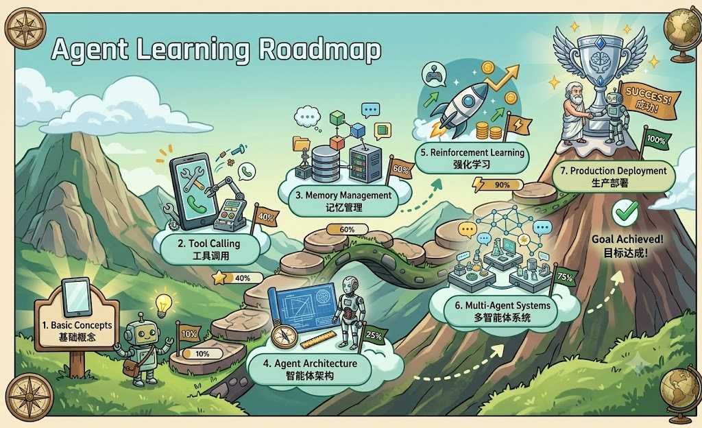

<div align="center">



# AI Agent Roadmap

**A personal learning handbook and practice roadmap for understanding, building, and operating AI Agents.**

[](LICENSE)
[](https://rust-lang.github.io/mdBook/)
[](https://whisperre.github.io/ai-agent-roadmap/)

[Read Chinese](https://whisperre.github.io/ai-agent-roadmap/zh/) ·
[Read English](https://whisperre.github.io/ai-agent-roadmap/en/) ·
[中文 README](README_ZH.md)

</div>

---

## What This Is

AI Agent Roadmap is my structured study notebook for the Agent era. It brings together LLM fundamentals, tool calling, memory, RAG, planning, LangGraph, MCP, multi-agent collaboration, evaluation, security, deployment, and Agentic RL into one readable mdBook site.

The goal is not to collect every possible resource. The goal is to keep a practical route through the field: first understand the concepts, then build small systems, then learn how production Agent applications are evaluated, secured, and shipped.

## Learning Paths

| Goal | Suggested Route |
| ---- | --------------- |
| Understand what an Agent is | Agent fundamentals -> LLM basics -> tool calling -> ReAct -> Hello Agent |
| Build an Agent application | tools -> memory -> planning -> RAG -> context engineering -> LangGraph |
| Prepare for production | harness engineering -> evaluation -> security -> deployment -> observability |
| Follow research trends | ReAct -> Reflexion -> memory papers -> RAG papers -> Agentic RL |
| Learn by doing | setup -> tool calling -> RAG QA -> LangGraph workflow -> coding/data/multimodal agents |

## What Is Included

- A bilingual mdBook structure for Chinese and English reading.
- Topic chapters covering LLMs, RAG, memory, tools, planning, frameworks, protocols, evaluation, safety, deployment, and Agentic RL.
- Diagrams, animations, formulas, and code-oriented explanations for concepts that are easier to understand visually.
- A GitHub Pages deployment workflow for publishing the handbook as a static site.
- A reading interface customized for long technical sessions.

## Local Preview

Install `mdbook` and `mdbook-katex`, then build both versions:

```bash
mdbook build
cp book.toml book.toml.zh_bak
cp book-en.toml book.toml
mdbook build
mv book.toml.zh_bak book.toml
cp root-index.html ./book/index.html
```

For quick local serving:

```bash
./serve.sh
```

## Deployment

This repository includes a GitHub Actions workflow at `.github/workflows/deploy.yml`. Push to `main`, enable GitHub Pages with "GitHub Actions" as the source, and the workflow will publish the generated mdBook site.

Expected public URL:

```text
https://whisperre.github.io/ai-agent-roadmap/
```

If your GitHub username is different, update the links in `README.md`, `README_ZH.md`, `book.toml`, `book-en.toml`, and `root-index.html`.

## Project Notes

This is a personal learning and curation project. I use it to organize Agent concepts, keep implementation notes close to the theory, and make the reading experience easier to revisit.

The repository is distributed under the MIT License. It includes open-source material and keeps the required copyright and license notices in `LICENSE`.

## Acknowledgements

This project builds on open-source AI Agent learning material released under the MIT License. The original copyright notice is preserved in `LICENSE`; this repository focuses on personal curation, presentation, deployment, and reading-experience improvements.
