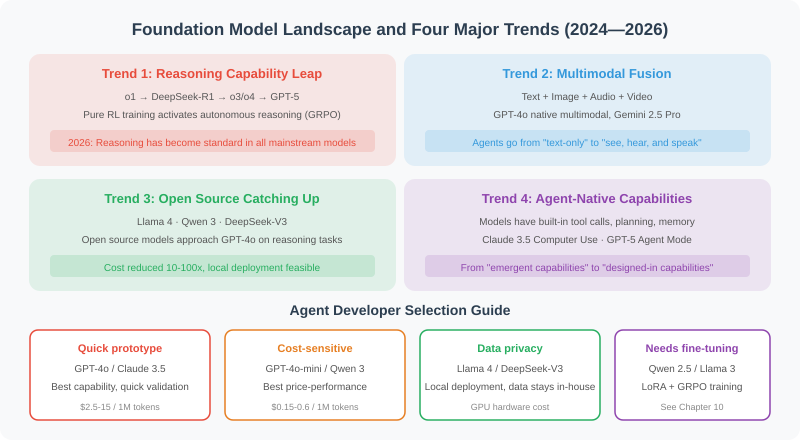

# Foundation Model Landscape and Selection Guide

> 🌍 *"Models iterate rapidly — today's SOTA may be tomorrow's baseline. But understanding the evolution trends lets you make better choices amid change."*

In the previous sections, we learned about the basic principles of LLMs, prompt engineering, API calls, and model parameters. That knowledge represents the "unchanging" underlying capabilities. This section discusses the "changing" part — **the technical frontier and industry landscape of foundation models**.

As an Agent developer, you don't need to train your own foundation model, but you must understand the capability boundaries and development trends of models — because **the choice of model directly determines the ceiling of your Agent**.



## 2024–2026: Four Major Trends in Foundation Models

### Trend 1: The Leap in Reasoning Capability

In September 2024, OpenAI's o1 first proved the feasibility of "trading more reasoning time for better results." In January 2025, the open-source release of DeepSeek-R1 ignited the democratization of reasoning models — it was the first to demonstrate how pure RL training (GRPO) could cause Chain-of-Thought capability to emerge spontaneously in a model.

In April 2025, OpenAI released o3 and o4-mini, achieving **multimodal reasoning** ("thinking while looking at images") and autonomous tool chain calls for the first time. In August 2025, **GPT-5** was officially released, with reasoning capability built in as a native feature, eliminating the need for a separate o-series model.

By early 2026, reasoning had become standard in all mainstream models:

| Model | Release | Reasoning Mode | Key Breakthrough |
|-------|---------|---------------|-----------------|
| **Claude Opus 4.7** | 2026.04 | Adaptive thinking depth | SWE-bench Verified #1, visual capability tops charts, new tokenizer |
| **GPT-5.4** | 2026.03 | Built-in Thinking mode | Reasoning+coding+Computer Use+search unified, 1M context |
| **Claude Opus 4.6** | 2026.02 | Adaptive thinking depth | 1M context (Beta) + SWE-bench 80.8% |
| **GPT-5** | 2025.08 | Built-in intelligent routing | SWE-bench 75%, unified system architecture, multimodal |
| **Claude Opus 4** | 2025.05 | Deep reasoning | SWE-bench 72.5%, continuous 7-hour operation |
| **Gemini 2.5 Pro** | 2025.03 | Native multimodal reasoning | 1M context + dynamic reasoning budget control |
| **DeepSeek-R1** | 2025.01 | Pure RL reasoning | Open-source reasoning model ignites the world, GRPO training |
| **Kimi K2.6** | 2026.04 | Agent reasoning | 1T params open-source, 13-hour coding, 300 sub-agents parallel |
| **Kimi K2** | 2025.07 | Agent reasoning | 1T total/32B active, MuonClip optimizer, open-source Agent SOTA |
| **Qwen3-235B-A22B** | 2025.04 | Hybrid reasoning (fast/slow) | Open-source flagship, surpasses DeepSeek-R1 and o1 |

> 💡 **Impact on Agents**: Reasoning models give Agents a qualitative leap in "planning" and "complex decision-making." In real engineering, more and more Agents adopt a "fast-slow dual system" — fast models for simple routing, reasoning models for complex planning. The arrival of GPT-5 and Claude 4.6 makes this switching more seamless — reasoning capability is now built into general-purpose models.

### Trend 2: MoE and the Efficiency Revolution

Large models keep getting larger, but **inference costs are falling** — driven by the comprehensive victory of **Mixture of Experts (MoE)**.

The core idea of MoE: the total parameter count can be very large (hundreds of billions), but only a small fraction is activated during each inference. Like a large company with hundreds of employees, but only the most suitable dozen are assigned to each project.

```python
# Intuitive understanding of MoE models (conceptual illustration)
class MixtureOfExperts:
    """
    Using Qwen3.5-Plus as an example:
    Total parameters: 397B
    Active per inference: 17B (~4.3% only)
    Effect: Approaches or exceeds trillion-parameter dense models, at a fraction of the inference cost
    """
    def __init__(self, num_experts=128, active_experts=8):
        self.num_experts = num_experts
        self.active_experts = active_experts
    
    def forward(self, input_tokens):
        # Router decides which experts to activate
        scores = self.router(input_tokens)
        top_k = scores.topk(self.active_experts)
        # Only selected experts participate in computation
        return sum(expert(input_tokens) * w for expert, w in top_k)
```

| Model | Total Params | Active Params | Architecture Highlights |
|-------|-------------|--------------|------------------------|
| **Kimi K2.6** | 1T | 32B | K2 upgrade, 13-hour coding, 300 sub-agents parallel, SWE-bench Pro 58.6% |
| **Kimi K2** | 1T | 32B | MuonClip optimizer, trillion-parameter open-source MoE |
| **Qwen3.6-35B-A3B** | 35B | 3B | Released 2026.04, lightweight MoE, extreme efficiency |
| **Llama 4 Maverick** | ~400B | 17B | 128 experts, native multimodal, text generation surpasses GPT-4.1 |
| **Qwen3-235B-A22B** | 235B | 22B | Hybrid reasoning, Apache 2.0, tops open-source leaderboard |
| **Qwen3-30B-A3B** | 30B | 3B | Lightweight MoE, runs on single GPU |
| **DeepSeek-V3** | 671B | 37B | MoE architecture, $5.57M training cost, best price-performance |
| **DeepSeek-V3-0324** | 685B | 37B | Minor update, major coding improvement |
| **Gemma 4-26B** | 26B | 4B (active) | Apache 2.0, native video/image, 256K context |
| **Llama 4 Scout** | 109B | 17B | 16 experts, 10M token ultra-long context |

> 💡 **Impact on Agents**: MoE makes "large model capability + small model cost" a reality. The biggest change in early 2026 is **Kimi K2.6 open-sourcing at trillion-parameter scale** with 300 sub-agents running in parallel, pushing MoE-based Agent capability to new heights. Qwen3.6-35B-A3B achieves extreme efficiency with only 3B active parameters. DeepSeek-V3-0324 significantly enhances coding and tool-calling capability. These advances mean Agent operating costs are falling rapidly.

### Trend 3: The Full Rise of the Open-Source Ecosystem

In 2025–2026, open-source models are no longer just "catching up" with closed-source — they have **formed a competitive balance** and even **locally surpassed** closed-source in multiple areas:

**Tier 1 (Competing with GPT-5.4 / Claude Opus 4.7)**:
- **Kimi K2.6** (Moonshot AI, 2026.04): 1T params open-source MoE, 13-hour continuous coding, 300 sub-agents parallel, SWE-bench Pro 58.6%, API price only 1/8 of Opus 4.6
- **Kimi K2** (Moonshot AI, 2025.07): 1T total/32B active MoE, MuonClip optimizer doubles training efficiency, open-source Agent SOTA, compatible with OpenAI/Anthropic API
- **Qwen3-235B-A22B** (Alibaba, 2025.04): 235B MoE hybrid reasoning, surpasses DeepSeek-R1 and o1, Apache 2.0
- **DeepSeek-V3-0324** (DeepSeek, 2025.03): 685B MoE, coding surpasses Claude 3.7, more permissive open-source license
- **Llama 4 Maverick** (Meta, 2025.04): ~400B MoE multimodal, text generation surpasses GPT-4.1

**Tier 2 (Lightweight and Efficient, single-GPU capable)**:
- **Qwen3.6-35B-A3B** (Alibaba, 2026.04): 35B total/3B active, lightweight MoE, extreme efficiency
- **Qwen3.6-Plus / Flash / Max** (Alibaba, 2026.04): Qwen3 rapid iteration, covering different performance tiers
- **Gemma 4-31B** (Google, 2026.04): Dense model, top-3 open-source on Arena Elo, Apache 2.0, native video/image multimodal
- **Llama 4 Scout** (Meta, 17B active/109B total): 10M context window, runs on a single H100
- **Phi-4** (Microsoft, 14B): The ceiling for small-size models, reasoning surpasses many 70B models
- **Phi-4-multimodal** (Microsoft, 5.6B): Unified architecture for speech + vision + text
- **Gemma 4-E2B/E4B** (Google, 2026.04): 2.3B/4.5B, phone/edge devices, native audio/video, Apache 2.0
- **Qwen3 series** (Alibaba, 0.6B~235B): Full coverage from phones to servers, Apache 2.0

**Open-source vs. Closed-source Decision Matrix**:

| Dimension | Closed-source | Open-source |
|-----------|--------------|-------------|
| **Peak Capability** | Still has an edge (GPT-5.4, Claude Opus 4.7) | Rapidly catching up; Kimi K2.6/Qwen3.6 locally surpass in coding |
| **Cost** | Pay-per-use API | Near-zero marginal cost after self-deployment |
| **Privacy** | Data sent to third party | Data completely private |
| **Customization** | Limited (Fine-tuning API) | Fully controllable (LoRA/full fine-tuning) |
| **Latency** | Affected by network | Controllable with local deployment |
| **Agent Capability** | Mature and stable tool calling | Kimi K2.6, Qwen3.6 natively support Agent; K2.6 supports 300 sub-agents parallel |
| **Best For** | Rapid prototyping, general tasks | Production deployment, data-sensitive scenarios |

### Trend 4: The Rise of Agent-Native Models

The most notable new trend in 2025–2026 is: **models are beginning to be specifically optimized for Agent scenarios**.

- **Claude Opus 4.7** (2026.04): SWE-bench Verified #1, visual capability tops charts, Claude Code fully upgraded, production-ready foundation for RPA and automated testing
- **Kimi K2.6** (2026.04): 1T params open-source, 300 sub-agents parallel, continuous 5-day operation for complex DevOps, SWE-bench Pro 58.6%, API price only 1/8 of Opus 4.6
- **GPT-5.4** (2026.03): First to unify reasoning+coding+Computer Use+deep search in a single model, natively controls browsers and OS, Agent tool-call token cost cut in half
- **Kimi K2**: Trillion-parameter open-source MoE, Agent capability reaches open-source SOTA on multiple benchmarks, focused on Agent-specific pre-training and post-training, compatible with Claude Code and other mainstream Agent frameworks
- **DeepSeek-V3-0324**: Significantly enhanced coding and tool-calling capability, more permissive open-source license, suitable for Agent production deployment
- **GPT-5**: Unified system architecture, built-in reasoning routing, stable Agent tool calling, supports Computer Use
- **Claude Opus 4.6**: 1M context (Beta), handles massive codebases, autonomously discovers zero-day vulnerabilities, enterprise-grade Agent workflows
- **Claude Opus 4**: Continuous autonomous operation for 7 hours, SWE-bench 72.5%, new Agent coding benchmark
- **Qwen3-235B-A22B**: Deeply adapted to Agent frameworks, dramatically improved tool call accuracy, hybrid reasoning auto-switches fast/slow thinking
- **Llama 4 Scout**: 10M token ultra-long context, suitable for Agent tasks requiring very long documents

This means Agent developers no longer need to "force a fit" — the models themselves are designed for Agents.

## Multimodal Foundation Models: More Than Just Text

In 2026, foundation models are almost all **natively multimodal** — supporting mixed input and output of text, images, audio, and video at the architecture level.

```python
# Typical multimodal Agent call
from openai import OpenAI
client = OpenAI()

response = client.chat.completions.create(
    model="gpt-5",  # GPT-5 natively supports multimodal
    messages=[{
        "role": "user",
        "content": [
            {"type": "text", "text": "What's wrong with this architecture diagram? Please provide improvement suggestions."},
            {"type": "image_url", "image_url": {"url": "data:image/png;base64,..."}}
        ]
    }]
)

# GPT-5 can not only "understand" images, but also generate images and have real-time voice conversations
```

**Mainstream Multimodal Model Comparison**:

| Model | Release | Input Modalities | Output Modalities | Special Capabilities |
|-------|---------|-----------------|------------------|---------------------|
| **Claude Opus 4.7** | 2026.04 | Text+Image+PDF | Text | SWE-bench Verified #1, image input 3.75M pixels, visual capability tops charts |
| **GPT-5.4** | 2026.03 | Text+Image+Audio | Text+Image | Computer Use surpasses humans, reasoning+coding+search unified, 1M context |
| **GPT-5** | 2025.08 | Text+Image+Audio | Text+Image+Audio | Real-time voice conversation, native image generation, Computer Use |
| **Claude Opus 4.6** | 2026.02 | Text+Image+PDF | Text | 1M context (Beta), enterprise-grade Agent workflows |
| **Gemini 2.5 Pro** | 2025.03 | Text+Image+Video+Audio | Text+Image | Native video understanding, 1M context |
| **Kimi K2.6** | 2026.04 | Text | Text | Trillion-param open-source, 300 sub-agents parallel, Agent coding SOTA |
| **Kimi K2** | 2025.07 | Text | Text | Trillion-param Agent SOTA, strongest tool calling |
| **Llama 4 Maverick** | 2025.04 | Text+Image | Text | Open-source multimodal MoE, ~400B total params |
| **Phi-4-multimodal** | 2025.02 | Text+Image+Speech | Text | Only 5.6B params, unified multimodal architecture |

## The Rise of Small Models: SLM and Edge Deployment

The progress of **Small Language Models (SLMs)** is remarkable — 14B parameter models from 2025 have comprehensively surpassed GPT-4 from 2023.

```python
# Impressive small model performance (2025–2026 benchmark data)
slm_benchmarks = {
    "Phi-4 (14B)":             {"MMLU": 84.8, "HumanEval": 82.6, "GSM8K": 94.5},
    "Phi-4-reasoning (14B)":   {"MMLU": 86.2, "HumanEval": 85.1, "GSM8K": 95.8},
    "Qwen 3 (8B)":            {"MMLU": 81.2, "HumanEval": 79.8, "GSM8K": 91.3},
    "Llama 4 Scout (17B act)": {"MMLU": 83.5, "HumanEval": 80.1, "GSM8K": 92.1},
    "Phi-4-mini (3.8B)":      {"MMLU": 72.1, "HumanEval": 68.5, "GSM8K": 84.2},
    # Comparison: GPT-4 from 2023 (~1.7T params estimated)
    "GPT-4 (2023)":           {"MMLU": 86.4, "HumanEval": 67.0, "GSM8K": 92.0},
}

# Phi-4-reasoning (14B) has comprehensively surpassed GPT-4 (2023) in coding and math!
# Phi-4-mini (3.8B) can even run on a phone and still do function calling
# This means: Agents don't necessarily need the largest model
```

> 💡 **Impact on Agents**: SLMs allow Agents to run locally on **phones, laptops, and edge devices**, enabling zero-latency, fully private interactions. Apple Intelligence, Google's Gemini Nano, and Microsoft's Phi-4-mini are all products of this trend. Phi-4-multimodal handles speech, vision, and text simultaneously with just 5.6B parameters, opening the door for edge-side multimodal Agents.

## Model Selection Guide for Agent Developers

With so many model choices, how do you pick the right foundation model for your Agent?

```python
def select_model(requirements: dict) -> str:
    """Agent model selection decision function (April 2026 edition)"""
    
    budget = requirements.get("monthly_budget_usd", 100)
    task_type = requirements.get("task_type", "general")
    privacy = requirements.get("privacy_required", False)
    latency_ms = requirements.get("max_latency_ms", 5000)
    reasoning = requirements.get("complex_reasoning", False)
    agent_native = requirements.get("agent_native", False)
    
    # Decision tree
    if privacy:
        if reasoning:
            return "Kimi K2.6 (self-hosted)"  # Open-source + Agent + best price-performance
        elif latency_ms < 500:
            return "Phi-4 / Qwen3-8B (local deployment)"  # Edge SLM
        else:
            return "Qwen3-235B / Llama 4 Maverick (self-hosted)"  # Open-source general
    
    if agent_native:
        if budget > 500:
            return "Claude Opus 4.7 / GPT-5.4"  # Top-tier Agent experience
        else:
            return "Kimi K2.6 API / DeepSeek-V3 API"  # Value Agent (K2.6 is 1/8 the price of Opus 4.6)
    
    if reasoning:
        if budget > 500:
            return "Claude Opus 4.7 / GPT-5.4"  # Top-tier reasoning
        else:
            return "DeepSeek-V3 API / o4-mini"  # Value reasoning
    
    if budget < 50:
        return "DeepSeek-V3 API / GPT-4o-mini"  # Extreme value
    
    return "GPT-5.4 / Claude Sonnet 4.6"  # Balanced general choice
```

**Recommended models by Agent scenario**:

| Agent Scenario | Recommended Model | Reason |
|---------------|------------------|--------|
| Coding assistant | Claude Opus 4.7 / Kimi K2.6 | SWE-bench dual #1; K2.6 extreme price-performance (1/8 of Opus 4.6) |
| Data analysis | GPT-5.4 / Gemini 2.5 Pro | Multimodal understanding + stable function calling |
| Customer service | GPT-4.1-mini / Qwen3-8B | Cost-sensitive, high response speed requirement |
| Deep research | Claude Opus 4.6 / GPT-5.4 | 1M context + deep reasoning |
| Document processing | Gemini 2.5 Pro / Claude Opus 4.6 | 1M ultra-long document input, PDF layout understanding |
| Local privacy | Kimi K2.6 / Qwen3-235B (self-hosted) | Data stays local, complete Agent capability, K2.6 is open-source |
| Edge deployment | Phi-4-mini (3.8B) / Qwen3-4B | Runs on phone/laptop |
| Multimodal Agent | GPT-5.4 / Gemini 2.5 Pro | Computer Use surpasses humans, native multimodal + visual understanding |
| RPA / automated testing | Claude Opus 4.7 / GPT-5.4 | Visual capability tops charts, ScreenSpot-Pro/OSWorld all #1 |

## 2025–2026 Key Model Release Timeline

```
2024.09  OpenAI o1 ──── The year of reasoning models
2024.12  Phi-4 (14B) ── Microsoft releases strongest small model
2025.01  DeepSeek-R1 ── Open-source reasoning model ignites the world
2025.02  Phi-4-multimodal / Phi-4-mini ── Edge multimodal
2025.03  Gemini 2.5 Pro ── 1M context + reasoning, tops leaderboards
2025.03  DeepSeek-V3-0324 ── Major coding improvement, more permissive license
2025.04  Llama 4 Scout/Maverick ── Meta's first MoE open-source multimodal
2025.04  o3 / o4-mini ── OpenAI multimodal reasoning
2025.04  Qwen3 ── Alibaba hybrid reasoning full series (0.6B~235B)
2025.05  Claude Opus 4 / Sonnet 4 ── 7-hour continuous coding, new Agent benchmark
2025.07  Kimi K2 ── Moonshot AI trillion-parameter open-source MoE, MuonClip optimizer
2025.08  GPT-5 ── OpenAI unified architecture, built-in reasoning routing, SWE-bench 75%
━━━━━━━━━━━━━━━━━━━━━━━━ 2026 ━━━━━━━━━━━━━━━━━━━━━━━━
2026.02  Claude Opus 4.6 ── 1M context (Beta), SWE-bench 80.8%, enterprise Agent
2026.03  GPT-5.4 ── Reasoning+coding+Computer Use+search unified, 1M context, 3 variants
2026.04  Gemma 4 (E2B/E4B/26B/31B) ── Google open-source, native video/audio, Apache 2.0
2026.04  Claude Opus 4.7 ── SWE-bench Verified #1, visual capability tops charts, Claude Code fully upgraded
2026.04  Kimi K2.6 ── Moonshot AI open-source, 13-hour coding, 300 sub-agents parallel, SWE-bench Pro 58.6%
2026.04  Qwen3.6 series ── Alibaba rapid iteration (35B-A3B/Flash/Plus/Max), full tier coverage
```

## Outlook: What's Next for Foundation Models

Several development directions worth watching:

1. **Reasoning Built-in**: Reasoning capability moves from standalone o-series models into general-purpose models (GPT-5.4 Thinking mode, Qwen3 hybrid reasoning) — developers no longer need to manually choose between "reasoning model" and "general model"
2. **Computer Use Maturity**: GPT-5.4 and Claude Opus 4.7 surpass human-level performance on ScreenSpot-Pro and OSWorld — Agents can now natively control browsers and operating systems, bringing RPA into production-ready territory
3. **Agent Clustering**: Models evolve from "single-task execution" to "large-scale autonomous collaboration" — Kimi K2.6's 300 sub-agents running in parallel for 5 continuous days is a landmark milestone
4. **MoE Efficiency Revolution**: Kimi K2.6/Qwen3.6 open-source at trillion-parameter scale with only 3B~32B active parameters — Agent operating costs fall dramatically; K2.6 API is only 1/8 the price of Opus 4.6
5. **Open-Source Full Rise**: Kimi K2.6/Qwen3.6/Gemma 4 form a complete ecosystem — private Agent deployment matures; data security is no longer a bottleneck
6. **World Models**: From language models to world models — understanding physical laws and causal relationships, not just text patterns
7. **Continual Learning and Personalization**: Models continuously learn from post-deployment interactions; each Agent has unique "experience"
8. **Native Multimodal**: Text → vision + speech + video full modality — Agents can "see," "hear," and "draw"

---

## Summary

| Trend | Core Change | Impact on Agent Development |
|-------|------------|----------------------------|
| Reasoning built-in | GPT-5.4 Thinking mode, Qwen3 hybrid fast/slow thinking | Qualitative leap in Agent complex planning; no need to manually choose reasoning model |
| Computer Use maturity | GPT-5.4/Claude Opus 4.7 surpass human level | Agents directly control browsers and OS; RPA enters production-ready stage |
| Agent clustering | Kimi K2.6's 300 sub-agents parallel, continuous 5-day operation | Agents evolve from single-task execution to large-scale autonomous collaboration |
| MoE efficiency revolution | Kimi K2.6/Qwen3.6 open-source at trillion-param scale, only 3B~32B active | Agent operating costs fall dramatically; K2.6 API only 1/8 of Opus 4.6 |
| Open-source full rise | Kimi K2.6/Qwen3.6/Gemma 4 form complete ecosystem | Private Agent deployment matures; data security no longer a bottleneck |
| Agent-Native | Models specifically optimized for Agent scenarios (tool calling/long tasks) | Developers no longer need to "force a fit"; models are Agent-ready |
| Native multimodal | Text → vision + speech + video full modality | Agents can "see," "hear," and "draw"; more natural interaction |
| Small model progress | 3.8B params run on phones; 14B surpasses GPT-4 | Agents can run on edge devices; zero latency, complete privacy |

> ⏰ *Note: Model technology evolves extremely fast. The data in this section is current as of April 23, 2026. Claude Opus 4.7 and Kimi K2.6 were just released in April 2026. The industry landscape is still rapidly evolving. It is recommended to regularly follow vendor release announcements and authoritative benchmark evaluations (such as LMArena, Open LLM Leaderboard, Chatbot Arena) for the latest information.*

---

*Next section: [3.7 Foundation Model Architecture Explained](./07_model_architecture.md)*
