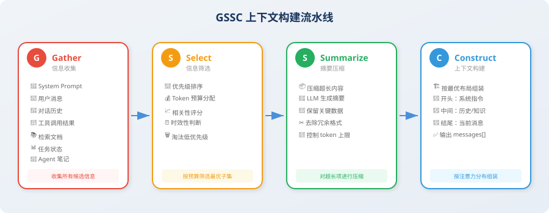

# 7.4 实战：构建上下文管理器

> 📖 *"Talk is cheap, show me the code." — 让我们用代码实现一个完整的上下文管理系统。*

经过前三节的理论学习，你已经掌握了上下文工程的核心概念：六大信息源、注意力预算、Lost-in-the-Middle 效应、三大长时程策略。现在，是时候把这些知识**落地为可运行的代码**了。

## 项目目标

本节实现 **GSSC（Gather-Select-Summarize-Construct）上下文构建流水线** [1]——一个从信息收集到上下文组装的完整工作流，可作为任何 Agent 项目的上下文管理基础设施。完成后你将拥有：

- 从六大信息源**自动收集**候选信息
- 按优先级和 token 预算**智能筛选**最优子集
- 对超长内容**自动压缩**为精炼摘要
- 按 Lost-in-the-Middle 感知的最优布局**组装**最终上下文



## GSSC 流水线概述

| 阶段 | 名称 | 作用 | 对应原则 |
|---|---|---|---|
| **G** | Gather（收集） | 从六大来源收集所有候选信息 | — |
| **S** | Select（选择） | 根据优先级和预算筛选最优子集 | 相关性优先 + 动态裁剪 |
| **S** | Summarize（摘要） | 对超长内容进行压缩 | 动态裁剪 |
| **C** | Construct（构建） | 按注意力分布最优布局组装 | 结构化呈现 |

> 💡 GSSC 的每个阶段都是独立的、可替换的模块——你可以根据需求替换任何一个阶段（比如用更高级的语义过滤替换 Select，或用专门领域模型替换 Summarize）。

---

## 数据结构：信息片段 + 预算配置

整个流水线流动的"货物"是 `ContextItem`——一个带元数据的信息片段。`ContextBudget` 定义每个来源的 token 预算上限。

```python
from dataclasses import dataclass, field
from enum import Enum
import time

class InfoSource(Enum):
    SYSTEM_PROMPT = "system_prompt"
    USER_MESSAGE = "user_message"
    CONVERSATION = "conversation"
    TOOL_RESULT = "tool_result"
    RETRIEVED_DOC = "retrieved_doc"
    TASK_STATE = "task_state"
    AGENT_NOTE = "agent_note"

@dataclass
class ContextItem:
    """流水线中流动的信息片段。"""
    content: str
    source: InfoSource
    priority: int = 5              # 1（最高）到 10（最低）
    relevance_score: float = 1.0   # 0~1
    token_count: int = 0
    timestamp: float = field(default_factory=time.time)
    metadata: dict = field(default_factory=dict)

    def __post_init__(self):
        if self.token_count == 0:
            self.token_count = len(self.content) // 3  # 粗略估算

@dataclass
class ContextBudget:
    """每个来源的 token 预算上限。"""
    total_tokens: int = 128000
    output_reserve: int = 4096
    system_prompt_max: int = 2000
    task_state_max: int = 3000
    agent_notes_max: int = 2000
    recent_conversation_max: int = 20000
    tool_results_max: int = 40000
    retrieved_docs_max: int = 20000
    history_max: int = 30000

    @property
    def available_input_tokens(self) -> int:
        return self.total_tokens - self.output_reserve
```

**两个设计决策**：
1. **优先级 1-10 数字越小越重要**——便于排序和快速过滤
2. **粗略 token 估算**：`len(content) // 3`（中文约 1.5 字/token）。生产环境建议用 `tiktoken` 精确计算

---

## 阶段 1：Gather（信息收集）

Gather 的职责很简单：**从各个来源收集所有可能需要的信息，形成候选池**。这个阶段故意不做任何筛选——收集就是收集，判断交给后续阶段。

```python
class GatherStage:
    """G - 从各来源拉取数据，形成候选信息池。"""

    def __init__(self):
        self.items: list[ContextItem] = []

    def add_system_prompt(self, prompt: str):
        self.items.append(ContextItem(content=prompt, source=InfoSource.SYSTEM_PROMPT, priority=1))

    def add_user_message(self, message: str):
        self.items.append(ContextItem(content=message, source=InfoSource.USER_MESSAGE, priority=1))

    def add_conversation_history(self, messages: list[dict]):
        """越近的消息优先级越高——大多数场景下最近对话与当前任务最相关。"""
        for i, msg in enumerate(messages):
            recency = i / max(len(messages), 1)
            priority = int(8 - recency * 5)    # 最新 3，最旧 8
            self.items.append(ContextItem(
                content=f"[{msg['role']}]: {msg['content']}",
                source=InfoSource.CONVERSATION,
                priority=priority,
                metadata={"turn_index": i, "role": msg["role"]}
            ))

    def add_tool_result(self, tool_name: str, result: str, is_recent: bool = True):
        self.items.append(ContextItem(
            content=f"[工具: {tool_name}]\n{result}",
            source=InfoSource.TOOL_RESULT,
            priority=2 if is_recent else 6,
            metadata={"tool_name": tool_name}
        ))

    def add_retrieved_doc(self, doc: str, score: float):
        self.items.append(ContextItem(content=doc, source=InfoSource.RETRIEVED_DOC,
                                      priority=4, relevance_score=score))

    def add_task_state(self, state: dict):
        self.items.append(ContextItem(content=json.dumps(state, ensure_ascii=False, indent=2),
                                      source=InfoSource.TASK_STATE, priority=2))

    def add_agent_note(self, note: str):
        self.items.append(ContextItem(content=note, source=InfoSource.AGENT_NOTE, priority=2))
```

**关键设计**：Gather 阶段不做任何判断，只负责"进货"。这让系统容易扩展（加新来源只需加一个 `add_xxx` 方法），也避免了早期筛选导致的信息丢失。

---

## 阶段 2：Select（信息选择）

Select 是流水线的核心决策阶段——它决定哪些信息最终进上下文。

**核心设计：分层优先级**——先保必选项（system prompt + user message），再按重要性递减填充，每层有自己的 token 上限。预算紧张时低优先级信息自动被裁剪，高优先级始终得到保障。

```python
class SelectStage:
    """S1 - 按优先级和预算筛选信息。"""

    def __init__(self, budget: ContextBudget):
        self.budget = budget

    def select(self, items: list[ContextItem]) -> list[ContextItem]:
        # 按来源分组
        groups: dict[InfoSource, list[ContextItem]] = {}
        for item in items:
            groups.setdefault(item.source, []).append(item)

        selected = []
        # 1. 必选：system prompt + user message（始终保留）
        for src in [InfoSource.SYSTEM_PROMPT, InfoSource.USER_MESSAGE]:
            selected.extend(groups.get(src, []))

        # 2. 任务状态 + Agent 笔记
        for src in [InfoSource.TASK_STATE, InfoSource.AGENT_NOTE]:
            items = groups.get(src, [])
            max_t = self.budget.task_state_max if src == InfoSource.TASK_STATE \
                    else self.budget.agent_notes_max
            selected.extend(self._fit_within_budget(items, max_t))

        # 3. 工具结果（按 priority 升序，最近的优先）
        selected.extend(self._fit_within_budget(
            sorted(groups.get(InfoSource.TOOL_RESULT, []), key=lambda x: x.priority),
            self.budget.tool_results_max
        ))

        # 4. 检索文档（按 relevance_score 降序）
        selected.extend(self._fit_within_budget(
            sorted(groups.get(InfoSource.RETRIEVED_DOC, []),
                   key=lambda x: x.relevance_score, reverse=True),
            self.budget.retrieved_docs_max
        ))

        # 5. 对话历史（按 turn_index 降序，最近的优先）
        selected.extend(self._fit_within_budget(
            sorted(groups.get(InfoSource.CONVERSATION, []),
                   key=lambda x: x.metadata.get("turn_index", 0), reverse=True),
            self.budget.history_max
        ))

        return selected

    def _fit_within_budget(self, items: list[ContextItem], max_tokens: int) -> list[ContextItem]:
        """贪心填充：在预算内选尽可能多的项。"""
        selected, remaining = [], max_tokens
        for item in items:
            if item.token_count <= remaining:
                selected.append(item)
                remaining -= item.token_count
            else:
                break
        return selected
```

**为什么是贪心不是最优？**——贪心 O(n) 简单稳定；最优（如动态规划）在 sources 多时复杂度爆炸。实际中各来源的预算已分层，贪心就够。

---

## 阶段 3：Summarize（摘要压缩）

Select 之后的片段可能仍然很长（3000 tokens 的 SQL 表格、5000 tokens 的检索文档）。Summarize 阶段负责**压缩超长片段，保留核心信息**。

**重要决策**：**不同来源用不同压缩策略**。工具结果必须保留所有数字（数据准确性是核心价值），检索文档只需保留关键知识点。差异化压缩比"一刀切"通用摘要保留更多信息。

```python
from openai import OpenAI
client = OpenAI()

class SummarizeStage:
    """S2 - 对超长内容按来源类型差异化压缩。"""

    def __init__(self, max_item_tokens: int = 2000):
        self.max_item_tokens = max_item_tokens

    def summarize(self, items: list[ContextItem]) -> list[ContextItem]:
        result = []
        for item in items:
            if item.token_count > self.max_item_tokens:
                result.append(self._compress_item(item))
            else:
                result.append(item)
        return result

    def _compress_item(self, item: ContextItem) -> ContextItem:
        # 按来源类型用不同 prompt
        if item.source == InfoSource.TOOL_RESULT:
            prompt = f"""压缩以下工具结果，保留所有数字数据和结论，去除冗余格式：
{item.content}
要求：保留所有数字、保留结论、控制在 500 字内。"""
        elif item.source == InfoSource.RETRIEVED_DOC:
            prompt = f"""提取以下文档与当前任务最相关的核心内容：
{item.content}
要求：控制在 300 字内，只保留关键知识点。"""
        else:
            prompt = f"""简要总结以下内容要点（300 字内）：{item.content}"""

        resp = client.chat.completions.create(
            model="gpt-4.1-mini",    # 压缩用小模型即可
            messages=[{"role": "user", "content": prompt}],
            max_tokens=600
        )
        return ContextItem(
            content=f"[压缩] {resp.choices[0].message.content}",
            source=item.source,
            priority=item.priority,
            relevance_score=item.relevance_score,
            metadata={**item.metadata, "compressed": True}
        )
```

**为什么用小模型？**——压缩是结构化任务，不需要最强推理；`gpt-4.1-mini` 成本约为主力的 1/20，输出 token 也少，总成本能差 10-20 倍。

---

## 阶段 4：Construct（按注意力最优布局组装）

Construct 阶段把处理好的片段按 Lost-in-the-Middle 知识组装成最终 messages：

- **开头（高注意力）**：System prompt + 任务状态 + Agent 笔记（确保 Agent "不迷路"）
- **中间（较低注意力）**：检索文档 + 历史对话 + 工具结果（辅助信息，部分忽略不致命）
- **结尾（最高注意力）**：当前用户消息（确保围绕最新需求回答）

```python
class ConstructStage:
    """C - 按 Lost-in-the-Middle 感知的最优布局组装。"""

    def construct(self, items: list[ContextItem]) -> list[dict]:
        groups: dict[InfoSource, list[ContextItem]] = {}
        for item in items:
            groups.setdefault(item.source, []).append(item)

        messages = []

        # 开头（高注意力）：System Prompt + 嵌入任务状态和笔记
        if InfoSource.SYSTEM_PROMPT in groups:
            system_content = groups[InfoSource.SYSTEM_PROMPT][0].content
            extras = []
            if InfoSource.TASK_STATE in groups:
                extras.append(f"\n\n## 当前任务状态\n{groups[InfoSource.TASK_STATE][0].content}")
            if InfoSource.AGENT_NOTE in groups:
                extras.append(f"\n\n## 执行笔记\n{groups[InfoSource.AGENT_NOTE][0].content}")
            messages.append({"role": "system", "content": system_content + "".join(extras)})

        # 中间（较低注意力）：检索文档 → 历史对话 → 工具结果
        if InfoSource.RETRIEVED_DOC in groups:
            docs = [item.content for item in groups[InfoSource.RETRIEVED_DOC]]
            messages.append({"role": "system", "content": "## 相关知识\n\n" + "\n\n---\n\n".join(docs)})

        for item in sorted(groups.get(InfoSource.CONVERSATION, []),
                           key=lambda x: x.metadata.get("turn_index", 0)):
            role = item.metadata.get("role", "user")
            content = item.content
            prefix = f"[{role}]: "
            if content.startswith(prefix):
                content = content[len(prefix):]
            messages.append({"role": role, "content": content})

        for item in groups.get(InfoSource.TOOL_RESULT, []):
            messages.append({"role": "assistant", "content": item.content})

        # 结尾（最高注意力）：当前用户消息
        if InfoSource.USER_MESSAGE in groups:
            messages.append({"role": "user", "content": groups[InfoSource.USER_MESSAGE][0].content})

        return messages
```

**三明治布局**：关键信息不被埋在中间；辅助信息不抢头尾的注意力位。

---

## 完整流水线：GSSCPipeline

把 4 个阶段组装成可调用的接口：

```python
class GSSCPipeline:
    """GSSC 上下文构建流水线：Gather → Select → Summarize → Construct。"""

    def __init__(self, budget: ContextBudget = None, max_item_tokens: int = 2000):
        self.budget = budget or ContextBudget()
        self.max_item_tokens = max_item_tokens
        self.gather = GatherStage()
        self.select = SelectStage(self.budget)
        self.summarize = SummarizeStage(max_item_tokens)
        self.construct = ConstructStage()

    def build(self, system_prompt: str, user_message: str,
              conversation_history=None, tool_results=None,
              retrieved_docs=None, task_state=None, agent_notes=None) -> list[dict]:
        """一站式构建最优上下文，返回 messages 列表（可直接调 LLM API）。"""
        # G: Gather
        self.gather = GatherStage()
        self.gather.add_system_prompt(system_prompt)
        self.gather.add_user_message(user_message)
        if conversation_history:
            self.gather.add_conversation_history(conversation_history)
        for tr in (tool_results or []):
            self.gather.add_tool_result(tr["tool"], tr["result"], tr.get("recent", False))
        for d in (retrieved_docs or []):
            self.gather.add_retrieved_doc(d["content"], d["score"])
        if task_state:
            self.gather.add_task_state(task_state)
        if agent_notes:
            self.gather.add_agent_note(agent_notes)

        all_items = self.gather.get_all_items()
        # S1: Select
        selected = self.select.select(all_items)
        # S2: Summarize
        summarized = self.summarize.summarize(selected)
        # C: Construct
        return self.construct.construct(summarized)
```

### 使用示例

```python
pipeline = GSSCPipeline(budget=ContextBudget(total_tokens=128000))

messages = pipeline.build(
    system_prompt="你是资深数据分析师，擅长用户行为分析。",
    user_message="基于之前的分析，请给出提升留存率的前 3 条建议。",
    conversation_history=[
        {"role": "user", "content": "帮我分析 Q1 的用户留存数据"},
        {"role": "assistant", "content": "好的，我来查询数据库..."},
        {"role": "user", "content": "重点看新用户的留存"},
    ],
    tool_results=[{"tool": "sql_query", "result": "新用户7日留存率: 38%...", "recent": True}],
    task_state={"objective": "分析 Q1 用户留存率下降原因", "current_step": "生成建议"},
    agent_notes="关键发现：新用户首日引导流程完成率仅 45%，是留存下降的主因。"
)

# messages 现在可直接传给 client.chat.completions.create(...)
```

> 📦 **完整代码（含 token 监控、可视化调试日志）见仓库** `examples/chapter07/gssc_pipeline.py`。

---

## 小结

| 阶段 | 核心功能 | 关键设计 |
|---|---|---|
| **Gather** | 从六大来源收集候选信息 | 自动按新旧程度分配优先级 |
| **Select** | 按优先级和预算筛选 | 必选 → 高优先 → 工具 → 文档 → 历史 |
| **Summarize** | 压缩超长内容 | 按来源类型用不同压缩策略（数字 vs 文本） |
| **Construct** | 按 Lost-in-the-Middle 布局组装 | 开头=系统+状态，中间=知识+历史，结尾=用户消息 |

### 扩展方向

- **加缓存层**：在 Summarize 阶段加哈希缓存，避免重复压缩相同内容
- **集成 embedding**：在 Select 阶段用语义相似度做更精准筛选
- **加监控**：记录每次构建的 token 分配和压缩比，用于优化预算配置
- **多模态支持**：扩展 `InfoSource` 枚举支持图片、音频等多模态信息

## 🤔 思考练习

1. 如何为 GSSC 流水线添加缓存机制，避免重复压缩相同内容？设计缓存 key 的策略。
2. 如果 Agent 支持多模态输入（图片、音频），GSSC 流水线需要怎样扩展？Gather 和 Select 阶段分别需要什么改动？
3. 如何评估上下文管理的效果？尝试设计一个 A/B 测试方案，对比"无管理"vs"GSSC 管理"的 Agent 输出质量。

---

*下一节：[7.5 上下文工程前沿进展](./05_latest_advances.md)*

---

## 参考文献

[1] ANTHROPIC. Building effective agents[EB/OL]. 2024. https://www.anthropic.com/engineering/building-effective-agents.
