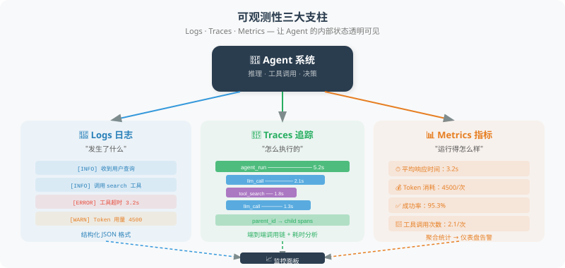

# 18.5 可观测性：日志、追踪与监控

> **本节目标**：学会为 Agent 构建完善的可观测性体系，做到"出了问题能发现、发现了能定位"。

---

## 什么是可观测性？

可观测性（Observability）是指：在不修改系统代码的情况下，通过系统的外部输出来理解其内部状态。对于 Agent 来说，就是能回答以下问题：

- Agent 做了什么决策？为什么？
- 调用了哪些工具？每个工具花了多长时间？
- 用户问题到最终回答之间，经历了哪些中间步骤？
- 出错了，错在哪一步？

可观测性的三大支柱：**日志（Logs）**、**追踪（Traces）**、**指标（Metrics）**。



---

## 支柱一：结构化日志

```python
import logging
import json
from datetime import datetime

class AgentLogger:
    """Agent 专用的结构化日志器"""
    
    def __init__(self, agent_name: str, log_file: str = None):
        self.agent_name = agent_name
        self.logger = logging.getLogger(agent_name)
        self.logger.setLevel(logging.DEBUG)
        
        # 控制台输出
        console_handler = logging.StreamHandler()
        console_handler.setFormatter(
            logging.Formatter("%(asctime)s [%(levelname)s] %(message)s")
        )
        self.logger.addHandler(console_handler)
        
        # 文件输出（JSON 格式）
        if log_file:
            file_handler = logging.FileHandler(log_file)
            file_handler.setFormatter(logging.Formatter("%(message)s"))
            self.logger.addHandler(file_handler)
    
    def log_event(self, event_type: str, **kwargs):
        """记录结构化事件"""
        event = {
            "timestamp": datetime.now().isoformat(),
            "agent": self.agent_name,
            "event": event_type,
            **kwargs
        }
        self.logger.info(json.dumps(event, ensure_ascii=False))
    
    def log_llm_call(
        self,
        model: str,
        prompt: str,
        response: str,
        tokens: dict,
        latency: float
    ):
        """记录 LLM 调用"""
        self.log_event(
            "llm_call",
            model=model,
            prompt_preview=prompt[:200] + "..." if len(prompt) > 200 else prompt,
            response_preview=response[:200] + "..." if len(response) > 200 else response,
            input_tokens=tokens.get("input", 0),
            output_tokens=tokens.get("output", 0),
            latency_ms=round(latency * 1000)
        )
    
    def log_tool_call(
        self,
        tool_name: str,
        args: dict,
        result: str,
        success: bool,
        latency: float
    ):
        """记录工具调用"""
        self.log_event(
            "tool_call",
            tool=tool_name,
            arguments=args,
            result_preview=str(result)[:200],
            success=success,
            latency_ms=round(latency * 1000)
        )
    
    def log_error(self, error: Exception, context: dict = None):
        """记录错误"""
        self.log_event(
            "error",
            error_type=type(error).__name__,
            error_message=str(error),
            context=context or {}
        )

# 使用示例
logger = AgentLogger("customer_service", log_file="agent.log")

logger.log_llm_call(
    model="gpt-4.1",
    prompt="用户问：我的订单到哪了？",
    response="让我帮您查询一下订单状态...",
    tokens={"input": 150, "output": 80},
    latency=1.2
)
```

---

## 支柱二：链路追踪

追踪一个请求从开始到结束经历的所有步骤：

```python
import uuid
import time
from dataclasses import dataclass, field

@dataclass
class Span:
    """追踪链路中的一个节点"""
    name: str
    trace_id: str
    span_id: str = field(default_factory=lambda: str(uuid.uuid4())[:8])
    parent_id: str = None
    start_time: float = 0.0
    end_time: float = 0.0
    attributes: dict = field(default_factory=dict)
    events: list = field(default_factory=list)
    status: str = "ok"
    
    @property
    def duration_ms(self) -> float:
        return (self.end_time - self.start_time) * 1000


class AgentTracer:
    """Agent 链路追踪器"""
    
    def __init__(self):
        self.traces = {}  # trace_id -> list[Span]
    
    def start_trace(self, name: str) -> Span:
        """开始一条新的追踪链路"""
        trace_id = str(uuid.uuid4())[:12]
        span = Span(name=name, trace_id=trace_id)
        span.start_time = time.time()
        self.traces[trace_id] = [span]
        return span
    
    def start_span(self, name: str, parent: Span) -> Span:
        """在现有链路中创建子节点"""
        span = Span(
            name=name,
            trace_id=parent.trace_id,
            parent_id=parent.span_id
        )
        span.start_time = time.time()
        self.traces[parent.trace_id].append(span)
        return span
    
    def end_span(self, span: Span, status: str = "ok", **attributes):
        """结束一个节点"""
        span.end_time = time.time()
        span.status = status
        span.attributes.update(attributes)
    
    def print_trace(self, trace_id: str):
        """可视化打印一条完整的追踪链路"""
        spans = self.traces.get(trace_id, [])
        if not spans:
            print("未找到该追踪链路")
            return
        
        print(f"\n{'='*60}")
        print(f"🔍 Trace: {trace_id}")
        print(f"{'='*60}")
        
        # 构建树结构
        root_spans = [s for s in spans if s.parent_id is None]
        
        for root in root_spans:
            self._print_span_tree(root, spans, indent=0)
    
    def _print_span_tree(self, span: Span, all_spans: list, indent: int):
        """递归打印 Span 树"""
        prefix = "  " * indent
        status_icon = "✅" if span.status == "ok" else "❌"
        
        print(f"{prefix}{status_icon} {span.name} "
              f"({span.duration_ms:.0f}ms)")
        
        for key, value in span.attributes.items():
            print(f"{prefix}   {key}: {value}")
        
        # 打印子节点
        children = [s for s in all_spans if s.parent_id == span.span_id]
        for child in children:
            self._print_span_tree(child, all_spans, indent + 1)


# 使用示例
tracer = AgentTracer()

# 模拟一个完整的 Agent 请求追踪
root = tracer.start_trace("handle_user_query")

# 第 1 步：理解用户意图
intent_span = tracer.start_span("classify_intent", root)
# ... 执行意图分类 ...
tracer.end_span(intent_span, intent="order_query")

# 第 2 步：调用工具
tool_span = tracer.start_span("call_tool:query_order", root)
# ... 查询订单 ...
tracer.end_span(tool_span, order_id="12345", status="shipped")

# 第 3 步：生成回复
reply_span = tracer.start_span("generate_reply", root)
# ... 生成最终回复 ...
tracer.end_span(reply_span, tokens=150)

tracer.end_span(root)
tracer.print_trace(root.trace_id)
```

输出示例：
```
============================================================
🔍 Trace: a1b2c3d4e5f6
============================================================
✅ handle_user_query (1523ms)
  ✅ classify_intent (245ms)
     intent: order_query
  ✅ call_tool:query_order (1050ms)
     order_id: 12345
     status: shipped
  ✅ generate_reply (228ms)
     tokens: 150
```

---

## 支柱三：监控指标

```python
import time
from collections import defaultdict, deque
from dataclasses import dataclass

class AgentMonitor:
    """Agent 运行时监控"""
    
    def __init__(self, window_size: int = 100):
        self.window_size = window_size
        self.latencies = deque(maxlen=window_size)
        self.error_count = 0
        self.total_count = 0
        self.tool_stats = defaultdict(
            lambda: {"calls": 0, "errors": 0, "total_ms": 0}
        )
    
    def record_request(self, latency: float, success: bool):
        """记录一次请求"""
        self.total_count += 1
        self.latencies.append(latency)
        if not success:
            self.error_count += 1
    
    def record_tool_usage(
        self,
        tool_name: str,
        latency: float,
        success: bool
    ):
        """记录工具使用情况"""
        stats = self.tool_stats[tool_name]
        stats["calls"] += 1
        stats["total_ms"] += latency * 1000
        if not success:
            stats["errors"] += 1
    
    def get_dashboard(self) -> str:
        """获取监控面板数据"""
        avg_latency = (
            sum(self.latencies) / len(self.latencies)
            if self.latencies else 0
        )
        error_rate = (
            self.error_count / self.total_count
            if self.total_count else 0
        )
        p95_latency = (
            sorted(self.latencies)[int(len(self.latencies) * 0.95)]
            if len(self.latencies) > 20 else avg_latency
        )
        
        dashboard = f"""
┌──────────────────────────────────────┐
│        🖥️  Agent 监控面板             │
├──────────────────────────────────────┤
│ 总请求数:    {self.total_count:<20} │
│ 错误率:      {error_rate:<20.2%} │
│ 平均延迟:    {avg_latency:<18.0f}ms │
│ P95 延迟:    {p95_latency:<18.0f}ms │
├──────────────────────────────────────┤
│ 🔧 工具使用统计                       │
"""
        for name, stats in self.tool_stats.items():
            avg_tool_ms = (
                stats["total_ms"] / stats["calls"]
                if stats["calls"] else 0
            )
            dashboard += (
                f"│ {name:<15} "
                f"调用:{stats['calls']:<5} "
                f"均耗时:{avg_tool_ms:.0f}ms │\n"
            )
        
        dashboard += "└──────────────────────────────────────┘"
        return dashboard
```

---

## 使用 LangSmith 进行追踪（推荐）

[LangSmith](https://smith.langchain.com/) 是 LangChain 官方的可观测性平台，可以自动追踪 LangChain/LangGraph 应用的每一步：

```python
import os

# 只需设置环境变量即可启用 LangSmith 追踪
os.environ["LANGCHAIN_TRACING_V2"] = "true"
os.environ["LANGCHAIN_API_KEY"] = os.getenv("LANGSMITH_API_KEY")
os.environ["LANGCHAIN_PROJECT"] = "my-agent-project"

# 之后所有 LangChain 调用都会自动被追踪
from langchain_openai import ChatOpenAI

llm = ChatOpenAI(model="gpt-4.1")
response = llm.invoke("你好")
# 这次调用的详细信息（输入、输出、延迟、Token）
# 会自动出现在 LangSmith 的 Web 界面上
```

LangSmith 提供的核心功能：

| 功能 | 说明 |
|------|------|
| 自动追踪 | 每次 LLM/工具调用的完整链路 |
| 可视化 | 在 Web 界面上查看每步的输入输出 |
| 数据集管理 | 创建测试数据集，批量评估 |
| 比较运行 | 对比不同版本的表现差异 |
| 告警 | 设置错误率、延迟等告警规则 |

## 可观测性平台对比与选型

2026 年 Agent 可观测性生态已经形成了多个成熟方案，各有侧重：

| 平台 | 开源 | 核心优势 | 适合场景 | 定价 |
|------|------|----------|----------|------|
| **LangSmith** | ❌ | LangChain 生态原生集成 | LangChain/LangGraph 项目 | 免费 5K 追踪/月 |
| **LangFuse** | ✅ | 开源、框架无关、功能全面 | 多框架混合、私有化部署 | 开源自托管免费 |
| **OpenTelemetry** | ✅ | 行业标准、供应商中立 | 微服务架构、已有 OTel 基础设施 | 免费（需后端存储） |
| **Arize Phoenix** | ✅ | 本地优先、嵌入式可视化 | 开发调试、Jupyter 集成 | 本地免费 |
| **Braintrust** | ❌ | 评估优先、自动评分 | 模型评估与对比 | 免费 1K 评估/月 |
| **Traceloop** | ✅ | 基于 OTel、轻量级 | 已有 OTel 的团队 | 开源免费 |

> 💡 **选型建议**：如果你只使用 LangChain 生态，LangSmith 是最省心的选择；如果需要私有化部署或使用多种框架，LangFuse 是当前最佳开源方案；如果公司已有 OpenTelemetry 基础设施，Traceloop 可以无缝集成。

---

## LangFuse：开源可观测性平台实战

[LangFuse](https://langfuse.com/) 是目前最活跃的开源 LLM 可观测性项目，支持任意框架的追踪、评估和 Prompt 管理。

### 核心概念

LangFuse 的数据模型围绕三个核心实体：

- **Trace**：一次用户请求的完整生命周期
- **Span**：Trace 中的一个步骤（LLM 调用、工具执行等）
- **Generation**：Span 中的 LLM 生成（记录 Prompt、Completion、Token 用量）

### 快速集成

```python
# pip install langfuse
from langfuse import LangFuse

# 初始化（支持自托管部署）
langfuse = LangFuse(
    public_key=os.getenv("LANGFUSE_PUBLIC_KEY"),
    secret_key=os.getenv("LANGFUSE_SECRET_KEY"),
    host=os.getenv("LANGFUSE_HOST", "https://cloud.langfuse.com"),  # 或自托管地址
)

# 创建一条追踪
trace = langfuse.trace(
    name="customer_service_agent",
    user_id="user_123",
    metadata={"version": "2.1.0", "environment": "production"},
)

# 记录 LLM 调用
generation = trace.generation(
    name="intent_classification",
    model="gpt-4.1",
    input=[{"role": "user", "content": "我的订单到哪了？"}],
    output={"intent": "order_query", "confidence": 0.95},
    usage={"prompt_tokens": 45, "completion_tokens": 12, "total_tokens": 57},
    metadata={"latency_ms": 320},
)

# 记录工具调用
tool_span = trace.span(
    name="query_order",
    input={"order_id": "12345"},
    output={"status": "shipped", "eta": "明天下午"},
    metadata={"tool": "order_api", "latency_ms": 850},
)

# 记录最终回复
final_generation = trace.generation(
    name="generate_reply",
    model="gpt-4.1",
    input=[{"role": "system", "content": "根据查询结果生成友好回复"}],
    output="您的订单已发货，预计明天下午送达。",
    usage={"prompt_tokens": 120, "completion_tokens": 35, "total_tokens": 155},
)
```

### 与 LangChain/LangGraph 集成

```python
# pip install langfuse-langchain
from langfuse.callback import CallbackHandler

# 创建 LangFuse 回调处理器
langfuse_handler = CallbackHandler(
    public_key=os.getenv("LANGFUSE_PUBLIC_KEY"),
    secret_key=os.getenv("LANGFUSE_SECRET_KEY"),
    host=os.getenv("LANGFUSE_HOST", "https://cloud.langfuse.com"),
)

# 方式1：传入单个链/Agent 调用
result = agent.invoke(
    {"input": "帮我查一下最近的订单"},
    config={"callbacks": [langfuse_handler]},
)

# 方式2：全局启用（所有 LangChain 调用自动追踪）
from langchain_core.callbacks import set_handler
set_handler(langfuse_handler)
```

### 评分与评估

```python
# 为追踪添加人工评分
langfuse.score(
    trace_id=trace.id,
    name="user-feedback",
    value=5,  # 1-5 评分
)

# 为追踪添加自动评分（如使用 LLM-as-Judge）
langfuse.score(
    trace_id=trace.id,
    name="answer-quality",
    value=0.85,
    comment="回答准确且有帮助",
)
```

### Prompt 版本管理

```python
# 从 LangFuse 拉取生产环境的 Prompt
prompt = langfuse.get_prompt("customer_service_system_prompt")

# Prompt 带版本控制，可以 A/B 测试
production_prompt = langfuse.get_prompt("system_prompt", version=3)

# 编译 Prompt 模板
compiled = production_prompt.compile(language="中文", tone="友好")
```

---

## OpenTelemetry：标准化分布式追踪

[OpenTelemetry](https://opentelemetry.io/) 是 CNCF 的可观测性标准，适合已有微服务基础设施的团队。通过 OTel，Agent 追踪数据可以与现有的微服务追踪（如 Jaeger、Zipkin）统一查看。

### Agent 追踪的 OTel 语义约定

```python
# pip install opentelemetry-api opentelemetry-sdk
from opentelemetry import trace
from opentelemetry.sdk.trace import TracerProvider
from opentelemetry.sdk.trace.export import BatchSpanProcessor
from opentelemetry.sdk.resources import Resource

# 初始化 Tracer
resource = Resource.create({
    "service.name": "agent-service",
    "service.version": "2.1.0",
    "deployment.environment": "production",
})

provider = TracerProvider(resource=resource)
trace.set_tracer_provider(provider)

# 配置导出器（Jaeger / OTLP / Console）
from opentelemetry.exporter.otlp.proto.grpc.trace_exporter import OTLPSpanExporter
exporter = OTLPSpanExporter(endpoint="http://otel-collector:4317")
provider.add_span_processor(BatchSpanProcessor(exporter))

tracer = trace.get_tracer("agent-service")
```

### Agent 请求追踪实现

```python
"""
基于 OpenTelemetry 的 Agent 追踪实现
遵循 OTel 语义约定，与微服务追踪无缝集成
"""
from opentelemetry import trace
from opentelemetry.trace import Status, StatusCode

class OTelAgentTracer:
    """使用 OpenTelemetry 标准的 Agent 追踪器"""

    def __init__(self, service_name: str = "agent-service"):
        self.tracer = trace.get_tracer(service_name)

    def trace_agent_request(self, user_query: str, agent_name: str):
        """追踪一次完整的 Agent 请求"""
        with self.tracer.start_as_current_span(
            f"agent.{agent_name}.request",
            attributes={
                "agent.name": agent_name,
                "user.query": user_query[:200],
                "agent.request_type": "chat",
            },
        ) as request_span:
            return request_span

    def trace_llm_call(self, parent_span, model: str, prompt_tokens: int,
                       completion_tokens: int, latency_ms: float):
        """追踪 LLM 调用"""
        with self.tracer.start_as_current_span(
            f"llm.{model}.completion",
            attributes={
                "llm.request.type": "completion",
                "llm.model": model,
                "llm.usage.prompt_tokens": prompt_tokens,
                "llm.usage.completion_tokens": completion_tokens,
                "llm.usage.total_tokens": prompt_tokens + completion_tokens,
                "llm.latency_ms": latency_ms,
            },
        ) as llm_span:
            return llm_span

    def trace_tool_call(self, parent_span, tool_name: str,
                        args: dict, result: str, success: bool,
                        latency_ms: float):
        """追踪工具调用"""
        with self.tracer.start_as_current_span(
            f"tool.{tool_name}.call",
            attributes={
                "tool.name": tool_name,
                "tool.args": str(args)[:500],
                "tool.result_preview": str(result)[:200],
                "tool.success": success,
                "tool.latency_ms": latency_ms,
            },
        ) as tool_span:
            if not success:
                tool_span.set_status(Status(StatusCode.ERROR))
            return tool_span

    def trace_retrieval(self, parent_span, query: str, num_results: int,
                        latency_ms: float):
        """追踪 RAG 检索"""
        with self.tracer.start_as_current_span(
            "retrieval.search",
            attributes={
                "retrieval.query": query[:200],
                "retrieval.num_results": num_results,
                "retrieval.latency_ms": latency_ms,
            },
        ) as retrieval_span:
            return retrieval_span
```

### 完整集成示例

```python
# 将 OTel 追踪与 Agent 执行结合
otel_tracer = OTelAgentTracer("customer-service-agent")

def handle_user_query(query: str) -> str:
    """带追踪的 Agent 请求处理"""
    with otel_tracer.trace_agent_request(query, "customer_service") as req_span:
        # 步骤 1：意图分类
        with otel_tracer.trace_llm_call(
            req_span, "gpt-4.1-mini", 45, 12, 320
        ):
            intent = classify_intent(query)

        # 步骤 2：工具调用（如果需要）
        if intent == "order_query":
            with otel_tracer.trace_tool_call(
                req_span, "query_order",
                {"query": query}, "订单已发货", True, 850
            ):
                order_info = query_order(query)

        # 步骤 3：生成回复
        with otel_tracer.trace_llm_call(
            req_span, "gpt-4.1", 120, 35, 480
        ):
            reply = generate_reply(query, order_info)

        req_span.set_attribute("agent.result_preview", reply[:200])
        return reply
```

> 💡 **OTel vs 自定义追踪**：如果你的 Agent 运行在微服务环境中（如调用其他 API、数据库），OTel 可以将 Agent 追踪与下游服务追踪关联起来，在 Jaeger/Zipkin 中看到完整的请求链路。纯 Agent 项目则 LangFuse 更便捷。

---

## Arize Phoenix：本地开发调试利器

[Arize Phoenix](https://github.com/Arize-ai/phoenix) 是一个嵌入式可观测性工具，特别适合在开发和调试阶段使用：

```python
# pip install arize-phoenix openinference-instrumentation-langchain
import phoenix as px

# 启动本地 Phoenix 服务器（自动打开浏览器）
session = px.launch_app()

# 自动追踪 LangChain 调用
from openinference.instrumentation.langchain import LangChainInstrumentor
LangChainInstrumentor().instrument()

# 所有 LangChain 调用都会自动出现在 Phoenix UI 中
from langchain_openai import ChatOpenAI
llm = ChatOpenAI(model="gpt-4.1")
result = llm.invoke("你好")

# 查看 Phoenix UI
print(f"Phoenix UI: {session.url}")
```

Arize Phoenix 的核心优势：

| 特性 | 说明 |
|------|------|
| 零配置 | 本地启动，无需注册账户 |
| 嵌入式 | 直接在 Jupyter Notebook 中查看 |
| 自动追踪 | 支持 LangChain/LlamaIndex/OpenAI |
| Token 可视化 | 实时查看 Token 用量和成本 |
| 评估集成 | 内置 LLM-as-Judge 评估 |

---

## 生产级可观测性架构

将日志、追踪、指标统一到一套体系中：

```
┌─────────────────────────────────────────────────────┐
│                   Agent 应用层                        │
│  ┌──────────┐  ┌──────────┐  ┌──────────────────┐  │
│  │ LLM 调用  │  │ 工具执行  │  │ RAG 检索/记忆读写 │  │
│  └────┬─────┘  └────┬─────┘  └────────┬─────────┘  │
│       │             │                 │             │
│       └─────────────┼─────────────────┘             │
│                     ▼                               │
│            ┌────────────────┐                       │
│            │  OTel Collector │                       │
│            └───────┬────────┘                       │
└────────────────────┼────────────────────────────────┘
                     │
         ┌───────────┼───────────┐
         ▼           ▼           ▼
   ┌──────────┐ ┌────────┐ ┌──────────┐
   │ LangFuse  │ │ Jaeger │ │ Prometheus│
   │ (LLM 追踪)│ │(服务追踪)│ │ (指标监控) │
   └──────────┘ └────────┘ └──────────┘
         │           │           │
         └───────────┼───────────┘
                     ▼
              ┌─────────────┐
              │   Grafana    │
              │ (统一看板)    │
              └─────────────┘
```

```python
"""
生产级可观测性管理器
统一接入日志、追踪和指标，支持多后端
"""
import os
import time
import logging
from dataclasses import dataclass
from typing import Optional

from langfuse import LangFuse
from opentelemetry import trace


@dataclass
class ObservabilityConfig:
    """可观测性配置"""
    # LangFuse
    langfuse_public_key: str = ""
    langfuse_secret_key: str = ""
    langfuse_host: str = "https://cloud.langfuse.com"
    langfuse_enabled: bool = False

    # OpenTelemetry
    otlp_endpoint: str = "http://otel-collector:4317"
    otel_enabled: bool = False

    # 日志
    log_level: str = "INFO"
    log_file: str = "agent.log"


class ProductionObservability:
    """生产级可观测性管理器"""

    def __init__(self, config: ObservabilityConfig):
        self.config = config
        self.logger = self._setup_logger()

        # LangFuse
        self.langfuse = None
        if config.langfuse_enabled:
            self.langfuse = LangFuse(
                public_key=config.langfuse_public_key,
                secret_key=config.langfuse_secret_key,
                host=config.langfuse_host,
            )

        # OpenTelemetry
        self.tracer = None
        if config.otel_enabled:
            self.tracer = trace.get_tracer("agent-service")

    def _setup_logger(self) -> logging.Logger:
        """配置结构化日志"""
        logger = logging.getLogger("agent")
        logger.setLevel(getattr(logging, self.config.log_level))
        return logger

    def create_trace(self, name: str, **kwargs):
        """创建追踪（同时写入 LangFuse 和 OTel）"""
        langfuse_trace = None
        otel_span = None

        if self.langfuse:
            langfuse_trace = self.langfuse.trace(name=name, **kwargs)

        if self.tracer:
            otel_span = self.tracer.start_as_current_span(
                f"agent.{name}",
                attributes={f"agent.{k}": str(v) for k, v in kwargs.items()},
            )

        return {
            "langfuse": langfuse_trace,
            "otel": otel_span,
            "logger": self.logger,
        }

    def record_llm_call(self, trace_ctx: dict, model: str,
                        input_text: str, output_text: str,
                        usage: dict, latency_ms: float):
        """记录 LLM 调用到所有后端"""
        self.logger.info(
            f"LLM调用 model={model} tokens={usage.get('total_tokens', 0)} "
            f"latency={latency_ms:.0f}ms"
        )

        if trace_ctx.get("langfuse"):
            trace_ctx["langfuse"].generation(
                name=f"llm_{model}",
                model=model,
                input=input_text,
                output=output_text,
                usage=usage,
                metadata={"latency_ms": latency_ms},
            )

        if trace_ctx.get("otel"):
            trace_ctx["otel"].set_attributes({
                f"llm.{model}.tokens": usage.get("total_tokens", 0),
                f"llm.{model}.latency_ms": latency_ms,
            })

    def record_tool_call(self, trace_ctx: dict, tool_name: str,
                         args: dict, result: str, success: bool,
                         latency_ms: float):
        """记录工具调用到所有后端"""
        self.logger.info(
            f"工具调用 tool={tool_name} success={success} latency={latency_ms:.0f}ms"
        )

        if trace_ctx.get("langfuse"):
            trace_ctx["langfuse"].span(
                name=f"tool_{tool_name}",
                input=args,
                output=result,
                metadata={"success": success, "latency_ms": latency_ms},
            )

        if trace_ctx.get("otel"):
            trace_ctx["otel"].set_attributes({
                f"tool.{tool_name}.success": success,
                f"tool.{tool_name}.latency_ms": latency_ms,
            })
```

> ⚠️ **注意事项**：生产环境中追踪数据量可能很大（每次请求产生 5-20 个 Span），建议：
> 1. 设置采样率（如只追踪 10% 的请求，或追踪所有错误请求 + 10% 正常请求）
> 2. 异步写入追踪数据，不阻塞主请求路径
> 3. 设置数据保留策略（如 LangFuse 保留 30 天，OTel 保留 7 天）

---

## 小结

| 支柱 | 解决的问题 | 工具 |
|------|-----------|------|
| 日志 | "发生了什么？" | 结构化日志、JSON 格式 |
| 追踪 | "经过了哪些步骤？" | Span 链路、LangFuse/LangSmith/OTel |
| 指标 | "整体表现如何？" | 计数器、直方图、Prometheus/Grafana |

| 场景 | 推荐方案 |
|------|----------|
| LangChain 项目 | LangSmith（最省心） |
| 多框架/私有化 | LangFuse（开源+功能全） |
| 微服务架构 | OpenTelemetry + Jaeger/Prometheus |
| 开发调试 | Arize Phoenix（零配置） |
| 生产级统一 | OTel Collector → LangFuse + Prometheus → Grafana |

> 💡 **延伸阅读**：关于 Agent 运行时的模型路由评估和 A/B 测试，详见 [18.7 A/B 测试与回归测试自动化](./07_ab_testing.md) 和 [18.8 模型路由评估](./08_model_routing.md)。

> 🎓 **本章总结**：评估和优化是一个持续迭代的过程。先建立评估体系，然后通过 Prompt 调优、成本控制和可观测性来不断改进 Agent。

---

[第19章 安全与可靠性](../chapter_security/README.md)
