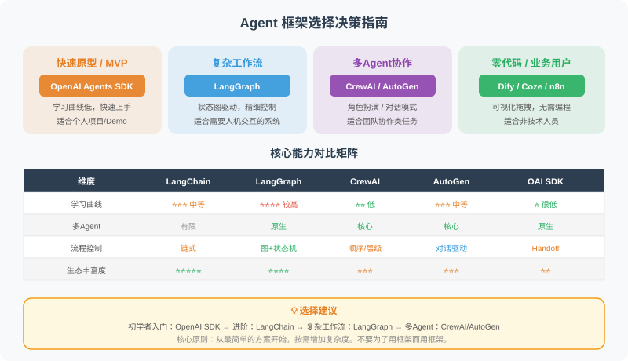

# 14.5 如何选择合适的框架？

框架选择是 Agent 项目成功的关键决策之一。随着 2025 年 OpenAI Agents SDK 的发布和各框架的快速迭代，选择变得更加丰富。本节提供系统的决策框架。



## 框架能力对比矩阵

```python
framework_comparison = {
    "框架": [
        "LangChain", "LangGraph", "CrewAI",
        "AutoGen", "OpenAI Agents SDK", "Dify", "Coze/n8n"
    ],
    
    "学习曲线": ["中等", "较高", "低", "中等", "低", "低", "很低"],
    
    "多Agent支持": [
        "有限", "原生支持", "核心特性",
        "核心特性", "原生支持", "支持", "有限"
    ],
    
    "工作流复杂度": [
        "线性", "复杂循环", "顺序/Flow",
        "事件驱动", "Handoff 交接", "可视化", "可视化"
    ],
    
    "MCP 支持": [
        "社区集成", "社区集成", "社区集成",
        "社区集成", "原生支持", "插件", "不支持"
    ],
    
    "生产就绪": ["高", "高", "中", "中", "高", "中", "低"],
    
    "最适场景": [
        "RAG/通用链",
        "有状态工作流",
        "角色协作任务",
        "代码生成/对话",
        "轻量生产Agent",
        "快速原型",
        "非技术用户"
    ]
}

# 打印对比
for key, values in framework_comparison.items():
    print(f"\n{key}：")
    for framework, value in zip(framework_comparison["框架"], values):
        if key != "框架":
            print(f"  {framework}: {value}")
```

## 决策树

```python
def choose_framework(requirements: dict) -> str:
    """根据需求选择框架（2026 年更新版）"""
    
    # 非技术团队 → 低代码
    if not requirements.get("technical_team"):
        return "Dify 或 Coze（低代码平台）"
    
    # 需要代码自动执行 → AutoGen
    if requirements.get("code_execution"):
        return "AutoGen 0.4"
    
    # 轻量 Agent、快速上线 → OpenAI Agents SDK
    if (requirements.get("lightweight") and 
        not requirements.get("complex_control_flow")):
        return "OpenAI Agents SDK"
    
    # 角色分工明确的多 Agent → CrewAI
    if (requirements.get("multi_agent") and 
        not requirements.get("complex_control_flow")):
        return "CrewAI"
    
    # 复杂状态管理/循环/Human-in-Loop → LangGraph
    if (requirements.get("complex_control_flow") or
        requirements.get("human_in_the_loop") or
        requirements.get("stateful_workflow")):
        return "LangGraph"
    
    # 标准 RAG/单 Agent → LangChain
    return "LangChain"


# 测试决策
scenarios = [
    {
        "name": "企业知识库问答",
        "technical_team": True,
        "multi_agent": False,
        "code_execution": False,
        "complex_control_flow": False,
        "lightweight": False
    },
    {
        "name": "自动化软件开发助手",
        "technical_team": True,
        "multi_agent": True,
        "code_execution": True,
        "complex_control_flow": True,
        "lightweight": False
    },
    {
        "name": "内容创作团队",
        "technical_team": True,
        "multi_agent": True,
        "code_execution": False,
        "complex_control_flow": False,
        "lightweight": False
    },
    {
        "name": "客服自动化（业务配置）",
        "technical_team": False,
        "multi_agent": False,
        "code_execution": False,
        "complex_control_flow": False,
        "lightweight": False
    },
    {
        "name": "快速构建工具调用 Agent",
        "technical_team": True,
        "multi_agent": False,
        "code_execution": False,
        "complex_control_flow": False,
        "lightweight": True
    }
]

print("框架选择建议：\n")
for scenario in scenarios:
    name = scenario["name"]  # 使用 [] 读取而非 pop()，避免修改原始字典
    # 构造不含 name 的需求字典传给决策函数
    requirements = {k: v for k, v in scenario.items() if k != "name"}
    framework = choose_framework(requirements)
    print(f"场景：{name}")
    print(f"推荐：{framework}\n")
```

## 实际项目的框架策略

```python
# 大多数生产项目会混合使用多个框架

class HybridAgentSystem:
    """
    实际生产系统的典型架构（2025-2026）：
    - LangGraph 管理复杂工作流状态
    - OpenAI Agents SDK 处理轻量 Agent 逻辑
    - LangChain 处理 RAG 和链式调用
    - MCP 统一工具接口
    - 自定义代码处理业务逻辑
    """
    
    def __init__(self):
        # LangGraph 负责工作流
        from langgraph.graph import StateGraph
        self.workflow = None  # 用 LangGraph 构建
        
        # LangChain 负责 RAG
        from langchain_community.vectorstores import Chroma
        self.knowledge_base = None  # 用 LangChain 构建
        
        # OpenAI Agents SDK 负责轻量 Agent
        # from agents import Agent, Runner
        self.agents = {}
        
        # 自定义工具（可通过 MCP 标准化）
        self.tools = {}
    
    def build(self):
        """组合各框架构建完整系统"""
        # 1. 用 LangChain 建立知识库
        # 2. 用 LangGraph 建立工作流
        # 3. 用 OpenAI Agents SDK 创建轻量 Agent
        # 4. 用 MCP 标准化工具接口
        pass

# 建议：不要被任何单一框架绑定
# 理解各框架的优势，按需组合
```

## 最终建议

选择框架的核心原则：

1. **从简单开始**：先尝试 OpenAI Agents SDK 或 LangChain + 直接 API 调用，够用就不要引入复杂框架
2. **根据瓶颈升级**：发现需要状态管理 → 引入 LangGraph；需要多角色协作 → 考虑 CrewAI；需要代码执行 → 考虑 AutoGen
3. **拥抱标准协议**：用 MCP 统一工具接口，降低框架切换成本；关注 A2A 协议发展，为 Agent 间互操作做准备
4. **保持框架无关的代码**：业务逻辑不要与框架强耦合，工具函数保持通用性
5. **重视调试与可观测性**：生产环境首选有良好日志和观测性的方案（LangSmith、Dify 等都提供了较好的可观测能力）
6. **社区和生态**：选择活跃维护的框架（查看 GitHub 活跃度）；2025 年最活跃：LangGraph、CrewAI、OpenAI Agents SDK

---

## 小结

主流框架一览：

| 框架 | 核心优势 | 推荐场景 |
|------|---------|---------|
| LangChain | 生态丰富，RAG 强大 | 通用 Agent，快速开发 |
| LangGraph | 状态管理，复杂工作流 | 生产级有状态 Agent |
| CrewAI | 简单的多 Agent + Flows | 角色分工明确的任务 |
| AutoGen 0.4 | 事件驱动，代码执行 | 编程自动化任务 |
| OpenAI Agents SDK | 轻量、MCP 原生 | 快速构建生产 Agent |
| Dify/Coze | 低代码可视化 | 非技术团队快速验证 |

---

## 📝 本章练习

读完本章，先合上书用自己的话回答下面的问题，再展开参考答案对照。

**练习 1（概念）**：AutoGPT 和 BabyAGI 在 2023 年引爆了"自主 Agent"的热潮，但本章说它们"在生产环境中的实用性有限"。请说出本章总结的至少三个它们暴露出的核心问题，并解释现代框架（如带 `max_iterations`、Human-in-the-Loop 的设计）是如何回应这些教训的。

<details>
<summary>参考答案</summary>

AutoGPT/BabyAGI 的价值在于"概念验证"——证明了 LLM 可以自主拆解并执行复杂任务，但它们暴露了全自动 Agent 的典型问题：

1. **目标漂移（Goal Drift）**：执行过程中逐渐偏离原始目标。比如目标是"写一篇博客"，结果 Agent 一路搜索资料、研究写作技巧、研究工具……最后忘了写文章。
   → 现代回应：把目标定义得**清晰且有界**（"列出前 5 个最常见投诉"而非"让产品更好"），并让每一步都对照原始目标做验证。

2. **无限循环 / 没有终止条件**："一直运行直到完成"在实践中可能永远停不下来。
   → 现代回应：强制设置 `max_iterations` / `max_steps` / `max_turns` 和预算上限——本章看到的 AutoGen、CrewAI 都内置了这类限制。

3. **任务分解能力有限**：模型自动规划的质量远不如人精心设计的流程。
   → 现代回应：人工辅助规划 + Agent 执行，或用 LangGraph 把流程显式画成图、用 CrewAI 把角色和任务显式定义出来，而不是让模型自由发挥。

4. **错误传播**：早期一步的小错误会在后续步骤被放大。
   → 现代回应：每步验证 + 回滚机制，以及 **Human-in-the-Loop（人在回路）**——在关键节点让人确认，避免错误一路滚雪球。全自动 Agent 在生产环境风险高，"人监督 + Agent 执行"才是当前可行方案。

一句话：AutoGPT 教会行业的不是"怎么做全自动 Agent"，而是"为什么全自动 Agent 不可靠"，从而推动了**有界、可控、可观测**的现代框架设计。

</details>

**练习 2（辨析）**：CrewAI 和 AutoGen 都是多 Agent 框架，但定位差别很大。有人说："多 Agent 框架都差不多，随便选一个就行。" 请用本章内容反驳：从"核心理念""是否支持代码执行""适合场景"三个角度对比 CrewAI 与 AutoGen，并各举一个最适合它们的任务。

<details>
<summary>参考答案</summary>

"随便选一个"是错的——两者的设计哲学和杀手锏完全不同，选错会让项目事倍功半。

| 对比角度 | CrewAI | AutoGen |
|---------|--------|---------|
| **核心理念** | 角色扮演 + 任务流程：先定义好 Agent（role/goal/backstory）和 Task，按预定流程（顺序或分层）执行 | Agent 间自由对话：把每个 Agent 当成"会议参与者"，通过自然语言你来我往地讨论推进 |
| **代码执行** | ❌ 不内置 | ✅ 内置沙箱执行器（Docker / 本地），能"生成代码→执行→看报错→自动修正"，这是它的杀手级特性 |
| **适合场景** | 角色分工明确、流程可预先编排的流水线任务 | 需要真正运行代码的编程/数据分析，或需要灵活多轮讨论的场景 |

**各举一个最适合的任务：**
- **CrewAI 最适合**：内容创作流水线——"研究员"收集资料 → "编辑"写文章 → "审查员"打分修改。角色清晰、流程固定，CrewAI 的声明式定义最省事。
- **AutoGen 最适合**：自动化编程任务——"程序员"写代码、"代码执行器"在 Docker 沙箱里跑、出错后程序员看报错自动改。这个"生成-执行-修正"闭环是 AutoGen 独有的，CrewAI 做不到。

**关键判断点**："需不需要让 Agent 真正运行代码？"——需要就几乎只能选 AutoGen；只是角色分工跑流程，CrewAI 更简单直观。所以框架绝不是"随便选"。

</details>

**练习 3（动手）**：你的团队接到这样一个需求："做一个企业内部的 IT 报修助手，员工用微信提问，助手查知识库回答常见问题，遇到复杂问题转人工。团队里只有产品经理和运营，没有专职程序员，要求一周内上线试用。" 请基于本章的"框架选择决策树"和选型原则，给出你的框架选择并完整说明理由；再补充：如果半年后这个助手要支持"多步审批流程 + 与内部工单系统深度集成"，你会怎么演进技术方案？

<details>
<summary>参考答案</summary>

**第一阶段选择：低代码平台（Coze 或 Dify）。**

对照本章决策树，第一个判断节点就是"是否有技术团队"——本需求明确"没有专职程序员"，决策树直接给出"Dify 或 Coze（低代码平台）"。再结合具体约束逐条验证：

| 需求点 | 为什么低代码合适 |
|--------|----------------|
| 没有程序员，产品/运营主导 | 低代码是图形化拖拽，非技术人员就能搭 |
| 一周内上线 | 低代码主打"1-3 天出原型"，时间完全够 |
| 微信渠道 | **Coze** 原生支持发布到微信/飞书等 IM 平台，这点比 Dify 更省事 |
| 查知识库答常见问题 | 两者都内置知识库 / RAG 检索 |
| 复杂问题转人工 | 可用工作流的条件分支实现"识别到复杂问题 → 转人工" |

**结论**：优先 **Coze**（因为要分发到微信，这是它的强项）；如果企业要求私有化部署、数据不能出内网，则选 **Dify**（开源、可自托管）。

**第二阶段演进（半年后：多步审批 + 工单系统深度集成）：**

按本章"根据瓶颈升级"和"混合方案"的原则演进，而不是一开始就上重型框架：

1. **识别瓶颈**：低代码平台的复杂状态管理、多步审批流程（可能有循环、回退、会签）和与内部工单系统的深度对接，会超出可视化编排的舒适区。
2. **核心逻辑迁移到 LangGraph**：多步审批本质是"有状态、带条件分支和循环"的工作流——这正是 LangGraph 的强项（强状态管理 + 循环控制 + Human-in-the-Loop 做审批确认）。
3. **保留低代码做非核心部分**：按"混合方案"，可以继续用 Coze/Dify 承担前端对话和简单问答，把审批这类核心流程用 LangGraph 重写，两者通过 API 对接。
4. **用 MCP 统一工具接口**：与工单系统的对接做成标准化工具（遵循 MCP），降低未来更换框架或新增系统的成本——呼应本章"拥抱标准协议、保持框架无关"的原则。

一句话总结演进思路：**先用低代码快速验证产品方向，验证成功后按真实瓶颈把核心流程迁移到代码框架（LangGraph），并保持业务逻辑与框架解耦。**

</details>

---

*下一章：[第16章 多 Agent 协作](../chapter_multi_agent/README.md)*
