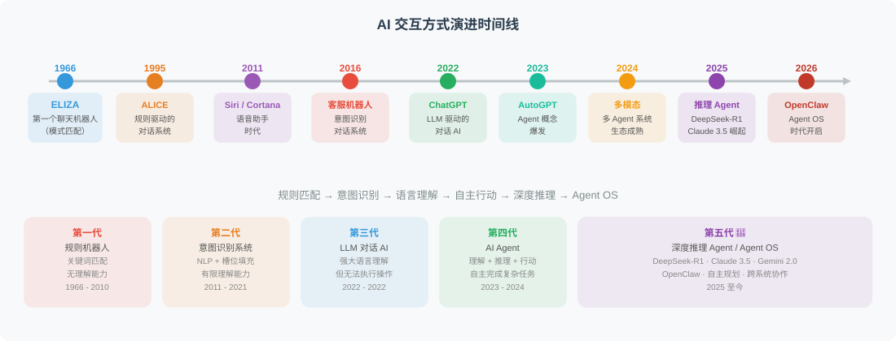
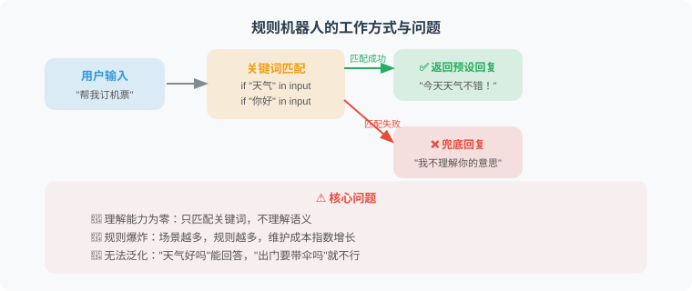
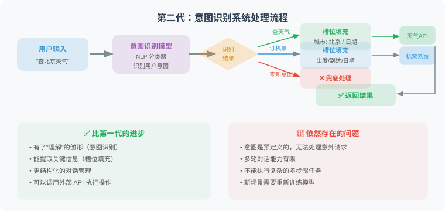
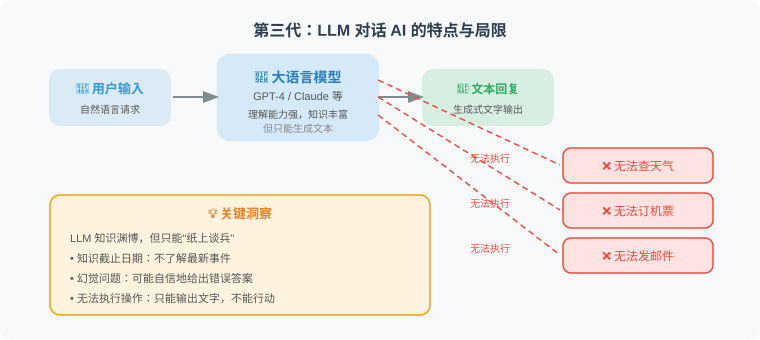
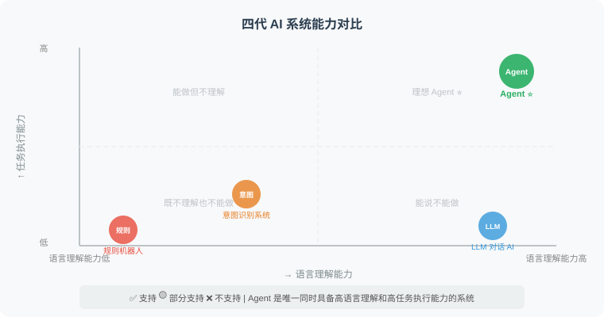
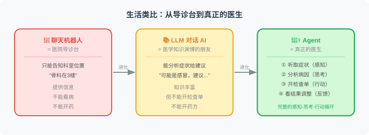

# 1.1 从聊天机器人到智能体的演进

> 📖 *"要理解 Agent 是什么，最好的方式是看看它是从哪里来的。"*

## 一段简短的历史

AI 与人类的交互方式经历了一段漫长而精彩的演进旅程。让我们坐上时光机，快速回顾这段历史：

## 第一代：基于规则的聊天机器人

最早的聊天机器人完全依赖**预设规则**。1966 年 MIT 的 Joseph Weizenbaum 创造了 ELIZA [1]——这是历史上第一个能与人类"对话"的计算机程序。它通过简单的模式匹配来"伪装"成一个心理咨询师：

**它的工作方式可以用一句话概括**：先把用户输入和一组关键词规则逐条匹配，命中哪条规则就返回对应模板；如果没有命中，就进入兜底回复。

| 输入示例 | 规则机器人会怎么处理 | 暴露的问题 |
|---|---|---|
| “你好” | 命中问候规则，返回固定欢迎语 | 只能处理被写进规则里的表达 |
| “今天天气怎样” | 命中“天气”关键词，返回预设天气话术 | 并没有真正查询实时天气 |
| “帮我订机票” | 没有匹配规则，只能说“听不懂” | 一旦超出规则边界就失效 |

这种系统看起来像在对话，本质上只是“关键词开关 + 回复模板”。

**这种方式的问题显而易见：**

| 问题 | 说明 |
|------|------|
| 🔴 理解能力为零 | 只是匹配关键词，不理解语义 |
| 🔴 规则爆炸 | 场景越多，规则越多，维护成本指数增长 |
| 🔴 无法泛化 | "天气好吗"能回答，"出门要带伞吗"就不行 |
| 🔴 无状态 | 不记得之前说过什么，每轮对话都是独立的 |

## 第二代：基于意图识别的对话系统

2016 年左右，NLP 技术的发展催生了一批更智能的对话系统。苹果 Siri（2011）、微软 Cortana（2014）等虚拟助手相继问世，它们的核心思路是：**先识别用户的意图，再做出相应的处理** [2]。

**第二代系统的核心变化**是把用户输入先转成结构化意图，再交给对应的业务流程处理。

| 阶段 | 作用 | 例子 |
|---|---|---|
| 意图识别 | 判断用户想做什么 | “查天气”“订机票”“闲聊” |
| 槽位填充 | 提取完成任务所需的关键信息 | 城市=北京，日期=明天 |
| 对话管理 | 决定下一轮问什么或执行什么 | 缺少出发地时继续追问 |

它比规则机器人更灵活，但“能做什么”仍然由开发者提前定义。用户一旦提出系统没有建模过的新需求，它仍然会退回到兜底逻辑。

**第二代系统的处理流程：**

**比第一代好在哪？**
- ✅ 有了"理解"的雏形（意图识别）
- ✅ 能提取关键信息（槽位填充）
- ✅ 更结构化的对话管理

**但依然存在的问题：**
- 🔴 意图是预定义的，无法处理"意料之外"的请求
- 🔴 多轮对话能力有限
- 🔴 不能执行复杂的、需要多步骤的任务

## 第三代：LLM 驱动的对话 AI

2022 年底，ChatGPT 横空出世，带来了划时代的变革 [3]。大语言模型（LLM）不再需要预定义意图，它能理解**任何**自然语言输入：

**LLM 驱动的对话 AI 不再依赖预定义意图**。用户可以用任意自然语言表达需求，模型会直接生成回答。

例如，面对“北京明天出门需要带伞吗？”，LLM 能理解这是在问天气和出行建议，也能给出合理的语言回复。但如果没有接入实时天气工具，它只能基于已有知识或泛化经验回答，无法真的查询“明天北京”的最新天气。

这就是第三代系统的关键边界：**理解能力显著增强，但行动能力仍然缺失**。

**LLM 对话 AI 的特点：**

> 💡 LLM 知识渊博，但只能“纸上谈兵”，无法真正执行操作。

## 第四代：Agent —— 能说更能做

终于，我们来到了 **Agent** 时代。Agent 在 LLM 强大的理解和推理能力基础上，增加了**行动能力** [4]。它不仅能理解你的需求，还能真正去执行：

**Agent 的关键变化不是“回答更像人”，而是“能够把回答转化为行动”。**

以“北京明天需要带伞吗？”为例，一个 Agent 通常会经历下面的闭环：

| 步骤 | Agent 做什么 | 结果 |
|---|---|---|
| 理解需求 | 判断用户真正想知道的是天气和出行建议 | 明确需要实时信息 |
| 选择工具 | 决定调用天气查询工具，而不是凭记忆回答 | 找到可执行动作 |
| 执行工具 | 向天气 API 传入城市和日期 | 获得最新天气数据 |
| 生成回复 | 把工具结果转成自然语言建议 | 告诉用户是否需要带伞 |

所以，Agent 可以被理解为：**LLM 负责理解和决策，工具负责连接真实世界，循环机制负责根据反馈继续修正**。具体的 Function Calling 代码会在第 3 章展开，这里先建立整体直觉。

## 四代演进对比总结

下面这张图清晰地展示了四代 AI 交互方式的核心区别：

| 能力 | 规则机器人 | 意图识别 | LLM 对话 AI | Agent |
|------|:--------:|:-------:|:-----------:|:-----:|
| 语言理解 | ❌ | 🟡 | ✅ | ✅ |
| 开放域对话 | ❌ | ❌ | ✅ | ✅ |
| 使用工具 | ❌ | 🟡 | ❌ | ✅ |
| 自主决策 | ❌ | ❌ | ❌ | ✅ |
| 任务执行 | ❌ | 🟡 | ❌ | ✅ |
| 多步规划 | ❌ | ❌ | ❌ | ✅ |
| 自我纠错 | ❌ | ❌ | 🟡 | ✅ |

> 图例：✅ 支持  🟡 部分支持  ❌ 不支持

## 关键洞察

> 💡 **Agent 的本质飞跃在于：从"只会说"到"能做事"。**
>
> - **聊天机器人** = 嘴（只能对话）
> - **Agent** = 大脑 + 嘴 + 手脚（能思考、能说话、能行动）

用一个生活类比来理解：

## 小结

- AI 交互方式经历了 **规则 → 意图识别 → LLM → Agent** 四个阶段
- 每一代都在前一代的基础上增加了新的能力
- Agent 的核心突破是：**在 LLM 的理解和推理能力上，增加了行动能力**
- Agent 可以使用工具、执行任务、做出决策，而不仅仅是生成文本

## 🤔 思考练习

1. 你日常使用的 AI 产品（如 Siri、ChatGPT、Copilot）分别属于哪一代？
2. 想一想，如果给 ChatGPT 配上"手脚"（工具），它能帮你完成哪些目前做不到的事？
3. 你认为 Agent 的下一代演进方向可能是什么？

---

*在下一节中，我们将正式给出 Agent 的定义，并深入了解它的核心特征。*

---

## 参考文献

[1] WEIZENBAUM J. ELIZA — A computer program for the study of natural language communication between man and machine[J]. Communications of the ACM, 1966, 9(1): 36-45.

[2] CHEN H, LIU X, YIN D, et al. A survey on dialogue systems: Recent advances and new frontiers[J]. ACM SIGKDD Explorations Newsletter, 2017, 19(2): 25-35.

[3] OPENAI. GPT-4 technical report[R]. arXiv preprint arXiv:2303.08774, 2023.

[4] XI Z, CHEN W, GUO X, et al. The rise and potential of large language model based agents: A survey[R]. arXiv preprint arXiv:2309.07864, 2023.
