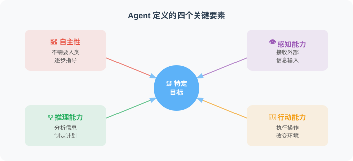

# 1.2 Agent 的核心概念与定义

> 📖 *"如果你无法清晰地定义一个概念，你就无法真正理解它。"*

## 1. 从强化学习到大模型：Agent 定义的演进

在探讨正式定义之前，我们需要理清 Agent（智能体）概念的历史脉络。Agent 并非大语言模型（LLM）时代的全新发明。早在强化学习（Reinforcement Learning, RL）主导的时期，Agent 就被用来描述在特定环境（Environment）中，通过不断地和环境交互试错（Trial and Error）来最大化累积奖励（Cumulative Reward）的算法实体（例如击败人类围棋冠军的 AlphaGo）。

然而，传统 RL 时代的 Agent 存在明显的局限性：它们往往局限于特定的封闭环境（如规则明确的棋盘或游戏），在面对全新的开放式任务时存在严重的**冷启动问题（Cold-start Problem）**，且极难将学到的策略泛化、迁移到其他领域。

大语言模型（LLM）的爆发，为 Agent 带来了一个具备海量世界知识的“通用认知大脑”，使其内涵发生了彻底的质变。综合目前学术界与工业界的共识，现代 Agent 的正式定义如下：

> **Agent 是一个以大语言模型（LLM）为核心计算与推理引擎，能够自主感知复杂环境状态、进行多步逻辑推理与目标拆解，并调用外部工具采取行动，最终以闭环形式实现特定目标的智能系统。**

在这个定义下，Agent 不再是一个只会预测下一个 Token 的文本生成器，而是一个具备自主规划能力的“数字实体”。让我们从工程和算法的视角，深度拆解这个定义中的核心要素。

---

## 2. Agent 的五大核心特征

为了彻底将 Agent 与传统的“基于规则的软件”或单纯的“问答机器人（Chatbot）”区分开来，一个真正意义上的 Agent 必须具备以下五大核心特征。

### 特征1：自主性（Autonomy）—— 从“指令驱动”到“目标驱动”

传统软件工程是**指令驱动**（Instruction-driven）的，系统的状态流转依赖于开发者预先编写的静态 DAG（有向无环图）或繁杂的 `if-else` 控制流。一旦遇到预期外的数据分布，流水线就会崩溃。而 Agent 是**目标驱动**（Goal-driven）的。

Agent 能够在没有任何人类硬编码规则、甚至没有给出具体执行步骤的情况下，利用大模型的上下文学习能力（In-context Learning），自主在未知的状态空间中探索并规划执行路径。

用更直观的话说，传统程序像一条固定流水线：缺字段就报错，遇到意外就停止。Agent 更像一个拿到目标的助理：发现缺字段后，会先判断字段是否能从上下文推断、是否需要追问用户、是否可以换一条路径继续完成任务。

| 对比项 | 传统流水线 | Agent |
|---|---|---|
| 输入异常 | 直接失败或进入预设异常分支 | 把异常当作新的观察结果 |
| 执行路径 | 开发者提前写死 | 运行时动态规划 |
| 人类提供的内容 | 具体步骤和规则 | 高层目标与边界条件 |
| 失败后的行为 | 抛错、重试或中断 | 反思原因，尝试替代方案 |

### 特征2：感知能力（Perception）—— 将异构信号转化为状态表示

Agent 必须能够从外界获取信息，理解当前的“环境”状态。需要澄清的是，感知的形式完全取决于 Agent 所在的“工作空间”：
* **纯文本/代码环境：** 编译器抛出的 Error Log、终端的标准输出（stdout）、数据库返回的 Schema。
* **多模态环境：** GUI 界面的像素截图、用户的语音指令、甚至物理机器人的传感器数据。

感知的核心算法本质，是**将物理或数字世界中高维、稀疏、异构的反馈信号，通过 Embedding 模型转化为大语言模型能够理解的统一隐空间表示（Latent Representation）。**

可以把感知模块理解为 Agent 的“信息翻译层”。它负责把外部世界中杂乱的信号整理成大模型能读懂的状态描述。

| 信号来源 | 原始形态 | 感知模块要做的事 |
|---|---|---|
| 文本请求 | 用户问题、日志、文档 | 提取目标、约束和关键事实 |
| 视觉界面 | 截图、商品图、网页布局 | 识别对象、位置和交互入口 |
| 行为序列 | 点击、浏览、购买、停留时间 | 总结用户偏好和当前意图 |
| 系统反馈 | API 返回、报错堆栈、SQL 结果 | 压缩成可推理的观察结果 |

感知不是简单“读取输入”，而是把多源信息转成下一步推理可用的上下文。

### 特征3：推理能力（Reasoning）—— 逻辑拓扑的深度展开

如果感知引擎提供了环境的状态 $S_t$，那么 LLM 就是计算策略分布 $\pi(a|S_t)$ 的核心推理中枢。Agent 的推理不再是单次的问答映射（QA Mapping），而是复杂逻辑拓扑的展开。

目前主流的 Agent 推理范式包括：
* **思维链（Chain of Thought, CoT）：** 将复杂问题线性拆解为“步骤 A -> 步骤 B -> 步骤 C”的连续逻辑节点。
* **思维树（Tree of Thoughts, ToT）：** 在每个决策点生成多个可能的分支，并结合启发式评估进行前瞻搜索和回溯，这赋予了 Agent 类似于蒙特卡洛树搜索（MCTS）的全局寻优能力。

工业界最广泛使用的是 **ReAct (Reason + Act)** 模式：它强制 Agent 在调用外部工具干预现实之前，必须先在沙盒内输出内部的思考过程（Thought）。这种机制极大地降低了模型因“幻觉（Hallucination）”而产生破坏性动作的概率。

### 特征4：行动能力（Action）—— 跨越虚拟与现实的边界

Agent 通过**工具调用**（Tool Calling / Function Calling）跨越数字边界。工具是 Agent 的“四肢”。当 Agent 在推理阶段决定需要实时数据或物理执行时，它会输出特定格式的结构化指令（通常是 JSON），从而触发外部系统的原生代码。

工具调用可以理解为一份“可行动作说明书”。其中最重要的信息包括：

| 字段 | 含义 | 为什么重要 |
|---|---|---|
| 工具名称 | Agent 可调用的动作 | 让模型知道有哪些外部能力 |
| 工具描述 | 什么时候该用、什么时候不该用 | 决定工具选择是否准确 |
| 参数定义 | 需要传入哪些信息 | 保证动作可以被真实系统执行 |
| 必填项 | 缺哪些信息不能调用 | 避免模型胡乱发起请求 |

例如，一个“查询实时指标”的工具需要说明它用于查询 pCTR、pCVR 等监控数据，并明确要求传入模型版本和时间窗口。这样 Agent 才能把自然语言目标转换成结构化动作。

### 特征5：学习与适应能力（Learning & Adaptation）—— 记忆机制与防疲劳控制

这是区分“玩具级 Agent”和“工业级 Agent”的终极分水岭。一个强大的 Agent 系统在面临连续交互或环境数据分布发生偏移（Data Shift）时，必须具备**记忆（Memory）与自我反思（Reflection）机制**。

在真实的业务流中（例如广告推荐或内容分发 Agent），如果系统仅仅是一个贪心算法，不断地向用户推荐 pCTR（预估点击率）最高的内容，很快就会导致**内容同质化（Content Homogenization）**，陷入信息茧房。用户在连续接收相似的多模态刺激后，会产生严重的**疲劳效应（Fatigue Effect）**，进而导致后链路的转化率（pCVR）断崖式下跌。

具备适应能力的 Agent 会利用长短期记忆机制进行动态干预，主动打破信息茧房：

具备适应能力的 Agent 不会只看眼前收益最高的动作，而会参考记忆判断“继续这么做是否会伤害长期目标”。

在推荐场景中，它的决策可以拆成四步：

1. **检索记忆**：查看用户最近看过、点过、跳过或明确不喜欢的内容。
2. **识别风险**：判断候选内容是否与近期曝光高度相似，是否可能造成疲劳。
3. **调整策略**：对过度重复的内容降权，同时提升多样化候选的探索机会。
4. **记录反馈**：把本次选择和用户反应写回记忆，供下一轮决策使用。

这类机制让 Agent 不只是“当前最优”，而是能在连续交互中逐步适应用户和环境变化。

---

## 3. Agent 系统的核心架构公式

综上所述，目前学术界和工业界普遍将一个完整的 AI Agent 系统的底层架构提炼为以下核心要素的组合公式：

> 🎯 **Agent = LLM (核心大脑) + Memory (记忆系统) + Planning (规划调度) + Tools (工具执行)**

| 核心组件 | 工程隐喻 | 架构职责与技术栈体现 |
| :--- | :--- | :--- |
| **LLM Engine** | CPU / 算术逻辑单元 | 负责复杂语义的理解、常识推理和自然语言生成。依赖于大参数量基座模型（如 GPT-5、Claude、Gemini、Qwen 等）。 |
| **Planning** | 操作系统调度器 | 负责宏大目标的拆解（Sub-goal Decomposition），管理任务流的时序与并发执行。涉及 ReAct 框架或复杂状态机编排。 |
| **Memory** | 内存与硬盘系统 | 维持 Agent 的上下文连贯性与长期进化。**短期记忆**依赖大模型的 Context Window；**长期记忆**依赖 Vector DB（如 Milvus）进行 RAG 检索。 |
| **Tools/Action** | 外设接口（I/O） | 赋予虚拟大脑干预物理/数字现实的能力。涉及 OpenAPI Schema 自动解析、沙盒代码执行环境（Python Sandbox）。 |

---

## 小结

如果说大语言模型是一颗被供奉在数据中心里、拥有海量知识却无法直接移动的“大脑”，那么 Agent 框架就是为其连接上了感知复杂环境的“多模态传感器”、存储过往踩坑经验的“海马体”（记忆系统），以及能够改变现实世界的“四肢”（工具 API）。

Agent 的出现，正式宣告了人工智能从 **“对话时代（Chat Paradigm）”** 全面迈向了 **“行动时代（Action Paradigm）”**。

---

## 🤔 思考练习

1. **环境与模态差异：** 一个专门用于修复 Python 后端 Bug 的代码 Agent，和一个负责在电商平台帮用户挑选衣服的导购 Agent，它们在“感知层”和“工具层”的设计架构上会有什么本质区别？
2. **冷启动与记忆池：** 当 Agent 首次部署到一个全新的业务场景时，由于“长期记忆库”为空，其表现往往不佳。能否结合多模态特征预训练模型，设计一种加速 Agent 跨域“冷启动”的初始化机制？
3. **架构的自省：** 为什么在复杂的推荐业务中，单纯依靠提升 LLM 的参数量无法解决用户的“疲劳效应”？为什么必须在 Agent 架构中引入独立于大模型的显式记忆模块与打分惩罚机制？

---

## 📚 推荐阅读与深度引言

为了进一步加深对 Agent 底层架构和前沿演进的理解，强烈建议研读以下在 AI 业界具有里程碑意义的经典文献：

1. **Weng, L. (2023). *"LLM Powered Autonomous Agents"*. OpenAI Safety & Alignment Blog.**
   * **核心贡献：** 本文是目前工业界引用最广的 Agent 综述长文。作者极度清晰地剖析了 `Agent = LLM + Memory + Planning + Tool Use` 的四位一体架构，是所有 Agent 开发者的必读总纲。
2. **Yao, S., et al. (2022). *"ReAct: Synergizing Reasoning and Acting in Language Models"*. (ICLR 2023).**
   * **核心贡献：** 首次系统性提出了将内部“逻辑推理（Reasoning）”与外部“行动（Acting）”交替进行的 ReAct 范式，彻底改变了 LLM 盲目调用工具的乱象，奠定了绝大多数现代 Agent 的控制流基础。
3. **Park, J. S., et al. (2023). *"Generative Agents: Interactive Simulacra of Human Behavior"*. (UIST 2023).**
   * **核心贡献：** 即著名的斯坦福大学“AI 小镇”论文。该研究深入探讨了 Agent 的记忆机制（观察 -> 记忆 -> 检索 -> 反思），展示了多 Agent 系统如何通过长短期记忆衍生出复杂的涌现性社会行为。
4. **Shinn, N., et al. (2023). *"Reflexion: Language Agents with Iterative Design Learning"*. (NeurIPS 2023).**
   * **核心贡献：** 深度探讨了 Agent 的自我反思（Self-reflection）机制。论文展示了智能体如何在没有额外网络权重更新的情况下，仅仅依靠将失败的教训转化为语言记忆，就能实现策略的自我进化和迭代适应。