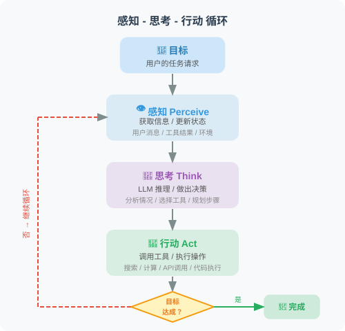
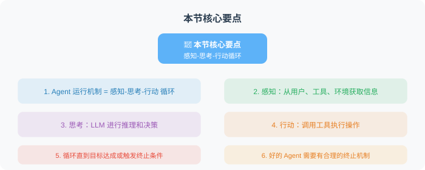

# 1.3 Agent 架构：感知-思考-行动循环

> 📖 *"智能并非静态的权重矩阵，而是系统在复杂环境中，通过高频循环交互展现出的动态适应过程。"*

## 1. 核心循环的数学形式化与 MDP 抽象

在剖析具体的代码架构之前，我们需要从系统控制论和算法原理的视角，重新审视 Agent 的运行机制。Agent 的运行绝非单向的 DAG（有向无环图）流水线，而是一个不断重复的**反馈控制回路（Feedback Control Loop）**。

在经典强化学习中，这被定义为智能体与环境的交互。在大语言模型（LLM）的语境下，我们将其精炼为 **感知-思考-行动（Observe-Think-Act, OTA）循环**。我们可以将其形式化为一个部分可观测马尔可夫决策过程（POMDP）的变体。

假设当前为第 $t$ 个时间步，整个闭环的数学与逻辑表达如下：

1. **感知 (Observe- $O_t$):**

   $$O_t = \text{Observe}(E_t, A_{t-1})$$

   Agent 观察当前高维环境 $E_t$，并获取上一步动作 $A_{t-1}$ 的确切反馈（如 API 状态码、数据库返回的 Schema、或者模型预估的点击率分布），生成当前的观察特征向量或文本表达 $O_t$。

2. **思考 (Think - $T_t, P_t$):**

   $$T_t, P_t = \text{LLM\_Policy}(O_t \mid S_{t-1})$$

   核心大模型（大脑）结合最新的观察结果 $O_t$ 与历史记忆上下文 $S_{t-1}$，进行自回归解码。生成内部逻辑推理拓扑 $T_t$（Thought，即隐变量寻优过程）和下一步的局部最优行动计划 $P_t$。

3. **行动 (Act - $A_t$):**

   $$A_t = \text{Execute}(P_t)$$

   工具执行引擎（Tool Executor）解析行动计划，对外部系统（如调整推荐排序权重、发起 SQL 查询）施加确切动作 $A_t$。环境因 $A_t$ 发生状态转移。

4. **状态与记忆更新 (State Update):**

   $$S_t = \text{Memory\_Update}(S_{t-1}, O_t, T_t, A_t)$$

   将本轮的“所见、所想、所做”进行序列化或摘要压缩，追加到全局状态空间 $S_t$ 中，作为下一轮解码的先验 Prompt。



> 🎬 **交互式动画**：想亲眼看看 OTA 循环如何运转？点击下方链接打开交互式演示，观察感知、思考、行动三个阶段的完整流转过程。
>
> <a href="../animations/pta_cycle.html" target="_blank" style="display:inline-block;padding:8px 16px;background:#4CAF50;color:white;border-radius:6px;text-decoration:none;font-weight:bold;">▶ 打开 OTA 循环交互动画</a>

---

## 2. 深度拆解：OTA 循环的工程实现壁垒

要构建一个工业级的 Agent，单纯依靠拼接 API 是远远不够的，开发者必须深入这三个阶段的底层架构。

### 👁️ 阶段一：感知（Observe）—— 异构信号的降噪与多模态对齐
大模型无法直接“看”到代码报错堆栈，也无法直接理解推荐系统中的浮点数矩阵。感知模块的核心工程任务是**信息解析、降噪与特征对齐**。

在复杂的工业场景（例如一个负责监控和优化内容分发大盘的 Agent）中，环境反馈往往是多模态和极其稀疏的：
* **结构化数据感知：** 当 Agent 执行 SQL 查询 pCTR（预估点击率）和 pCVR（预估转化率）大盘数据时，返回的 JSON 可能长达数兆。感知引擎必须使用截断（Truncation）或动态采样算法，只提取核心统计分布喂给 LLM，防止 Context Overflow。
* **多模态特征对齐：** 如果 Agent 需要分析特定商品的转化率下降原因，它不仅需要感知文本标签，还可能需要将商品的视觉封面图（Image）、用户的历史行为序列（Sequence）通过外部的 Embedding 抽取器对齐到一个统一的隐空间，再转换为自然语言描述供大模型理解。

### 🧠 阶段二：思考（Think）—— 认知范式的深度演进
“感知直接映射到行动”的端到端做法极易让模型产生严重幻觉。在工业界，思考阶段主要由以下几种高级范式主导，它们在计算开销和推理深度上各有取舍：

1. **ReAct (Reason + Act):**
   * **机制：** 强制 Agent 在输出结构化工具指令前，必须先生成一段人类可读的推理文本（Thought）。
   * **原理：** 利用大模型的自回归特性，先生成的 Thought Token 构成了后续 Action 生成的强制上下文（Forcing Context），从而极大降低了动作的随机性。
2. **Plan-and-Solve (先规划后执行):**
   * **机制：** 应对 ReAct 的延迟瓶颈（每走一步都要等待 LLM 响应）。Agent 在首轮循环中直接输出一个完整的全局任务执行图（DAG），后续循环由轻量级脚本负责调度，只在遇到异常时重新呼叫大模型。
3. **Tree of Thoughts (ToT, 思维树):**
   * **机制：** 在关键的决策分叉点，Agent 内部会生成多个候选的 Thought 分支，并调用一个 `Evaluator` 评估器对分支进行打分（Heuristic Evaluation），选择期望收益最高的路径继续展开。类似于给 Agent 装上了蒙特卡洛树搜索（MCTS）的前瞻能力。
4. **Reflexion (动态反思机制):**
   * **机制：** 引入短期的情景记忆。当感知到上一轮动作失败时，触发一段独立的 `<Reflection>` 生成过程，强制 Agent 总结失败的根本原因，并将这条经验注入当前循环：“为了避免重蹈覆辙，我这次应该调整策略”。

### 🦾 阶段三：行动（Act）—— 跨越边界与执行环境的博弈

行动是 Agent 跨越数字边界、干涉现实的物理抓手。主流工程实践深度依赖大模型的 `Function Calling` 机制。然而，在执行大模型生成的代码或高危指令时，系统设计必须在 **“安全性”** 与 **“便捷性”** 之间做出妥协。

根据应用场景的不同，Act 阶段的执行环境通常分为两条截然不同的演进路线：

**路线 1：云端/生产级 Agent（沙盒物理隔离）**
当 Agent 部署在多租户的云端环境（如企业级数据分析 Agent、自动运维 Agent）时，为了防范大模型产生幻觉输出恶意指令（例如 `DROP TABLE`、`rm -rf /` 或执行无限消耗 GPU 的挖矿脚本），所有代码维度的 Act 操作**必须被强制隔离**在瞬时的 Docker 容器或轻量级 WASM 沙盒中运行。执行完毕后环境即刻销毁，确保主机的绝对安全。

**路线 2：本地/辅助开发 Agent（信任授权与直觉流编程）**
随着 **Vibe Coding（直觉流编程）** 的兴起，像 Cursor、Aider 以及各种 CLI 本地智能体成为了开发者的“结对编程”伙伴。这类 Agent 为了追求极致的开发体验，通常**直接在用户的宿主机（本地操作系统）上运行**。

由于放弃了严格的物理隔离，这类架构在执行层衍生出了**不同信任等级的授权模式**：

* **人类在环（Human-in-the-loop, HITL）默认模式：** 在执行状态变更命令（如安装依赖、修改系统配置）前，框架会在终端请求人类开发者输入 `y/n` 确认。人类的经验是最后的护栏。
* **全自动执行（Auto-run / YOLO 模式）：** 像 Cursor 的 Composer 或 Aider 的全自动模式，允许用户向 Agent 授予**完整的终端控制权**。Agent 可以自主运行测试、读取 Terminal 报错日志、自动安装缺失的 npm 包并递归修复 Bug。此时，"隔离护栏"被完全打破，取而代之的是极致的效率，而系统的底线安全则依赖于操作系统的用户权限（非 Root 运行）以及高频的 Git 版本自动提交（随时可回滚）。

---

## 3. 工业级核心源码：基于 FSM 的状态机调度架构

相比于简单的 `while True` 循环，现代先进的 Agent 框架（如 LangGraph, AutoGen）底层都采用了**有限状态机**（Finite State Machine, FSM）的流转架构。

下面我们将摒弃玩具级的“天气查询”案例，直接手搓一个贴近算法真实业务流的 **“广告算法调优 Agent”** 骨架。它展示了高内聚的 ReAct 循环引擎如何维护状态、追踪轨迹并进行多工具路由。

工业级 Agent 的状态机调度器可以先用架构视角理解，而不必一上来阅读完整源码。一个可靠的调度器通常包含以下组件：

| 组件 | 职责 | 读者需要理解的重点 |
|---|---|---|
| 全局状态 | 保存目标、历史轨迹、当前轮次和终止状态 | Agent 不是无状态问答，而是持续累积上下文 |
| LLM 决策器 | 根据观察结果生成下一步思考和行动 | 模型负责“决定做什么”，不直接完成所有事 |
| 工具路由器 | 把模型选择的动作转交给真实工具执行 | 工具是确定性的执行边界 |
| 观察记录器 | 把工具返回、错误和环境变化写回轨迹 | 下一轮推理依赖上一轮反馈 |
| 护栏机制 | 限制最大轮数、检查格式、处理重复动作 | 防止幻觉、死循环和危险操作 |

以“广告算法调优 Agent”为例，它不会一次性给出结论，而是循环执行：先查询 pCVR 下滑幅度，再检查长尾视频类别，再分析内容相似度，最后输出干预建议。

如果要落到工程实现，伪流程如下：

1. 初始化任务目标和空白轨迹。
2. 将目标与历史轨迹交给 LLM，要求它输出“思考、动作、动作参数”。
3. 校验动作格式和参数是否合法。
4. 调用对应工具并截断过长返回。
5. 把观察结果写回轨迹。
6. 如果任务完成、达到最大轮数或触发护栏，则结束；否则进入下一轮。

真正的代码实现会在后续框架和项目章节展开。本章的重点是理解：**Agent 架构的核心不是某段循环代码，而是状态、工具、反馈和护栏组成的闭环系统。**

### 生产环境流转轨迹示例：

如果算法工程师下发的 `user_goal` 是：*“今天大盘多模态推荐实验组的 pCVR 出现显著下滑，请帮我排查原因并给出干预建议。”*

该 Agent 的循环日志将展现出极其专业的诊断逻辑：

```text
🔄 --- [OTA Loop 1/12] ---
🧠 [Thought] 我需要先确认大盘数据的下滑幅度，以及主要影响的流量特征。我将查询今日各策略组的 pCVR 数据。
🦾 [Action Decision] -> query_pctr_cvr_metrics({"experiment_group": "multimodal_exp_v2", "metric": "pCVR"})
📊 [Observation] 返回结果：相比对照组，实验组 pCVR 下滑 14.2%，主要集中在长尾冷启动视频类别。

🔄 --- [OTA Loop 2/12] ---
🧠 [Thought] 既然问题出在长尾视频，这可能是因为多模态 Embedding 融合阶段对稀疏特征的表达能力不足，或者内容推荐过于同质化导致了用户的审美疲劳。我需要查询冷启动阶段的特征分布相似度。
🦾 [Action Decision] -> analyze_multimodal_embeddings({"target_category": "long_tail_video"})
📊 [Observation] 返回结果：实验组召回列表的内容 Embedding 余弦相似度均值达到 0.89，表明内容高度同质化。

🔄 --- [OTA Loop 3/12] ---
🧠 [Thought] 明确了原因。多模态语义捕捉能力过强，导致对相同特征的内容进行了过度推荐，引发了严重的防疲劳机制缺失。我可以输出诊断报告了。
🦾 [Action Decision] -> Finish({"final_report": "诊断完毕。下滑原因为多模态推荐过度拟合，引发用户疲劳。建议在 SE_Logit 或重排层增加多样性惩罚项 (Anti-fatigue penalty)。"})
```

---

## 4. 工业级暗礁：循环失控与系统级护栏 (Guardrails)

在真实的线上业务中，环境充满噪声，Agent 极易陷入 **“循环崩溃”**。一个成熟的架构必须在 OTA 循环外部署多层“护栏”：

1. **无限死循环（Infinite Looping）：**
   * *现象：* Agent 陷入逻辑死锁。例如：*“尝试读取表 A -> 表 A 不存在 -> 再次尝试读取表 A”*。
   * *防线设计：* 在主循环外部署轨迹监控算法。如果检测到上下文中连续出现 3 次完全相同的 `Action` 和 `Action Input`，立刻通过环境反馈强力打断：`"Observation: [System Warning] 你已经连续重复了3次相同的无效动作，必须立刻切换其他工具或改变分析思路！"`。
2. **上下文窗口爆炸（Context Overflow）：**
   * *现象：* 如果工具 API 返回了数十万行的全量用户埋点数据，LLM 瞬间就会触碰 Token 上限，导致模型崩溃或截断。
   * *防线设计：* 实施**动态滑动窗口摘要（Sliding Window Summarization）**。当 `scratchpad` 长度逼近水位线时，主动剥离前 80% 的历史循环节点，调用轻量级模型（或文本提取算法）将其压缩为高密度的状态摘要。
3. **级联幻觉（Cascading Hallucinations）：**
   * *现象：* 如果某一步分析工具报错，Agent 可能会无视失败，在后续的 Think 中假装自己成功获取了指标，并凭空捏造虚假结论。
   * *防线设计：* 引入**独立评估器（Critic Evaluator）机制**。在触发 `Finish` 行动前，利用另一个 LLM 校验全局逻辑链条（Trajectory Check）：*“它给出的最终结论是否真正得到了前面 Observation 的数据支撑？”* 如果支撑不足，直接拦截并打回重做。

---

## 小结



| OTA 阶段 | 系统职责 | 工程化挑战与技术防线 |
| :--- | :--- | :--- |
| **感知 (Observe)** | 从高维、噪声环境中提取有效状态表征 | 数据防截断、多路特征聚合、JSON 结构体清洗 |
| **思考 (Think)** | 状态流转评估、多步目标寻优与规划 | Prompt 工程、ReAct 模板、ToT 剪枝机制、反思记忆注入 |
| **行动 (Act)** | 跨越边界触发外部物理/数字世界状态变更 | Schema 强校验、沙盒隔离执行、容错与重试路由 |

感知、思考、行动，构成了智能体持续进化的底层飞轮。基座模型（LLM）的算力越强，思考（Think）的全局前瞻能力越深；工具基建（Tools）越扎实，行动（Act）干涉现实的能力就越广。

## 🤔 思考练习

1. **并行规划陷阱：** 如果你的算法 Agent 需要同时查询北京、上海、广州三个数据中心的大盘耗时。在纯正的单线程 ReAct 范式下，它需要走 3 轮完整循环。你能否通过改造 `Think` 层面的输出约束，实现并发的 `Action` 调用，从而大幅降低大模型的网络延迟？
2. **架构回溯机制：** 观察上述状态机代码，如果在第 8 轮循环时 Agent 意识到自己在第 2 轮对某个字段的理解走错了方向，它目前的架构能支持“撤销”并回溯到第 2 轮的状态吗？如果不能，应该引入什么数据结构来改造草稿本（Scratchpad）？
3. **强化学习视角：** 尝试用伪代码将 ReAct 循环中的 `Thought -> Action -> Observation` 轨迹，映射为强化学习中 PPO 或 Q-Learning 算法的奖励反馈公式。Agent 的提示词（Prompt）相当于 RL 中的什么要素？

---

## 📚 推荐阅读与深度引言

深入理解底层控制循环和推理范式的演进，是资深算法从业者构建复杂系统的基石：

1. **Yao, S., et al. (2022). *"ReAct: Synergizing Reasoning and Acting in Language Models"*. (ICLR 2023)**
   * **研读价值：** 现代 Agent 架构的“创世级论文”。它用详实的数据证明：在复杂决策中，单独的推理（CoT）或单独的盲目行动（Acting）表现均不佳，唯有将二者在闭环中交织，才能激发出类似人类的试错和自修正涌现能力。
2. **Wang, L., et al. (2023). *"Plan-and-Solve Prompting: Improving Zero-Shot Chain-of-Thought Reasoning by Large Language Models"*. (ACL 2023)**
   * **研读价值：** 直击 ReAct 推理效率低下的痛点。本文提出预先生成完整执行 DAG 图，分离“全局规划器（Planner）”和“局部执行器（Executor）”的理念。
3. **Harrison Chase. (2024). *"LangGraph: Multi-Agent Workflows"*. LangChain Engineering Blog.**
   * **研读价值：** 工业界最前沿的编排实践。深度解释了为什么必须将简易的 `While` 循环彻底重构为以节点（Nodes）和边（Edges）构成的有向循环状态图，以构建容错率极高的生产级 Agent 系统。