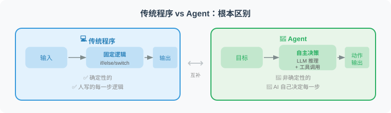
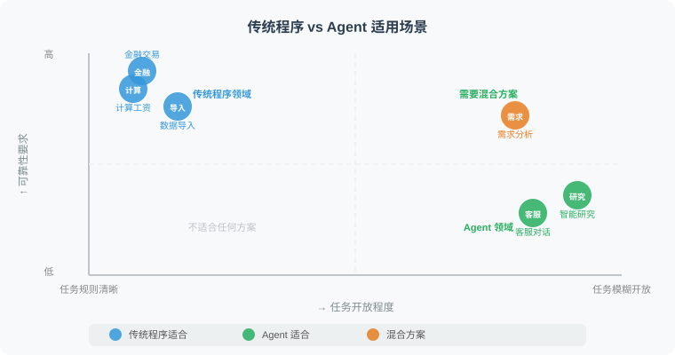

# 1.4 Agent 与传统程序的区别

> 📖 *"人工智能的演进，本质上是软件工程范式的跃迁。理解 Agent 最好的方式，就是搞清楚它与传统代码在‘控制权’上的根本博弈。"*

## 1. 核心范式的转移：从“软件 1.0”到“软件 2.0”

特斯拉前 AI 总监 Andrej Karpathy 曾提出过著名的“软件 2.0”理念。如果沿着这个思路往下推演，传统程序与 AI Agent 的根本差异在于**系统状态机（State Machine）的驱动方式**。

* **传统程序（Software 1.0）：确定性有向无环图（Static DAG）**
    系统的每一种状态流转、每一个 `if-else` 分支、每一次异常捕获，都必须由人类程序员在编译前**穷举并硬编码（Hard-coded）**。它的本质是**指令驱动（Instruction-driven）**。
* **AI Agent（Software 2.0+）：动态概率路由（Dynamic Probabilistic Routing）**
    人类不再定义执行路径，而是定义**高维目标**（Goal）与**边界护栏**（Guardrails）。Agent 依赖大模型的上下文理解和自回归推理能力，在运行时（Runtime）动态生成并修正执行路径。它的本质是**意图驱动**（Intent-driven）。



---

## 2. 源码级对比：应对“环境漂移”的降维打击

在算法工程中，我们经常遇到**数据漂移**（Data Shift）或**模式变更**（Schema Evolution）。让我们通过一个真实的数据分析场景来对比两者的脆弱性与反脆弱性。

**任务：** *“读取一份最新的广告投放报表（CSV），找出转化率（pCVR）最高且消耗大于 1000 的策略组。”*

### ❌ 传统程序的做法：脆弱的“玻璃管道”

传统程序在这个任务中通常会采用固定流水线：读取 CSV、按预设列名过滤、按预设指标排序并输出结果。只要上游报表结构稳定，这种方式非常高效。

但它的脆弱点也很明确：

| 假设 | 一旦变化会发生什么 |
|---|---|
| 列名一定叫 `cost` | 如果改成 `spend_usd`，过滤逻辑会失败 |
| 转化率字段一定叫 `pCVR` | 如果改成 `conversion_rate`，排序逻辑会失败 |
| 状态字段一定是布尔值 | 如果变成 `Y/N` 字符串，条件判断会失效 |
| 文件格式一直不变 | 如果多了表头说明或缺失值，清洗逻辑可能崩溃 |

传统程序的优势是确定、快速、可复现；劣势是面对未知变化时很难自救。

### ✅ Agent 的做法：具备自愈能力的动态执行

Agent 的处理方式更像一个会探索的分析师。它不会假设所有字段都固定，而是先观察数据结构，再根据目标动态生成分析路径。

| 循环 | Agent 的行为 | 价值 |
|---|---|---|
| 第 1 轮 | 读取表头，确认当前 CSV 有哪些字段 | 先感知环境，而不是直接套用旧规则 |
| 第 2 轮 | 将 `spend_usd` 对齐为“消耗”，将 `conversion_rate` 对齐为“转化率” | 进行语义匹配 |
| 第 3 轮 | 发现 `is_active` 是 `Y/N` 字符串后修正过滤条件 | 根据错误反馈自我修正 |
| 第 4 轮 | 输出转化率最高且消耗达标的策略组 | 完成原始目标 |

这就是 Agent 的反脆弱性：它把异常当成新的观察结果，而不是任务终点。

---

## 3. 工业级六大维度对比剖析



| 架构维度 | 传统程序 (Software 1.0) | 智能体 (Agent / Software 2.0+) |
| :--- | :--- | :--- |
| **控制流 (Control Flow)** | 静态编译的控制图（DAG / DFA） | 基于 LLM 的动态概率寻路与规划 |
| **输入接口 (Interface)** | 强 Schema 约束（RESTful, Protobuf） | 模糊自然语言、多模态意图（Images, Audio） |
| **异常处理 (Fault Tolerance)** | 显式的 `try-catch` 穷举设计 | 动态的堆栈分析、自我反思（Reflexion）与重试 |
| **泛化能力 (Generalization)** | 零泛化：应对 $N$ 个场景需写 $N$ 套代码 | 强泛化：提供通用工具，可应对无穷的未知场景 |
| **计算复杂度 (Complexity)** | 时间复杂度可精确度量（如 $O(N \log N)$） | 复杂度取决于 LLM 推理深度，具有不确定延迟 |
| **系统状态 (Determinism)** | 绝对的确定性：$f(x) \equiv y$ | 随机过程：相同输入可能引发不同的探索轨迹 |

---

## 4. 深度探讨：容错机制的降维打击

传统工程中的容错（Fault Tolerance）是极其僵化的。例如，当调用外部 API 遇到 `HTTP 429 Too Many Requests` 时，传统程序的极限就是执行**指数退避重试（Exponential Backoff）**。如果重试 3 次依然失败，程序就会抛出异常并熔断。

但 Agent 的容错是**基于语义理解的动态降级**：

```text
🚨 异常发生: Agent 调用 Google Search API 失败 (Quota Exceeded)。

🧠 传统程序的“大脑”: 
"触发异常 -> 重试 -> 重试失败 -> 抛出 RuntimeError -> 任务死亡"

🤖 Agent 的“大脑” (动态推理):
"Thought: Google Search API 的额度用尽了。但我现在的目标是获取 2026 年的财报数据。
除了 Google，我还可以怎么做？
方案 A: 切换调用备用的 Bing Search 工具。
方案 B: 使用 Web Browser 工具直接去指定的官网抓取。
方案 C: 查看本地知识库是否已经有了缓存。
我决定采取方案 A。"
-> 任务存活，动态绕过故障节点。
```

---

## 5. 架构的妥协：非确定性的双刃剑

必须要澄清的是，Agent 并非万能的“银弹”。传统程序最大的优势在于其**绝对的确定性**（Determinism）和**低延迟**。

在 Agent 架构中，大模型的输出本质上是对下一个 Token 的概率抽样（Stochastic Sampling）。这意味着：
1. **轨迹不可复现：** 相同的输入，Agent 昨天可能一次成功，今天可能因为在“思考树”上选错了分支而陷入死循环。
2. **高昂的延迟（Latency Tax）：** 传统程序在毫秒级（ms）完成的 `if-else` 判断，Agent 可能需要消耗 2-5 秒来等待 LLM 的推理生成。

> 💡 **架构师箴言（Architect's Rule of Thumb）：**
> **"Agent = 概率性的大脑 + 确定性的工具"**
> 永远不要让 LLM 去做精确的数学计算或直接修改底层数据库表。正确的做法是让 LLM（Agent）负责**意图理解与规划调度**，而将具体的业务逻辑封装为**确定性的 API 工具**供其调用。

---

## 6. 业务选型指南：什么时候用 Agent？

在实际的业务落地中，不要为了追逐 AI 概念而强行使用 Agent。我们需要根据**认知复杂度**（Cognitive Complexity）和**执行频率**（Execution Frequency）来进行架构选型。


1. **强规则、高并发、低延迟（坚守传统程序）：**
   * *场景：* 推荐系统的高并发召回层、广告计费引擎、双十一秒杀扣库存。
   * *理由：* 绝不能容忍毫秒级的延迟波动和任何非确定性的结果。
2. **重流程、需人工审核（使用传统流编排 + AI Copilot）：**
   * *场景：* 财务审批流、核心数据库迁移。
   * *理由：* 流程必须完全受控，AI 仅作为辅助提供建议（人类在环）。
3. **高动态、长尾需求、认知密集型（拥抱 Agent）：**
   * *场景：* 自动化数据探索与归因分析、代码 Bug 自动修复（SWE-agent）、海量非结构化文档的深度研判。
   * *理由：* 规则多如牛毛且时刻变化，人类程序员无法穷举所有 `if-else`。Agent 的泛化能力将极大降低研发边际成本。

---

## 小结

如果说**传统程序是铺设好的“铁轨”**，火车只能沿着固定的路线行驶，安全但缺乏灵活性；那么 **Agent 就是装配了 GPS 的“越野车”**，你只需设定终点坐标，它会自主感知地形、绕开路障，甚至在爆胎时自己寻找备胎，最终抵达目标。

## 🤔 思考练习

1. **边界思考：** 在自动驾驶系统中，刹车控制模块（Braking Control）和路线规划模块（Route Planning），哪个更适合用传统程序？哪个更适合引入 Agent 的思想？为什么？
2. **重构挑战：** 假设你维护着一个充满了几千个 `if-elif-else` 分支的客服工单路由系统。如果用 Agent 架构来重构它，你的系统架构图会发生怎样的变化？原来的那些 `if-else` 逻辑会被转移到哪里？
3. **容错陷阱：** Agent 的“自我修复”能力有时会弄巧成拙（例如反复修改代码导致偏离原意）。如何设计一种混合架构，既保留 Agent 的自主性，又能防止它在错误的方向上越走越远？

---

## 📚 推荐阅读与深度引言

* **Andrej Karpathy (2017). *"Software 2.0"*.**
  *(这是一篇极其经典的博客，深刻预言了以神经网络为代表的随机系统将如何取代部分传统的硬编码逻辑，为 Agent 的爆发奠定了思想基础。)*
* **Schick, T., et al. (2023). *"Toolformer: Language Models Can Teach Themselves to Use Tools"*.**
  *(展现了模型如何跨越“非确定性”的文本生成，学会通过 API 接口与“确定性”的传统程序系统进行交互，是理解 Agent 工具调用本质的必读文献。)*
* **Rich Sutton (2019). *"The Bitter Lesson"*.**
  *(强化学习先驱的洞察。他指出在长期的 AI 演进中，试图将人类的先验知识（即传统程序的硬编码规则）强加给系统的做法最终都会失败，唯有利用算力和搜索（Agent 自主规划的核心）才是正途。)*