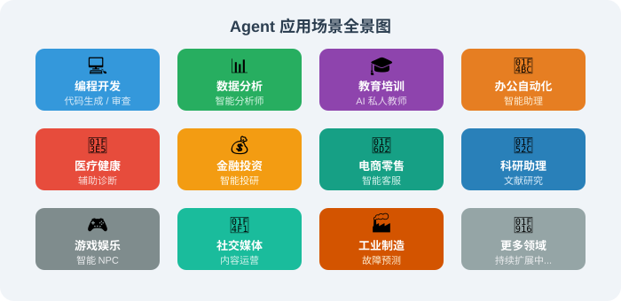
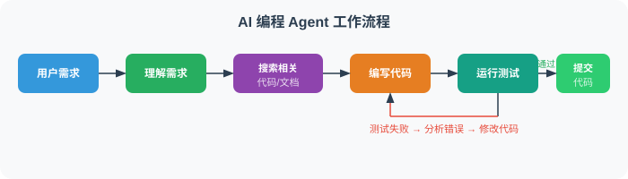
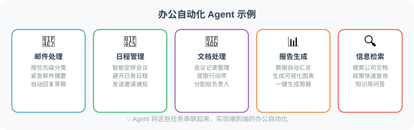
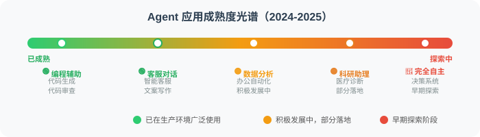

# 1.5 Agent 的应用场景全景图

> 📖 *"Agent 不是某个行业的专属技术，它是一种通用的智能化范式。"*

## 应用全景概览

Agent 技术正在各个领域快速落地。让我们从全局视角看看 Agent 能做什么：

## 场景1：💻 编程开发 —— AI 编程助手

这可能是目前最成熟、影响最大的 Agent 应用场景。

AI 编程助手常见能力可以分成四类：

| 场景 | 用户怎么说 | Agent 做什么 |
|---|---|---|
| 代码生成 | “帮我写一个用户注册接口” | 规划接口、数据模型、校验和错误处理 |
| Bug 修复 | “这段代码报 `NoneType` 错误” | 阅读上下文、定位原因、给出修复方案 |
| 代码审查 | “帮我 review 这个 PR” | 检查安全、性能、可维护性和边界条件 |
| 项目脚手架 | “创建一个带日志和配置的 Python 项目” | 规划目录、创建文件、补齐依赖和运行说明 |

代表产品包括 GitHub Copilot、Cursor、Windsurf、Devin 等。

**AI 编程 Agent 的工作流程：**

## 场景2：📊 数据分析 —— 智能分析师

数据分析 Agent 的价值在于让用户用自然语言提出分析目标，而不是先掌握 SQL、Python、统计学和可视化工具。

典型流程如下：

1. **理解需求**：把“分析上季度用户流失”转成流失率、流失用户特征、可能原因等子问题。
2. **连接数据**：查询用户行为、订单、客服记录等数据源。
3. **清洗数据**：处理缺失值、异常值和字段口径不一致。
4. **执行分析**：计算趋势、分群对比和流失前行为模式。
5. **生成可视化**：输出趋势图、漏斗图、对比图。
6. **总结洞察**：用业务语言解释主要原因和建议动作。

## 场景3：🎓 教育培训 —— AI 私人教师

教育 Agent 与传统在线课程最大的区别是“自适应”。

| 能力 | 传统课程 | 教育 Agent |
|---|---|---|
| 教学内容 | 所有学生看同样材料 | 根据学生当前理解程度调整解释方式 |
| 难度控制 | 预先固定 | 答对则加深，答错则降阶或换例子 |
| 反馈方式 | 课后统一批改 | 对话中实时判断困惑点 |
| 练习生成 | 固定题库 | 针对薄弱环节生成个性化题目 |

例如学生说“我不理解递归”，Agent 可以先用查字典、俄罗斯套娃等生活类比解释，再根据学生反馈决定是否进入代码示例。

## 场景4：💼 办公自动化 —— 智能助理

## 场景5：🛒 电商零售 —— 智能客服与推荐

电商 Agent 的核心价值，是从“被动菜单式客服”升级为“理解上下文的主动服务”。

| 场景 | 传统系统 | Agent 系统 |
|---|---|---|
| 智能客服 | 让用户选择退换货、物流、投诉等菜单 | 结合订单和评价主动判断问题并给出处理方案 |
| 个性化推荐 | 基于协同过滤推荐常见搭配 | 结合近期行为、天气、预算和偏好给出解释型推荐 |
| 售后跟进 | 固定时间发送评价邀请 | 根据商品类型提供使用指导、保养建议或补购提醒 |

## 场景6：🔬 科研助理 —— 文献研究与实验设计

科研 Agent 可以覆盖从文献到实验再到写作的多个环节：

| 环节 | 示例需求 | Agent 产出 |
|---|---|---|
| 文献检索 | “找最近 3 年 Transformer 在医学影像中的应用” | 论文列表、方法对比、关键结论 |
| 实验设计 | “设计新药对小鼠血糖影响的实验” | 对照组、样本量、统计方法和风险点 |
| 数据分析 | “分析这组基因表达数据” | 差异基因、火山图、热力图和解释 |
| 论文写作 | “把实验结果写成 Results 部分” | 符合学术表达的结果描述 |

## 更多应用场景速览

| 领域 | Agent 应用示例 |
|------|------|
| 💰 金融 | 智能投研、风险评估、合规审查、报告生成 |
| 🏥 医疗 | 辅助诊断、病历分析、药物研究、患者随访 |
| ⚖️ 法律 | 合同审查、案例检索、法律咨询、文书生成 |
| 🏭 工业 | 设备监控、故障预测、质量检测、生产调度 |
| 🎮 游戏 | 智能 NPC、游戏测试、关卡设计、玩家分析 |
| 📱 社交 | 内容审核、用户运营、舆情监控、社群管理 |
| 🚗 出行 | 路线规划、行程助手、车辆诊断、调度优化 |
| 🏠 地产 | 房源推荐、合同处理、市场分析、客户服务 |

## Agent 应用的成熟度光谱

不同的应用场景处于不同的成熟阶段：

## 你的第一个 Agent 应用创意

学完了这些应用场景，试着想一个你自己的 Agent 应用：

请用下面这张表设计你的第一个 Agent 创意：

| 项目 | 你的填写 |
|---|---|
| 名称 | 例如：面试教练 Agent |
| 目标用户 | 例如：求职者 |
| 核心功能 | 例如：模拟面试、简历优化、面经整理 |
| 需要的工具 | 例如：职位搜索、题库检索、简历分析 |
| 为什么适合 Agent | 例如：能根据目标职位实时追问，并给出个性化反馈 |

这个练习的重点不是写代码，而是想清楚：它感知什么信息、调用什么工具、如何根据反馈持续改进。

## 小结

| 要点 | 说明 |
|------|------|
| **应用广度** | Agent 几乎可以应用于所有需要智能化的场景 |
| **最成熟领域** | 编程辅助、智能客服、文案创作 |
| **高潜力领域** | 数据分析、办公自动化、教育培训 |
| **核心价值** | 将专家级能力民主化，让每个人都拥有"AI 助手" |
| **关键原则** | Agent 是增强人类能力，不是替代人类 |

## 🤔 思考练习

1. 在你的日常工作或学习中，哪些任务最适合交给 Agent？
2. 你所在行业还有哪些 Agent 应用的机会？
3. 设计你自己的第一个 Agent 创意，填写上面的模板！

---

## 参考文献

[1] NAKANO R, HILTON J, BALWIT A, et al. WebGPT: Browser-assisted question-answering with human feedback[R]. arXiv preprint arXiv:2112.09332, 2021.

[2] CHEN M, TWOREK J, JUN H, et al. Evaluating large language models trained on code[R]. arXiv preprint arXiv:2107.03374, 2021.

[3] YANG J, JIMENEZ C E, WETTIG A, et al. SWE-agent: Agent-computer interfaces enable automated software engineering[R]. arXiv preprint arXiv:2405.15793, 2024.

[4] CHASE H. LangChain: Building applications with LLMs through composability[EB/OL]. 2022. https://github.com/langchain-ai/langchain.

---

*下一节：[1.6 智能体发展史：从符号主义到大模型驱动](./06_history.md)*
