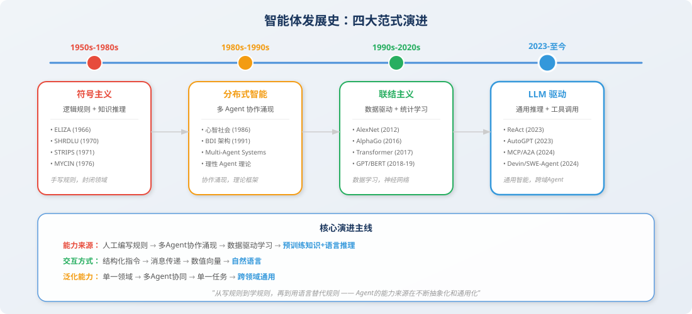
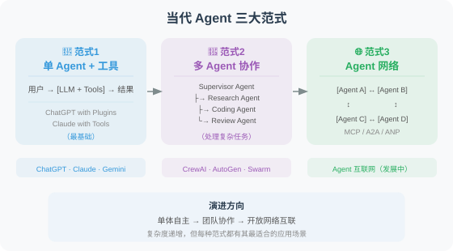
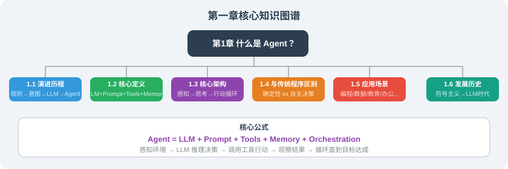

# 1.6 智能体发展史：从符号主义到大模型驱动

> 📖 *"不了解历史，就无法真正理解当下。Agent 的每一次跃迁，都站在前人的肩膀之上。"*

## 为什么要了解发展史？

"Agent"这个概念并非 LLM 时代的发明。从 1950 年代 AI 学科诞生之日起，**如何构建能够自主行动的智能系统**就是核心研究命题。了解这段历史，能让我们：

1. 理解当前 Agent 架构设计背后的**学术渊源**
2. 避免"重新发明轮子"——很多经典方法仍在发挥作用
3. 预判未来 Agent 技术的**演进方向**



## 第一阶段：符号主义智能体（1950s—1980s）

### 图灵的预言

1950 年，Alan Turing 发表了划时代的论文《Computing Machinery and Intelligence》[1]，提出了"机器能思考吗？"这个根本性问题，并设计了著名的"图灵测试"。这篇论文为整个 AI 领域奠定了哲学基础。

### 早期专家系统

符号主义（Symbolism）认为智能的本质是**符号操作**：通过逻辑规则推理来模拟人类思维。这一时期的代表性系统包括：

- **SHRDLU（1970）**[2]：MIT 的 Terry Winograd 开发的自然语言理解系统，能在一个由积木组成的虚拟世界中理解并执行指令（如"把红色方块放在蓝色方块上面"）。它是最早的"能理解语言并执行动作"的系统——某种意义上，这就是最原始的 Agent。

- **MYCIN（1976）**[3]：斯坦福大学开发的医学诊断专家系统，使用约 600 条规则来诊断细菌感染并推荐抗生素。在临床测试中，MYCIN 的诊断准确率达到 69%，超过了当时大多数非专科医生。

- **STRIPS（1971）**[4]：SRI International 开发的自动化规划系统，为机器人 Shakey 提供行动规划能力。STRIPS 提出的"前置条件-动作-效果"规划范式，至今仍是 AI 规划领域的基础框架。

STRIPS 的核心思想可以不用代码理解：每个动作都由三部分组成——**前置条件**、**动作本身**和**执行后的效果**。

以“移动积木”为例：

| 部分 | 含义 | 示例 |
|---|---|---|
| 前置条件 | 动作发生前必须满足什么 | 积木是空闲的，目标位置是空闲的 |
| 动作 | 系统实际执行什么 | 把积木从 A 移到 B |
| 效果 | 执行后世界状态如何变化 | 积木位于 B，A 变为空闲 |

这种“条件—动作—效果”的表达方式，正是今天 Agent 工具调用和任务规划的早期思想来源。

### 符号主义的局限

符号主义 Agent 在**封闭领域**内表现出色，但面临根本性瓶颈：

| 问题 | 说明 |
|------|------|
| 知识获取瓶颈 | 规则需要人工手动编写，数量呈指数增长 |
| 脆弱性 | 遇到规则未覆盖的情况就完全失效 |
| 常识缺失 | 无法处理"不言自明"的常识知识 |
| 可扩展性差 | 规则库越大，规则之间的冲突越难管理 |

> 💡 **与当代 Agent 的联系**：符号主义的"规则+推理"思路并未消亡。在今天的 LLM Agent 中，**系统提示词（System Prompt）** 其实就是一种软性"规则"，而**工具的参数约束**则是硬性规则。区别在于 LLM 用统计学习取代了手工编码的逻辑推理。

## 第二阶段：心智社会与分布式智能（1980s—1990s）

### 明斯基的"心智社会"

1986 年，MIT 人工智能实验室的创始人之一 Marvin Minsky 出版了《心智社会（The Society of Mind）》[5]。他提出了一个革命性的观点：

> **智能不是单一能力的体现，而是大量"不那么聪明"的小 Agent（Minsky 称之为 "agency"）协作的结果。**

这个理论的核心思想是：

- 每个小 Agent 只负责一件简单的事（如"识别颜色"、"计算距离"）
- 复杂的智能行为由这些小 Agent 的层级协作**涌现**出来
- 不同的小 Agent 之间会竞争和合作

“心智社会”的重点不在于某个复杂类如何实现，而在于：**智能可以由许多能力有限的小模块协作涌现出来**。

| 小 Agent | 擅长的事 | 协作价值 |
|---|---|---|
| 语言理解者 | 解析用户意图 | 把自然语言转成任务目标 |
| 规划者 | 拆解步骤 | 决定先做什么、后做什么 |
| 执行者 | 调用工具 | 把计划落实到外部动作 |
| 评估者 | 检查结果 | 判断是否需要重试或修正 |

现代多 Agent 系统仍然沿用这一思想：单个模块不必全能，只要接口清晰、反馈闭环可靠，整体就能表现出复杂智能。

### BDI 架构

1990 年代，Rao 和 Georgeff 提出了 **BDI（Belief-Desire-Intention）架构** [6]，成为理性 Agent 的标准理论框架：

- **Belief（信念）**：Agent 对世界的认知（"我认为现在的交通状况很拥堵"）
- **Desire（愿望）**：Agent 想要达成的目标（"我想在 30 分钟内到达公司"）
- **Intention（意图）**：Agent 决定采取的行动计划（"我选择坐地铁而不是开车"）

BDI 架构可以理解为三个层次：

| 层次 | 含义 | 在现代 Agent 中的对应物 |
|---|---|---|
| Belief（信念） | Agent 当前认为世界是什么样 | 观察结果、上下文、记忆 |
| Desire（愿望） | Agent 想达成什么目标 | 用户任务、系统目标、奖励信号 |
| Intention（意图） | Agent 当前承诺执行的计划 | 任务分解、工具调用序列 |

它提供了一种非常直观的 Agent 心智模型：先看见世界，再确定目标，最后选择并坚持一条行动路径。

> 💡 **BDI 与 ReAct 的联系**：如果你对比 BDI 架构和 ReAct 框架 [7]，会发现惊人的相似性——ReAct 中的 Thought 对应 BDI 的 Belief + 推理过程，Action 对应 Intention 的执行，Observation 对应 Belief 的更新。ReAct 本质上是用 LLM 实现了 BDI 架构中的"审慎推理"过程。

## 第三阶段：联结主义与深度学习（1990s—2020s）

### 从统计学习到神经网络

1990 年代后期，随着计算能力的提升和数据量的增长，**联结主义（Connectionism）** 逐渐占据主流。其核心思想是：智能可以通过大量简单计算单元（神经元）的**连接和学习**来涌现。

关键里程碑：

- **1997 年 Deep Blue**：IBM 的国际象棋程序击败世界冠军卡斯帕罗夫，但本质仍是搜索+启发式算法
- **2012 年 AlexNet** [8]：深度卷积神经网络在 ImageNet 竞赛中取得突破性成绩，开启深度学习革命
- **2016 年 AlphaGo** [9]：DeepMind 的围棋程序击败李世石，将深度强化学习推向大众视野。AlphaGo 可以被视为一个复杂的"游戏 Agent"——它能感知棋盘状态、推理最优走法、并执行落子动作

### 强化学习 Agent

深度强化学习（Deep RL）为 Agent 领域带来了一套系统的数学框架。Agent 被建模为在环境中采取行动以最大化累计奖励的实体 [10]：

强化学习 Agent 的交互循环可以概括为：

1. Agent 观察环境状态。
2. 根据策略选择一个动作。
3. 环境返回新状态和奖励。
4. Agent 根据奖励更新策略。
5. 重复以上步骤，直到任务结束。

LLM Agent 虽然通常不在每次运行时更新模型权重，但仍然继承了这个闭环思想：把工具返回、错误信息和用户反馈作为“环境奖励”，再通过上下文记忆影响下一步决策。

> 💡 **RL 到 LLM Agent 的传承**：强化学习的 Agent 循环（State→Action→Reward→NewState）直接映射到今天 LLM Agent 的工作循环（Observation→Thought→Action→Result）。唯一的区别是：RL Agent 的策略由数值化的神经网络驱动，而 LLM Agent 的策略由自然语言推理驱动。

### Attention Is All You Need

2017 年，Google 的研究团队发表了具有里程碑意义的 Transformer 论文 [11]，提出了完全基于注意力机制的序列到序列模型。这篇论文直接催生了：

- **GPT 系列**（OpenAI）：生成式预训练 + 指令微调
- **BERT**（Google）：双向编码器，在理解任务上取得突破
- **T5、PaLM、LLaMA** 等后续模型

Transformer 架构使得模型规模可以高效地扩展到数千亿参数，为 LLM 时代的到来奠定了技术基础。

## 第四阶段：LLM 驱动的智能体（2023—至今）

### 从语言模型到通用智能体

2022-2023 年，以 ChatGPT/GPT-4 为代表的大语言模型证明了一个关键假设：**足够大的语言模型能够涌现出推理、规划、工具使用等高层认知能力** [12]。这使得"Agent"的实现方式发生了根本性转变：

| 维度 | 传统 Agent | LLM 驱动的 Agent |
|------|-----------|-----------------|
| 决策引擎 | 规则/搜索/RL 策略网络 | 大语言模型 |
| 知识来源 | 手动编码的知识库 | 预训练中习得的世界知识 |
| 交互方式 | 结构化输入/输出 | 自然语言 |
| 泛化能力 | 仅限训练域 | 跨领域泛化 |
| 开发成本 | 需要大量领域工程 | Prompt + Tool 即可构建 |

### 标志性里程碑

**2023 年：概念验证阶段**

- **ReAct** [7]：将推理和行动统一到一个 LLM 交互循环中，成为 Agent 的基础范式
- **AutoGPT**（2023.3）：第一个引起全球关注的自主 Agent 项目，证明 LLM 可以自主规划和执行复杂任务
- **Generative Agents** [13]（2023.4）：Stanford 的"AI 小镇"实验，25 个 Agent 在虚拟小镇中自主生活、社交和记忆，展示了 Agent 的社会行为涌现
- **Voyager** [14]（2023.5）：NVIDIA 的 Minecraft Agent，能自主探索、学习技能并编写代码，展示了终身学习能力

**2024 年：工程化阶段**

- **Devin**（2024.3）：Cognition AI 推出的首个"AI 软件工程师"，在 SWE-bench 上取得突破
- **SWE-Agent** [15]（2024.6）：Princeton 的开源代码 Agent，系统性地设计了 Agent-Computer Interface (ACI)
- **MCP 协议**（2024.11）：Anthropic 发布 Model Context Protocol，标准化工具集成
- **A2A 协议**（2025.4）：Google 发布 Agent-to-Agent Protocol，标准化 Agent 间通信

**2025 年：规模化应用阶段**

- **Claude Code / Codex CLI**：Agent 进入开发者日常工作流
- **OpenAI Agents SDK**：官方 Agent 开发框架
- **DeepSWE**：纯 RL 训练的开源代码 Agent，在 SWE-bench Verified 上达到 59% SOTA
- **Anthropic** 发布 *Building Effective Agents* 指南 [16]，强调"简单组合优于复杂框架"
- **OpenAI** 发布 *A Practical Guide to Building Agents* [17]，提供完整的工程化最佳实践

### 当代 Agent 的三大范式

经过几年的快速发展，LLM 驱动的 Agent 形成了三大主要范式：



## 发展脉络总结

整个智能体发展史可以用一条清晰的主线串联：

> **从"写规则"到"学规则"，再到"用语言替代规则"——Agent 的能力来源在不断抽象化和通用化。**

| 时期 | 范式 | Agent 能力来源 | 代表 |
|------|------|--------------|------|
| 1950s-1980s | 符号主义 | 人工编写的逻辑规则 | MYCIN, SHRDLU, STRIPS |
| 1980s-1990s | 分布式智能 | 多 Agent 协作涌现 | BDI 架构, 心智社会 |
| 1990s-2020s | 联结主义 | 数据驱动的统计学习 | AlphaGo, DQN |
| 2023-至今 | LLM 驱动 | 预训练知识 + 自然语言推理 | GPT-4 Agent, Claude Agent |

## 小结

- Agent 的概念贯穿了 AI 70 余年的发展史，远比 LLM 时代更早
- 符号主义奠定了"规则+推理"的基础，BDI 架构定义了理性 Agent 的理论框架
- 深度学习和强化学习提供了数据驱动的学习能力
- LLM 的出现实现了"质变"：Agent 首次获得了**跨领域的通用推理和规划能力**
- 理解历史有助于我们更好地设计和构建当代 Agent 系统

## 🤔 思考练习

1. MYCIN 的 600 条规则和今天 Agent 的 System Prompt，本质区别在哪里？
2. 明斯基的"心智社会"理论如何启发了今天的多 Agent 框架设计？
3. 从 STRIPS 到 ReAct，Agent 的"规划"能力经历了怎样的演变？
4. 你认为下一个阶段的 Agent 会是什么样的？

---

## 📝 本章练习

读完本章，先合上书用自己的话回答下面的问题，再展开参考答案对照。

**练习 1（概念）**：本章用一条主线串起了整部智能体发展史。请用自己的话说出这条主线是什么，并解释：为什么说今天 LLM Agent 里的 System Prompt 和"工具参数约束"，其实是符号主义"规则 + 推理"思想的延续，而不是把它彻底抛弃了？

<details>
<summary>参考答案</summary>

主线是：**从"写规则"到"学规则"，再到"用语言替代规则"——Agent 的能力来源在不断抽象化、通用化。**

- 符号主义（MYCIN、SHRDLU、STRIPS）：能力来自人工一条条手写的逻辑规则；
- 联结主义（AlphaGo、深度 RL）：能力来自数据驱动的统计学习；
- LLM 驱动：能力来自预训练习得的世界知识 + 自然语言推理。

但"规则"并没有消失，只是换了形态：

- **System Prompt 是一种"软规则"**：用自然语言描述 Agent 的行为边界、偏好和职责，模型会大致遵守（但不是 100% 强制）。
- **工具的参数定义、必填项是"硬规则"**：是结构化约束，参数不合法就无法调用，必须满足才行。

区别在于分工变了：过去规则要人逐条写死、而且模型必须严格按规则执行；今天大部分"推理"交给了统计学习出来的大模型，规则退居为"引导 + 护栏"。这也解释了为什么 STRIPS 的"前置条件—动作—效果"范式，至今还活在 Agent 的工具调用里。所以是**分工的演变，而非彻底替代**——理解这一点能避免"重新发明轮子"。

</details>

**练习 2（辨析）**：有人说"ReAct 是 2022 年才出现的新发明，和上世纪那些老理论没什么关系"。结合本章讲的 BDI 架构，判断这句话对不对，并具体说明 ReAct 的 Thought / Action / Observation 分别对应 BDI 的哪个部分。

<details>
<summary>参考答案</summary>

这句话**不对**。ReAct 在工程实现上确实是新的（用 LLM 的自回归生成，把推理和行动放进同一个循环里），但它的**思想骨架**和 1990 年代的 BDI（Belief-Desire-Intention）架构高度同构。

对应关系：

- **Thought（思考/推理）≈ Belief 的形成与更新 + 审慎推理**：模型根据当前观察和历史，整理出"我现在认为世界是什么样、接下来该怎么做"。
- **Action（行动/工具调用）≈ Intention 的执行**：模型承诺并执行一条具体的行动计划。
- **Observation（工具返回）≈ Belief 的更新来源**：环境把反馈传回来，刷新模型对世界的认知，进入下一轮。
- 而 **Desire（愿望/目标）** 对应用户任务或系统目标，贯穿整个循环。

所以可以说"ReAct 本质上是用 LLM 实现了 BDI 架构里的审慎推理过程"。这正印证了本章主线：很多看似全新的框架，其实是旧理论在新算力、新载体上的复活——读历史能让我们看穿"新瓶装旧酒"。

</details>

**练习 3（动手）**：1.3 节强调"Agent 架构的核心不是某段循环代码，而是状态、工具、反馈和护栏组成的闭环"。请写出一个**最小 OTA 循环**的伪代码（或 Python）骨架，要求至少包含两道护栏：**最大轮数限制**和**重复动作检测**。

<details>
<summary>参考答案</summary>

```python
def run_agent(goal, tools, llm, max_steps=10):
    trajectory = []        # 状态：累积的"所见、所想、所做"
    recent = []            # 用于重复动作检测

    for step in range(max_steps):          # 护栏 1：最大轮数，防死循环
        # —— 思考 (Think) ——
        thought, action, action_input = llm.decide(goal, trajectory)

        # 护栏 2：重复动作检测
        signature = (action, str(action_input))
        recent.append(signature)
        if recent[-3:].count(signature) == 3:   # 连续 3 次完全相同
            obs = "[System] 你已连续重复同一无效动作 3 次，请换思路或换工具。"
            trajectory.append((thought, action, obs))
            continue

        # 正常出口
        if action == "Finish":
            return action_input

        # —— 行动 (Act) ——
        if action not in tools:
            obs = f"[Error] 未知工具 {action}"
        else:
            obs = str(tools[action](action_input))[:2000]  # 截断，防上下文爆炸

        # —— 观察并更新状态 (Observe + Update) ——
        trajectory.append((thought, action, obs))

    return "[未在限定轮数内完成任务]"   # 护栏 1 触发后的兜底
```

讲解：

- 循环体现了 **Think → Act → Observe** 三个阶段，每轮的结果都写回 `trajectory`，作为下一轮推理的依据；
- `max_steps` 是第一道护栏，防止 Agent 永远跑不停；
- 重复动作检测是第二道护栏，防止"读表 A → 表 A 不存在 → 再读表 A"这种逻辑死锁；
- 对工具返回做截断，防止超长结果撑爆上下文窗口；
- `Finish` 是正常出口。

可以看到：真正撑起这段代码的不是 `for` 循环本身，而是**状态（trajectory）+ 工具 + 反馈（obs）+ 护栏**这套闭环——这正是本章想强调的架构思维。

</details>

---

## 参考文献

[1] TURING A M. Computing machinery and intelligence[J]. Mind, 1950, 59(236): 433-460.

[2] WINOGRAD T. Understanding Natural Language[M]. New York: Academic Press, 1972.

[3] SHORTLIFFE E H, BUCHANAN B G. A model of inexact reasoning in medicine[J]. Mathematical Biosciences, 1975, 23(3-4): 351-379.

[4] FIKES R E, NILSSON N J. STRIPS: A new approach to the application of theorem proving to problem solving[J]. Artificial Intelligence, 1971, 2(3-4): 189-208.

[5] MINSKY M. The Society of Mind[M]. New York: Simon & Schuster, 1986.

[6] RAO A S, GEORGEFF M P. BDI agents: From theory to practice[C]//Proceedings of the First International Conference on Multi-Agent Systems (ICMAS). 1995: 312-319.

[7] YAO S, ZHAO J, YU D, et al. ReAct: Synergizing reasoning and acting in language models[C]//ICLR. 2023.

[8] KRIZHEVSKY A, SUTSKEVER I, HINTON G E. ImageNet classification with deep convolutional neural networks[C]//NeurIPS. 2012: 1097-1105.

[9] SILVER D, HUANG A, MADDISON C J, et al. Mastering the game of Go with deep neural networks and tree search[J]. Nature, 2016, 529(7587): 484-489.

[10] SUTTON R S, BARTO A G. Reinforcement Learning: An Introduction[M]. 2nd ed. Cambridge: MIT Press, 2018.

[11] VASWANI A, SHAZEER N, PARMAR N, et al. Attention is all you need[C]//NeurIPS. 2017: 5998-6008.

[12] WEI J, TAY Y, BOMMASANI R, et al. Emergent abilities of large language models[J]. Transactions on Machine Learning Research, 2022.

[13] PARK J S, O'BRIEN J C, CAI C J, et al. Generative agents: Interactive simulacra of human behavior[C]//UIST. 2023.

[14] WANG G, XIE Y, JIANG Y, et al. Voyager: An open-ended embodied agent with large language models[R]. arXiv preprint arXiv:2305.16291, 2023.

[15] YANG J, JIMENEZ C E, WETTIG A, et al. SWE-agent: Agent-computer interfaces enable automated software engineering[R]. arXiv preprint arXiv:2405.15793, 2024.

[16] ANTHROPIC. Building effective agents[EB/OL]. 2024. https://www.anthropic.com/engineering/building-effective-agents.

[17] OPENAI. A practical guide to building agents[R]. 2025. https://cdn.openai.com/business-guides-and-resources/a-practical-guide-to-building-agents.pdf.

---

## 📚 第一章总结

恭喜你完成了第一章的学习！🎉 让我们回顾一下学到的核心概念：



| 节次 | 核心收获 |
|------|---------|
| 1.1 演进历程 | AI 交互经历了规则→意图→LLM→Agent 四代演进，Agent 的本质飞跃是"从说到做" |
| 1.2 核心概念 | Agent = LLM + Memory + Planning + Tools，五大核心特征：自主性、感知、推理、行动、学习 |
| 1.3 架构循环 | 感知-思考-行动（OTA）闭环，FSM 状态机调度，四层护栏防止循环崩溃 |
| 1.4 与传统程序的区别 | 传统程序是静态 DAG，Agent 是动态概率路由；各有适用场景，不要为了 Agent 而 Agent |
| 1.5 应用场景 | 编程、数据分析、教育、办公、电商、科研……几乎覆盖所有认知密集型场景 |
| 1.6 发展史 | 从符号主义到 BDI 到深度 RL 再到 LLM，Agent 能力来源不断抽象化和通用化 |

---

*下一章：[第2章 大语言模型基础](../chapter_llm/README.md)*
