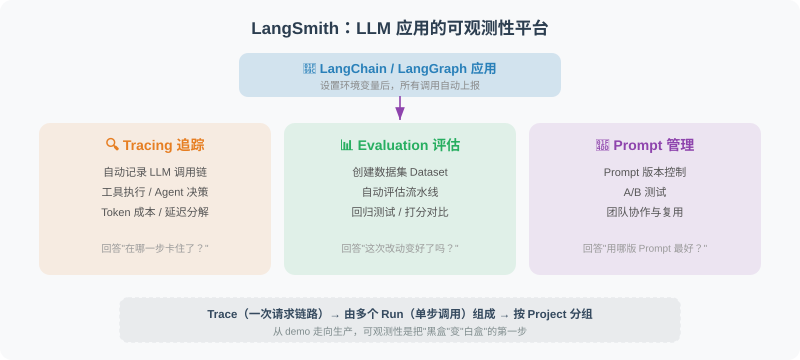

# 12.6 LangSmith 集成与可观测性

> **本节目标**：掌握 LangSmith 的核心功能，学会在 LangChain 应用中集成追踪（Tracing）、评估（Evaluation）和 Prompt 管理，构建生产级的可观测性体系。

---

## 为什么需要可观测性？

当你的 Agent 从 demo 走向生产时，"黑盒"是最可怕的敌人。LLM 调用失败了吗？工具返回了什么？Agent 在哪一步卡住了？如果没有可观测性，这些问题只能靠猜测。

传统软件有日志、链路追踪、指标监控三件套，但 LLM 应用带来了新的挑战：

| 挑战 | 传统软件 | LLM 应用 |
|------|---------|---------|
| 非确定性输出 | 输出固定，断言即可 | 同一输入可能产生不同输出 |
| 多步推理链 | 单次函数调用 | Agent 循环：LLM → 工具 → LLM → ... |
| Token 成本 | 无 | 每次 LLM 调用都有精确成本 |
| 延迟来源 | 数据库 / 网络 | 主要是 LLM 推理时间 |
| 调试难度 | Stack trace | 需要看完整的推理链路 |

LangSmith 就是 LangChain 团队为解决这些问题而推出的可观测性平台。

---

## LangSmith 平台概述

LangSmith 是 LangChain 官方的开发者平台，提供三大核心能力：

1. **Tracing（追踪）**：自动记录 LLM 调用链、工具执行、Agent 决策过程
2. **Evaluation（评估）**：创建数据集、运行自动评估流水线、回归测试
3. **Prompt Management（Prompt 管理）**：版本控制、A/B 测试、团队协作



### 核心概念

| 概念 | 说明 |
|------|------|
| **Trace** | 一次完整请求的执行链路，包含多个 Step |
| **Run** | Trace 中的一个步骤（如一次 LLM 调用、一次工具执行） |
| **Project** | Trace 的分组单位，通常对应一个应用或环境 |
| **Dataset** | 评估用的输入-输出对集合 |
| **Experiment** | 对数据集运行一次评估，记录得分 |

---

## Tracing 集成

### 最简配置

LangSmith 的追踪几乎是零配置的——只需要设置环境变量：

```python
# .env 文件
LANGCHAIN_TRACING_V2=true
LANGCHAIN_API_KEY=lsv2_pt_xxxxxx  # 从 https://smith.langchain.com 获取
LANGCHAIN_PROJECT=my-agent-project  # 可选，默认 "default"
```

```python
# 只需设置环境变量，所有 LangChain 调用自动被追踪
import os
from dotenv import load_dotenv

load_dotenv()  # 加载 .env 中的 LangSmith 配置

from langchain_openai import ChatOpenAI
from langchain_core.prompts import ChatPromptTemplate
from langchain_core.output_parsers import StrOutputParser

llm = ChatOpenAI(model="gpt-4.1-mini", temperature=0.7)
prompt = ChatPromptTemplate.from_messages([
    ("system", "你是一个{role}。"),
    ("human", "{question}")
])
chain = prompt | llm | StrOutputParser()

# 这次调用会被自动追踪到 LangSmith
result = chain.invoke({"role": "Python 专家", "question": "什么是装饰器？"})
print(result)
```

就这么简单。设置完环境变量后，所有通过 LangChain 组件执行的调用都会自动上报到 LangSmith，你可以在 Web 界面查看完整的执行链路。

### 追踪 Agent 的完整执行过程

对于 Agent 应用，追踪的价值更大——你能看到每一步的推理过程：

```python
import os
from dotenv import load_dotenv
load_dotenv()

from langchain_openai import ChatOpenAI
from langchain_core.tools import tool
from langchain.agents import AgentExecutor, create_openai_tools_agent
from langchain_core.prompts import ChatPromptTemplate, MessagesPlaceholder

# ============================
# 工具定义
# ============================

@tool
def search_database(query: str) -> str:
    """在内部数据库中搜索信息。"""
    # 模拟数据库查询
    db = {
        "销售额": "2024年Q4总销售额为 1,250 万元，同比增长 18%",
        "用户数": "当前月活用户 52 万，日活 12 万",
        "转化率": "注册到付费转化率 3.2%，较上月提升 0.3%",
    }
    for keyword, value in db.items():
        if keyword in query:
            return value
    return "未找到相关数据"

@tool
def generate_chart(data_description: str) -> str:
    """根据数据描述生成图表。输入：数据描述文本。"""
    return f"图表已生成：{data_description} — 已保存为 chart_{hash(data_description) % 10000}.png"

# ============================
# Agent 构建
# ============================

tools = [search_database, generate_chart]

prompt = ChatPromptTemplate.from_messages([
    ("system", """你是一个数据分析助手。
你可以使用工具查询数据库和生成图表。
请先查询数据，再根据结果回答用户问题。"""),
    MessagesPlaceholder(variable_name="chat_history"),
    ("human", "{input}"),
    MessagesPlaceholder(variable_name="agent_scratchpad"),
])

llm = ChatOpenAI(model="gpt-4.1", temperature=0)
agent = create_openai_tools_agent(llm, tools, prompt)
agent_executor = AgentExecutor(
    agent=agent,
    tools=tools,
    verbose=True,
    max_iterations=5,
)

# 执行 —— 自动追踪到 LangSmith
result = agent_executor.invoke({
    "input": "帮我查一下最近的销售额，然后生成一个图表",
    "chat_history": []
})
print(result["output"])
```

在 LangSmith 的 Trace 视图中，你会看到：

```
Trace: "帮我查一下最近的销售额，然后生成一个图表"
├── Run: ChatPromptTemplate (format)
├── Run: ChatOpenAI (invoke)           ← 第一次 LLM 调用
│   ├── Input: system + user messages
│   ├── Output: tool_call(search_database, query="销售额")
│   └── Tokens: 156 in / 28 out, $0.0023
├── Run: search_database (invoke)      ← 工具执行
│   ├── Input: {"query": "销售额"}
│   └── Output: "2024年Q4总销售额为 1,250 万元..."
├── Run: ChatOpenAI (invoke)           ← 第二次 LLM 调用
│   ├── Input: 带工具结果的对话
│   ├── Output: tool_call(generate_chart, ...)
│   └── Tokens: 234 in / 45 out, $0.0041
├── Run: generate_chart (invoke)       ← 工具执行
│   └── Output: "图表已生成..."
└── Run: ChatOpenAI (invoke)           ← 最终 LLM 回复
    ├── Output: "根据查询结果..."
    └── Tokens: 189 in / 67 out, $0.0056
```

> 💡 **关键洞察**：通过 Trace，你可以清楚地看到 Agent 执行了几步、每步的 Token 消耗、工具的输入输出——这些信息对于调试和成本优化至关重要。

### 自定义追踪信息

有时你需要在 Trace 上附加业务上下文，方便后续筛选和排查：

```python
from langchain_core.callbacks.manager import CallbackManagerForLLMRun
from langsmith import Client

# 方法1：通过 config 传递元数据
result = agent_executor.invoke(
    {"input": "查一下销售额", "chat_history": []},
    config={
        "metadata": {
            "user_id": "user_123",
            "environment": "production",
            "version": "v2.1.0",
        },
        "tags": ["production", "data-agent"],  # 可在 UI 中按标签筛选
        "run_name": "数据查询-用户123",  # 自定义 Run 名称
    }
)

# 方法2：使用 LangSmith Client 查询 Trace
client = Client()

# 查询某个 Project 下的 Trace
traces = client.list_runs(
    project_name="my-agent-project",
    filter='and(eq(metadata.user_id, "user_123"), gt(total_tokens, 1000))',
    limit=10
)

for trace in traces:
    print(f"Run: {trace.name}, Tokens: {trace.total_tokens}, "
          f"Cost: ${trace.total_cost:.4f}, Status: {trace.status}")
```

---

## 评估集成

评估是 LLM 应用上线前的关键环节。LangSmith 提供了完整的评估流水线：创建数据集 → 定义评估器 → 运行实验 → 对比结果。

### 创建数据集

```python
from langsmith import Client

client = Client()

# 创建数据集
dataset = client.create_dataset(
    dataset_name="customer-service-qa",
    description="客服 Agent 评估数据集"
)

# 添加示例（输入-输出对）
examples = [
    {
        "inputs": {"question": "退款政策是什么？"},
        "outputs": {"answer": "购买7天内可以申请退款，需要保留原始包装。"},
    },
    {
        "inputs": {"question": "订单 ORD-12345678 发货了吗？"},
        "outputs": {"answer": "已发货，预计明天到达。"},
    },
    {
        "inputs": {"question": "你们支持什么支付方式？"},
        "outputs": {"answer": "支持微信、支付宝、银行卡支付。"},
    },
    {
        "inputs": {"question": "推荐一本 Python 入门书"},
        "outputs": {"answer": "推荐《Python编程：从入门到实践》，适合零基础学习者。"},
    },
]

for example in examples:
    client.create_example(
        inputs=example["inputs"],
        outputs=example["outputs"],
        dataset_id=dataset.id,
    )

print(f"数据集已创建，包含 {len(examples)} 个示例")
```

### 运行评估

```python
from langsmith.evaluation import evaluate
from langchain_openai import ChatOpenAI
from langchain_core.prompts import ChatPromptTemplate
from langchain_core.output_parsers import StrOutputParser

# 定义被评估的目标函数
llm = ChatOpenAI(model="gpt-4.1-mini", temperature=0)
prompt = ChatPromptTemplate.from_messages([
    ("system", "你是客服助手，简洁专业地回答用户问题。"),
    ("human", "{question}")
])
chain = prompt | llm | StrOutputParser()

def target_fn(inputs: dict) -> dict:
    """被评估的函数：接收输入，返回输出"""
    answer = chain.invoke({"question": inputs["question"]})
    return {"answer": answer}

# 定义评估器
from langsmith.evaluation import LangChainStringEvaluator

# 使用 LLM-as-Judge 评估回答质量
qa_evaluator = LangChainStringEvaluator(
    "qa",
    config={
        "criteria": {
            "helpfulness": "回答是否有帮助且解决了用户问题？",
            "correctness": "回答的事实是否正确？",
            "conciseness": "回答是否简洁不冗余？",
        },
        "llm": ChatOpenAI(model="gpt-4.1", temperature=0),
    }
)

# 运行评估
results = evaluate(
    target_fn,
    data="customer-service-qa",  # 数据集名称
    evaluators=[qa_evaluator],
    experiment_prefix="customer-service-v1",
    max_concurrency=4,
)

# 查看结果
for result in results:
    print(f"输入: {result.example.inputs['question']}")
    print(f"输出: {result.execution_result.output['answer'][:50]}...")
    for score in result.scores:
        print(f"  {score.name}: {score.value:.2f}")
    print()
```

### 自定义评估器

当内置评估器无法满足需求时，可以编写自定义评估逻辑：

```python
from langsmith.evaluation import RunEvaluator, EvaluationResult
from langsmith.schemas import Run, Example

class ToolUsageEvaluator(RunEvaluator):
    """评估 Agent 是否正确使用了工具"""

    def evaluate(self, run: Run, example: Example = None) -> EvaluationResult:
        # 从 Run 中提取工具调用信息
        tool_calls = []
        for child in (run.child_runs or []):
            if child.run_type == "tool":
                tool_calls.append(child.name)

        expected_tools = []
        if example and example.outputs:
            expected_tools = example.outputs.get("expected_tools", [])

        # 检查是否调用了预期的工具
        correct = len(tool_calls) > 0 if expected_tools else True
        score = 1.0 if correct else 0.0

        return EvaluationResult(
            key="tool_usage_correctness",
            score=score,
            comment=f"调用了工具: {tool_calls}, 预期: {expected_tools}"
        )

# 使用自定义评估器
results = evaluate(
    target_fn,
    data="customer-service-qa",
    evaluators=[qa_evaluator, ToolUsageEvaluator()],
    experiment_prefix="customer-service-v2",
)
```

---

## Prompt 管理

LangSmith 提供了 Prompt 的版本管理和协作功能，让你的 Prompt 像代码一样可追踪。

### 从 LangSmith Hub 拉取 Prompt

```python
from langsmith import Client

client = Client()

# 从 Hub 拉取 Prompt（支持版本号）
prompt = client.pull_prompt("my-team/customer-service-prompt", version="latest")

# 在 Chain 中直接使用
from langchain_openai import ChatOpenAI
from langchain_core.output_parsers import StrOutputParser

llm = ChatOpenAI(model="gpt-4.1-mini", temperature=0.7)
chain = prompt | llm | StrOutputParser()

result = chain.invoke({"question": "退款政策是什么？"})
print(result)
```

### 推送 Prompt 到 Hub

```python
from langchain_core.prompts import ChatPromptTemplate
from langsmith import Client

client = Client()

# 创建 Prompt
prompt = ChatPromptTemplate.from_messages([
    ("system", """你是"小慧"客服助手。
职责：{responsibilities}
服务准则：{guidelines}"""),
    ("human", "{question}"),
])

# 推送到 Hub
client.push_prompt(
    "my-team/customer-service-prompt",
    object=prompt,
    description="客服 Agent 系统提示词 v2",
)

print("Prompt 已推送到 LangSmith Hub")
```

> 💡 **Prompt 管理最佳实践**：
> - 每个 Prompt 都在 Hub 上维护，代码中通过 `pull_prompt` 获取
> - 修改 Prompt 时推送新版本，而不是改代码
> - 使用 `version` 参数锁定生产环境的 Prompt 版本
> - 在评估数据集上对比不同版本的效果

---

## LangSmith vs LangFuse

LangFuse 是 LangSmith 的主要开源替代方案。两者功能相似，但定位不同：

| 特性 | LangSmith | LangFuse |
|------|-----------|----------|
| **部署方式** | SaaS（官方托管） | 自托管 / SaaS |
| **开源** | 部分开源（SDK 开源，服务端闭源） | 完全开源（MIT 协议） |
| **LangChain 集成** | 原生，零配置 | 需要额外配置 callback |
| **评估功能** | 内置丰富评估器 | 内置评估框架 |
| **Prompt 管理** | Hub 版本控制 | Prompt 版本管理 |
| **数据隐私** | 数据存储在 LangChain 服务器 | 自托管时数据完全自主 |
| **定价** | 免费额度 + 按用量付费 | 开源免费 / 云版按用量 |
| **社区** | LangChain 官方生态 | 独立社区，快速增长 |

### LangFuse 集成示例

如果你的团队需要数据自主管控，可以选择 LangFuse：

```python
# pip install langfuse

# .env 配置
# LANGFUSE_PUBLIC_KEY=pk-lf-xxxx
# LANGFUSE_SECRET_KEY=sk-lf-xxxx
# LANGFUSE_HOST=http://localhost:3000  # 自托管地址

from langfuse.callback import CallbackHandler

langfuse_handler = CallbackHandler()

# 在 LangChain 中使用
from langchain_openai import ChatOpenAI

llm = ChatOpenAI(model="gpt-4.1-mini")

result = llm.invoke(
    "你好",
    config={"callbacks": [langfuse_handler]}
)

# 查看追踪
print(f"Trace URL: {langfuse_handler.get_trace_url()}")
```

> ⚠️ **选型建议**：
> - 如果你已经深度使用 LangChain 生态，**LangSmith 是最省心的选择**——环境变量一行搞定
> - 如果你的项目有数据合规要求（如金融、医疗），**LangFuse 自托管**更合适
> - 两者都支持 OpenTelemetry，可以和现有的可观测性基础设施整合

---

## 生产环境最佳实践

### 1. 按环境隔离 Project

```python
import os

# 开发环境
# LANGCHAIN_PROJECT=data-agent-dev

# 预发布环境
# LANGCHAIN_PROJECT=data-agent-staging

# 生产环境
# LANGCHAIN_PROJECT=data-agent-prod

# 也可以在代码中动态设置
os.environ["LANGCHAIN_PROJECT"] = f"data-agent-{os.getenv('DEPLOY_ENV', 'dev')}"
```

### 2. 采样策略

生产环境流量大时，不需要追踪每一次调用。可以配置采样率：

```python
from langchain_core.runnables import ConfigurableField

# 方法1：基于概率的采样
import random

def should_trace() -> bool:
    """1% 的请求被追踪"""
    return random.random() < 0.01

# 方法2：基于条件的追踪
# 只追踪特定用户的请求
def should_trace_user(user_id: str) -> bool:
    premium_users = {"user_vip_001", "user_vip_002"}
    return user_id in premium_users

# 在调用时动态控制
result = chain.invoke(
    {"question": "你好"},
    config={
        "callbacks": [] if not should_trace() else None,  # 不追踪时传空列表
        "tags": ["sampled"] if should_trace() else [],
    }
)
```

### 3. 成本监控与告警

```python
from langsmith import Client

client = Client()

def check_daily_cost(project_name: str, budget_limit: float = 50.0):
    """检查今日成本是否超预算"""
    from datetime import datetime, timedelta

    today = datetime.now().replace(hour=0, minute=0, second=0)
    runs = client.list_runs(
        project_name=project_name,
        filter=f'and(gt(start_time, "{today.isoformat()}"), eq(status, "success"))',
    )

    total_cost = sum(run.total_cost or 0 for run in runs)

    if total_cost > budget_limit:
        # 发送告警（接入你的告警系统）
        print(f"⚠️ 今日成本 ${total_cost:.2f} 已超过预算 ${budget_limit:.2f}")

    return total_cost

# 定时执行
cost = check_daily_cost("data-agent-prod")
print(f"今日成本: ${cost:.4f}")
```

### 4. 评估驱动的发布流程

> 代码变更 → 运行评估数据集 → 对比与 baseline 的得分 → 得分不降才发布

```python
from langsmith import Client

client = Client()

def compare_experiments(baseline: str, candidate: str) -> dict:
    """对比两个实验的评估结果"""
    baseline_runs = list(client.list_runs(
        project_name=baseline, is_root=True
    ))
    candidate_runs = list(client.list_runs(
        project_name=candidate, is_root=True
    ))

    # 汇总对比
    comparison = {
        "baseline": {
            "total": len(baseline_runs),
            "avg_feedback": sum(
                r.feedback_stats.get("helpfulness", 0) if r.feedback_stats else 0
                for r in baseline_runs
            ) / max(len(baseline_runs), 1),
        },
        "candidate": {
            "total": len(candidate_runs),
            "avg_feedback": sum(
                r.feedback_stats.get("helpfulness", 0) if r.feedback_stats else 0
                for r in candidate_runs
            ) / max(len(candidate_runs), 1),
        },
    }

    # 判断是否可以发布
    can_deploy = (
        comparison["candidate"]["avg_feedback"]
        >= comparison["baseline"]["avg_feedback"]
    )

    comparison["can_deploy"] = can_deploy
    return comparison
```

### 5. 与现有监控系统集成

LangSmith 不是孤立存在的，它应该和你的整体可观测性体系协同工作：

```python
import logging
from langsmith import Client

# 将 LangSmith Trace ID 记录到应用日志
logger = logging.getLogger("agent_service")

class TracingMiddleware:
    """FastAPI 中间件：将 LangSmith Trace ID 注入请求上下文"""

    def __init__(self, app):
        self.app = app

    async def __call__(self, scope, receive, send):
        if scope["type"] == "http":
            # 在请求处理中记录 Trace ID
            trace_id = scope.get("langsmith_trace_id")
            if trace_id:
                logger.info(f"langsmith_trace_id={trace_id}")
        await self.app(scope, receive, send)

# 接入 OpenTelemetry（LangSmith 支持 OTel 导出）
# LANGSMITH_OTEL_ENABLED=true
# OTEL_EXPORTER_OTLP_ENDPOINT=http://your-collector:4317
```

---

## 小结

LangSmith 为 LangChain 应用提供了完整的可观测性解决方案：

| 能力 | 关键要点 |
|------|---------|
| **Tracing** | 环境变量即可启用，自动追踪 LLM → 工具 → Agent 全链路 |
| **Evaluation** | 数据集 + 评估器 + 自动流水线，评估驱动发布 |
| **Prompt 管理** | Hub 版本控制，代码与 Prompt 解耦 |
| **成本监控** | Token 级精确成本，支持预算告警 |
| **隐私合规** | 数据敏感场景可选用 LangFuse 自托管 |

> 💡 **与本书其他章节的关系**：
> - 第 12 章 [第13章 LangGraph：构建有状态的 Agent](../chapter_langgraph/README.md) 中构建的图 Agent 同样可以通过 LangSmith 追踪
> - 第 17 章 [第18章 Agent 的评估与优化](../chapter_evaluation/README.md) 深入讨论了 Agent 评估方法论
> - 第 19 章 [第20章 部署与生产化](../chapter_deployment/README.md) 涵盖了更完整的监控体系

---

*下一节：[12.7 LangChain 生态 2026](./07_langchain_ecosystem_2026.md)*

---

## 参考文献

[1] LangChain Team. LangSmith Documentation. https://docs.smith.langchain.com, 2025.

[2] LangChain Team. LangSmith Evaluation. https://docs.smith.langchain.com/evaluation, 2025.

[3] LangFuse Team. LangFuse Open Source Observability. https://langfuse.com/docs, 2025.
