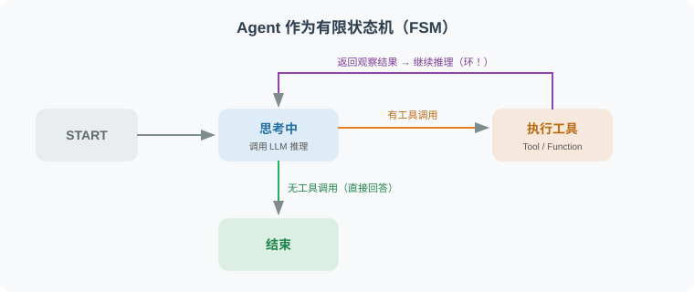
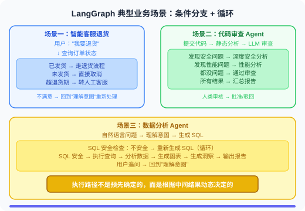
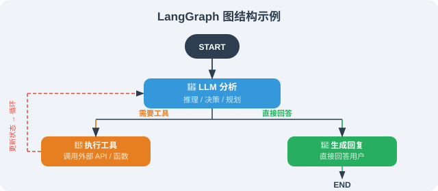

# 13.1 为什么需要图结构？

> **本节目标**：理解线性链的局限，掌握图结构解决复杂 Agent 场景的核心优势。

LangChain 的 LCEL 链非常适合线性处理流程，但现实中的 Agent 需要处理更复杂的场景：循环执行、条件分支、回溯重试。图结构正是为此而生。

---

## 理论背景：有限状态机与图计算

LangGraph 的设计灵感直接来源于计算机科学中的两个经典概念。

### 有限状态机（FSM）

Agent 的行为本质上是一个**有限状态机**——在有限个状态之间，根据输入和条件进行转换 [1]：



在 FSM 模型中：
- **状态**（State）：Agent 当前所处的阶段（如"思考中"、"执行工具"、"等待人类审批"）
- **转换**（Transition）：从一个状态到另一个状态的条件跳转
- **动作**（Action）：在状态转换时执行的操作（如调用 LLM、执行工具）

LangGraph 将 FSM 的理念直接映射为 API：**State 对应 TypedDict**，**状态对应 Node**，**转换对应 Edge**。这使得复杂的 Agent 行为变得可建模、可测试、可调试。

### 图计算在 AI Agent 中的学术渊源

图结构在 AI Agent 领域有深厚的学术基础：

| 学术领域 | 图的应用 | 与 LangGraph 的联系 |
|---------|---------|-------------------|
| **行为树**（Robotics）[2] | 游戏 AI 和机器人用行为树控制决策 | LangGraph 的条件边 = 行为树的选择节点 |
| **数据流编程**（Dataflow） | TensorFlow 等框架用计算图表达数据流 | LangGraph 的 State 流转 = 数据流图的张量传递 |
| **工作流引擎**（BPM） | Airflow/Temporal 用 DAG 编排任务 | LangGraph 支持循环，比 DAG 更灵活 |
| **认知架构**（Cognitive Arch） | SOAR、ACT-R 用产生式规则控制推理 | LangGraph 的条件路由 = 产生式规则的条件匹配 |

> 💡 LangGraph 的创新在于：**它不是简单的 DAG（有向无环图），而是支持环（cycle）的有向图**。这个区别至关重要——因为 Agent 的核心行为模式（ReAct 循环：思考→行动→观察→再思考）天然就是一个环。传统的工作流引擎（如 Airflow）不支持环，因此无法原生表达 Agent 的循环推理。

---

## 真实业务场景分析

在深入代码之前，我们先来看几个真实业务场景，感受一下为什么「图结构」不是可选的高级特性，而是构建生产级 Agent 的**刚需**。



这些场景的共同特点是：**执行路径不是预先确定的，而是根据中间结果动态决定的**。图结构天然适合表达这种「运行时决策」。

---

## 线性链的局限

```python
# LCEL 链：线性的，A → B → C
chain = step_a | step_b | step_c

# 无法处理：
# 1. 循环："步骤B的结果不满意，重新执行步骤B"
# 2. 条件分支："根据步骤A的结果，走B路或C路"  
# 3. 并行后汇合："同时执行B和C，然后在D步骤合并"
# 4. 持久状态："步骤B需要访问步骤A很久之前保存的数据"
```

**一个具体的例子**：假设你在构建一个代码审查 Agent：

```python
# LCEL 方式：线性执行，无法应对复杂情况
review_chain = analyze_code | find_issues | suggest_fix

# 问题场景：
# 1. 如果 analyze_code 发现代码文件太大 → 需要先拆分，然后分段分析
#    LCEL 无法回到之前的步骤
# 2. 如果 find_issues 发现了安全漏洞 → 需要额外的安全分析步骤
#    LCEL 无法动态插入步骤
# 3. 如果 suggest_fix 的修复建议引入了新问题 → 需要重新审查
#    LCEL 无法实现循环
```

---

## 图结构的优势



图结构从根本上改变了 Agent 的执行模型：

| 特性 | 线性链（LCEL） | 图结构（LangGraph） |
|------|:---:|:---:|
| 执行流程 | A → B → C（固定） | 任意拓扑（动态） |
| 循环支持 | ❌ 不支持 | ✅ 节点可回指 |
| 条件分支 | ⚠️ 有限支持 | ✅ 条件边 |
| 状态管理 | ❌ 无持久状态 | ✅ 全局 State |
| 人机交互 | ❌ 不支持 | ✅ Human-in-the-Loop |
| 断点恢复 | ❌ 不支持 | ✅ Checkpoint 持久化 |
| 并行执行 | ⚠️ 简单并行 | ✅ 复杂并行+汇合 |

---

## LangGraph 的核心设计

LangGraph 的设计围绕三个核心概念：**State（状态）**、**Node（节点）**、**Edge（边）**。

```python
# pip install langgraph

from langgraph.graph import StateGraph, END, START
from typing import TypedDict, Annotated
import operator

# 1. 定义状态（State）：图中所有节点共享的数据
class AgentState(TypedDict):
    messages: list        # 消息历史
    current_task: str     # 当前任务
    iterations: int       # 循环次数（防无限循环）
    final_answer: str     # 最终答案

# 2. 定义节点（Node）：每个节点是一个函数，接收状态，返回更新
def process_input(state: AgentState) -> AgentState:
    """节点函数：处理输入"""
    print(f"处理：{state['current_task']}")
    return {"iterations": state.get("iterations", 0) + 1}

# 3. 定义边（Edge）：节点间的连接（可以是条件边）
def should_continue(state: AgentState) -> str:
    """条件边：返回下一个节点的名称"""
    if state.get("final_answer"):
        return "end"
    elif state.get("iterations", 0) >= 5:
        return "end"  # 防止无限循环
    else:
        return "continue"

# 4. 构建图
graph = StateGraph(AgentState)
graph.add_node("process", process_input)
graph.add_edge(START, "process")
graph.add_conditional_edges(
    "process",
    should_continue,
    {"end": END, "continue": "process"}  # 可以循环回自己！
)

app = graph.compile()
```

### 什么场景应该选择 LangGraph？

```python
# ✅ 选择 LangGraph 的信号：
should_use_langgraph = [
    "Agent 需要多步循环（如 ReAct 循环）",
    "需要条件路由（如根据用户意图走不同分支）",
    "需要 Human-in-the-Loop（审批/确认节点）",
    "需要长时间运行的任务（带 checkpoint 恢复）",
    "多个 Agent 协作（Supervisor 模式）",
]

# ❌ 不需要 LangGraph 的场景：
use_lcel_instead = [
    "简单的 Prompt → LLM → 输出",
    "固定步骤的处理管道",
    "不需要循环和条件分支的工作流",
]
```

---

## 小结

图结构的核心价值：
- **循环支持**：节点可以指向自身或之前的节点
- **持久状态**：State 在所有节点间共享，贯穿整个执行
- **条件路由**：根据状态动态决定下一步
- **可视化**：图结构可以直观地展示 Agent 的执行逻辑
- **断点恢复**：通过 Checkpoint 机制，支持任务中断后恢复执行
- **人机协作**：内置 Human-in-the-Loop 支持，适合需要人类审批的场景

---

## 📝 本章练习

读完本节，先合上书用自己的话回答下面的问题，再展开参考答案对照。

**练习 1（概念）**：为什么说 LangGraph 是「支持环的有向图」而不是 DAG？这个区别对 Agent 意味着什么？

<details>
<summary>参考答案</summary>

DAG（有向无环图）不允许任何节点回指到之前的节点，因此只能表达「一次性、单向」的流程。而 Agent 最核心的行为模式是 **ReAct 循环**：思考 → 行动 → 观察 → 再思考，这本质上是一个**环**——同一个「思考」节点会被反复进入。

- 如果用 DAG，必须把每一轮循环都展开成独立节点，循环次数不确定时根本无法静态建模。
- LangGraph 允许条件边指回已有节点（甚至指回自己），因此能用**固定的图结构**表达**运行时长度不定的循环**。

这就是 Airflow 这类 DAG 工作流引擎无法原生表达 Agent 推理的根本原因。

</details>

**练习 2（辨析）**：下面这段需求，应该用 LCEL 链还是 LangGraph？为什么？

> "用户上传一段代码，先分析，若发现安全漏洞则插入一个额外的安全审查步骤，修复后若引入新问题需要重新审查。"

<details>
<summary>参考答案</summary>

应该用 **LangGraph**。这段需求踩中了 LCEL 的三个死穴：

1. **动态插入步骤**——"若发现漏洞则插入安全审查"是运行时条件分支，LCEL 的 `a | b | c` 是固定管道，做不到。
2. **回溯重审**——"修复引入新问题需重新审查"是一个环，LCEL 无法回到之前的节点。
3. 需要在节点间共享分析结果（持久 State）。

用 LangGraph，把"分析/安全审查/修复/重审"做成节点，用条件边根据 State 中的 `has_vulnerability`、`new_issue` 字段动态路由即可。

</details>

**练习 3（动手）**：本节的示例图里，`should_continue` 在 `iterations >= 5` 时返回 `"end"`。请说明这行代码的作用，并尝试修改 `AgentState` 与条件函数，让循环上限可以由外部传入而不是硬编码为 5。

<details>
<summary>参考答案</summary>

**作用**：这是**防无限循环的兜底**。Agent 的循环长度由 LLM 决定，若模型始终不给出 `final_answer`，图就会无限循环、烧光 token。`iterations >= 5` 强制在 5 轮后退出。

**让上限可配置**的一种改法：在 State 里加一个 `max_iterations` 字段，初始化时传入，条件函数读取它：

```python
class AgentState(TypedDict):
    messages: list
    current_task: str
    iterations: int
    max_iterations: int   # 新增：循环上限
    final_answer: str

def should_continue(state: AgentState) -> str:
    if state.get("final_answer"):
        return "end"
    if state.get("iterations", 0) >= state.get("max_iterations", 5):
        return "end"
    return "continue"

# 调用时通过初始 State 传入上限
app.invoke({"current_task": "...", "iterations": 0, "max_iterations": 10})
```

要点：把"策略参数"放进 State，而不是写死在代码里，是让图可复用、可测试的常见技巧。

</details>

---

*下一节：[13.2 LangGraph 核心概念：节点、边、状态](./02_core_concepts.md)*

---

## 参考文献

[1] HOPCROFT J E, MOTWANI R, ULLMAN J D. Introduction to automata theory, languages, and computation[M]. 3rd ed. Pearson, 2006.

[2] COLLEDANCHISE M, ÖGREN P. Behavior trees in robotics and AI: an introduction[M]. CRC Press, 2018.
