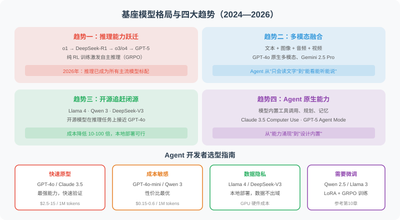
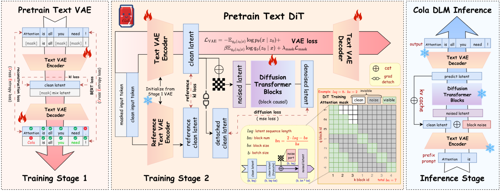

# 2.6 基座模型前沿进展与选型指南

> 🌍 *"模型在快速迭代，今天的 SOTA 可能是明天的基线——但理解演进趋势，能让你在变化中做出更好的选择。"*

前几节我们学习了 LLM 的基本原理、提示工程、API 调用和模型参数。这些知识是"不变"的底层能力。而本节要讨论的是"变化"的部分——**基座模型的技术前沿和产业格局**。

作为 Agent 开发者，你不需要训练自己的基座模型，但你必须了解模型的能力边界和发展趋势——因为**模型的选择直接决定了 Agent 的天花板**。



## 2024—2026：基座模型的四大趋势

### 趋势一：推理能力的跃迁

2024 年 9 月，OpenAI 的 o1 首次证明了"用更多推理时间换取更好结果"的可行性。2025 年 1 月，DeepSeek-R1 的开源发布引爆了推理模型的民主化——它首次展示了如何通过纯 RL 训练（GRPO）让模型自发涌现 Chain-of-Thought 能力。

2025 年 4 月，OpenAI 发布 o3 和 o4-mini，首次实现**多模态推理**（"看图思考"）和自主工具链调用。2025 年 8 月，**GPT-5** 正式发布，采用统一系统架构，内置智能路由，根据问题复杂度自动选择推理深度，不再需要独立的 o 系列模型。

到了 2026 年初，推理已成为所有主流模型的标配：

| 模型 | 发布时间 | 推理模式 | 关键突破 |
|------|---------|---------|---------|
| **Claude Opus 4.7** | 2026.04 | 自适应推理深度 | SWE-bench Verified 第一，视觉能力登顶，新版 tokenizer |
| **GPT-5.4** | 2026.03 | 内置 Thinking 模式 | 推理+编程+Computer Use+搜索大一统，1M 上下文 |
| **Claude Opus 4.6** | 2026.02 | 自适应推理深度 | 1M 上下文（Beta）+ SWE-bench 80.8% |
| **GPT-5** | 2025.08 | 内置智能路由推理 | SWE-bench 75%，统一系统架构，多模态 |
| **Claude Opus 4** | 2025.05 | 深度推理 | SWE-bench 72.5%，连续运行 7 小时 |
| **Gemini 2.5 Pro** | 2025.03 | 原生多模态推理 | 1M 上下文 + 动态推理预算控制 |
| **DeepSeek-R1** | 2025.01 | 纯 RL 推理 | 开源推理模型引爆全球，GRPO 训练 |
| **Kimi K2.6** | 2026.04 | Agent 推理 | 1T 参数开源，13 小时不间断编码，300 子智能体并行 |
| **Kimi K2** | 2025.07 | Agent 推理 | 1T 总参/32B 激活，MuonClip 优化器，开源 Agent SOTA |
| **Qwen3-235B-A22B** | 2025.04 | 混合推理（快/慢思考） | 开源旗舰，性能超越 DeepSeek-R1 和 o1 |

> 💡 **对 Agent 的影响**：推理模型让 Agent 在"规划"和"复杂决策"环节获得质的飞跃。实际工程中越来越多 Agent 采用"快慢双系统"——简单路由用快速模型，复杂规划用推理模型。GPT-5 和 Claude Opus 4.6 的出现让这种切换变得更加无缝——推理能力已经内置在通用模型中。

### 趋势二：MoE 与效率革命

大模型越来越大，但**推理成本却在降低**——背后是**混合专家模型（Mixture of Experts, MoE）** 的全面胜利。

MoE 的核心思想：模型总参数量可以很大（数千亿），但每次推理只激活其中一小部分。就像一家大公司有几百名员工，但每个项目只抽调最合适的十几个人。

```python
# MoE 模型的直觉理解（概念示意）
class MixtureOfExperts:
    """
    以 Qwen3-235B-A22B 为例：
    总参数量：235B
    每次激活：22B（仅 ~9.4%）
    效果：性能超越 DeepSeek-R1 和 OpenAI o1，推理成本仅为零头
    """
    def __init__(self, num_experts=128, active_experts=8):
        self.num_experts = num_experts
        self.active_experts = active_experts
    
    def forward(self, input_tokens):
        # Router 决定激活哪些专家
        scores = self.router(input_tokens)
        top_k = scores.topk(self.active_experts)
        # 只有被选中的专家参与计算
        return sum(expert(input_tokens) * w for expert, w in top_k)
```

| 模型 | 总参数 | 激活参数 | 架构特点 |
|------|--------|---------|---------|
| **Kimi K2.6** | 1T | 32B | K2 升级版，13 小时编码，300 子智能体并行，SWE-bench Pro 58.6% |
| **Kimi K2** | 1T | 32B | MuonClip 优化器，万亿参数开源 MoE |
| **Qwen3.6-35B-A3B** | 35B | 3B | 2026.04 发布，轻量 MoE，极致效率 |
| **Llama 4 Maverick** | ~400B | 17B | 128 专家，原生多模态，文本生成超越 GPT-4.1 |
| **Qwen3-235B-A22B** | 235B | 22B | 混合推理，Apache 2.0，登顶开源榜 |
| **Qwen3-30B-A3B** | 30B | 3B | 轻量 MoE，单卡可跑 |
| **DeepSeek-V3** | 671B | 37B | MoE 架构，557 万美元训练成本，性价比之王 |
| **DeepSeek-V3-0324** | 685B | 37B | 小版本更新，编程能力大幅提升 |
| **Gemma 4-26B** | 26B | 4B（激活） | Apache 2.0，原生视频/图像，256K 上下文 |
| **Llama 4 Scout** | 109B | 17B | 16 专家，10M token 超长上下文 |

> 💡 **对 Agent 的影响**：MoE 让"大模型能力 + 小模型成本"成为现实。**2026 年 4 月的重要进展**：Gemma 4 以 Apache 2.0 协议提供原生多模态；Qwen3 系列从 0.6B 到 235B 全覆盖，混合推理内置快慢思考；Kimi K2 万亿参数开源，MuonClip 优化器将训练效率翻倍。

### 趋势三：开源生态的全面崛起

2025—2026 年，开源模型已不仅是"追赶"闭源，而是在多个领域**形成分庭抗礼**甚至**局部超越**的态势：

**第一梯队（与 GPT-5.4 / Claude Opus 4.7 竞争）**：
- **Kimi K2.6**（Moonshot AI，2026.04）：1T 参数开源 MoE，13 小时不间断编码，300 子智能体并行，SWE-bench Pro 58.6%，API 价格仅为 Opus 4.6 的 1/8
- **Kimi K2**（Moonshot AI，2025.07）：1T 总参/32B 激活 MoE，MuonClip 优化器训练效率翻倍，开源 Agent 能力 SOTA，兼容 OpenAI/Anthropic API
- **Qwen3-235B-A22B**（阿里，2025.04）：235B MoE 混合推理，性能超越 DeepSeek-R1 和 o1，Apache 2.0
- **DeepSeek-V3-0324**（DeepSeek，2025.03）：685B MoE，编程能力超越 Claude 3.7，开源协议更宽松
- **Llama 4 Maverick**（Meta，2025.04）：~400B MoE 多模态，文本生成超越 GPT-4.1

**第二梯队（轻量高效，单卡可跑）**：
- **Qwen3.6-35B-A3B**（阿里，2026.04）：35B 总参/3B 激活，轻量 MoE，极致效率
- **Qwen3.6-Plus / Flash / Max**（阿里，2026.04）：Qwen3 系列快速迭代，覆盖不同性能档位
- **Gemma 4-31B**（Google，2026.04）：密集型，Arena Elo 全球开源前三，Apache 2.0，原生视频/图像多模态
- **Gemma 4-26B MoE**（Google，2026.04）：4B 激活参数，256K 上下文，Apache 2.0
- **Qwen3-32B**（阿里，2025.04）：密集型旗舰，混合推理，Apache 2.0
- **Qwen3-30B-A3B**（阿里，2025.04）：30B 总参/3B 激活，极致效率
- **Llama 4 Scout**（Meta，2025.04）：17B 激活/109B 总参，10M 上下文窗口，单卡 H100 可运行
- **Phi-4**（微软，2024.12）：14B 参数，推理能力超越许多 70B 模型
- **Phi-4-multimodal**（微软，2025.02）：5.6B，统一架构处理语音+视觉+文本
- **Gemma 4-E2B/E4B**（Google，2026.04）：2.3B/4.5B，手机/边缘设备，原生音视频，Apache 2.0
- **Qwen3 全系列**（阿里，0.6B~235B）：从手机到服务器全覆盖，Apache 2.0

> 📊 **2026 年 4 月重要里程碑**：一周之内，Anthropic 发布 Claude Opus 4.7、阿里推出 Qwen3.6、月之暗面发布 Kimi K2.6，国产开源模型在编程基准上全面追平甚至超越顶级闭源模型；Chatbot Arena 评分显示中美差距已大幅缩小。

**开源 vs 闭源的选择矩阵**：

| 维度 | 闭源模型 | 开源模型 |
|------|---------|---------|
| **最强能力** | 仍有优势（GPT-5.4, Claude Opus 4.7） | 快速追赶，Kimi K2.6/Qwen3.6 已局部超越 |
| **成本** | API 按量付费 | 自部署后边际成本极低 |
| **隐私** | 数据发送给第三方 | 数据完全私有 |
| **定制化** | 有限（Fine-tuning API） | 完全可控（LoRA/全参微调） |
| **延迟** | 受网络影响 | 本地部署可控 |
| **Agent 能力** | 工具调用成熟稳定 | Kimi K2.6、Qwen3.6 已原生支持 Agent，K2.6 支持 300 子智能体并行 |
| **适合场景** | 快速原型、通用任务 | 生产部署、数据敏感场景 |

### 趋势四：Agent-Native 模型的兴起

2025—2026 年最显著的新趋势是：**模型开始专门为 Agent 场景优化**。

- **Claude Opus 4.7**（2026.04）：SWE-bench Verified 第一，视觉能力登顶，Claude Code 全面升级，RPA 与自动化测试生产级基础
- **Kimi K2.6**（2026.04）：1T 参数开源，300 子智能体并行，连续运行 5 天完成复杂运维，SWE-bench Pro 58.6%，API 价格仅为 Opus 4.6 的 1/8
- **GPT-5.4**（2026.03）：首次将推理+编程+Computer Use+深度搜索融合到单一模型，原生操控浏览器和操作系统，Agent 工具调用 token 消耗减半
- **Kimi K2**：万亿参数开源 MoE，Agent 能力在多个基准上达到开源 SOTA，专注 Agent 场景的预训练和后训练，兼容 Claude Code 等主流 Agent 框架
- **DeepSeek-V3-0324**：编程和工具调用能力大幅增强，开源协议更宽松，适合 Agent 生产部署
- **GPT-5**：统一系统架构，内置推理路由，Agent 工具调用更稳定，支持 Computer Use
- **Claude Opus 4.6**：1M 上下文（Beta），能处理超大代码库，自主发现零日漏洞，企业级 Agent 工作流
- **Claude Opus 4**：连续自主运行 7 小时，SWE-bench 72.5%，Agent 编程新标杆
- **Qwen3-235B-A22B**：深度适配 Agent 框架，工具调用精准度大幅提升，混合推理自动切换快慢思考
- **Llama 4 Scout**：10M token 超长上下文，适合需要处理超长文档的 Agent 任务

这意味着 Agent 开发者不再需要"削足适履"——模型本身就是为 Agent 设计的。

## 多模态基座模型：不只是文本

2026 年的基座模型几乎都是**原生多模态**的——从架构层面就支持文本、图像、音频、视频的混合输入和输出。

```python
# 多模态 Agent 的典型调用方式
from openai import OpenAI
client = OpenAI()

response = client.chat.completions.create(
    model="gpt-5",  # GPT-5 原生支持多模态
    messages=[{
        "role": "user",
        "content": [
            {"type": "text", "text": "这张架构图有什么问题？请给出改进建议。"},
            {"type": "image_url", "image_url": {"url": "data:image/png;base64,..."}}
        ]
    }]
)

# GPT-5 不仅能"看懂"图片，还能生成图像、实时语音对话
```

**主流多模态模型对比**：

| 模型 | 发布时间 | 输入模态 | 输出模态 | 特色能力 |
|------|---------|---------|---------|---------|
| **Claude Opus 4.7** | 2026.04 | 文本+图像+PDF | 文本 | SWE-bench Verified 第一，图像输入 375 万像素，视觉能力登顶 |
| **GPT-5.4** | 2026.03 | 文本+图像+音频 | 文本+图像 | Computer Use 超越人类，推理+编程+搜索大一统，1M 上下文 |
| **GPT-5** | 2025.08 | 文本+图像+音频 | 文本+图像+音频 | 实时语音对话，原生图像生成，Computer Use |
| **Claude Opus 4.6** | 2026.02 | 文本+图像+PDF | 文本 | 1M 上下文（Beta），企业级 Agent 工作流 |
| **Gemini 2.5 Pro** | 2025.03 | 文本+图像+视频+音频 | 文本+图像 | 原生视频理解，1M 上下文，推理预算控制 |
| **Llama 4 Maverick** | 2025.04 | 文本+图像 | 文本 | 开源多模态 MoE，文本生成超越 GPT-4.1 |
| **Gemma 4-31B** | 2026.04 | 文本+图像+视频 | 文本 | Apache 2.0，Arena 全球开源前三 |
| **Gemma 4-E2B/E4B** | 2026.04 | 文本+图像+音频 | 文本 | 手机可跑，Apache 2.0，原生音视频 |
| **Phi-4-multimodal** | 2025.02 | 文本+图像+语音 | 文本 | 仅 5.6B 参数，统一多模态架构 |
| **Kimi K2.6** | 2026.04 | 文本 | 文本 | 万亿参数开源，300 子智能体并行，Agent 编程 SOTA |
| **Kimi K2** | 2025.07 | 文本 | 文本 | 万亿参数 Agent SOTA，工具调用最强 |

## 小模型的崛起：SLM 与端侧部署

**小语言模型（Small Language Models, SLM）** 的进步速度令人瞩目——2025 年的 14B 参数模型已全面超越 2023 年的 GPT-4。

```python
# 小模型的惊人表现（2025—2026 年基准测试数据）
slm_benchmarks = {
    "Phi-4 (14B)":             {"MMLU": 84.8, "HumanEval": 82.6, "GSM8K": 94.5},
    "Phi-4-reasoning (14B)":   {"MMLU": 86.2, "HumanEval": 85.1, "GSM8K": 95.8},
    "Qwen3-8B":               {"MMLU": 81.2, "HumanEval": 79.8, "GSM8K": 91.3},
    "Llama 4 Scout (17B act)": {"MMLU": 83.5, "HumanEval": 80.1, "GSM8K": 92.1},
    "Gemma 4-31B":            {"MMLU": 87.3, "HumanEval": 79.1, "MATH": 72.8},
    "Phi-4-mini (3.8B)":      {"MMLU": 72.1, "HumanEval": 68.5, "GSM8K": 84.2},
    # 对比：2023 年的 GPT-4 (~1.7T 参数估算)
    "GPT-4 (2023)":           {"MMLU": 86.4, "HumanEval": 67.0, "GSM8K": 92.0},
}

# Phi-4-reasoning (14B) 在编程和数学上已全面超越 2023 年的 GPT-4！
# Gemma 4-31B 在 MMLU 上超越 GPT-4，且完全开源（Apache 2.0）
# 这意味着：Agent 不一定需要最大的模型
```

> 💡 **对 Agent 的影响**：SLM 让 Agent 可以在**手机、笔记本、边缘设备**上本地运行，实现零延迟、完全隐私的交互。苹果的 Apple Intelligence、Google 的 Gemini Nano、微软的 Phi-4-mini 都是这一趋势的产物。Phi-4-multimodal 更是以 5.6B 参数同时处理语音、视觉和文本，为端侧多模态 Agent 开辟了道路。

## Agent 开发者的模型选型指南

面对如此多的模型选择，如何为你的 Agent 挑选合适的基座模型？

```python
def select_model(requirements: dict) -> str:
    """Agent 模型选型决策函数（2026 年 4 月版）"""
    
    budget = requirements.get("monthly_budget_usd", 100)
    task_type = requirements.get("task_type", "general")
    privacy = requirements.get("privacy_required", False)
    latency_ms = requirements.get("max_latency_ms", 5000)
    reasoning = requirements.get("complex_reasoning", False)
    agent_native = requirements.get("agent_native", False)
    
    # 决策树
    if privacy:
        if reasoning:
            return "Kimi K2 / Qwen3-235B (自部署)"  # 开源 + 推理 + Agent
        elif latency_ms < 500:
            return "Phi-4-mini / Qwen3-4B (本地部署)"  # 端侧 SLM
        else:
            return "Qwen3-32B / Llama 4 Maverick (自部署)"  # 开源通用
    
    if agent_native:
        if budget > 500:
            return "Claude Opus 4.7 / GPT-5.4"  # 顶级 Agent 体验
        else:
            return "Kimi K2.6 API / DeepSeek-V3 API"  # 性价比 Agent（K2.6 仅为 Opus 4.6 的 1/8）
    
    if reasoning:
        if budget > 500:
            return "Claude Opus 4.7 / GPT-5.4"  # 顶级推理
        else:
            return "DeepSeek-V3 API / o4-mini"  # 性价比推理
    
    if budget < 50:
        return "DeepSeek-V3 API / GPT-4.1-mini"  # 极致性价比
    
    return "GPT-5 / Claude Sonnet 4"  # 通用均衡之选
```

**按场景的推荐选型**：

| Agent 场景 | 推荐模型 | 理由 |
|-----------|---------|------|
| 编程助手 | Claude Opus 4.7 / Kimi K2.6 | SWE-bench 双料第一，K2.6 性价比极高（Opus 4.6 的 1/8） |
| 数据分析 | GPT-5.4 / Gemini 2.5 Pro | 多模态理解 + 函数调用稳定 |
| 客服对话 | GPT-4.1-mini / Qwen3-8B | 成本敏感，响应速度要求高 |
| 深度研究 | Claude Opus 4.6 / GPT-5.4 | 1M 上下文 + 深度推理 |
| 文档处理 | Gemini 2.5 Pro / Claude Opus 4.6 | 1M 超长文档输入，PDF 布局理解 |
| 本地隐私 | Kimi K2.6 / Qwen3-235B (自部署) | 数据不出本地，Agent 能力完整，K2.6 开源 |
| 端侧部署 | Phi-4-mini (3.8B) / Qwen3-4B | 手机/笔记本可运行 |
| 多模态 Agent | GPT-5.4 / Gemini 2.5 Pro | Computer Use 超越人类，原生多模态 + 视觉理解 |
| RPA/自动化测试 | Claude Opus 4.7 / GPT-5.4 | 视觉能力登顶，ScreenSpot-Pro/OSWorld 全部夺冠 |

## 2024—2026 关键模型发布时间线

```
2024.09  OpenAI o1 ──── 推理模型元年
2024.12  Phi-4 (14B) ── 微软发布最强小模型
2025.01  DeepSeek-R1 ── 开源推理模型引爆全球，GRPO 训练
2025.02  Phi-4-multimodal / Phi-4-mini ── 端侧多模态
2025.03  Gemini 2.5 Pro ── 1M 上下文 + 推理，屠榜
2025.03  DeepSeek-V3-0324 ── 小版本更新，编程能力超越 Claude 3.7
2025.04  Llama 4 Scout/Maverick ── Meta 首个 MoE 开源多模态
2025.04  o3 / o4-mini ── OpenAI 多模态推理，首次"看图思考"
2025.04  Qwen3 ── 阿里混合推理全系列（0.6B~235B），Apache 2.0
2025.05  Claude 4 (Opus 4 / Sonnet 4) ── 连续编程 7 小时，SWE-bench 72.5%
2025.05  GPT-4.1 ── 100 万 token 上下文，编程能力大幅提升
2025.07  Kimi K2 ── 月之暗面万亿参数开源 MoE，MuonClip 优化器
2025.08  GPT-5 ── OpenAI 统一系统架构，内置推理路由，SWE-bench 75%
━━━━━━━━━━━━━━━━━━━━━━━━ 2026 年 ━━━━━━━━━━━━━━━━━━━━━━━━
2026.02  Claude Opus 4.6 ── 1M 上下文（Beta），SWE-bench 80.8%，企业级 Agent
2026.03  GPT-5.4 ── OpenAI 推理+编程+Computer Use+搜索大一统，1M 上下文，三版本
2026.04  Gemma 4 (E2B/E4B/26B/31B) ── 谷歌开源，原生视频/音频，Apache 2.0
2026.04  Claude Opus 4.7 ── SWE-bench Verified 第一，视觉能力登顶，Claude Code 全面升级
2026.04  Kimi K2.6 ── 月之暗面开源，13 小时编码，300 子智能体并行，SWE-bench Pro 58.6%
2026.04  Qwen3.6 系列 ── 阿里快速迭代（35B-A3B/Flash/Plus/Max），覆盖全档位
2026.04  深度求索 ── 开源 DeepSeek-V4
2026.06  MiniMax M3开源 ── 国内首个同时具备原生多模态、超长上下文、Agent 操作三大能力的模型。
```

## 展望：基座模型的下一步

几个值得关注的发展方向：

1. **推理内置化**：推理能力从独立的 o 系列模型，逐渐内置到通用模型中（GPT-5.4 Thinking 模式、Qwen3 混合推理），开发者不再需要手动选择
2. **MoE 效率持续提升**：激活参数比例持续降低（Qwen3-235B 仅激活 9.4%），推理成本还有很大下降空间
3. **Agent 集群化**：模型从"被动回答"到"主动行动"——Kimi K2.6 的 300 子智能体并行、连续运行 5 天，让 Agent 从单任务执行向大规模自主协作演进
4. **超长上下文**：从 128K 到 1M 再到 10M（Llama 4 Scout），上下文窗口的扩大让 Agent 能处理整个代码库、完整文档集
5. **开源追平闭源**：Kimi K2、Qwen3、Gemma 4 等开源模型在多项基准上已与顶级闭源模型持平，私有化部署的门槛大幅降低
6. **多模态原生**：文本→视觉+语音+视频全模态，Agent 能"看"能"听"能"画"，交互方式更自然
7. **端侧智能**：3B~14B 参数模型在手机/笔记本上运行，零延迟、完全隐私的本地 Agent 成为可能

---

## 小结

| 趋势 | 核心变化 | 对 Agent 开发的影响 |
|------|---------|-------------------|
| 推理内置化 | GPT-5.4 Thinking 模式，Qwen3 混合快慢思考 | Agent 复杂规划能力质的飞跃，无需手动选择推理模型 |
| Computer Use 成熟 | GPT-5.4/Claude Opus 4.7 超越人类水平 | Agent 直接操控浏览器和操作系统，RPA 进入生产可用阶段 |
| Agent 集群化 | Kimi K2.6 的 300 子智能体并行，连续运行 5 天 | Agent 从单任务执行向大规模自主协作演进 |
| MoE 效率革命 | Kimi K2.6/Qwen3.6 万亿参数开源，激活仅 3B~32B | Agent 运营成本大幅降低，K2.6 API 仅为 Opus 4.6 的 1/8 |
| 开源全面崛起 | Kimi K2.6/Qwen3.6/Gemma 4 形成完整生态 | 私有化 Agent 部署成熟，数据安全不再是瓶颈 |
| Agent-Native | 模型专门为 Agent 场景优化（工具调用/长期任务） | 开发者不再需要"削足适履"，模型即 Agent 基座 |
| 多模态原生 | 文本→视觉+语音+视频全模态 | Agent 能"看"能"听"能"画"，交互方式更自然 |
| 超长上下文 | 1M~10M token 上下文窗口 | Agent 可处理整个代码库、完整文档集 |
| 小模型进步 | 3B~14B 参数模型在手机/笔记本上运行 | Agent 可在端侧运行，零延迟、完全隐私 |

> ⏰ *注：模型技术发展极快，本节数据截至 **2026 年 4 月**。建议定期关注各厂商的发布动态和权威基准评测（如 LMArena、Open LLM Leaderboard、Chatbot Arena）获取最新信息。*

---

*上一节：[2.5 Token、Temperature 与模型参数详解](./05_model_parameters.md)*

*下一节：[2.7 基座模型架构详解](./07_model_architecture.md)*

---

## 参考文献

[1] OPENAI. GPT-4 technical report[R]. arXiv preprint arXiv:2303.08774, 2023.

[2] GUO D, YANG D, ZHANG H, et al. DeepSeek-R1: Incentivizing reasoning capability in LLMs via reinforcement learning[R]. arXiv preprint arXiv:2501.12948, 2025.

[3] TEAM G, RIVIERE M, PATHAK S, et al. Gemma 2: Improving open language models at a practical size[R]. arXiv preprint arXiv:2408.00118, 2024.

[4] META AI. The Llama 4 herd: The beginning of a new era of natively multimodal AI[R]. 2025.

[5] QWEN TEAM. Qwen3 technical report[R]. arXiv preprint arXiv:2505.09388, 2025.

[6] ANTHROPIC. Claude's character[EB/OL]. 2024. https://www.anthropic.com/research/claude-character.

[7] HOFFMANN J, BORGEAUD S, MENSCH A, et al. Training compute-optimal large language models[R]. arXiv preprint arXiv:2203.15556, 2022. (Chinchilla 定律)

[8] SHAZEER N. Fast transformer decoding: One write-head is all you need[R]. arXiv preprint arXiv:1911.02150, 2019. (GQA/MQA 基础)

[9] ABDIN M, JACOBS S A, AWAN A A, et al. Phi-4 technical report[R]. arXiv preprint arXiv:2412.08905, 2024.

[10] MOONSHOT AI. Kimi K2: Open agentic intelligence[EB/OL]. 2025. https://huggingface.co/moonshotai/Kimi-K2-Instruct.

---

## 📰 最新论文速递

> 🗓️ 本节由每日自动更新任务维护，最近更新：**2026 年 7 月 14 日**

### [Cola DLM：连续隐空间扩散语言模型——非自回归文本生成新范式（2026）](https://arxiv.org/abs/2605.06548)

> 🧬 **一句话**：把文本生成从"逐 token 自回归"搬到"连续隐空间分层扩散"，统一了 AR、离散去噪与连续 token 空间方法的理论框架。

**核心问题**：主流大语言模型清一色自回归（AR）逐 token 生成，但 AR 范式天然受限于串行解码、难以全局规划。离散去噪语言模型和连续 token 空间方法虽各有探索，却缺乏统一理论框架来横向对比与优势互补。

**方法介绍**：Cola DLM（Continuous Latent Diffusion Language Model）提出分层连续隐变量语言模型：先用 **Text VAE** 把文本映射到连续隐表示，再用 **block-causal 扩散 Transformer** 在隐空间建模全局语义先验，最后解码生成文本。它在严格概率定义下，把 Cola DLM 与 AR 模型、离散去噪语言模型、连续 token 空间方法纳入同一理论框架对比。整体工作流见下图：



> 图源：Cola DLM 论文（来源：2026, arXiv:2605.06548，字节跳动 Seed）

**关键结果**：在 4 个研究问题、8 个基准上与约 20 亿参数的自回归基线严格对比，验证了强扩展性；代码与检查点已以 Apache 2.0 开源。

**与本章关系**：对应 2.7 基座模型架构详解，代表语言模型从自回归范式向扩散范式探索的重要前沿，有助于理解未来基座模型的多样化架构方向。

---

### [字节跳动 Seed 2.0：面向真实世界复杂性的智能前沿（2026）](https://arxiv.org/abs/2607.00248)

**发表**：2026 年 6 月 30 日 | [arXiv:2607.00248](https://arxiv.org/abs/2607.00248)

**核心贡献**：字节跳动发布 Seed 2.0 模型系列，以用户真实需求为出发点，构建了可靠的前瞻性评估体系，重点攻克长尾知识和复杂指令遵循两大持久挑战，同时在推理智能、视觉理解和搜索能力方面达到世界领先水平。模型卡通过大量真实世界用例展示了 Seed 2.0 在复杂长时程任务上的初步解决能力，服务数亿用户。

**与本章关系**：对应本章「前沿基座模型全景」，是 2026 年下半年国内顶级大模型的重要发布节点，与 Qwen3、GLM-5.1 系列共同代表国内基座模型竞争格局的最新进展，对关注 Agent 骨干模型选型具有直接参考价值。

---

### [Soofi S 30B-A3B：混合 Mamba-Transformer MoE 主权开源基座模型（2026）](https://arxiv.org/abs/2607.09424)

**发表**：2026 年 7 月 10 日 | [arXiv:2607.09424](https://arxiv.org/abs/2607.09424)

**核心贡献**：Soofi S 30B-A3B 是面向德语和英语的主权开源 MoE 混合 Mamba Transformer 基座模型。其混合设计每 token 仅激活 30B 参数中的 3B，且推理缓存在上下文增长时保持**近恒定**，在长上下文、高并发部署场景下相比密集模型具有显著吞吐优势。在约 27 万亿 token 上预训练，刻意提升德语权重，在英语和德语综合基准上匹配密集 14–27B 模型，在两个语言的代码聚合指标上领先 17 个开源基座模型，并超越所有欧洲主权基线。在完全开源模型中取得最高英德评估分数，超越 Olmo 3 32B 和 Apertus 70B。权重、中间检查点、完整数据来源清单、超参数和训练/评估代码均以宽松条款开源。

**与本章关系**：对应 2.7 基座模型架构详解，Soofi S 代表了 Mamba-Transformer 混合架构在 MoE 配置下的最新大规模验证——近恒定推理缓存特性对长上下文 Agent 部署具有直接工程价值，与 Cola DLM（扩散范式）共同展示自回归之外基座模型架构的多样化探索方向。

---
