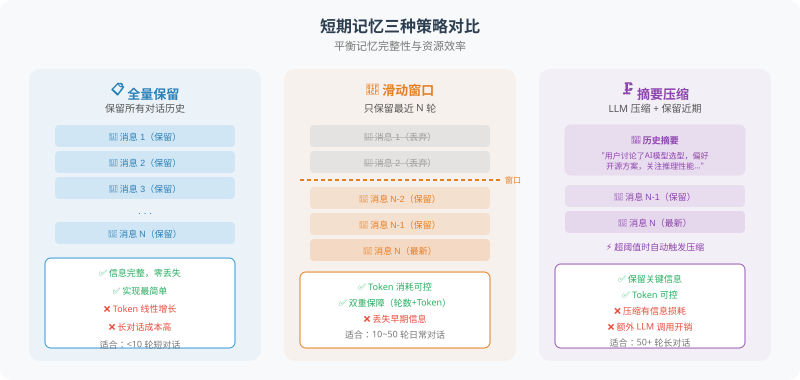

# 4.2 短期记忆：对话历史管理

短期记忆是最基础的记忆形式——维护对话历史，让 Agent 知道"刚才我们说了什么"。

为什么这很重要？LLM 本身是**无状态**的——每次调用都是一次全新的请求，模型并不"记得"上一次对话的内容。如果用户在第一轮说"我叫张伟"，第二轮问"我叫什么名字"，模型如果不回传之前的对话历史，就会一脸茫然。短期记忆解决的正是这个问题：**通过在每次请求中附带之前的对话记录，让模型"看起来"拥有了记忆。**

但这带来一个新问题：LLM 的上下文窗口是有限的（GPT-4.1 约 128K Token）。随着对话越来越长，Token 消耗急剧增加，不仅费用高昂，还可能超出模型的处理上限。因此，我们需要**对话历史管理策略**来平衡"记忆完整性"和"资源效率"。

本节介绍三种策略：全量保留、滑动窗口、摘要压缩，它们适用于不同长度的对话场景。



## 为什么需要策略：Token 是硬约束

在深入代码之前，先理解问题的本质。对话每多一轮，所有"之前的消息 + 当前消息"都会重新发给 LLM 计算一次。Token 消耗随轮次线性增长，单次对话成本可能从几厘涨到几毛。

> 💡 **粗略估算**：一次 50 轮的技术支持对话，每轮平均 500 token，总输入 ≈ 50 × 500 = 25,000 token。即便用 `gpt-4.1-mini`，成本也在 $0.005 量级；用 `gpt-4.1` 则接近 $0.07。如果是客服场景每天几千次对话，这笔费用必须严格控制。

三种策略就是为这个问题设计的"成本-记忆完整性"权衡点。

## 策略一：全量保留

最简单的实现。每一轮对话都加入历史数组，下次调用时全部发给模型。

```python
from dataclasses import dataclass
from openai import OpenAI
import tiktoken

client = OpenAI()

@dataclass
class Message:
    role: str   # "user" / "assistant" / "system" / "tool"
    content: str
    token_count: int = 0

class ConversationHistory:
    """全量保留所有消息，token 计数用 tiktoken 精确统计。"""

    def __init__(self, system_prompt: str = "", model: str = "gpt-4.1"):
        self.encoding = tiktoken.encoding_for_model(model)
        self.messages: list[Message] = []
        if system_prompt:
            self.add_message("system", system_prompt)

    def add_message(self, role: str, content: str) -> None:
        tokens = len(self.encoding.encode(content))
        self.messages.append(Message(role, content, tokens))

    def total_tokens(self) -> int:
        return sum(m.token_count for m in self.messages)

    def chat(self, user_message: str) -> str:
        self.add_message("user", user_message)
        resp = client.chat.completions.create(
            model="gpt-4.1",
            messages=[{"role": m.role, "content": m.content} for m in self.messages]
        )
        reply = resp.choices[0].message.content
        self.add_message("assistant", reply)
        return reply
```

> ⚠️ **何时用**：对话总轮次 < 10，或调试期临时使用。超过 10 轮就必须切到下面两种策略。

## 策略二：滑动窗口

**核心思想**：只保留最近 N 轮对话，丢弃更早的记录。类似于人类的短期记忆容量限制（心理学中"7±2"法则）。

```python
class SlidingWindowMemory:
    """只保留最近 N 轮；system_prompt 始终保留。"""

    def __init__(self, system_prompt: str = "", max_turns: int = 10,
                 max_tokens: int = 8000, model: str = "gpt-4.1-mini"):
        self.system_prompt = system_prompt
        self.max_turns = max_turns
        self.max_tokens = max_tokens
        self.encoding = tiktoken.encoding_for_model(model)
        self.all_messages: list[dict] = []   # 完整历史（不传给 LLM）

    def _count(self, msgs: list[dict]) -> int:
        return sum(len(self.encoding.encode(m.get("content", ""))) for m in msgs)

    def _window(self) -> list[dict]:
        result = [{"role": "system", "content": self.system_prompt}] if self.system_prompt else []
        recent = self.all_messages[-(self.max_turns * 2):]
        # 双重保障：轮数 + token 数，任一超限就继续截
        while recent and self._count(result + recent) > self.max_tokens:
            recent = recent[2:]   # 每次移除最早一轮
        return result + recent

    def chat(self, user_message: str) -> str:
        self.all_messages.append({"role": "user", "content": user_message})
        window = self._window()
        resp = client.chat.completions.create(
            model="gpt-4.1-mini", messages=window
        )
        reply = resp.choices[0].message.content
        self.all_messages.append({"role": "assistant", "content": reply})
        return reply
```

### 为什么需要 `max_turns` 和 `max_tokens` 双重保障？

- 只用 `max_turns`：用户传了一段 5000 token 的代码，3 轮就可能撑爆上下文窗口
- 只用 `max_tokens`：单轮 10 token 的闲聊，会塞 800 条消息，模型注意力反而分散

两者配合才能既控制成本，又保证每条消息有合理关注度。

### ⚠️ 滑动窗口的致命缺陷

窗口外的对话**直接丢弃**。如果用户在对话开头说"我是 Python 工程师，偏好简洁代码"，等窗口滑过去后，Agent 就完全忘了这些身份信息。

> **解决方法**：把用户身份、核心偏好等信息提取到长期记忆（4.3 节）。滑动窗口只负责"最近聊了什么"。

## 策略三：摘要压缩

**核心思想**：当历史超过阈值，用 LLM 把旧对话压缩成一段摘要，然后只保留"摘要 + 最近的消息"。

```python
class SummaryMemory:
    """超阈值时自动用 LLM 压缩旧对话。"""

    def __init__(self, system_prompt: str = "", max_tokens: int = 3000,
                 model: str = "gpt-4.1-mini", summary_model: str = "gpt-4.1-mini"):
        self.system_prompt = system_prompt
        self.max_tokens = max_tokens
        self.encoding = tiktoken.encoding_for_model(model)
        self.summary: str = ""                          # 已压缩的历史
        self.recent: list[dict] = []                    # 未压缩的最近消息

    def _should_compress(self) -> bool:
        return sum(len(self.encoding.encode(m["content"]))
                   for m in self.recent) > self.max_tokens

    def _compress(self) -> str:
        """用 LLM 把 self.recent 压成 300 字内的摘要，并与已有摘要合并。"""
        convo = "\n".join(f"{m['role'].upper()}: {m['content']}"
                          for m in self.recent)
        prev = f"已有摘要：\n{self.summary}\n\n" if self.summary else ""
        prompt = f"""{prev}请将以下对话压缩为简洁摘要，保留用户需求、决策、偏好：
{convo}
要求：第三人称、客观简洁、不超过 300 字。"""
        resp = client.chat.completions.create(
            model="gpt-4.1-mini",
            messages=[{"role": "user", "content": prompt}],
            max_tokens=400
        )
        return resp.choices[0].message.content

    def chat(self, user_message: str) -> str:
        self.recent.append({"role": "user", "content": user_message})
        if self._should_compress():
            self.summary = self._compress()
            self.recent = [self.recent[-1]]              # 保留最后一条触发消息
        messages = []
        if self.system_prompt:
            messages.append({"role": "system", "content": self.system_prompt})
        if self.summary:
            messages.append({"role": "system",
                             "content": f"【历史摘要】\n{self.summary}"})
        messages.extend(self.recent)
        resp = client.chat.completions.create(model="gpt-4.1-mini", messages=messages)
        reply = resp.choices[0].message.content
        self.recent.append({"role": "assistant", "content": reply})
        return reply
```

### 摘要压缩的代价与适用场景

| 维度 | 评价 |
|---|---|
| **优点** | 保留早期关键信息（用户身份、决策、偏好）；适合长对话 |
| **缺点** | 每次压缩多一次 LLM 调用（成本和延迟增加）；细节必然丢失 |
| **理想场景** | 长技术支持对话（前半段大量排查，真正有用的是结论）；项目复盘 |
| **不理想** | 短对话、逻辑推理对话（细节缺失会破坏推理链） |

> 💡 **技巧**：摘要 prompt 中明确要求"保留用户需求、决策、偏好"，可以引导 LLM 留下真正重要的信息。也可以给"保留 5 条最重要的决策"这样的硬约束。

## 三种策略对比

| 策略 | 适用场景 | 优点 | 缺点 | 实现复杂度 |
|---|---|---|---|---|
| **全量保留** | < 10 轮的短对话 | 信息完整、无丢失 | Token 线性增长，费用失控 | ⭐ |
| **滑动窗口** | 一般客服 / 闲聊 | 简单高效、延迟低 | 窗口外信息全丢 | ⭐⭐ |
| **摘要压缩** | 长对话 / 项目复盘 | 保留关键信息、Token 受控 | 需额外 LLM 调用、细节丢失 | ⭐⭐⭐ |

### 选型决策树

```
对话预计多长？
  ├─ < 10 轮 ──→ 全量保留
  ├─ 10~50 轮 ─→ 滑动窗口
  └─ > 50 轮 ──→ 滑动窗口 + 长期记忆（关键信息外提）
                  或 摘要压缩
```

实战中**滑动窗口 + 长期记忆**（4.3 节）的组合最常用——滑动窗口管"最近聊了什么"，长期记忆管"用户身份和核心偏好"。

---

## 小结

| 策略 | 一句话总结 |
|---|---|
| 全量保留 | 简单但贵，只适合短对话 |
| 滑动窗口 | 适合大部分场景，但会丢早期信息 |
| 摘要压缩 | 适合长对话，代价是额外 LLM 调用 |

短期记忆的核心目标是**让模型"看到"之前的对话**。真正的难点不在于"记住什么"，而在于"该记多少、该忘什么"。

---

*下一节：[4.3 长期记忆：向量数据库与检索](./03_long_term_memory.md)*
