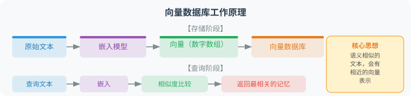

# 4.3 长期记忆：向量数据库与检索

长期记忆让 Agent 能够"记住"跨越多次会话的信息——你今天告诉它你是 Python 开发者、偏好简洁风格，下周再来对话时它依然记得。

> 📄 **学术前沿**：记忆系统的一个经典研究是 Stanford 的 Generative Agents [1]——25 个 AI Agent 在虚拟小镇中生活，它们通过"记忆流"（Memory Stream）记录所有经历，并通过**时近性（Recency）、重要性（Importance）、相关性（Relevance）** 三个维度的加权来检索记忆。特别值得注意的是其记忆衰减机制：越久远的记忆检索权重越低（指数衰减），但如果某段记忆被频繁回忆则权重会提升。这种设计与认知科学中的记忆巩固理论高度一致。

短期记忆（对话历史）在会话结束后就消失了。而长期记忆需要**持久化存储**——信息必须写入某种数据库，下次启动时能够检索回来。但传统数据库的精确查询（SQL `WHERE` 子句）并不适合自然语言场景。用户可能问"我之前提到过什么编程语言？"，你不可能预先知道该搜"Python"还是"Java"还是"Rust"。

这就是**向量数据库**发挥作用的地方。它的核心思想是：将文本转化为数学向量（一组浮点数），然后通过计算向量之间的距离来衡量语义相似度。"Python 是编程语言"和"编程用的 Python"虽然文字不同，但它们的向量非常接近。这让我们能够用自然语言作为查询条件，按语义相关性检索信息。

## 向量数据库的工作原理



核心思想：**语义相似的文本，会有相近的向量表示**。

下面的代码演示了这一点——我们生成三段文本的向量嵌入，然后计算它们之间的余弦相似度。你会看到，语义相似的句子（即使用词不同）相似度接近 1.0，而语义无关的句子相似度很低。

```python
import chromadb
from openai import OpenAI
import numpy as np

client = OpenAI()

def get_embedding(text: str, model: str = "text-embedding-3-small") -> list[float]:
    """获取文本的向量嵌入（1536 维）"""
    response = client.embeddings.create(input=text, model=model)
    return response.data[0].embedding

def cosine_sim(v1, v2) -> float:
    return float(np.dot(v1, v2) / (np.linalg.norm(v1) * np.linalg.norm(v2)))

# 验证语义相似性
texts = [
    "Python 是一种编程语言",        # 原始句
    "Python 是用于编程的语言",      # 语义相似
    "今天天气很好",                 # 语义不相关
]
embeddings = [get_embedding(t) for t in texts]
print(f"相似度（语义相似）：{cosine_sim(embeddings[0], embeddings[1]):.4f}")  # > 0.9
print(f"相似度（语义不同）：{cosine_sim(embeddings[0], embeddings[2]):.4f}")  # < 0.5
```

> 💡 **理解余弦相似度**：返回值范围 `[-1, 1]`。OpenAI 的 `text-embedding-3-small` 通常让语义相近的文本相似度在 `0.7~0.95` 之间，无关文本在 `0.1~0.4`。阈值 `0.4` 是常见的"勉强相关"分界线。

## 用 ChromaDB 构建记忆系统

[ChromaDB](https://www.trychroma.com/) 是轻量级开源向量数据库，支持持久化和语义检索，适合本地开发与原型。

```python
class LongTermMemory:
    """基于 ChromaDB 的长期记忆系统：每用户独立 collection。"""

    def __init__(self, user_id: str, persist_dir: str = "./memory_db"):
        self.user_id = user_id
        self.client = chromadb.PersistentClient(path=persist_dir)
        # 每个用户独立 collection：避免不同用户的记忆互相干扰
        self.collection = self.client.get_or_create_collection(
            name=f"user_{user_id}_memory",
            metadata={"hnsw:space": "cosine"}     # 用余弦相似度
        )

    def add(self, content: str, type: str = "general",
            importance: int = 5, source: str = "conversation") -> str:
        """把一段文本向量化后写入数据库，返回记忆 ID。"""
        import uuid
        memory_id = str(uuid.uuid4())
        self.collection.add(
            ids=[memory_id],
            embeddings=[get_embedding(content)],
            documents=[content],
            metadatas=[{
                "type": type, "importance": importance,
                "source": source, "user_id": self.user_id,
                "created_at": datetime.now().isoformat()
            }]
        )
        return memory_id

    def search(self, query: str, n: int = 5,
               type: str | None = None, min_importance: int = 1) -> list[dict]:
        """按查询语义找最相关的记忆。"""
        where = {"user_id": self.user_id}
        if type:
            where["type"] = type
        if min_importance > 1:
            where["importance"] = {"$gte": min_importance}

        results = self.collection.query(
            query_embeddings=[get_embedding(query)],
            n_results=min(n, self.collection.count()),
            where=where,
            include=["documents", "metadatas", "distances"]
        )
        return [
            {"content": d, "type": m.get("type"),
             "importance": m.get("importance"), "relevance": 1 - dist}
            for d, m, dist in zip(
                results["documents"][0], results["metadatas"][0],
                results["distances"][0])
        ]
```

> 📦 **完整代码（含 `format_for_prompt`、`get_all`、`update`、`delete` 等工程化方法）见仓库** `examples/chapter04/long_term_memory.py`。

### 三个设计决策

1. **每用户独立 collection**：避免不同用户的记忆互相污染。如果有 10 万用户，建议改用单 collection + `user_id` metadata 过滤，否则 collection 数量爆炸。
2. **`importance` 字段**：检索时可过滤低重要性记忆，避免噪音。
3. **`type` 字段（preference/fact/event/task）**：检索时支持按类型过滤——例如只检索 preference 类，缩小范围。

## 自动从对话中提取记忆

手动调用 `memory.add()` 很不实用。更优雅的做法是：**每轮对话结束后，自动让 LLM 决定哪些值得记**。

```python
class MemoryExtractor:
    """分析对话轮次，提取值得长期记忆的内容。"""

    EXTRACT_PROMPT = """分析以下对话，提取值得长期记忆的重要信息。
用户说：{user_msg}
助手回复：{assistant_reply}

提取规则：
- 记录用户的个人信息、偏好、习惯、正在做的项目、重要决策
- 忽略闲聊、问候、临时查询、重复信息
- 用简洁陈述句（第三人称）

返回 JSON 数组（无内容则返回 []）：
[{{"content": "记忆内容", "type": "preference|fact|event|task|skill", "importance": 1-10}}]"""

    def extract(self, user_msg: str, assistant_reply: str) -> list[dict]:
        import json
        prompt = self.EXTRACT_PROMPT.format(
            user_msg=user_msg, assistant_reply=assistant_reply[:300])
        resp = client.chat.completions.create(
            model="gpt-4.1-mini",
            messages=[{"role": "user", "content": prompt}],
            response_format={"type": "json_object"},
            max_tokens=300
        )
        try:
            data = json.loads(resp.choices[0].message.content)
            return data if isinstance(data, list) else data.get("memories", [])
        except Exception:
            return []
```

### 关键设计决策

| 决策 | 选择 | 原因 |
|---|---|---|
| **模型** | `gpt-4.1-mini` | 提取是结构化任务，不需要最强推理；mini 成本约为主力的 1/20 |
| **温度** | 默认 1.0 → 建议改为 0.0 | 提取需要稳定，避免随机生成不同 schema |
| **`response_format: json_object`** | 开启 | 强制 JSON 输出，避免手动 `json.loads` 失败的概率 |
| **失败兜底** | `try/except` 返回 `[]` | 提取是"锦上添花"功能，失败不能影响主对话 |

## 完整链路

把短期记忆（4.2 节）、长期记忆（4.3 节）、自动提取三者串起来：

```text
用户消息
   │
   ├─→ 检索长期记忆（按当前消息查相关历史）
   │
   ├─→ 拼装 system_prompt = 系统角色 + 相关长期记忆 + 历史摘要
   │
   ├─→ 发送：system_prompt + 滑动窗口内的近期消息 + 用户消息
   │
   ├─→ 收到 LLM 回复
   │
   ├─→ 追加到滑动窗口（短期记忆）
   │
   └─→ 调用 MemoryExtractor 提取新记忆 → 写入长期记忆库
```

这套"滑动窗口 + 长期记忆 + 自动提取"的组合，是工业级个人助理 Agent 的标准架构（4.5 节实战会完整搭建）。

---

## 小结

长期记忆的核心要素：
- **向量嵌入**：将文本转为可比较的向量
- **语义检索**：找到语义相关（而非关键词匹配）的记忆
- **分类存储**：区分偏好、事实、任务等不同类型
- **自动提取**：从对话中自动识别值得记忆的信息

---

## Memory Governance：记忆不是越多越好

当 Agent 进入长期使用阶段，记忆系统会从"功能模块"变成"治理对象"。因为记忆一旦持久化，就会影响未来所有对话和决策：错误记忆会反复误导模型，过期记忆会污染用户画像，敏感记忆会带来隐私风险。

**Memory Governance（记忆治理）** 要回答四个问题：

1. **什么可以被记住？** 用户偏好、长期事实、项目背景可以记；临时查询、敏感凭证、一次性信息不应默认记。
2. **谁有权写入和修改记忆？** 自动提取器、用户显式指令、管理员规则的优先级不同。
3. **记忆什么时候过期或删除？** 过期偏好、被用户撤回的信息、低置信度事实需要衰减或移除。
4. **如何审计记忆影响？** 当 Agent 给出某个建议时，应能说明使用了哪些记忆。

### 记忆治理的五条规则

| 规则 | 说明 | 工程实现 |
|---|---|---|
| **显式优先** | 用户明确说"记住/忘记"的优先级最高 | 为显式记忆打 `source=explicit` 标签 |
| **敏感最小化** | 不保存密码、密钥、身份证号等高风险信息 | PII 检测 + 写入前过滤 |
| **可撤回** | 用户可以查看、修改、删除记忆 | 提供 memory list/update/delete 接口 |
| **时间有效性** | 偏好和任务会变化，记忆需要有效期 | `created_at`、`updated_at`、`expires_at` 字段 |
| **可追溯** | 重要输出应能追踪到使用了哪些记忆 | 记录 `memory_id` 与回答的关联 |

### 为记忆增加治理元数据

在写入时给每条记忆打上"治理标签"：

| 字段 | 取值示例 | 作用 |
|---|---|---|
| `confidence` | `0.92` | 自动提取的置信度（低置信度不用于关键决策） |
| `expires_at` | `2027-01-01T00:00:00` | 过期时间（到期自动失效） |
| `sensitivity` | `low / medium / high` | 敏感度（高敏感需用户二次确认） |
| `consent` | `True / False` | 用户是否同意记录 |
| `status` | `active / archived / deleted` | 状态（被撤回的记忆归档而非硬删） |

检索时不应该只看语义相似度，还要过滤状态、敏感度和有效期：

```python
def is_memory_usable(meta: dict) -> bool:
    """判断一条记忆是否可用于当前回答。"""
    if meta.get("status") != "active":
        return False
    if meta.get("sensitivity") == "high":
        return False
    if meta.get("consent") is False:
        return False
    if meta.get("expires_at") and meta["expires_at"] < datetime.now().isoformat():
        return False
    return True
```

### 记忆冲突与更新

长期记忆中最常见的问题不是"记不住"，而是"记住了互相矛盾的信息"。例如：

```text
2025-01：用户主要使用 Python。
2026-04：用户现在主要使用 Rust。
```

这时不应该简单返回两条记忆，而应根据时间、置信度和显式程度做冲突解决：

| 冲突类型 | 处理策略 |
|---|---|
| 新旧偏好冲突 | 新记忆优先，旧记忆归档或降低权重 |
| 显式与自动提取冲突 | 显式记忆优先 |
| 低置信度事实冲突 | 请求用户确认或不用于关键决策 |
| 敏感信息误写入 | 立即删除并记录审计日志 |

Memory Governance 的目标不是让 Agent "记住一切"，而是让它**有边界、有来源、有生命周期地记住真正有用的信息**。

---

*下一节：[4.4 工作记忆：Scratchpad 模式](./04_working_memory.md)*

---

## 参考文献

[1] PARK J S, O'BRIEN J C, CAI C J, et al. Generative agents: Interactive simulacra of human behavior[C]//UIST. 2023.

[2] JOHNSON J, DOUZE M, JÉGOU H. Billion-scale similarity search with GPUs[J]. IEEE Transactions on Big Data, 2021, 7(3): 535-547.
