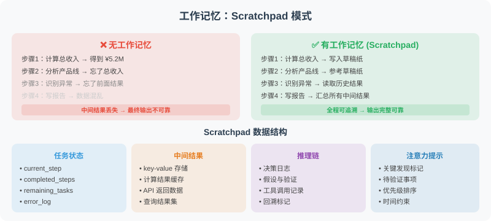

# 4.4 工作记忆：Scratchpad 模式

工作记忆是 Agent 在执行复杂任务时的"草稿纸"——记录推理步骤、中间结果，帮助 Agent 保持任务状态。



## 为什么需要工作记忆？

考虑一个真实场景：分析 Q1 财务数据——计算总收入、找增长最快的产品线、识别成本异常、生成摘要报告。**没有工作记忆的 Agent 会"忘记"中间步骤**：

- 步骤 1（总收入）的结果，步骤 3 怎么用？
- 分析了 20 个产品线，哪个增长最快？
- 发现了 3 个异常，每个的详情是什么？

这些中间信息**不应该写回对话历史**（会撑爆短期记忆），也**不应该进长期记忆**（一次性任务结束就丢）。它们属于"工作记忆"——任务进行时存在，任务结束即可清空。

## Scratchpad 模式的核心设计

Scratchpad = 任务进行时的"草稿本"。Agent 在推理过程中用工具调用把中间结果写进 Scratchpad，后续步骤可读取并引用。

```python
class Scratchpad:
    """草稿纸：键值存储 + 格式化输出为 Prompt 文本。"""
    def __init__(self):
        self._notes: dict[str, dict] = {}
        self._log: list[dict] = []

    def write(self, key: str, value, description: str = ""):
        """写入一条笔记（覆盖同 key）。"""
        self._notes[key] = {"value": value, "description": description}
        self._log.append({"action": "write", "key": key, "time": _now()})

    def read(self, key: str):
        return self._notes.get(key, {}).get("value")

    def list_keys(self) -> list[str]:
        return list(self._notes.keys())

    def to_prompt_text(self) -> str:
        """将当前内容序列化为可注入 system prompt 的文本。"""
        if not self._notes:
            return "工作记忆：（空）"
        lines = ["【工作记忆 - 已知信息】"]
        for k, e in self._notes.items():
            desc = f"（{e['description']}）" if e["description"] else ""
            lines.append(f"- {k}{desc}: {json.dumps(e['value'], ensure_ascii=False)}")
        return "\n".join(lines)

    def clear(self):
        self._notes.clear()
```

然后在 System Prompt 中**每次调用前**重新注入最新状态：

```python
class ScratchpadAgent:
    """将 Scratchpad 暴露为工具集，让 LLM 自己决定何时读写。"""

    def _tools(self) -> list[dict]:
        return [
            {"type": "function", "function": {
                "name": "save_to_scratchpad",
                "description": "将中间计算结果保存到工作记忆，供后续步骤使用",
                "parameters": {"type": "object", "properties": {
                    "key": {"type": "string", "description": "键名，英文蛇形命名"},
                    "value": {"description": "要保存的值"},
                    "description": {"type": "string"}
                }, "required": ["key", "value"]}}},
            {"type": "function", "function": {
                "name": "read_from_scratchpad",
                "description": "读取之前保存的中间结果",
                "parameters": {"type": "object", "properties": {
                    "key": {"type": "string"}
                }, "required": ["key"]}}},
            {"type": "function", "function": {
                "name": "list_scratchpad_keys",
                "description": "列出工作记忆中的所有键名",
                "parameters": {"type": "object", "properties": {}}}}
        ]

    def solve(self, problem: str) -> str:
        self.scratchpad.clear()
        messages = [
            {"role": "system", "content": (
                "你是复杂多步骤问题助手。请将问题分解为多个步骤，"
                "每步完成后用 save_to_scratchpad 保存中间结果，"
                "后续步骤可读取前面结果。\n\n"
                + self.scratchpad.to_prompt_text()
            )},
            {"role": "user", "content": problem}
        ]
        for step in range(10):           # MAX_STEPS 硬上限
            # 关键：每次都重新构建 system_prompt，让模型看到最新 scratchpad
            messages[0]["content"] = self.scratchpad.to_prompt_text()
            resp = client.chat.completions.create(
                model="gpt-4.1", messages=messages,
                tools=self._tools(), tool_choice="auto"
            )
            msg = resp.choices[0].message
            messages.append(msg)
            if resp.choices[0].finish_reason == "stop":
                return msg.content
            # 执行工具调用...
            for tc in msg.tool_calls or []:
                result = self._execute_tool(tc.function.name, json.loads(tc.function.arguments))
                messages.append({"role": "tool", "tool_call_id": tc.id, "content": result})
        return "超过最大步骤数"
```

> 📦 **完整代码（包含工具执行分发、测试数据、调用日志）见仓库** `examples/chapter04/scratchpad_agent.py`。

### 三个关键设计点

| 决策 | 选择 | 原因 |
|---|---|---|
| **Scratchpad 暴露为工具** | 是 | 让 LLM 自己决定何时读写，模拟人脑"用草稿纸"的思考过程 |
| **每次重新构建 system_prompt** | 必做 | scratchpad 状态变化后，模型必须看到最新内容，否则读到的是过期状态 |
| **Scratchpad 不进长期记忆** | 是 | 任务结束 `clear()`，避免污染用户的长期画像 |

## ReAct 中的工作记忆

ReAct 模式本身就是工作记忆的一种体现。每一轮的 `Thought → Action → Observation` 序列都写在消息历史中，模型在下一轮能"看到"前面所有推理步骤——这是隐式工作记忆。

> 但 ReAct 的"工作记忆"会随对话变长而膨胀。复杂任务应该用显式 Scratchpad 替代：把"关键中间结果"提取到 scratchpad（节省 token），而不是把所有步骤留在消息历史（重复消费 token）。

## Scratchpad vs 短期记忆 vs 长期记忆

| 维度 | 短期记忆（4.2） | 工作记忆（4.4） | 长期记忆（4.3） |
|---|---|---|---|
| **存在位置** | 消息历史 | 独立数据结构 | 向量数据库 |
| **生命周期** | 当前会话 | 当前任务 | 跨会话永久 |
| **典型容量** | 数十轮 | 数十个键值对 | 数千条 |
| **检索方式** | 顺序 | 按 key 查找 | 语义相似度 |
| **典型内容** | 用户/助手消息 | 中间计算结果 | 用户偏好、身份 |
| **何时清空** | 会话结束 | 任务完成 | 用户撤回或过期 |

## 什么时候用 Scratchpad？

| 场景 | 是否需要 | 原因 |
|---|---|---|
| 单轮问答 | ❌ | 没有多步推理 |
| 3-5 步的链式推理 | ⚠️ 可选 | ReAct 自带工作记忆 |
| 10+ 步复杂任务（数据分析、多步检索） | ✅ 必须 | 关键中间结果显式保存，避免丢失 |
| 跨工具数据传递 | ✅ 必须 | "A 工具的结果作为 B 工具的输入" |
| 长时间运行的多步任务 | ✅ 必须 | 防止上下文窗口超限 |

---

## 小结

工作记忆（Scratchpad）的价值：
- 支持**复杂多步骤任务**，步骤间共享中间结果
- 避免重复计算和信息丢失
- 让 Agent 的推理过程更透明可追踪
- 任务完成后可清空，不污染长期记忆

> 💡 **一句话区分**：短期记忆管"对话历史"，长期记忆管"用户是谁"，工作记忆管"任务进行到哪一步"。

---

*下一节：[4.5 实战：带记忆的个人助理 Agent](./05_practice_memory_agent.md)*
