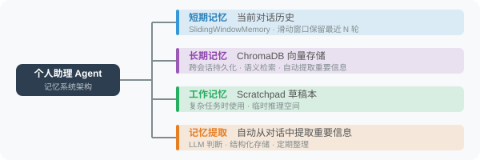

# 4.5 实战：带记忆的个人助理 Agent

综合前四节的知识，构建一个真正有"记忆"的个人助理——它能记住你的偏好、持续跨会话学习。

这个项目是本章知识的综合应用。我们将**短期记忆**（滑动窗口）和**长期记忆**（ChromaDB 向量检索）组合在一起，再加上**自动记忆提取**，构建一个真正"懂你"的个人助理。

## 系统架构

个人助理的记忆系统分三层协作：

1. **短期记忆**（滑动窗口）：保持当前会话的连贯性
2. **长期记忆**（ChromaDB）：跨会话持久化，记住用户的身份、偏好、技能等
3. **自动提取**（LLM 分析）：每轮对话结束后自动识别值得记忆的信息



**协作流程**：

```
用户消息 → 检索长期记忆(按 query 找相关) → 拼装 prompt
         → 调用 LLM → 回复
         → 追加到短期记忆(滑动窗口)
         → 自动提取新记忆(异步) → 写入长期记忆
```

## 核心实现

整个系统的核心是 `chat` 方法——它实现了"检索 → 调用 → 更新 → 提取"四步流水线。下面展示关键流程，完整工程化代码（富文本日志、错误处理、交互式 REPL）见仓库。

```python
import json, uuid, datetime, chromadb
from openai import OpenAI

client = OpenAI()

class PersonalAssistant:
    def __init__(self, user_id: str, assistant_name: str = "小助"):
        self.user_id = user_id
        self.assistant_name = assistant_name
        # 长期记忆：ChromaDB
        self.memory = chromadb.PersistentClient(
            path=f"./data/memory_{user_id}"
        ).get_or_create_collection(
            name="long_term_memory",
            metadata={"hnsw:space": "cosine"}
        )
        # 短期记忆：滑动窗口（最近 10 轮 = 20 条消息）
        self.history: list[dict] = []
        self.max_history_turns = 10

    def _embed(self, text: str) -> list[float]:
        return client.embeddings.create(
            input=text, model="text-embedding-3-small"
        ).data[0].embedding

    def recall(self, query: str, n: int = 5) -> list[dict]:
        """按 query 检索最相关的长期记忆，过滤低相关度（< 0.4）。"""
        if self.memory.count() == 0:
            return []
        results = self.memory.query(
            query_embeddings=[self._embed(query)],
            n_results=min(n, self.memory.count()),
            where={"user_id": self.user_id},
            include=["documents", "metadatas", "distances"]
        )
        memories = []
        for doc, meta, dist in zip(
            results["documents"][0], results["metadatas"][0],
            results["distances"][0]
        ):
            relevance = 1 - dist
            if relevance > 0.4:        # ← 关键阈值
                memories.append({
                    "content": doc, "type": meta.get("type", "general"),
                    "importance": meta.get("importance", 5),
                    "relevance": relevance
                })
        return sorted(memories, key=lambda x: x["relevance"], reverse=True)

    def _auto_extract(self, user_msg: str, assistant_reply: str):
        """每轮对话后用小模型提取值得长期记忆的内容。"""
        prompt = f"""从以下对话中提取值得长期记忆的用户信息。
用户说：{user_msg}
助手回复：{assistant_reply[:200]}

提取规则：
✅ 要提取：用户的个人信息、偏好、工作、技能、正在做的项目、明确表达的需求
❌ 不提取：日常问候、临时查询、没有持久价值的内容

返回JSON数组（无则返回 []）：[{{"content": "...", "type": "fact|preference|task|skill", "importance": 1-10}}]"""
        try:
            resp = client.chat.completions.create(
                model="gpt-4.1-mini",
                messages=[{"role": "user", "content": prompt}],
                response_format={"type": "json_object"},
                max_tokens=300
            )
            data = json.loads(resp.choices[0].message.content)
            memories = data if isinstance(data, list) else data.get("memories", [])
            for m in memories:
                if isinstance(m, dict) and m.get("content"):
                    self.memory.add(
                        ids=[str(uuid.uuid4())],
                        embeddings=[self._embed(m["content"])],
                        documents=[m["content"]],
                        metadatas=[{
                            "type": m.get("type", "general"),
                            "importance": m.get("importance", 5),
                            "user_id": self.user_id,
                            "created_at": datetime.datetime.now().isoformat()
                        }]
                    )
        except Exception:
            pass     # 提取失败不影响主对话

    def chat(self, user_message: str) -> str:
        """核心流水线：检索 → 调用 → 更新 → 提取。"""
        # ① 检索相关长期记忆
        memories = self.recall(user_message, n=5)

        # ② 拼装 system prompt
        system = f"你是 {self.assistant_name}，用户 {self.user_id} 的专属助理。"
        if memories:
            memory_text = "\n".join(
                f"- [{m['type']}] {m['content']}" for m in memories[:3]
            )
            system += f"\n\n【关于用户的记忆】\n{memory_text}"

        # ③ 滑动窗口内的近期消息 + 当前用户消息
        window = self.history[-(self.max_history_turns * 2):]
        messages = [{"role": "system", "content": system}] + window \
                 + [{"role": "user", "content": user_message}]

        # ④ 调用 LLM
        resp = client.chat.completions.create(
            model="gpt-4.1", messages=messages, max_tokens=800
        )
        reply = resp.choices[0].message.content

        # ⑤ 更新短期记忆（滑动窗口）
        self.history.append({"role": "user", "content": user_message})
        self.history.append({"role": "assistant", "content": reply})

        # ⑥ 自动提取新记忆（不影响本次响应）
        self._auto_extract(user_message, reply)

        return reply
```

> 📦 **完整代码（含 `show_memories`、交互式 REPL、`rich` 美化日志）见仓库** `examples/chapter04/personal_assistant.py`。

## 关键实现细节

**相关性阈值过滤**：`recall` 设置 `relevance > 0.4` 是因为向量检索总会返回"最相似"的 N 个结果，但这些结果不一定真的相关。例如用户问"今天吃什么"时，记忆库里没有饮食信息，ChromaDB 仍会返回 5 个"最不无关"的结果（相似度可能只有 0.2）。0.4 这个阈值能有效过滤噪音——但具体值需要根据你的 embedding 模型和场景调优。

**记忆注入 System Prompt** 而不是 User Message：检索到的相关记忆放在 system prompt 里，模型会将其视为"背景知识"，更自然地融入回答；放在 user 消息里，模型可能机械地"引用"原文，显得生硬。

**静默的记忆提取**：`_auto_extract` 用 `try/except` 包裹，失败时不影响主对话。这是"锦上添花"功能的标准做法——不稳定的副作用不能阻塞主流程。

**滑动窗口与长期记忆的配合**：

| 信息类型 | 存放位置 | 例子 |
|---|---|---|
| 实时对话 | 短期记忆（滑动窗口） | "我刚才问的代码问题" |
| 用户身份 | 长期记忆 | "我是 Python 工程师" |
| 项目背景 | 长期记忆 | "正在做 AI Agent 项目" |
| 临时中间结果 | 不保存 | 上一轮某个计算结果 |

## 演示效果

```
[张伟]：我叫张伟，是一名 Python 工程师，正在做一个 AI 项目
💾 记忆：用户名为张伟
💾 记忆：用户是 Python 工程师
💾 记忆：用户正在做 AI 项目

小智：你好，张伟！很高兴认识你。作为 Python 工程师做 AI 项目，
     你是在做什么方向呢？是 Agent 开发、模型训练还是其他方向？

[张伟]：帮我写一个 Python 函数来计算斐波那契数列

小智：（基于"Python工程师"的记忆，给出专业级代码）
def fibonacci(n: int) -> list[int]:
    """返回前 n 个斐波那契数"""
    ...

-- 下次启动 --
[张伟]：昨天那个斐波那契函数能优化吗？

小智：（从长期记忆中检索到"Python 工程师" + 之前对话的斐波那契函数）
    可以用记忆化（memoization）或生成器来优化 ...
```

跨会话记忆的力量：**即使 Agent 重启，也能"认出"你、记得你的偏好和历史**。

---

## 小结

本章构建了一个完整的记忆系统：

| 组件 | 技术 | 用途 |
|---|---|---|
| 短期记忆 | 滑动窗口 | 当前对话连贯性 |
| 长期记忆 | ChromaDB | 跨会话个性化 |
| 记忆提取 | LLM 分析 | 自动识别重要信息 |
| 语义检索 | 向量相似度 | 精准召回相关记忆 |
| 阈值过滤 | relevance > 0.4 | 过滤低相关度噪音 |

### 工业级扩展建议

1. **元数据丰富化**：加上 `source`（explicit / extracted）、`confidence`、`expires_at` 等治理字段
2. **记忆衰减**：长期不用的记忆权重自动降低（参考 Generative Agents 的时近性衰减）
3. **多用户隔离**：多租户场景必须用 `user_id` metadata 过滤，不能依赖 collection 隔离
4. **审计日志**：记录"哪条记忆影响了哪个回答"，方便排查问题

> 💡 **下一步**：第 5 章我们学习**规划与推理**——让 Agent 能拆解复杂任务，而不只是"被动回应"。

---

*下一章：[第5章 规划与推理（Planning & Reasoning）](../chapter_planning/README.md)*
