# 4.6 论文解读：记忆系统前沿进展

> 📖 *"记忆不只是存储，更是理解和推理的基础。"*  
> *Agent 记忆系统的研究正在快速发展，以下是最有影响力的几项工作。*

---

## Generative Agents：虚拟小镇中的记忆里程碑

**论文**：*Generative Agents: Interactive Simulacra of Human Behavior*  
**作者**：Park et al., Stanford University & Google Research  
**发表**：2023 | [arXiv:2304.03442](https://arxiv.org/abs/2304.03442)

### 核心问题

如何让 AI Agent 像人类一样拥有丰富的内心世界——记住过去的经历、反思这些经历的意义、并据此制定未来的计划？

### 实验设计

研究者构建了一个名为 **Smallville** 的虚拟小镇，25 个 AI 居民（Generative Agents）在其中自主生活。每个居民有自己的身份背景（名字、职业、人际关系），并在小镇中自由活动——去咖啡店、上班、与其他居民交谈、参加活动。

令人惊叹的是，这些 Agent 展现出了许多**涌现行为**：
- 一个 Agent 计划举办情人节派对，自发地邀请其他 Agent
- Agent 之间形成了友谊和社交圈
- Agent 会基于过去的互动调整对其他 Agent 的态度

### 记忆架构（核心贡献）

Generative Agents 的记忆系统是其最重要的技术创新，包含三个层次：

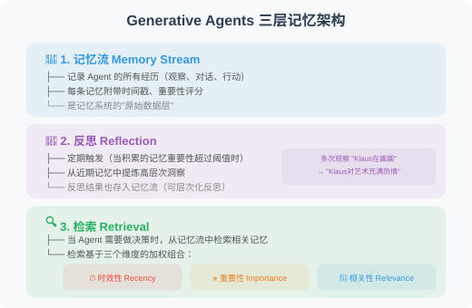

### 对 Agent 开发的启示

1. **"观察-反思-检索"框架**是设计 Agent 记忆系统的黄金范式。大多数后续研究都借鉴了这一框架
2. **重要性评分**的思想——不是所有信息都值得记忆，需要有选择性
3. **多维度检索**优于单维度检索（纯时间序列或纯语义相似度都不够）
4. **反思机制**让 Agent 能从具体经历中提炼出抽象知识——这是"智能"的关键标志

---

## MemGPT：操作系统式的记忆管理

**论文**：*MemGPT: Towards LLMs as Operating Systems*  
**作者**：Packer et al., UC Berkeley  
**发表**：2023 | [arXiv:2310.08560](https://arxiv.org/abs/2310.08560)

### 核心问题

LLM 的上下文窗口是有限的（即使 128K Token 也会耗尽）。当对话足够长或需要处理大量信息时，如何管理这个有限的"内存"？

### 核心类比：LLM = 计算机

MemGPT 最精妙的洞察是将 LLM 的上下文窗口类比为计算机的内存管理：

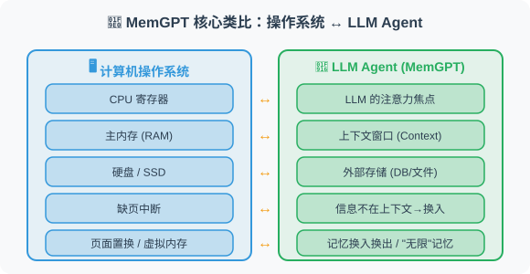

### 方法原理

MemGPT 将上下文窗口分为两个区域：

1. **主上下文（Main Context）**：类似 RAM，放当前最需要的信息（系统提示、近期对话、工作记忆）
2. **外部存储（External Storage）**：类似硬盘，存放完整的对话历史、文档、知识等

关键机制：
- **自我编辑函数**：Agent 可以调用 `core_memory_append()`、`core_memory_replace()` 等函数来主动管理自己的记忆
- **自动换入换出**：当 Agent 需要的信息不在主上下文中时，系统自动从外部存储中检索并"换入"
- **暂停与恢复**：Agent 可以暂停当前对话，去外部存储中搜索信息，然后恢复

### 关键发现

1. **理论上无限的记忆**：通过分层存储，LLM 可以突破上下文窗口的限制
2. **主动记忆管理**：Agent 自己决定哪些信息值得保留在"工作记忆"中
3. **多会话连续性**：跨会话的信息可以通过外部存储持续保存

### 对 Agent 开发的启示

MemGPT 的架构思想在今天的 Agent 开发中非常实用：
- **分层记忆设计**：不要把所有信息都塞进 Prompt，而是分层管理
- **Agent 自管理记忆**：给 Agent 提供记忆管理工具（如本书 4.5 节的实战项目）
- **参考 mem0 等开源方案**：[mem0](https://github.com/mem0ai/mem0) 是 MemGPT 理念的开源实现

---

## MemoryBank：遗忘曲线启发的记忆管理

**论文**：*MemoryBank: Enhancing Large Language Models with Long-Term Memory*  
**作者**：Zhong et al.  
**发表**：2023 | [arXiv:2305.10250](https://arxiv.org/abs/2305.10250)

### 核心问题

现有的记忆系统要么"全部记住"（存储爆炸），要么"只记最新"（遗忘重要信息）。如何模拟人类真实的记忆行为——重要的、经常回忆的记忆被巩固，不重要的、不常回忆的记忆逐渐淡化？

### 方法原理

MemoryBank 的核心创新是引入了**艾宾浩斯遗忘曲线（Ebbinghaus Forgetting Curve）**：

> **记忆强度 = 初始强度 × e^(-t/S)**
>
> - t = 自上次访问以来的时间
> - S = 记忆稳定性（取决于重要性和回顾次数）
>
> 实际效果：经常被访问的记忆 → S 增大 → 衰减更慢 → 被"巩固"；很久不访问的记忆 → 强度不断衰减 → 最终被“遗忘”

### 记忆操作

MemoryBank 支持三种核心操作：
1. **记忆写入**：新信息带初始强度存入
2. **记忆回忆**：检索时更新访问时间，增加稳定性
3. **记忆遗忘**：定期扫描，强度低于阈值的记忆被移至"归档区"

### 对 Agent 开发的启示

- **自然的信息管理**：比起手动设置"保留最近 N 条"，遗忘曲线更智能
- **用户画像随时间演进**：用户的偏好可能会变化，旧偏好自然衰减
- **存储效率**：自动淘汰不再需要的信息，控制存储成本

---

## CoALA：Agent 认知架构的统一框架

**论文**：*Cognitive Architectures for Language Agents (CoALA)*  
**作者**：Sumers et al.  
**发表**：2023 | [arXiv:2309.02427](https://arxiv.org/abs/2309.02427)

### 核心问题

Agent 的记忆系统、推理系统、行动系统之间是什么关系？是否存在一个统一的认知架构来组织这些组件？

### CoALA 框架

CoALA 借鉴了认知科学中的认知架构理论（如 ACT-R、SOAR），提出了一个适用于 LLM Agent 的统一框架：

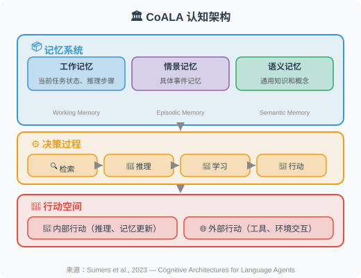

### 核心贡献

1. **统一分类**：将现有的 Agent 系统按认知架构的组件进行分类和比较
2. **记忆三分法**：工作记忆 / 情景记忆 / 语义记忆 的划分比传统的"短期/长期"划分更精细
3. **设计指导**：为 Agent 开发者提供了一个"清单"——在设计 Agent 时需要考虑哪些认知组件

### 对 Agent 开发的启示

CoALA 框架帮助我们更系统地思考 Agent 设计：
- **情景记忆 ≠ 语义记忆**：前者存储"我经历了什么"，后者存储"我知道什么"。两者的检索策略不同
- **工作记忆是推理的基础**：复杂推理需要 Scratchpad（详见 4.4 节）
- **学习循环**：Agent 不仅要使用记忆，还要从经验中学习并更新记忆

---

## HippoRAG：受海马体启发的长时记忆

**论文**：*HippoRAG: Neurobiologically Inspired Long-Term Memory for Large Language Models*  
**作者**：Gutiérrez et al., 俄亥俄州立大学 NLP Group  
**发表**：2024 | NeurIPS 2024 | [arXiv:2405.14831](https://arxiv.org/abs/2405.14831)

### 核心问题

人类大脑的海马体能够高效地整合新信息并与已有知识关联，而现有的 RAG 系统只是简单地"检索最相似的片段"——缺乏对知识之间**关联关系**的建模。

### 方法原理

HippoRAG 模拟了海马体的记忆索引理论（Complementary Learning Systems）：

**传统 RAG**：文档 → 分块 → 向量化 → 检索最相似片段 → 生成回答（问题：片段之间没有关联，无法跨文档推理）

**HippoRAG**：
- 离线索引：文档 → LLM 提取知识三元组 → 构建知识图谱
- 在线检索：查询 → 提取实体 → 通过个性化 PageRank 沿图扩展 → 定位最相关文档片段 → 生成回答

### 关键发现

1. **知识图谱作为索引**：比纯向量检索更擅长处理需要跨文档关联推理的问题
2. **持续学习**：新知识可以增量添加到图中，而不需要重新索引所有文档
3. **在多跳问答任务上显著优于标准 RAG**：在 MuSiQue 等基准上提升 20%+

### 对 Agent 开发的启示

HippoRAG 为 Agent 的长期记忆提供了一个新范式——用**知识图谱作为记忆的索引层**，向量数据库作为原始内容的存储层，两者协作实现高质量的记忆检索。这与 CoALA 框架中"语义记忆"的概念高度吻合。

---

## Zep：时序知识图谱驱动的 Agent 记忆

**论文**：*Zep: A Temporal Knowledge Graph Architecture for Agent Memory*  
**作者**：Rasmussen et al.  
**发表**：2025 | [arXiv:2501.13956](https://arxiv.org/abs/2501.13956)

### 核心问题

现有的 Agent 记忆系统大多忽略了**时间维度**——信息何时被记录、何时过期、不同时间点的信息如何演变。但在实际应用中，时间信息至关重要：

> 用户偏好的演变：2025年1月"用户喜欢用 Python" → 6月"用户开始转向 Rust" → 12月"用户现在主要用 Rust"
>
> 没有时间建模 → Agent 不知道该推荐哪种语言；有时间建模 → Agent 知道用户最新偏好是 Rust

### 方法原理

Zep 将 Agent 的记忆组织为**时序知识图谱（Temporal Knowledge Graph）**：

**核心数据结构**：`(实体, 关系, 实体, 时间戳, 有效期)`

例如：
- `(用户A, 偏好语言, Python, 2025-01, 2025-05)`
- `(用户A, 偏好语言, Rust, 2025-06, 当前)`

**检索时同时考虑**：语义相关性（图结构遍历）+ 时间相关性（优先返回最新、仍有效的记忆）+ 情景上下文（关联同一时期的其他记忆）

### 对 Agent 开发的启示

- **时间感知是长期记忆的必要条件**：特别是在个人助手、客户服务等场景中
- **知识图谱是记忆组织的理想结构**：比纯向量列表更能表达实体间的复杂关系
- Zep 已开源并提供 Python SDK，可以直接集成到 LangChain / LangGraph 项目中

---

## 论文对比与发展脉络

| 维度 | Generative Agents | MemGPT | MemoryBank | CoALA | HippoRAG | Zep |
|------|-------------------|--------|------------|-------|----------|-----|
| **年份** | 2023 | 2023 | 2023 | 2023 | 2024 | 2025 |
| **核心创新** | 观察-反思-检索框架 | OS 式分层存储 | 遗忘曲线记忆管理 | 统一认知架构 | 海马体索引理论 | 时序知识图谱 |
| **记忆类型** | 记忆流 + 反思 | 主上下文 + 外部存储 | 遗忘曲线驱动 | 工作/情景/语义 | 知识图谱索引 | 时序图 + 情景 |
| **特色** | 反思机制 | 自我编辑内存 | 自然记忆衰减 | 理论框架 | 跨文档关联 | 时间感知 |
| **适用场景** | 社会模拟 | 长对话 | 用户画像 | 系统设计 | 知识密集任务 | 个人助理 |

**发展脉络**：

> Generative Agents（建立了记忆系统的基本范式）→ MemGPT（解决"上下文窗口有限"的工程问题）→ MemoryBank（引入认知科学中的遗忘机制）→ CoALA（提供统一的理论框架）→ HippoRAG（用知识图谱作为记忆索引层，NeurIPS 2024）→ Zep + mem0（时序图谱 + 工业级记忆方案，2025）

> 💡 **前沿趋势（2025-2026）**：记忆系统正在从"被动存储"向"主动组织"演进，两大关键趋势：① **知识图谱成为记忆的核心**：HippoRAG、Zep、mem0 都采用了图结构来组织记忆，相比纯向量存储能更好地表达实体关系和支持多跳推理；② **时间感知记忆**：Agent 需要理解"什么时候知道了什么"、"哪些信息已过时"，Zep 的时序知识图谱和 MemoryBank 的遗忘曲线代表了两种互补的时间建模方案。[mem0](https://github.com/mem0ai/mem0) 作为开源记忆层方案已获得广泛采用，支持自动记忆提取、冲突检测和图结构记忆。[supermemory](https://github.com/supermemoryai/supermemory) 则代表了另一种工业级路线——它将 RAG 与 Memory 融合为统一的上下文引擎，支持自动事实提取、用户画像维护、多模态文档处理，并在 LongMemEval、LoCoMo、ConvoMem 三大基准上均排名第一，同时提供 MCP 服务和主流框架集成（LangChain、LangGraph、Vercel AI SDK 等）。

---

## 📰 最新论文速递

> 🗓️ 本节由每日自动更新任务维护，最近更新：**2026 年 7 月 14 日**

### [ProactAgent：经验驱动的终身 Agent 主动检索框架（2026）](https://arxiv.org/abs/2604.20572)

> 🧬 **一句话**：把记忆检索从"被动触发"升级为"主动决策"，用 ProactRL 把检索建模成显式策略动作，只在能带来更好结果时才检索。

**核心问题**：在线终身学习让 Agent 跨交互累积经验、持续改进长视野任务。但现有方法把"从过去经验检索"当被动操作——只在任务初始化或完成一步后触发，导致 Agent 在交互中无法识别知识缺口、主动检索最有用经验。

**方法介绍**：ProactAgent 是经验驱动的终身学习框架，在结构化经验库上做主动检索。先引入 Experience-Enhanced Online Evolution，把检索建模为显式策略动作，用 **ProactRL（主动强化学习检索）**配对分支过程奖励学习"何时检索"和"检索什么"——只有检索能带来更好任务结果时才触发。经验库按类型组织为事实记忆、情节记忆、行为技能三仓库。框架概览见下图：

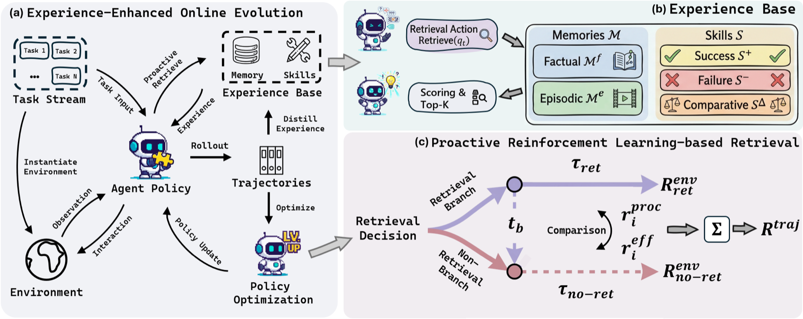

> 图源：ProactAgent 论文（来源：2026, arXiv:2604.20572）

**关键结果**：在 SciWorld（**73.50%**）和 AlfWorld（**71.28%**）上显著提升终身 Agent 成功率。

**与本章关系**：与本章 4.2 节「记忆类型」（事实/情节/技能三分法）和 4.4 节「记忆检索」高度对应，是「主动式记忆检索」方向的最新实践，为检索时机决策提供了 RL 范式的解决方案。

---

### [FSFM：仿生的 Agent 记忆选择性遗忘框架（2026）](https://arxiv.org/abs/2604.20300)

> 🧬 **一句话**：受海马索引/巩固理论与艾宾浩斯遗忘曲线启发，把遗忘分四类（被动衰减/主动删除/安全触发/自适应强化），证明"精心遗忘与记忆保留同等重要"。

**核心问题**：LLM Agent 中记忆管理是直接影响效率、质量与安全的关键挑战。大量研究关注记忆保留与检索，但生物选择性遗忘机制与策略同样重要却 largely 未探索。

**方法介绍**：FSFM 是神经启发的选择性遗忘框架，直接借鉴人类认知过程——海马记忆索引/巩固理论与艾宾浩斯遗忘曲线。把遗忘机制分四类：**被动衰减型、主动删除型、安全触发型、自适应强化型**，针对资源受限环境论证"精心设计的遗忘与记忆保留同等重要"。生物启发概览见下图：

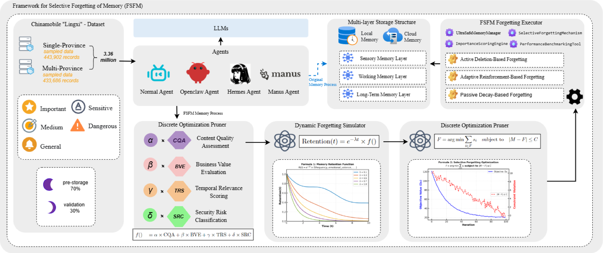

> 图源：FSFM 论文（来源：2026, arXiv:2604.20300）

**关键结果**：访问效率提升 **8.49%**、内容质量信噪比提升 **29.2%**、安全风险消除率 **100%**（主动删除恶意/隐私敏感记忆）。

**与本章关系**：填补了本章记忆管理讨论中「何时/如何删除过期记忆」的空白，与 MemoryBank 的遗忘曲线思路互补，为记忆安全治理提供了系统性的分类框架。

---

### [AI Agent 记忆系统现状 2026：10 种方法基准测评（2026）](https://mem0.ai/blog/state-of-ai-agent-memory-2026)

> 🧬 **一句话**：mem0 团队在 LOCOMO 上横向测评 10 种主流记忆方案（准确率/延迟/Token 三维），图增强 Mem0g 以 <5pp 精度差+低延迟成为最优生产方案。

**核心问题**：Agent 记忆方案百花齐放，但缺乏同时涵盖准确率、延迟、Token 成本的横向基准，选型无实证依据。

**方法介绍**：mem0 团队在 LOCOMO 基准上对 10 种主流 Agent 记忆方案（Full-context、Mem0、Mem0g 图增强、OpenAI Memory、RAG、MemGPT 等）横向测评，覆盖准确率、延迟、Token 消耗三维。

**关键结果**：全上下文注入精度最高（**72.9%**）但 P95 延迟 17 秒，不可用于生产；Mem0 仅损失 6pp 精度，换来 **91%** 延迟下降和 **90%** Token 节省；图增强 Mem0g 把精度差距压缩至 **<5pp** 同时保持低延迟——是最优生产就绪方案。报告还揭示记忆系统已从可选组件演进为 Agent 一等架构组件，21 个框架、19 个向量数据库已完成集成。

**与本章关系**：为本章 4.2 节「记忆类型」和 4.4 节「记忆检索」提供了全球首份包含延迟和 Token 成本的横向基准数据，也是选型决策的实证依据。

---

### [Prism：面向多 Agent 开放式发现的进化记忆基底（2026）](https://arxiv.org/abs/2604.19795)

> 🧬 **一句话**：把层次文件持久化、向量语义、图关系、多 Agent 进化搜索四大范式统一在单一决策论框架下，用熵门控路由+复制子衰减动力学收敛到进化稳定记忆集。

**核心问题**：多 Agent 开放式发现需要进化记忆基底，但现有记忆范式（层次文件、向量语义、图关系、进化搜索）各自孤立，缺乏统一决策框架。

**方法介绍**：PRISM（概率检索+信息分层记忆）把四大范式统一在单一决策论框架下。三大核心机制：①**熵门控分层路由**——基于 Shannon 信息熵把记忆自动分配到技能/笔记/尝试三元枢纽；②**因果记忆图**——追踪每条记忆的 Agent 贡献来源并支持干预溯源；③**复制子衰减动力学**——把记忆置信度建模为进化适应度，收敛至进化稳定记忆集（ESMS）。

**关键结果**：在 LOCOMO 基准上 LLM-as-a-Judge 得分 **88.1**，**超越 Mem0 达 31.2%**。

**与本章关系**：直接对应本章 4.2 节「记忆类型」与 4.4 节「记忆检索」，是将向量记忆、图记忆与进化搜索融合为统一记忆架构的前沿尝试，也为本章末尾 mem0 vs supermemory 的选型对比提供了新的竞争参照系。

---

### [Omni-SimpleMem：自主研究驱动的终身多模态 Agent 记忆框架（2026）](https://arxiv.org/abs/2604.01007)

> 🧬 **一句话**：用无人工干预的自主研究管道跑 50 次实验自动发现记忆框架，F1 从 0.117→0.598，最有价值的改进来自 bug 修复和提示优化而非超参。

**核心问题**：AI Agent 跨扩展时间 horizon 运作，但保留、组织、回忆多模态经验的能力仍是关键瓶颈。构建有效终身记忆需在架构、检索、提示、数据管道的庞大设计空间中导航——这空间太大且相互关联，手工探索或传统 AutoML 难以有效覆盖。

**方法介绍**：本文部署自主研究管道发现 Omni-SimpleMem——终身 AI Agent 的统一多模态记忆框架。从朴素基线（LoCoMo F1=0.117）出发，管道自主执行约 50 次实验，跨两个基准自动诊断失败模式、提架构改进、修复数据管道。框架见下图：

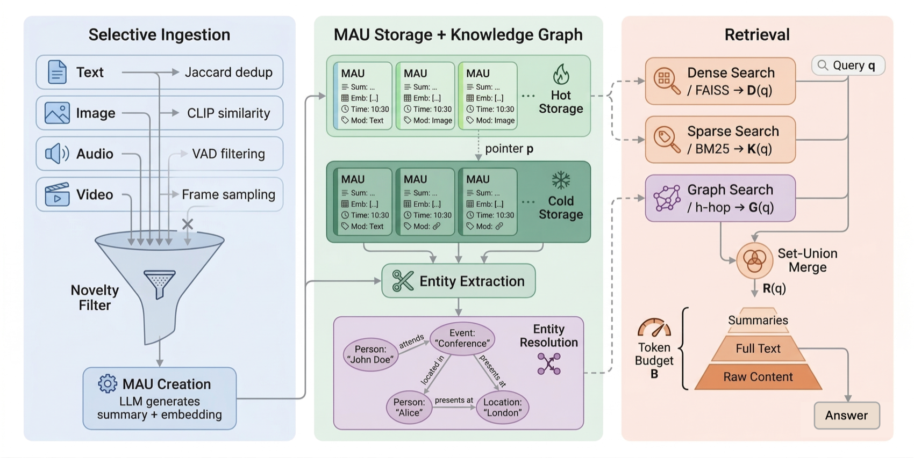

> 图源：Omni-SimpleMem 论文（来源：2026, arXiv:2604.01007）

**关键结果**：LoCoMo 达 F1=**0.598**（提升 **411%**），Mem-Gallery 达 F1=**0.797**（提升 **214%**），两项 SOTA。最有价值改进来自 bug 修复（+175%）和提示优化（+188%），远超所有超参调整之和。

**与本章关系**：直接对应本章「记忆系统设计」议题，是将自主研究（Auto-Research）方法首次应用于多模态记忆框架发现的前沿工作，为记忆系统架构探索提供了全自动化的新路径。

---

### [StructMem：面向长时行为的分层结构化记忆框架（2026）](https://arxiv.org/abs/2604.21748)

> 🧬 **一句话**：用事件级绑定保留+跨事件关系归纳+双视角时序锚定+周期语义整合，兼顾扁平记忆的效率与图记忆的推理能力。

**核心问题**：LLM Agent 长期对话记忆面临两难——扁平记忆高效但缺关系建模，图结构记忆支持推理但构建代价昂贵。

**方法介绍**：StructMem 是结构化分层记忆框架，通过**事件级绑定保留、跨事件关系归纳、双视角时序锚定、周期性语义整合**，在 LoCoMo 上同时提升时序推理和多跳问答性能。三种记忆范式对比见下图：

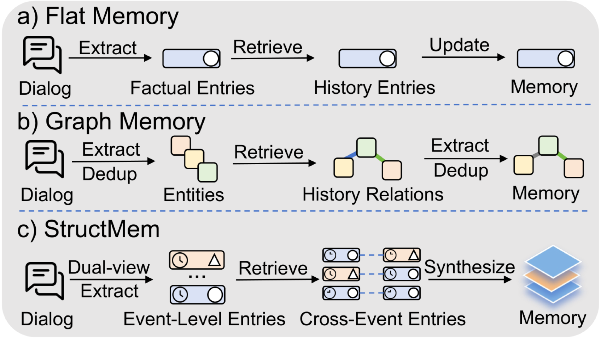

> 图源：StructMem 论文（来源：2026, arXiv:2604.21748，ACL 2026）

**关键结果**：显著减少 token 用量、API 调用次数与运行时间，同时提升时序推理与多跳问答性能。

**与本章关系**：对应本章 4.2「记忆类型」与 4.4「记忆检索」核心知识点，为实现兼顾效率与结构化推理的 Agent 长期记忆提供了经 ACL 2026 认可的完整方案。

---

### [AEL：通过经验演化学习提升开放环境中的 Agent 自我改进（2026）](https://arxiv.org/abs/2604.21725)

> 🧬 **一句话**：双时间尺度——快用 Thompson Sampling bandit 学检索策略，慢用 LLM 反思诊断失败注入因果洞见；揭示"少即是多"：记忆+反思+58%，每加一机制反降。

**核心问题**：LLM Agent 在数百顺序 episode 的开放环境中运作，却基本无状态——每个任务从零解，没把过去经验转成更好未来行为。核心障碍不是"记什么"而是"记住了什么"——用哪种检索策略、如何解读先验结果、何时该改变当前策略。

**方法介绍**：AEL（Agent Evolving Learning）是双时间尺度框架。快时间尺度用 **Thompson Sampling 老虎机**学每次用哪种记忆检索策略；慢时间尺度由 LLM 驱动的反思诊断失败模式，把因果洞见注入决策提示。框架概览见下图：

> 图源：AEL 论文（来源：2026, arXiv:2604.21725）

**关键结果**：消融揭示"少即是多"——记忆+反思带来 **58%** 累积提升，但每增加一个机制（规划演化、技能提取等）性能均下降。

**与本章关系**：直接呼应本章 4.4「记忆检索策略」议题，深刻揭示了记忆系统的核心瓶颈不在于存什么而在于如何使用，为 Agent 记忆利用策略的设计提供了清晰的研究方向。

---

### [Memanto：基于信息论检索的类型化语义记忆层（2026）](https://arxiv.org/abs/2604.22085)

> 🧬 **一句话**：颠覆"高保真记忆必须依赖知识图谱"假设，用 13 类类型化语义模式+Moorcheh 信息论搜索（零索引/亚90ms/零入库延迟），少 250 倍参数超混合图谱。

**核心问题**：从无状态推理到持久多会话自主 Agent 的转变，揭示了记忆是生产级 Agentic 系统的主要架构瓶颈。现有方法多依赖混合语义图架构——摄入与检索都带来大量计算开销（LLM 实体抽取、显式图 schema 维护、多查询检索管道）。

**方法介绍**：Memanto 是面向 Agent 的通用记忆层，挑战"知识需图"的主流假设。它用 13 个预定义记忆类别的**类型化语义模式**，配自动冲突解决与时间版本控制，依托 **Moorcheh 信息论搜索引擎**（零索引、亚 90 毫秒确定性检索、零入库延迟、单次查询）。

**关键结果**：在 LongMemEval 和 LoCoMo 上分别达 **89.8%** 和 **87.1%** 最优准确率，以少 **250 倍**可训练参数全面超越混合图谱与向量数据库方案。

**与本章关系**：与本章 4.3 节「长期记忆」和 4.4 节「记忆检索」直接对应，是当前在 LongMemEval 基准上的最优方案，展示了无图结构记忆架构的可行性。

---

### [Oblivion：衰减驱动激活的自适应 Agent 记忆控制（2026）](https://arxiv.org/abs/2604.00131)

> 🧬 **一句话**：每条记忆带随时间衰减的激活值，仅高于阈值才可检索，但上下文强化/显式访问可重激活——"有序遗忘"减 40%+ 上下文占用。

**核心问题**：选择性遗忘、巩固、重学习是人类记忆的适应属性——经验随时间变不易访问，但可通过强化或上下文线索重激活。而记忆增强 LLM Agent 依赖"always-on 检索"与"扁平存储"，随历史增长导致高干扰与延迟。

**方法介绍**：Oblivion 受人类记忆遗忘与重激活机制启发，为 Agent 记忆引入**动态衰减机制**——每条记忆有随时间降低的激活值，仅高于阈值的才可被检索；但经上下文强化或显式访问的记忆可被重新激活。这一"有序遗忘"让 Agent 自动过滤陈旧低质记忆。架构设计见下图：

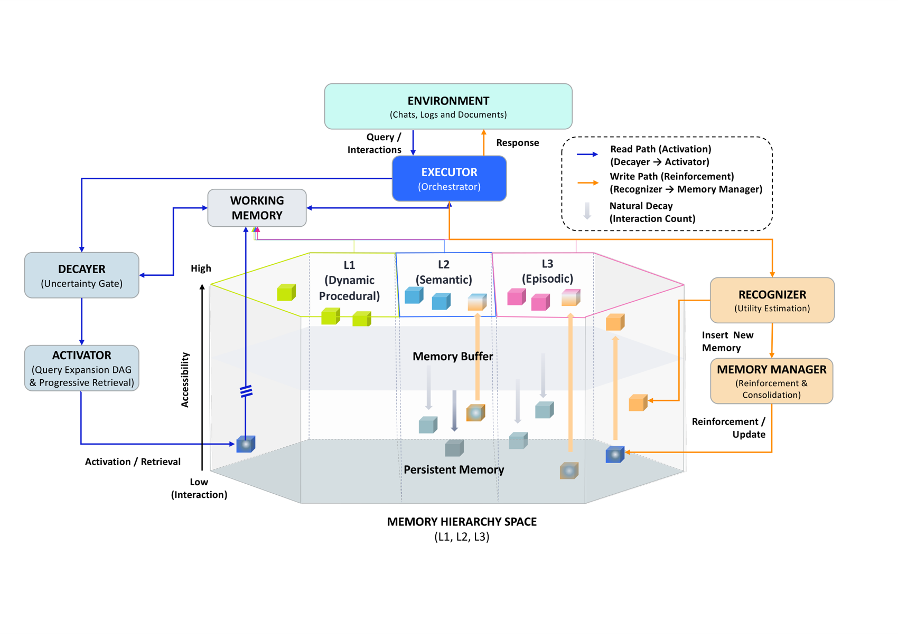

> 图源：Oblivion 论文（来源：2026, arXiv:2604.00131）

**关键结果**：任务相关性排序超越传统全量存储方案，上下文占用减少 **40%** 以上；代码已开源。

**与本章关系**：与本章 4.3 节「遗忘机制」与 FSFM 论文形成互补，从激活值建模角度为记忆管理提供了另一种仿生方案。

---

### [OCR-Memory：用视觉编码突破 Agent 长程记忆的上下文瓶颈（2026）](https://arxiv.org/abs/2604.26622)

> 🧬 **一句话**：把历史轨迹渲染成带视觉标识符的图像，用视觉模态高密度表示突破文本 token 瓶颈，检索时"定位-转录"恢复逐字文本。

**核心问题**：自主 LLM Agent 在长视野交互中需复用扩展历史累积的经验。但现有记忆系统受文本上下文预算根本约束——存或重访原始轨迹 token 极贵，摘要与纯文本检索虽省 token 却换来信息丢失与碎片化证据。

**方法介绍**：OCR-Memory（Optical Context Retrieval Memory）用**视觉模态**作为 agent 经验的高密度表示，以最小开销保留任意长历史——把历史轨迹渲染为附唯一视觉标识符的图像；检索时用"定位-转录"范式，通过视觉锚点选相关区域后直接恢复逐字文本，避免自由式生成减少幻觉。框架概览见下图：

> 图源：OCR-Memory 论文（来源：2026, arXiv:2604.26622，ACL 2026）

**关键结果**：在严格上下文约束下的长程 Agent 基准上取得一致性增益，已被 ACL 2026 主会议接收。

**与本章关系**：直接扩展了本章 4.2 节「外部记忆存储」的技术边界，为超长历史轨迹的高保真检索提供了视觉模态新路径。

---

### [MEMTIER：面向长期自主 AI Agent 的分层记忆架构与检索瓶颈分析（2026）](https://arxiv.org/abs/2605.03675)

> 🧬 **一句话**：诊断长期 Agent 72 小时工具成功率掉 14pp 的四类扁平记忆失效，建三层架构+五信号加权检索+PPO 调权，精度 5%→38.2%。

**核心问题**：长期运行自主 AI Agent 面临已记录的记忆一致性问题——工具执行成功率在 72 小时窗口内退化 14 个百分点，根因是现有扁平文件记忆系统的四类叠加失效模式。

**方法介绍**：MEMTIER 是 OpenClaw agent 运行时的三层记忆架构——结构化**情节 JSONL 存储**、**五信号加权检索引擎**、基于归因的**认知权重更新循环**、把情节事实提升到语义层的**异步巩固守护进程**，并用基于 PPO 的策略框架动态调整检索权重。系统架构见下图：

> 图源：MEMTIER 论文（来源：2026, arXiv:2605.03675）

**关键结果**：在 LongMemEval-S 上精度从 5% 提升至 **38.2%**（+33 个百分点），可在消费级 GPU（6GB 显存）上高效运行；诊断还揭示 PPO 在原始 BM25 主导与识别下失效。

**与本章关系**：与本章 4.3 节「长期记忆架构」和 4.4 节「记忆检索」直接对应，是专门针对长时运行 Agent 记忆衰减问题的系统性解决方案，为生产部署中的记忆持久化提供了实证基础。

---

### [HAGE：强化学习驱动加权图演化的 Agent 记忆动态检索（2026）](https://arxiv.org/abs/2605.09942)

> 🧬 **一句话**：把记忆检索从静态向量查询升级为查询条件化的加权多关系图遍历，每条边带可训练关系特征向量，RL 联合优化路由与边权。

**核心问题**：Agentic LLM 系统的记忆检索常被当静态查询问题——依赖扁平向量搜索或固定二元关系图。但固定图结构无法捕捉事件间关系的强度、置信度与查询相关性的变化。

**方法介绍**：HAGE 是加权多关系记忆框架，把检索重新概念化为在统一关系记忆图上的**顺序、查询条件化遍历**。记忆组织为共享记忆节点上的关系特定图视图，每条边关联一个可训练关系特征向量（编码多种关系），并通过**强化学习联合优化路由行为与边权表示**，实现跨对话的记忆图持续演化。架构概览见下图：

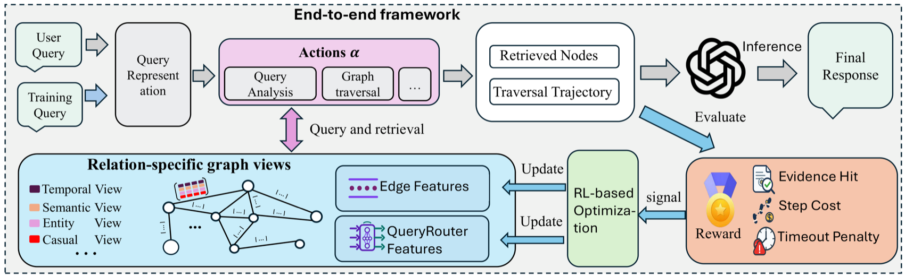

> 图源：HAGE 论文（来源：2026, arXiv:2605.09942）

**关键结果**：在长视野推理基准上，相比 RAG 基线在准确性与检索效率上均显著提升。

**与本章关系**：直接扩展本章 4.2 节「外部记忆存储」与 4.4 节「记忆检索」知识点，是将 RL 引入记忆图演化的最新进展，与 MEMTIER 的分层架构形成互补——前者关注图结构演化，后者关注层次化组织。

---

*返回：[第4章 记忆系统（Memory）](./README.md)*

### [Mem-W：统一隐空间原生记忆 GUI Agent（2026）](https://arxiv.org/abs/2605.09317)

> 🧬 **一句话**：把历史轨迹和当前情节前缀都投影到同一连续隐空间，自蒸馏+结果感知监督端到端训练，免手工记忆分类，最高 +30.0%。

**核心问题**：GUI Agent 开始操作 Web/移动/桌面作为交互世界，成功控制依赖把视觉、程序、任务级证据带过转瞬即逝的当前屏幕。但多数 Agent 把记忆当外部人类可读制品——历史被摘要、分类、检索后以文本/结构化记录重插入，再被 policy 重新编码。这造成记忆存储表示形式与现代 GUI policy 的 latent embedding 序列之间的错配。

**方法介绍**：Mem-W 提出统一隐空间原生记忆——用**可学习轨迹压缩器**把历史轨迹和当前情节前缀都投影到同一连续隐空间，通过自蒸馏和结果感知监督端到端训练，无需任何手工记忆分类。框架见下图：

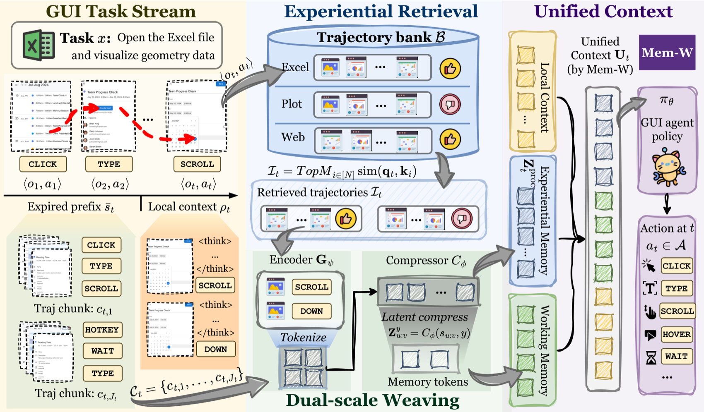

> 图源：Mem-W 论文（来源：2026, arXiv:2605.09317）

**关键结果**：在四个 web/移动导航基准上较主流 GUI Agent 最高提升 **+30.0%**，且随记忆库增长呈现良好扩展性。

**与本章关系**：对应本章 4.2 节"语义记忆与情节记忆"，展示了将两类记忆融合到单一隐空间的端到端学习范式，是记忆系统设计的前沿探索。

---

### [MementoGUI：面向长程 GUI Agent 的多模态记忆控制（2026）](https://arxiv.org/abs/2605.18652)

> 🧬 **一句话**：plug-in 记忆框架 MementoCore 在线选择/压缩/检索界面事件，文本摘要+ROI 级视觉证据入工作记忆，情景记忆检索可复用轨迹，免微调即插即用。

**核心问题**：GUI Agent 在视觉定位和动作预测上进步显著，但在需跨多次界面转换维护任务状态的长程任务上仍脆弱。现有 Agent 靠原始历史回放或纯文本记忆——前者用冗余截图淹没模型，后者丢弃未来决策所需的局部视觉证据。

**方法介绍**：MementoGUI 是 plug-in 记忆框架，为 MLLM GUI Agent 配备 **MementoCore**——一个在线选择、压缩、检索记忆的学习控制器。它不把交互历史当固定上下文，而是把文本摘要与 **ROI 级视觉证据**保存到工作记忆，并通过情景记忆检索可复用历史轨迹；即插即用增强现有 GUI Agent，无需微调骨干。框架见下图：

> 图源：MementoGUI 论文（来源：2026, arXiv:2605.18652）

**关键结果**：作为即插即用模块增强现有 GUI Agent，在长程任务上显著提升状态维持能力。

**与本章关系**：直接对应本章「工作记忆」「情景记忆」和「多模态记忆」知识点，展示了记忆系统如何从纯文本向界面视觉证据和长期操作轨迹扩展。

---

### [MemIR：类型化记忆中间表示——消除长期 Agent 溯源角色崩溃（2026）](https://arxiv.org/abs/2605.25869)

> 🧬 **一句话**：长期记忆存为扁平文本致"溯源角色崩溃"，MemIR 用类型化原子单元严格分离原始证据/检索线索/断言，事实授权仅限有支撑断言。

**核心问题**：长期记忆是持久 LLM Agent 的必需，但主流架构把历史交互存为无结构扁平文本，引发**溯源角色崩溃（source-monitoring errors）**——Agent 无法区分原始证据、检索线索和有证可循的真实断言。

**方法介绍**：MemIR 提出**类型化记忆中间表示（typed memory IR）**，把 source monitoring 操作化为结构约束——把长期记忆写成接地的原子单元，严格分离**原始证据原子、检索提示原子、断言原子**，事实授权仅限于有支撑的断言原子；再用多路由原子投影和溯源域利用，把异构检索结果转化为以断言为中心的候选束。现有方法 vs MemIR 对比见下图：

> 图源：MemIR 论文（来源：2026, arXiv:2605.25869）

**关键结果**：在 LoCoMo 和 BEAM-100K 上，尤其在需溯源追踪、时序定位和碎片化证据整合的任务中一致超越现有记忆基线。

**与本章关系**：对应本章 4.3 节"记忆的组织与检索"，是对长期记忆结构化存储问题的深层诊断与修复，揭示了无结构记忆导致的认知失效模式及其类型化解决方案。

---

### [SE-GA：记忆增强自进化 GUI Agent 框架（2026）](https://arxiv.org/abs/2605.16883)

> 🧬 **一句话**：TTME 推理时动态检索情节/语义/经验三类记忆，MASE 训练管线用 TTME 数据反哺基础策略，形成记忆→训练自进化闭环。

**核心问题**：自主 GUI Agent 常因受限上下文窗口和无法适应动态环境的静态策略在多步任务上挣扎。

**方法介绍**：SE-GA（Self-Evolving GUI Agent）集成层次记忆结构与迭代自改进机制——**TTME（Test-Time Memory Extension）**动态检索情节、语义、经验三类记忆支持长期规划；**MASE 训练管线**把 TTME 收集的数据用于稳定和增强基础策略，形成记忆→训练的持续自进化闭环。框架概览见下图：

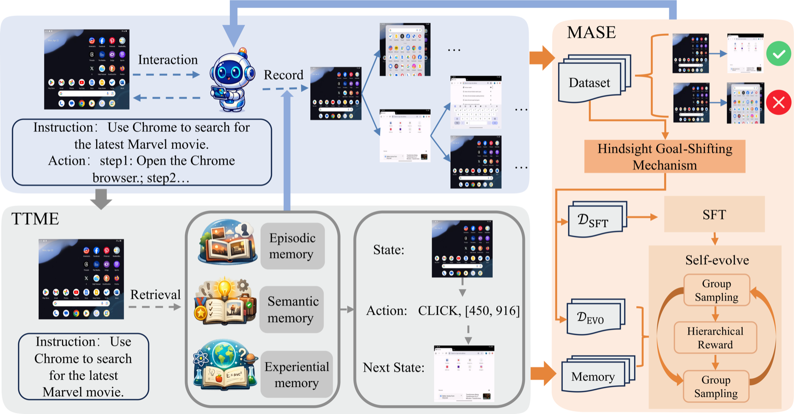

> 图源：SE-GA 论文（来源：2026, arXiv:2605.16883，天津大学&上海交大，ICML 2026）

**关键结果**：ScreenSpot 达 **89.0%**、AndroidControl-High 达 **75.8%**，AndroidWorld 超越所有已知基线。

**与本章关系**：直接对应本章「情节记忆」「语义记忆」和「记忆驱动的在线学习」知识点，是将三类记忆统一组织、与训练管线双向耦合的最新 ICML 旗舰成果，展示了记忆系统如何从被动检索升级为主动自进化的核心驱动力。

---

### [TOKI：LLM Agent 持久化记忆中矛盾解决的双时间算子代数（2026）](https://arxiv.org/abs/2606.06240)

> 🧬 **一句话**：把矛盾解决形式化为写时并发控制，用双时间操作符族给严格隔离前置条件，是唯一同时排除重放不一致/信念漂移/审计擦除的方案。

**核心问题**：LLM Agent 持久化记忆是写密集型系统——每次信念更新产生版本化写入，新声明可能与旧声明矛盾。生产系统常用的四种矛盾解决启发式（最后写入获胜、证据加权合并、等待确认、按规则策略）均未明确隔离级别。

**方法介绍**：TOKI 把矛盾解决形式化为**写时并发控制**，通过**双时间（bitemporal）操作符族**提供严格的隔离前置条件，并用出处注释把失败事实保留在审计行中。理论证明键控日志记录是重放一致性的必要条件。矛盾解决机制见下图：

> 图源：TOKI 论文（来源：2026, arXiv:2606.06240）

**关键结果**：审计行防御把 LoCoMo 提升 **0.86 分**，TOKI 是唯一同时排除重放不一致、信念漂移偏差和审计擦除三类异常的方案。

**与本章关系**：对应本章「记忆的组织与检索」和「长期记忆一致性」知识点，从并发控制角度为持久化记忆的矛盾解决提供了首个完整的形式化理论框架。

---

### [MRAgent：记忆是重建，不是检索——LLM Agent 的图记忆框架（2026）](https://arxiv.org/abs/2606.06036)

> 🧬 **一句话**：Cue-Tag-Content 三层关联图+主动重建机制把 LLM 推理嵌入记忆访问，迭代探索剪枝检索路径，超基线 23%。

**核心问题**：LLM Agent 在长交互历史上推理仍困难。当前记忆增强 Agent 依赖静态"先检索再推理"管线，这种刚性管道设计使其无法在推理中根据中间证据动态调整记忆访问路径。

**方法介绍**：MRAgent 把记忆表示为 **Cue–Tag–Content 图**——关联标签作语义桥梁连接细粒度触发点（Cue）与记忆内容（Content）。其**主动重建机制**把 LLM 推理直接嵌入记忆访问过程，Agent 迭代探索并剪枝检索路径，基于累积证据动态决定哪些记忆相关，同时用图结构约束扩展范围避免组合爆炸。系统架构见下图：

> 图源：MRAgent 论文（来源：2026, arXiv:2606.06036，ICML 2026）

**关键结果**：在 LoCoMo 和 LongMemEval 上超越强基线高达 **23%**，同时降低 token 与运行时成本。

**与本章关系**：对应本章「情节记忆」与「记忆的组织与检索」知识点，从范式层面挑战了现有"检索-推理"分离架构，是将 LLM 推理与记忆访问深度融合的最新 ICML 旗舰成果。

---

### [用户即代码：面向个性化 Agent 的可执行记忆架构（2026）](https://arxiv.org/abs/2606.16707)

> 🧬 **一句话**：把用户记忆存为可执行 Python 代码（状态=类型对象、规则=函数），聚合类问题检索型崩溃 6-43% 而 UaC 达 99%。

**核心问题**：个性化 AI Agent 需要用户模型——跨多次对话累积、每次新对话 consulted。如今这记忆几乎总存为非结构化文本、知识图谱或扁平事实库，用"取最相似条目"consulted。这种"事实袋"能 recall 单个事实，但因"存事实"与"用事实"是分离两步，难解矛盾、聚合多记录或执行逻辑规则。

**方法介绍**：本文论证用户记忆应是**可编程的**。提出 UaC（User as Code）范式——把用户记忆存为**可执行 Python 代码**：用户状态以有类型 Python 对象表示，规则以函数编码，从而把"表示用户"和"对用户推理"统一为解释器可运行的同一介质。两阶段管线：追加日志（永不丢事实）→ 周期性结构化为类型代码。六个记忆系统基准对比见下图：

> 图源：UaC 论文（来源：2026, arXiv:2606.16707）

**关键结果**：聚合类问题（如"去年出了几次国？"）检索型记忆崩溃（**6–43%**），而 UaC 接近满分（**99%**）——因答案只是对类型化状态的一行计算；还能在状态变更时主动触发安全关键提醒（如药物-过敏冲突）。

**与本章关系**：对应本章「结构化记忆」与「记忆的组织与检索」知识点，将记忆范式从"文本相似度检索"提升到"程序化状态计算"，是记忆系统从"存事实"到"可执行推理"的重要范式跳跃。

---

### [Infini Memory：面向长期 LLM Agent 的可维护主题文档记忆（2026）](https://arxiv.org/abs/2606.10677)

> 🧬 **一句话**：以主题结构化文档为记忆单元，新观测暂存缓冲+周期整合，推理时 Agent 迭代工具调用逐步读取，MemoryAgentBench 64.7%。

**核心问题**：长期 LLM Agent 需跨会话追踪变化事实并提供相关证据的持久记忆。现有系统把观测存为孤立记录、摘要或索引片段，使证据聚合、事实修订和记忆维护都困难。

**方法介绍**：Infini Memory 是可维护的文本持久记忆架构，把 agent 记忆视为**主题结构化文档**——每个主题文档作语义单元，收集相关证据、保留元数据并随时间修订事实；新观测先暂存缓冲区，再周期性整合为连贯文本上下文；推理时通过 Agent 迭代工具调用逐步读取记忆而非一次性检索。混合检索变体见下图：

> 图源：Infini Memory 论文（来源：2026, arXiv:2606.10677）

**关键结果**：在 MemoryAgentBench 上取得 **64.7%** 总分，消融表明主题结构化维护与迭代证据检查互补。

**与本章关系**：对应本章「长期记忆维护」与「情节记忆」知识点，提供了继"向量数据库检索"之后的第三种路线——主题文档迭代维护，解决了跨会话事实修订和证据聚合这两个长期记忆的核心工程难题。

---

### [RaMem：基于上下文复原的长期 Agentic 记忆框架（2026）](https://arxiv.org/abs/2606.22844)

> 🧬 **一句话**：诊断"上下文坍塌"——压缩后记忆失去判断适用性的外围情境，用四阶段（证据锚定→条件推断→有效性检索→上下文保留合成）复原，F1 +10%。

**核心问题**：长期记忆对持久 LLM Agent 至关重要。近期系统让过去经验更持久、紧凑、可检索，但检索 alone 不保证记忆为当前查询提供有效证据。当经验被压缩为可复用片段，来自不同情境的记忆可能因实体或用户状态重合而显得同样"相关"——这被称为**上下文坍塌（context collapse）**：记忆失去了判断其是否适用于当前查询所需的外围情境。

**方法介绍**：RaMem 是四阶段框架：①**证据锚定**把每条记忆的原始情节条件（事件时间、提及时间、会话跨度、参与者）显式内嵌；②**召回条件推断**从查询派生必要证据条件；③**有效性感知检索**用条件优先筛选上下文相容记忆，保留内容相关记忆作备选；④**上下文保留合成**在生成阶段维持记忆的结构化上下文。框架概览见下图：

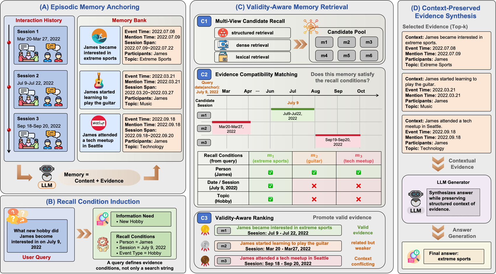

> 图源：RaMem 论文（来源：2026, arXiv:2606.22844）

**关键结果**：在长期记忆基准上，相比强基线平均 F1 **提升超过 10%**。

**与本章关系**：对应本章「记忆检索」与「情节记忆」知识点，直接解决了向量检索框架中的"相似不等于适用"问题，引入了情节锚定这一核心概念，是长期 Agent 记忆可靠性的最新系统性提升。

---

### [AutoMem：将记忆管理作为认知技能自动化学习（2026）](https://arxiv.org/abs/2607.01224)

**发表**：2026 年 7 月 1 日 | [arXiv:2607.01224](https://arxiv.org/abs/2607.01224)

**核心贡献**：AutoMem 把文件系统操作提升为与任务动作并列的一等记忆动作，让模型自主决定何时写入、检索和组织记忆文件。系统包含两个迭代闭环：外循环由强模型审查完整 Agent 轨迹并反复改进记忆结构（提示词、文件模式、动作词汇表）；内循环从海量情节中识别模型自身的优质记忆决策，以此为训练信号直接提升记忆熟练度。在三个程序生成的长时程游戏（Crafter、MiniHack、NetHack）上，仅优化记忆能力就让 32B 开源模型性能提升 2×–4×，达到 Claude Opus 4.5 和 Gemini 3.1 Pro Thinking 的竞争水平。

**与本章关系**：直接对应本章「记忆的写入与更新」和「长期记忆管理」知识点，首次证明记忆管理是可独立学习、高杠杆的认知技能，是 MemGPT 之后将记忆操作内化为模型能力的重要突破。

---

### [A-TMA：长期 Agent 记忆中的状态感知记忆失效解耦（2026）](https://arxiv.org/abs/2607.01935)

**发表**：2026 年 7 月 2 日 | [arXiv:2607.01935](https://arxiv.org/abs/2607.01935)

**核心贡献**：本文定义并系统研究了"幽灵记忆（Ghost Memory）"问题——旧事实、当前事实与过渡事实在记忆库中混存，检索时无法区分时态状态，导致 QA 模型给出误导性回答。A-TMA 提出状态感知叠加层：在检索时为查询构建"证据包"并显式暴露当前/历史/过渡三种标签，同时建立分层评估方法，将记忆库维护、检索、回答时刻的失效各自解耦测量。在新建的冲突稠密基准 LTP 上，Graphiti+ATMA 的冲突准确率相比 Graphiti 绝对提升 0.240，时态 F1 从 0.0295 提升至 0.1705。

**与本章关系**：直接对应本章「长期记忆维护」与「情节记忆」知识点，揭示了向量检索系统普遍存在但被最终准确率掩盖的状态协调失效问题，是继 RaMem（上下文坍塌）之后对长期记忆可靠性的又一系统性诊断与修复。

---

### [Remember When It Matters：面向长时程 Agent 的主动记忆干预机制（2026）](https://arxiv.org/abs/2607.08716)

**发表**：2026 年 7 月 9 日 | [arXiv:2607.08716](https://arxiv.org/abs/2607.08716)

**核心贡献**：本文定义并研究"行为状态衰减（Behavioral State Decay）"问题——长时程任务中，决策相关状态散布在不断增长的轨迹中，任务需求、环境事实、先前尝试和未完成子目标会被埋没或推出上下文窗口，导致在需要时无法影响决策。提出**主动记忆 Agent**：一个独立于动作 Agent 的记忆模块，从近期轨迹更新结构化记忆库，并决定是否注入记忆驱动的提醒或保持沉默。该模块即插即用，无需修改动作 Agent。在 Terminal-Bench 2.0 和 τ2-Bench 上分别提升 pass@1 **+8.3pp** 和 **+6.8pp**。消融实验证明选择性干预优于被动记忆库暴露、持续注入和通用检索。进一步用 SFT+GRPO 训练 Qwen3.5-27B 记忆策略，实现部分迁移。

**与本章关系**：直接对应本章「记忆的检索与使用」与「长期记忆管理」知识点，将记忆从"被动检索"升级为"主动干预"——记忆 Agent 独立于动作 Agent 运行、在关键时刻主动注入信息，是继 AutoMem（记忆作为技能）之后记忆架构分离设计方向的最新实证。

---
