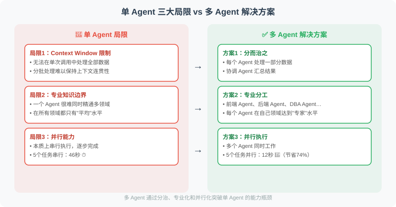

# 16.1 单 Agent 的局限性

> **本节目标**：理解单 Agent 在复杂任务场景下的三大核心限制，掌握何时应该引入多 Agent 架构的判断方法。

---



## 三个核心限制

```python
# 限制1：Context Window 限制
# 单 Agent 的上下文窗口有限（即使 128K Token 也会在复杂任务中耗尽）

# 示例：分析整个代码库
problem = """
任务：分析 50,000 行代码，找出所有安全漏洞

单 Agent 的困境：
- 无法在单次调用中处理全部代码
- 必须分批处理，但如何保持上下文连贯性？
- 不同批次的分析结果如何整合？
"""

# 限制2：专业知识边界
# 一个 Agent 很难同时成为多个领域的专家

# 示例：全栈项目开发
fullstack_task = """
任务：构建一个完整的 Web 应用

需要的专业知识：
- 前端 React/Vue 开发
- 后端 Python/Node.js 开发
- 数据库设计（SQL/NoSQL）
- DevOps/CI-CD 配置
- 安全审计

单 Agent 的问题：一个 Agent 在所有领域都只有"平均"水平
"""

# 限制3：并行能力
# 单 Agent 本质上是串行的，无法真正并行执行

sequential_time = sum([10, 8, 12, 9, 7])  # 单 Agent：46秒
parallel_time = max([10, 8, 12, 9, 7])    # 多 Agent 并行：12秒
print(f"时间节省：{sequential_time - parallel_time} 秒（{(sequential_time-parallel_time)/sequential_time*100:.0f}%）")
```

## 多 Agent 的优势

```python
# 优势展示：并行处理不同模块

import concurrent.futures
import time
from openai import OpenAI

client = OpenAI()

def single_agent_approach(tasks: list[str]) -> list[str]:
    """单 Agent：串行处理"""
    results = []
    for task in tasks:
        # 每次调用需要等待
        response = client.chat.completions.create(
            model="gpt-4.1-mini",
            messages=[{"role": "user", "content": task}],
            max_tokens=100
        )
        results.append(response.choices[0].message.content)
    return results

def multi_agent_approach(tasks: list[str]) -> list[str]:
    """多 Agent：并行处理（每个任务一个独立 Agent）"""
    def process_task(task: str) -> str:
        response = client.chat.completions.create(
            model="gpt-4.1-mini",
            messages=[{"role": "user", "content": task}],
            max_tokens=100
        )
        return response.choices[0].message.content
    
    with concurrent.futures.ThreadPoolExecutor(max_workers=5) as executor:
        results = list(executor.map(process_task, tasks))
    
    return results

# 对比测试
tasks = [
    "用一句话描述Python的特点",
    "用一句话描述JavaScript的特点", 
    "用一句话描述Go语言的特点",
    "用一句话描述Rust语言的特点",
    "用一句话描述Java语言的特点",
]

start = time.time()
single_results = single_agent_approach(tasks)
single_time = time.time() - start

start = time.time()
multi_results = multi_agent_approach(tasks)
multi_time = time.time() - start

print(f"单 Agent 耗时：{single_time:.2f}s")
print(f"多 Agent 耗时：{multi_time:.2f}s")
print(f"加速比：{single_time/multi_time:.1f}x")
```

## 什么时候使用多 Agent？

```python
# 决策函数
def should_use_multi_agent(task: dict) -> bool:
    """判断是否需要多 Agent"""
    
    criteria = {
        "需要并行处理": task.get("parallelizable", False),
        "需要多专业领域": len(task.get("domains", [])) > 2,
        "任务复杂度高": task.get("complexity", 0) > 7,
        "时间敏感": task.get("time_sensitive", False),
        "需要互相验证": task.get("requires_verification", False),
    }
    
    # 满足2个以上条件就考虑多 Agent
    met_criteria = sum(criteria.values())
    
    print("评估结果：")
    for criterion, met in criteria.items():
        print(f"  {'✅' if met else '❌'} {criterion}")
    print(f"满足 {met_criteria} 个条件")
    
    return met_criteria >= 2

# 测试
print(should_use_multi_agent({
    "name": "全栈应用开发",
    "parallelizable": True,
    "domains": ["前端", "后端", "数据库", "安全"],
    "complexity": 9,
    "time_sensitive": True,
    "requires_verification": True
}))
```

---

## 多 Agent 不是银弹

> ⚠️ **重要**：多 Agent 架构引入了新的复杂性，不是所有场景都适合。

### 多 Agent 的代价

```python
"""
多 Agent 系统的隐性成本分析
帮助团队理性决策，而非盲目追求多 Agent
"""

@dataclass
class MultiAgentCost:
    """多 Agent 系统的成本分析"""
    # 通信开销
    communication_rounds: int  # Agent 之间的通信轮次
    tokens_per_round: int      # 每轮通信消耗的 Token 数
    token_cost_per_1k: float   # 每 1K Token 的成本

    # 协调开销
    coordination_latency_ms: float  # 协调决策的额外延迟

    # 质量风险
    information_loss_rate: float    # 通信中的信息丢失率（0-1）
    conflict_probability: float    # Agent 意见冲突的概率（0-1）

    @property
    def communication_cost(self) -> float:
        """通信成本估算"""
        total_tokens = self.communication_rounds * self.tokens_per_round
        return total_tokens / 1000 * self.token_cost_per_1k

    @property
    def quality_risk(self) -> float:
        """质量风险评分（0-1，越低越好）"""
        return self.information_loss_rate * 0.5 + self.conflict_probability * 0.5

    def is_worthwhile(self, single_agent_time_s: float,
                      multi_agent_time_s: float,
                      single_agent_quality: float,
                      multi_agent_quality: float) -> dict:
        """判断多 Agent 是否值得"""
        time_saving = single_agent_time_s - multi_agent_time_s
        time_saving_pct = time_saving / single_agent_time_s * 100
        quality_gain = multi_agent_quality - single_agent_quality

        worthwhile = (
            time_saving_pct > 30  # 时间节省 > 30%
            or quality_gain > 0.15  # 质量提升 > 15%
        ) and self.quality_risk < 0.3  # 质量风险可控

        return {
            "time_saving_pct": round(time_saving_pct, 1),
            "quality_gain": round(quality_gain, 3),
            "communication_cost_usd": round(self.communication_cost, 4),
            "quality_risk": round(self.quality_risk, 3),
            "recommendation": "多 Agent" if worthwhile else "单 Agent",
            "reason": (
                f"节省 {time_saving_pct:.0f}% 时间，"
                f"质量{'提升' if quality_gain > 0 else '下降'} {abs(quality_gain)*100:.1f}%，"
                f"通信成本 ${self.communication_cost:.4f}"
            ),
        }
```

### 单 Agent vs 多 Agent 决策矩阵

| 维度 | 单 Agent 更优 | 多 Agent 更优 |
|------|-------------|-------------|
| **任务复杂度** | 简单任务（< 3 步） | 复杂任务（> 5 步，可分解） |
| **专业领域** | 单一领域 | 3+ 个不同专业领域 |
| **延迟要求** | 无特殊要求 | 需要并行加速 |
| **准确性要求** | 普通要求 | 需要多重验证（医疗/法律/金融） |
| **成本敏感** | 预算有限 | 预算充足（通信开销可承受） |
| **调试复杂度** | 简单直接 | 需要追踪多个 Agent 的交互 |
| **上下文需求** | 单次上下文够用 | 超出 Context Window |

### 渐进式引入策略

```python
"""
从单 Agent 到多 Agent 的渐进式迁移
不要一次性跳到最复杂的多 Agent 架构
"""

class AgentEvolution:
    """Agent 架构渐进式演进路径"""

    @staticmethod
    def stage_1_single_enhanced():
        """阶段1：增强型单 Agent
        在单 Agent 中通过 Prompt Engineering 模拟多角色"""
        system_prompt = """你是一个多功能助手，可以切换以下角色：

        📋 产品分析师：分析需求、编写用户故事
        🏗️ 架构师：设计系统架构、选择技术栈
        💻 开发者：编写代码实现
        🧪 测试工程师：设计测试用例

        当用户提出任务时，按照角色依次处理，每个角色输出后明确标注。
        """
        # 优点：最简单，无需协调
        # 缺点：上下文占用大，角色切换不够专业

    @staticmethod
    def stage_2_sequential_pipeline():
        """阶段2：串行流水线
        多个 Agent 依次处理，前一个的输出是后一个的输入"""
        # 优点：每个 Agent 专注一个环节，质量提升
        # 缺点：无法并行，延迟是各环节之和

    @staticmethod
    def stage_3_parallel_with_supervisor():
        """阶段3：并行 + Supervisor
        Supervisor 分发任务给并行 Agent，汇总结果"""
        # 优点：可并行加速，Supervisor 保证一致性
        # 缺点：Supervisor 成为瓶颈

    @staticmethod
    def stage_4_collaborative():
        """阶段4：协作式多 Agent
        Agent 之间可以自由通信、协商和协作"""
        # 优点：最灵活，适合复杂任务
        # 缺点：通信开销大，调试困难
```

> 💡 **实践建议**：从阶段 1 开始，当单 Agent 的局限性明显影响效果时再升级到阶段 2，以此类推。每升级一个阶段，复杂度大约增加 2-3 倍。

---

## 小结

使用多 Agent 的场景：
- 任务可以并行化（大幅节省时间）
- 需要多个专业领域（角色专业化）
- 任务超出单个 Context Window
- 需要相互验证（提升准确性）

多 Agent 的代价：
- 通信开销（Token 成本、延迟）
- 协调复杂性（冲突解决、一致性保证）
- 调试困难（分布式问题定位）
- 信息丢失（Agent 间传递的上下文截断）

> 📖 **想深入了解多 Agent 系统的学术前沿？** 请阅读 [16.6 论文解读：多 Agent 系统前沿研究](./06_paper_readings.md)，涵盖 MetaGPT、ChatDev、AutoGen、AgentVerse 等核心论文的深度解读。

> 💡 **延伸阅读**：关于多 Agent 系统的专项评估方法（Agent-as-Judge、τ-bench、SWE-bench），详见 [18.6 Agent 专项评估框架](../chapter_evaluation/06_agent_evaluation.md)。

---

*下一节：[16.2 多 Agent 通信模式](./02_communication_patterns.md)*
