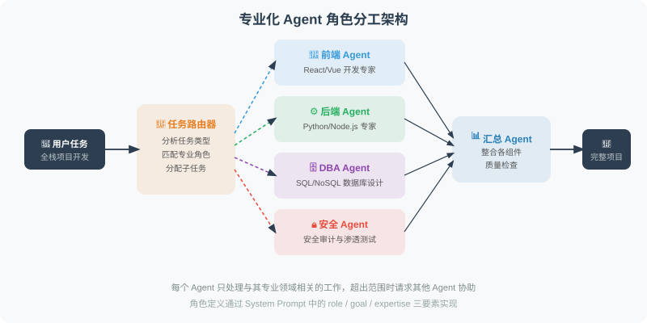

# 16.3 角色分工与任务分配

> **本节目标**：掌握多 Agent 系统中的角色设计原则、任务分配策略，以及动态角色分配的实现方法。

---

高效的多 Agent 系统需要合理的角色分工。好的角色设计让每个 Agent 都能发挥最大价值。



## 专业化 Agent 设计

```python
from openai import OpenAI
from typing import Optional

client = OpenAI()

class SpecializedAgent:
    """专业化 Agent 基类"""
    
    def __init__(self, name: str, role: str, expertise: str):
        self.name = name
        self.role = role
        self.expertise = expertise
        self.system_prompt = f"""你是 {name}，担任{role}角色。
        
你的专业领域：{expertise}

工作要求：
- 只处理与你专业领域直接相关的工作
- 如果任务超出你的专业范围，明确说明并请求其他 Agent 的帮助
- 给出专业、精准的输出
"""
    
    def process(self, task: str, context: str = "") -> str:
        """处理任务"""
        messages = [
            {"role": "system", "content": self.system_prompt}
        ]
        
        if context:
            messages.append({
                "role": "user",
                "content": f"背景信息：{context}\n\n任务：{task}"
            })
        else:
            messages.append({"role": "user", "content": task})
        
        response = client.chat.completions.create(
            model="gpt-4.1",
            messages=messages,
            max_tokens=800
        )
        
        return response.choices[0].message.content


# ============================
# 软件开发团队示例
# ============================

class DevTeam:
    """多 Agent 软件开发团队"""
    
    def __init__(self):
        # 定义各角色 Agent
        self.product_manager = SpecializedAgent(
            name="Alice",
            role="产品经理",
            expertise="需求分析、功能规划、用户故事编写、优先级排序"
        )
        
        self.architect = SpecializedAgent(
            name="Bob",
            role="系统架构师",
            expertise="系统设计、技术选型、架构决策、数据库设计、API设计"
        )
        
        self.developer = SpecializedAgent(
            name="Charlie",
            role="全栈开发工程师",
            expertise="Python后端开发、FastAPI、Django、数据库操作、代码实现"
        )
        
        self.tester = SpecializedAgent(
            name="Diana",
            role="QA工程师",
            expertise="测试用例设计、pytest编写、边界条件测试、安全测试"
        )
        
        self.devops = SpecializedAgent(
            name="Eve",
            role="DevOps工程师",
            expertise="Docker、CI/CD、部署脚本、监控配置"
        )
    
    def develop_feature(self, requirement: str) -> dict:
        """完整的功能开发流程"""
        
        results = {}
        
        print(f"\n{'='*60}")
        print(f"开发需求：{requirement}")
        print('='*60)
        
        # 1. 产品经理：需求分析
        print("\n[Alice - 产品经理] 分析需求...")
        user_stories = self.product_manager.process(
            f"为以下需求编写用户故事和验收标准：{requirement}"
        )
        results["user_stories"] = user_stories
        
        # 2. 架构师：系统设计
        print("\n[Bob - 架构师] 设计系统...")
        architecture = self.architect.process(
            "设计实现方案，包括：技术栈选择、数据结构、API设计",
            context=f"需求文档：{user_stories}"
        )
        results["architecture"] = architecture
        
        # 3. 开发工程师：代码实现
        print("\n[Charlie - 开发] 编写代码...")
        code = self.developer.process(
            "根据设计方案编写 Python 实现代码，包含完整的函数和类",
            context=f"设计方案：{architecture}"
        )
        results["code"] = code
        
        # 4. QA工程师：编写测试
        print("\n[Diana - QA] 编写测试...")
        tests = self.tester.process(
            "为以下代码编写 pytest 测试用例，覆盖正常和边界情况",
            context=f"待测代码：{code[:500]}"
        )
        results["tests"] = tests
        
        # 5. DevOps：部署配置
        print("\n[Eve - DevOps] 准备部署...")
        deployment = self.devops.process(
            "创建 Dockerfile 和 docker-compose.yml",
            context=f"代码：{code[:300]}"
        )
        results["deployment"] = deployment
        
        return results


# 测试
team = DevTeam()
result = team.develop_feature("用户登录接口，支持邮箱+密码登录，返回JWT Token")

print("\n\n=== 开发成果摘要 ===")
for key, value in result.items():
    print(f"\n【{key}】")
    print(value[:200] + "..." if len(value) > 200 else value)
```

## 动态角色分配

```python
class DynamicTaskAllocator:
    """动态任务分配器：根据任务内容自动分配给合适的 Agent"""
    
    def __init__(self, agents: dict[str, SpecializedAgent]):
        self.agents = agents
    
    def allocate(self, task: str) -> str:
        """分析任务，选择最合适的 Agent"""
        agent_descriptions = "\n".join([
            f"- {name}: 专长 {agent.expertise}"
            for name, agent in self.agents.items()
        ])
        
        response = client.chat.completions.create(
            model="gpt-4.1-mini",
            messages=[{
                "role": "user",
                "content": f"""根据任务描述，选择最合适的 Agent。

可用 Agent：
{agent_descriptions}

任务：{task}

只返回 Agent 名称（一个词）："""
            }],
            max_tokens=20
        )
        
        agent_name = response.choices[0].message.content.strip().lower()
        return agent_name
    
    def process(self, task: str) -> str:
        """自动分配并执行任务"""
        agent_name = self.allocate(task)
        agent = self.agents.get(agent_name)
        
        if agent:
            print(f"分配给：{agent.name}（{agent.role}）")
            return agent.process(task)
        else:
            # 找不到精确匹配，用第一个 Agent 处理
            agent = list(self.agents.values())[0]
            return agent.process(task)
```

---

## 角色设计的五大原则

### 1. MECE 原则：互斥且穷尽

```python
"""
MECE（Mutually Exclusive, Collectively Exhaustive）原则
确保角色之间不重叠，且覆盖所有需要的职责
"""

# ❌ 错误示例：角色重叠
bad_roles = {
    "coder": "编写代码和测试",       # 编码和测试混在一起
    "developer": "实现功能和调试",    # 与 coder 职责重叠
    "tester": "测试代码和写文档",     # 测试和文档混在一起
}

# ✅ 正确示例：角色互斥且穷尽
good_roles = {
    "product_manager": {
        "expertise": "需求分析、用户故事、优先级排序",
        "excludes": "不写代码、不做架构决策",
    },
    "architect": {
        "expertise": "系统设计、技术选型、API 设计",
        "excludes": "不写具体实现代码",
    },
    "developer": {
        "expertise": "代码实现、单元测试、代码审查",
        "excludes": "不做架构决策、不做部署",
    },
    "devops": {
        "expertise": "CI/CD、容器化、部署、监控",
        "excludes": "不写业务代码",
    },
}
```

### 2. 最少角色原则

```python
def optimize_roles(task: dict, candidate_roles: list[dict]) -> list[dict]:
    """最少角色原则：用最少角色覆盖所有职责

    每增加一个角色，就增加：
    - 通信开销（N 个角色 = N(N-1)/2 条通信链路）
    - 协调成本（Supervisor 需要管理更多 Agent）
    - 调试复杂度
    """
    # 第一步：识别任务所需的能力
    required_skills = set(task.get("required_skills", []))

    # 第二步：贪心选择——每步选覆盖最多未满足能力的角色
    selected = []
    covered = set()

    while covered != required_skills:
        # 找覆盖最多未满足能力的角色
        best_role = max(
            candidate_roles,
            key=lambda r: len(set(r["skills"]) & (required_skills - covered))
        )
        new_coverage = set(best_role["skills"]) & (required_skills - covered)

        if not new_coverage:
            break  # 无法覆盖更多

        selected.append(best_role)
        covered |= new_coverage

    return selected

# 示例
task = {
    "required_skills": [
        "需求分析", "系统设计", "后端开发",
        "前端开发", "测试", "部署"
    ]
}

candidates = [
    {"name": "全栈开发者", "skills": ["后端开发", "前端开发", "测试"]},
    {"name": "产品架构师", "skills": ["需求分析", "系统设计"]},
    {"name": "DevOps", "skills": ["部署", "测试"]},
    {"name": "项目经理", "skills": ["需求分析"]},
]

optimal = optimize_roles(task, candidates)
print(f"最少需要 {len(optimal)} 个角色：")
for role in optimal:
    print(f"  - {role['name']}")
```

### 3. 明确的输入/输出契约

```python
@dataclass
class RoleContract:
    """角色契约：明确定义输入、输出和质量标准"""
    role_name: str
    inputs: list[str]       # 期望接收什么
    outputs: list[str]      # 必须产出什么
    quality_gates: list[str]  # 质量门禁

# 示例：软件团队的角色契约
contracts = [
    RoleContract(
        role_name="产品经理",
        inputs=["用户需求描述", "业务背景"],
        outputs=["用户故事", "验收标准", "优先级排序"],
        quality_gates=["用户故事可测试", "验收标准明确"],
    ),
    RoleContract(
        role_name="架构师",
        inputs=["用户故事", "非功能性需求"],
        outputs=["系统设计文档", "API 接口定义", "数据模型"],
        quality_gates=["设计满足所有用户故事", "API 定义完整"],
    ),
    RoleContract(
        role_name="开发者",
        inputs=["系统设计文档", "API 接口定义"],
        outputs=["源代码", "单元测试", "代码注释"],
        quality_gates=["测试覆盖率 > 80%", "代码通过 Lint 检查"],
    ),
]
```

### 4. 容错与降级策略

```python
class ResilientTeam:
    """带容错的多 Agent 团队"""

    def __init__(self, primary_roles: dict, backup_roles: dict = None):
        self.primary = primary_roles
        self.backup = backup_roles or {}

    def assign_task(self, task: str, role: str) -> str:
        """分配任务，支持降级"""
        agent = self.primary.get(role)

        try:
            result = agent.process(task)
            # 质量检查
            if self._quality_check(result, role):
                return result
            else:
                print(f"⚠️ {role} 输出质量不达标，尝试降级...")
                return self._fallback(task, role)
        except Exception as e:
            print(f"❌ {role} 执行失败：{e}")
            return self._fallback(task, role)

    def _fallback(self, task: str, role: str) -> str:
        """降级策略"""
        # 策略1：使用备用 Agent
        if role in self.backup:
            print(f"🔄 切换到备用 {role}")
            return self.backup[role].process(task)

        # 策略2：合并到其他角色
        # 例如：架构师挂了，由高级开发者兼任
        merge_map = {
            "architect": "senior_developer",
            "tester": "developer",
        }
        if role in merge_map:
            alt_role = merge_map[role]
            if alt_role in self.primary:
                print(f"🔄 合并 {role} 职责到 {alt_role}")
                return self.primary[alt_role].process(
                    f"[兼任{role}] {task}"
                )

        # 策略3：Supervisor 直接处理
        return self.primary.get("supervisor", list(self.primary.values())[0]).process(task)

    def _quality_check(self, result: str, role: str) -> bool:
        """简单的质量检查"""
        if not result or len(result) < 50:
            return False
        return True
```

### 5. 上下文隔离与共享

```python
class ContextManager:
    """多 Agent 上下文管理：隔离私有上下文，共享必要信息"""

    def __init__(self):
        self.shared_context = {}    # 所有 Agent 共享
        self.private_context = {}   # 每个 Agent 私有

    def update_shared(self, key: str, value: str):
        """更新共享上下文（如项目需求、架构决策）"""
        self.shared_context[key] = value

    def update_private(self, agent_name: str, key: str, value: str):
        """更新私有上下文（如 Agent 的中间状态）"""
        if agent_name not in self.private_context:
            self.private_context[agent_name] = {}
        self.private_context[agent_name][key] = value

    def get_context_for(self, agent_name: str) -> dict:
        """获取 Agent 可见的上下文（共享 + 私有）"""
        return {
            **self.shared_context,
            **self.private_context.get(agent_name, {}),
        }

    def get_handoff_context(self, from_agent: str, to_agent: str,
                            task: str) -> str:
        """生成 Agent 间的上下文交接摘要"""
        from_ctx = self.private_context.get(from_agent, {})
        shared = self.shared_context

        # 只传递与目标 Agent 相关的上下文，而非全部
        summary = f"来自 {from_agent} 的工作交接：\n"
        summary += f"任务：{task}\n"
        summary += f"关键决策：{from_ctx.get('decisions', '无')}\n"
        summary += f"已完成部分：{from_ctx.get('completed', '无')}\n"
        summary += f"待处理：{from_ctx.get('pending', '无')}"

        return summary
```

---

## 小结

角色设计的关键原则：
- **MECE**：角色互斥且穷尽，不重叠不遗漏
- **最少角色**：用最少角色覆盖所有职责（N 个角色 = N(N-1)/2 条通信链路）
- **明确契约**：每个角色的输入/输出/质量标准必须可验证
- **容错降级**：设计备用方案，避免单点故障
- **上下文隔离**：私有上下文不泄漏，共享上下文精简传递

> 💡 **延伸阅读**：关于 Supervisor 模式与去中心化模式的深入对比，详见 [16.4 Supervisor 模式 vs. 去中心化模式](./04_supervisor_vs_decentralized.md)。

---

*下一节：[16.4 Supervisor 模式 vs. 去中心化模式](./04_supervisor_vs_decentralized.md)*
