# 15.6 论文解读：多 Agent 系统前沿研究

> 📖 *"一个人走得快，一群人走得远。多 Agent 系统是 Agent 研究中最活跃的方向。"*  
> *本节深入解读多 Agent 协作领域的核心论文。*

---

## MetaGPT：用 SOP 约束的多 Agent 协作

**论文**：*MetaGPT: Meta Programming for A Multi-Agent Collaborative Framework*  
**作者**：Hong et al.  
**发表**：2023 | ICLR 2024 Oral | [arXiv:2308.00352](https://arxiv.org/abs/2308.00352)

### 核心问题

当多个 Agent 自由地用自然语言交流时，信息传递会出现什么问题？
- **信息丢失**：A 告诉 B 的需求，B 转述给 C 时遗漏了细节
- **理解偏差**：每个 Agent 对同一句话可能有不同理解
- **效率低下**：Agent 之间大量的"闲聊"并不产生有效信息

### 核心洞察

**多 Agent 系统需要 SOP（标准操作流程）来约束协作行为。**

MetaGPT 模拟了一个真实的软件公司，定义了清晰的角色和工作流程：

| 角色 | 输出产物 |
|------|---------|
| 📋 产品经理（Product Manager） | PRD 文档（产品需求文档） |
| 🏗️ 架构师（Architect） | 系统设计文档 + 接口定义 |
| 📅 项目经理（Project Manager） | 任务分配 + 开发计划 |
| 💻 工程师（Engineer） | 代码文件 |
| 🧪 QA 工程师（QA Engineer） | 测试用例 + 测试报告 |

> 📌 各角色依次接力，上游输出是下游输入——**结构化工件传递**是 MetaGPT 的核心创新。

### 关键创新：结构化工件传递

MetaGPT 的 Agent 之间不传递松散的自然语言消息，而是传递**结构化的工件（Artifact）**：

```
❌ 松散的聊天消息：
  产品经理："我们需要做一个天气查询功能，要能查北京的天气，
            界面好看一点，加个图表..."

✅ 结构化的 PRD 文档：
  {
    "产品名": "天气查询系统",
    "功能列表": [
      {"名称": "城市天气查询", "优先级": "P0", "描述": "..."},
      {"名称": "天气趋势图表", "优先级": "P1", "描述": "..."}
    ],
    "技术要求": ["Python 3.10+", "FastAPI", "..."],
    "API 接口": [{...}]
  }
```

### 实验结果

在 SoftwareDev 基准上：
- **MetaGPT 代码执行成功率：87%**
- ChatDev 代码执行成功率：44%
- 成功率的巨大差距主要归因于结构化通信减少了信息丢失

### 对 Agent 开发的启示

1. **结构化通信 > 自然语言通信**：Agent 之间传递结构化数据比自然语言更可靠
2. **SOP 的价值**：定义清晰的工作流程可以避免 Agent 之间的混乱协作
3. **角色化 Prompt**：每个 Agent 的 System Prompt 应该明确定义角色职责和输出格式

---

## ChatDev：聊天链驱动的软件开发

**论文**：*Communicative Agents for Software Development*  
**作者**：Qian et al.  
**发表**：2023 | [arXiv:2307.07924](https://arxiv.org/abs/2307.07924)

### 核心思想

ChatDev 模拟了一个软件公司的组织结构，但采用了与 MetaGPT 不同的通信方式——**聊天链（Chat Chain）**：

> 开发流程被分解为多个阶段：设计阶段 → 编码阶段 → 测试阶段 → 文档阶段
>
> 每个阶段只有两个 Agent 对话：设计阶段 CEO ↔ CTO；编码阶段 CTO ↔ 程序员；测试阶段 程序员 ↔ 测试员；文档阶段 CEO ↔ 程序员

### Inception Prompting

ChatDev 使用了一种称为 **“Inception Prompting（初始提示）”** 的技术来引导每个阶段的对话：

> 在每个聊天阶段开始时，两个 Agent 都会收到：
> 1. 角色描述：“你是 CTO，负责选择技术方案...”
> 2. 阶段目标：“本阶段的目标是确定使用的编程语言和框架”
> 3. 输出格式：“对话结束时，请总结出技术选型方案”
> 4. 前置信息：前一阶段的输出结果

### 与 MetaGPT 的对比

| 维度 | MetaGPT | ChatDev |
|------|---------|---------|
| 通信方式 | 结构化工件（共享消息池） | 双人聊天链 |
| 协作模式 | 发布-订阅 | 两两对话 |
| 优势 | 信息传递更精确 | 设计更简洁直观 |
| 代码成功率 | 87% | 44% |
| 设计理念 | 工程化、流程化 | 社交化、对话化 |

### 对 Agent 开发的启示

ChatDev 的 **"每阶段只有两个 Agent 对话"** 的设计降低了多 Agent 协调的复杂度——N 个 Agent 的全连接通信复杂度是 O(N²)，而两两对话将其降为 O(N)。在实际项目中，如果 Agent 数量不多（< 5个），两两对话可能比复杂的共享状态更容易调试。

---

## AutoGen：可对话 Agent 框架

**论文**：*AutoGen: Enabling Next-Gen LLM Applications via Multi-Agent Conversation*  
**作者**：Wu et al., Microsoft Research  
**发表**：2023 | [arXiv:2308.08155](https://arxiv.org/abs/2308.08155)

### 核心抽象：Conversable Agent

AutoGen 提出了"可对话 Agent（Conversable Agent）"的抽象——每个 Agent 都是一个独立的对话参与者：

```python
# AutoGen 的核心抽象（概念示意）
class ConversableAgent:
    """每个 Agent 都可以与其他 Agent 或人类对话"""
    
    def __init__(self, name, system_message, llm_config):
        self.name = name
        self.system_message = system_message
    
    def generate_reply(self, messages):
        """根据收到的消息生成回复"""
        ...
    
    def receive(self, message, sender):
        """接收来自其他 Agent 或人类的消息"""
        ...
    
    def initiate_chat(self, recipient, message):
        """向另一个 Agent 发起对话"""
        ...
```

### 三种预定义 Agent

```
1. AssistantAgent（AI 助手）
   - 由 LLM 驱动
   - 根据对话历史生成回复

2. UserProxyAgent（用户代理）
   - 代表人类用户
   - 可以执行代码、请求人类输入
   - 是 Human-in-the-Loop 的关键

3. GroupChatManager（群聊管理器）
   - 管理多个 Agent 的群组对话
   - 决定下一个发言的 Agent
```

### Human-in-the-Loop

AutoGen 特别强调人类参与——人类可以随时加入多 Agent 对话，提供反馈或修正方向：

```
Agent A: "我认为应该使用 React 来构建前端..."
Agent B: "同意，React 的生态更成熟..."
Human:   "等一下，我们的项目要求使用 Vue.js，请重新讨论。"
Agent A: "好的，那我们用 Vue 3 + Composition API..."
```

### 对 Agent 开发的启示

1. **灵活的对话模式**：Agent 之间可以一对一、一对多、群聊等多种模式
2. **代码执行能力**：UserProxyAgent 可以在本地执行代码，这对编程任务非常重要
3. **人类参与的重要性**：完全自主的多 Agent 系统可能偏离方向，适时的人类干预很关键

---

## AgentVerse：多 Agent 的涌现行为

**论文**：*AgentVerse: Facilitating Multi-Agent Collaboration and Exploring Emergent Behaviors*  
**作者**：Chen et al.  
**发表**：2023 | [arXiv:2308.10848](https://arxiv.org/abs/2308.10848)

### 核心问题

当多个 Agent 自由交互时，会出现哪些**涌现行为（Emergent Behaviors）**？这些行为是好的还是坏的？

### 发现的涌现行为

```
正面涌现：
✅ 互补增强：不同 Agent 弥补了彼此的知识盲区
✅ 质量提升：多 Agent 讨论后的方案优于任何单个 Agent
✅ 创造性组合：不同观点的碰撞产生了新的解决方案

负面涌现：
❌ 群体极化：多数派的意见被过度放大，少数派被忽视
❌ 社会惰化：有些 Agent 在群组中"搭便车"，不贡献有价值的内容
❌ 信息级联：第一个发言的 Agent 的观点过度影响后续 Agent
```

### 动态角色调整

AgentVerse 提出了一种**动态角色调整机制**：在协作过程中，根据任务需要动态添加或移除 Agent 角色，而不是固定使用预定义的团队配置。

### 对 Agent 开发的启示

1. **注意群体动力学**：多 Agent 系统不仅要设计好个体 Agent，还要关注群体行为
2. **发言顺序很重要**：第一个发言的 Agent 可能过度影响结果——可以引入随机性
3. **独立思考 → 讨论 → 投票**：先让每个 Agent 独立思考，再进行讨论，最后投票决策

---

## Magentic-One：通用多 Agent 系统

**论文/技术报告**：*Magentic-One: A Generalist Multi-Agent System for Solving Complex Tasks*  
**作者**：Fourney et al., Microsoft Research  
**发表**：2024 年 11 月 | [arXiv:2411.04468](https://arxiv.org/abs/2411.04468)

### 核心问题

之前的多 Agent 系统（MetaGPT、ChatDev）大多聚焦于**软件开发**这一特定领域。能否构建一个**通用的**多 Agent 系统，像人类专家团队一样处理各种复杂任务？

### 架构设计

Magentic-One 采用了 **"指挥官 + 专家团"** 架构：

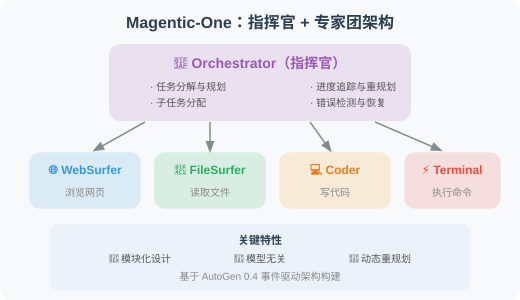

### 实验结果

| 基准 | 任务类型 | Magentic-One 表现 |
|------|---------|------------------|
| GAIA | 通用 AI 助手 | 接近人类水平 |
| AssistantBench | 复杂网页任务 | 当时的 SOTA |
| WebArena | 网页交互 | 竞争力表现 |

### 对 Agent 开发的启示

1. **Orchestrator 模式的有效性**：一个专门的协调 Agent 比"Agent 自由讨论"更可靠
2. **错误恢复是关键**：Magentic-One 约 30% 的成功来自于执行中的动态重规划
3. **基于 AutoGen 构建**：展示了 AutoGen 0.4 事件驱动架构的工程能力

---

## OpenAI Swarm：轻量级多 Agent 编排

**项目**：*Swarm: Educational Framework for Ergonomic, Lightweight Multi-Agent Orchestration*  
**作者**：OpenAI Solutions Team  
**发布**：2024 年 10 月 | [github.com/openai/swarm](https://github.com/openai/swarm)

### 核心理念

与 MetaGPT、AutoGen 等重量级框架不同，Swarm 追求**极简主义**——只用两个核心概念：

```python
# 概念1：Agent = 指令 + 工具
agent_a = Agent(
    name="销售顾问",
    instructions="你是一个友好的销售顾问...",
    functions=[check_inventory, get_price]
)

# 概念2：Handoff = Agent 之间的交接
def transfer_to_support():
    """当用户需要技术支持时，交接给技术支持 Agent"""
    return agent_b  # 返回另一个 Agent 即完成交接

agent_a = Agent(
    name="销售顾问",
    functions=[check_inventory, transfer_to_support]  # handoff 是普通函数
)
```

### 设计哲学

```
重量级框架（AutoGen、CrewAI）：
  - 丰富的抽象（角色、任务、流程）
  - 内置的状态管理和记忆
  - 适合复杂的多 Agent 工作流
  
Swarm 的极简哲学：
  - Agent 就是 instructions + functions
  - Handoff（交接）就是返回另一个 Agent
  - 没有状态管理（无状态，每次调用独立）
  - 适合简单的路由和交接场景
```

### 与 OpenAI Agents SDK 的关系

Swarm 是**教育性质的实验框架**（不建议生产使用），但其核心理念——**Handoff（Agent 交接）和 Routines（例程）**——被继承到了 2025 年发布的 **OpenAI Agents SDK** 中，后者是面向生产环境的正式框架。

### 对 Agent 开发的启示

1. **简单比复杂好**：不是所有场景都需要 AutoGen 或 CrewAI，简单的路由和交接用 Swarm 模式就够了
2. **Handoff 是多 Agent 协作的原语**：Agent 之间的交接可以用普通函数调用实现
3. **OpenAI 的 Agent 方向**：从 Swarm 到 Agents SDK，体现了"极简 + 可组合"的设计理念

---

## 多 Agent 协作综述（2025）

**论文**：*Multi-Agent Collaboration Mechanisms: A Survey of LLMs*  
**作者**：Nguyen et al., University College Cork & 釜山大学  
**发表**：2025 年 1 月 | [arXiv:2501.06322](https://arxiv.org/abs/2501.06322)

### 核心贡献

这是截至 2025 年初最全面的多 Agent 协作机制综述，系统梳理了协作的四大维度：

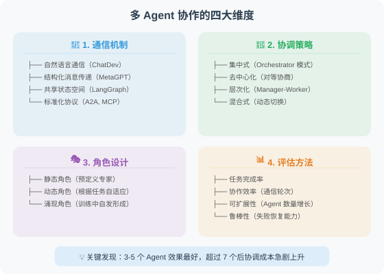

### 关键发现

1. **结构化通信显著优于自然语言通信**：MetaGPT 的成功验证了这一点
2. **Orchestrator 模式在大多数场景下最可靠**：但在创意类任务中，去中心化讨论可能产生更好的结果
3. **Agent 数量存在"甜蜜点"**：通常 3-5 个 Agent 效果最好，超过 7 个后协调成本急剧上升
4. **标准化协议是趋势**：A2A 和 MCP 正在改变 Agent 之间的互操作方式

---

## 综合综述

**论文**：*A Survey on Large Language Model based Autonomous Agents*  
**作者**：Wang et al., 中国人民大学高瓴人工智能学院  
**发表**：2023 | [arXiv:2308.11432](https://arxiv.org/abs/2308.11432)

这是目前最全面的 LLM Agent 综述论文，系统梳理了 Agent 的四大组成部分：

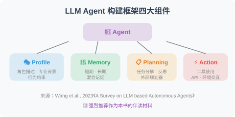

> 💡 **强烈推荐作为本书的伴读材料**，特别是在阅读多 Agent 相关章节时参考。

---

## 论文对比与发展脉络

| 论文 | 年份 | 通信模式 | Agent 数量 | 核心贡献 |
|------|------|---------|-----------|---------|
| MetaGPT | 2023 | 结构化工件 | 5 | SOP + 结构化通信 |
| ChatDev | 2023 | 双人聊天链 | 4-6 | 聊天链分阶段协作 |
| AutoGen | 2023 | 自由对话 | 2+ | 可对话 Agent 抽象 |
| AgentVerse | 2023 | 群组讨论 | 3+ | 涌现行为研究 |
| **Swarm** | **2024** | **Handoff 交接** | **2+** | **极简多 Agent 编排** |
| **Magentic-One** | **2024** | **Orchestrator 指挥** | **5** | **通用多 Agent 系统** |
| **协作综述** | **2025** | **系统分类** | **—** | **四维度协作机制分析** |

**发展脉络**：

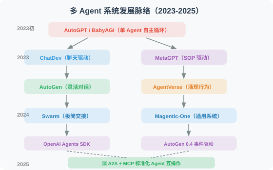

> 💡 **前沿趋势（2025-2026）**：多 Agent 系统正在从"框架竞争"转向"协议标准化"。三大趋势：① **Orchestrator 模式占主导**：Magentic-One 和 OpenAI Agents SDK 都采用了这种"一个协调者 + 多个专家"的架构；② **互操作标准化**：Google 的 A2A 和 Anthropic 的 MCP 协议让不同框架构建的 Agent 可以互相协作（详见第 15 章）；③ **从软件开发向通用场景扩展**：科学研究、商业分析、教育模拟等更广泛的多 Agent 应用正在涌现。


---

## 📰 最新论文速递

> 🗓️ 本节由每日自动更新任务维护，最近更新：**2026 年 7 月 14 日**

### [AgentGate：面向 Agent 互联网的轻量级结构化路由引擎（2026）](https://arxiv.org/abs/2604.06696)

> 🧬 **一句话**：把 Agent 路由从"无约束文本生成"变成"约束决策问题"，分动作决策+结构化实例化两阶段，3B-7B 小模型即可媲美大模型。

**核心问题**：AI Agent 系统正走向"Agent 互联网"——专用 Agent 跨本地设备、边缘节点、私有服务、云平台运作。虽已有 Agent 命名/发现/交互改进，但在延迟、隐私、成本约束下的高效请求分发仍是开放系统问题。

**方法介绍**：AgentGate 是候选感知的 Agent 分发路由引擎，把路由形式化为**约束决策问题**而非无约束文本生成，分解为两阶段：**动作决策**（单 Agent 调用 / 多 Agent 规划 / 直接响应 / 安全升级）+ **结构化实例化**。框架架构见下图：

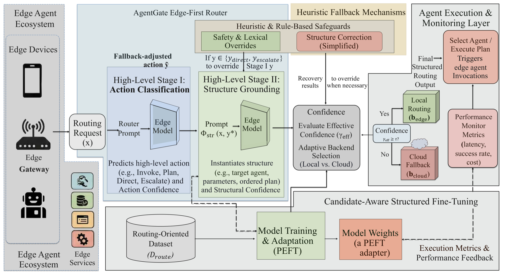

> 图源：AgentGate 论文（来源：2026, arXiv:2604.06696）

**关键结果**：在路由基准上，3B-7B 规模开源模型即可实现与大模型竞争的性能，大幅降低多 Agent 系统编排成本。

**与本章关系**：直接对应本章 16.3 节「Orchestrator 模式」中 Agent 任务分发与路由的工程实现，提供了比手工规则路由更智能的候选感知替代方案。

---

### [ETI：基于心理学维度的多 Agent 显式特征推断协调方法（2026）](https://arxiv.org/abs/2604.19278)

> 🧬 **一句话**：让 Agent 从交互历史推断伙伴的"热情度(信任)"和"能力度(技能)"两维心理特征，据此指导决策，减 45-77% 收益损失。

**核心问题**：LLM 多 Agent 系统在复杂任务上易出现目标漂移、错误级联、行为错位等协调失败，缺乏对合作伙伴特征的建模。

**方法介绍**：ETI（Explicit Trait Inference）是心理学驱动的协调改进方法，让 Agent 从交互历史中推断并追踪伙伴沿两个心理学维度——**热情度（如信任）**与**能力度（如技能）**——的特征，据此指导决策。ETI 改善协调的示意见下图：


> 图源：ETI 论文（来源：2026, arXiv:2604.19278）

**关键结果**：在经济博弈中减少 **45–77%** 收益损失，在 MultiAgentBench 复杂多 Agent 基准上相比 CoT 基线提升 **3–29%**，是首个系统验证 LLM Agent 可从交互历史可靠推断他者特征的工作。

**与本章关系**：对应本章「多 Agent 协调」议题，提供了在无中心调度情况下通过对合作伙伴建模来提升协调鲁棒性的轻量级方案。

---

### [合作特征预测多 Agent LLM 团队科研表现（2026）](https://arxiv.org/abs/2604.20658)

> 🧬 **一句话**：用 6 种行为经济学博弈测 35 个 LLM 的合作倾向，发现"博弈合作度"能可靠预测 AI-for-Science 多 Agent 团队下游表现。

**核心问题**：LLM 团队越来越多用于协作科研推理，需在共享约束（GPU、信用额度）下协调合作。行为经济学提供了隔离不同合作机制的博弈工具，但模型在这些程式化场景的行为能否预测真实协作任务表现，仍是未知。

**方法介绍**：本文在 6 种行为经济学博弈上基准测评 35 个开源 LLM，提取合作特征画像，再考察这些画像能否预测 AI-for-Science 多 Agent 任务（数据分析、建模、科研报告）的下游表现。六博弈的行为画像见下图：

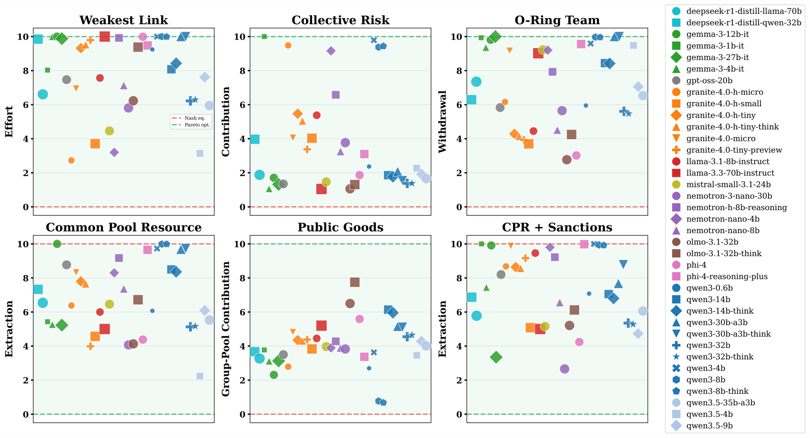

> 图源：该论文（来源：2026, arXiv:2604.20658）

**关键结果**：博弈衍生的合作画像能稳健预测 AI-for-Science 下游表现——在共享预算约束下投资团队乘法效应（而非贪婪策略）的模型产出更高质量科学报告，准确率、质量、完成率均更优；且该合作倾向是独立于通用能力的可测量属性。

**与本章关系**：为本章「多 Agent 协作机制」提供了行为经济学视角的实证依据——选择合适的 LLM 组成团队时，合作倾向是与智能水平同等重要的独立维度，可作为低成本的预部署诊断工具。

---

### [DiffMAS：将 Agent 间通信作为可学习组件的端到端多 Agent 优化（2026）](https://arxiv.org/abs/2604.21794)

> 🧬 **一句话**：把 Agent 间潜在通信（KV Cache 内部表示）当成可学习组件，参数高效监督训练让 Agent 共学如何编码/解读跨交互信息。

**核心问题**：现有多 Agent 系统通常固定 Agent 间的文本通信接口，只优化角色和编排逻辑，通信本身不可学习、不可优化。

**方法介绍**：DiffMAS 把**潜在通信**（通过 KV Cache 等内部表示传递信息）作为可学习组件，对多 Agent 潜在轨迹进行参数高效的监督训练，让 Agent 共同学习如何编码和解读跨交互信息。

**关键结果**：在 AIME24 和 GPQA-Diamond 上分别取得 **26.7%** 和 **20.2%** 的提升，优于单 Agent 推理和基于文本的多 Agent 方案。

**与本章关系**：直接对应本章「Agent 通信协议」知识点，是将多 Agent 通信从"工程约定"升级为"端到端可学习"的前沿探索，对设计下一代高效 Agent 协作框架具有重要参考价值。

---

### [OneManCompany：将多 Agent 系统组织为真实公司的可扩展框架（2026）](https://arxiv.org/abs/2604.22446)

> 🧬 **一句话**：给多 Agent 系统加"组织层"——技能/工具封装成可移植 Talent 身份，人才市场按需招募，E²R 树搜索统合规划/执行/评估。

**核心问题**：单个 Agent 能力已通过模块化技能和工具集成快速进步，但多 Agent 系统仍受固定团队结构、紧耦合协调逻辑、会话内学习所限——缺乏一个原则性的"组织层"来治理 Agent 劳动力的组建、治理与持续改进。

**方法介绍**：OMC 把多 Agent 系统提升到组织层面——把技能、工具、运行时配置封装为可移植的 **Talent 身份**，通过类型化组织接口抽象异构后端；"人才市场"支持按需招募，允许执行期间动态弥补能力缺口；核心决策机制 **E²R（探索-执行-复盘）树搜索**把任务规划、执行、评估整合进单一层次循环，并提供终止与无死锁的形式化保证。组织概览见下图：


> 图源：OneManCompany 论文（来源：2026, arXiv:2604.22446）

**关键结果**：在 PRDBench 上以 **84.67%** 成功率超越当前最优方案 **15.48 个百分点**。

**与本章关系**：与本章「角色分配」和「主从 vs. 去中心化协作」两个核心议题高度对应，OMC 的"人才市场 + E²R 决策循环"为构建可持续自适应的多 Agent 工作流提供了新的架构范式。

---

### [RouteMoA：无需预推理的动态路由，高效驱动多模型混合协作（2026）](https://arxiv.org/abs/2601.18130)

> 🧬 **一句话**：轻量评分器推理前预测粗粒度得分初筛，混合裁判组（自评+互评）后验修正，综合性能/成本/延迟排序，砍 89.8% 成本。

**核心问题**：Mixture-of-Agents（MoA）通过分层协作提升 LLM 表现，但密集拓扑推高成本与延迟。现有方法用 LLM 裁判过滤响应，却仍要求所有模型先推理再判——没能有效砍成本；也缺模型选择标准，面对大模型池时全量推理昂贵且可能超上下文。

**方法介绍**：RouteMoA 用轻量级**评分器**在推理前预测各模型粗粒度得分完成初筛，把候选缩到高潜力子集而无需推理；再用**混合裁判组**（自评+互评）后验修正；最后综合性能、成本、延迟三要素最终排序。架构见下图：

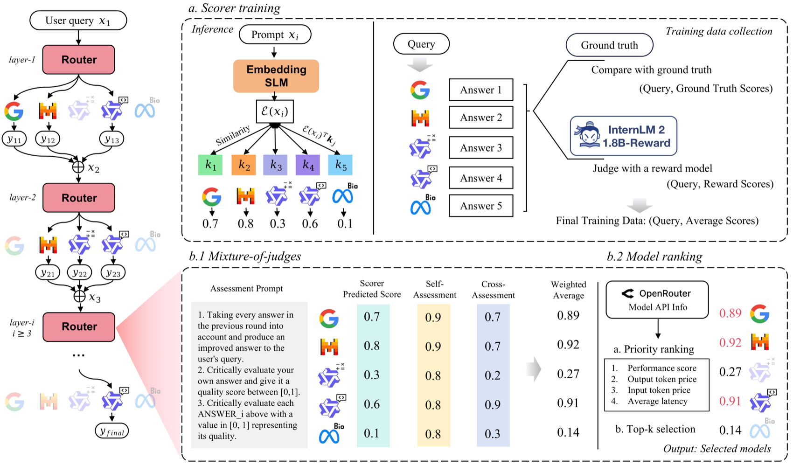

> 图源：RouteMoA 论文（来源：2026, arXiv:2601.18130）

**关键结果**：在大规模模型池场景下，相比标准 MoA 降低成本 **89.8%**、延迟降低 **63.6%**，同时保持任务性能提升。

**与本章关系**：直接对应本章 Mixture-of-Agents 协作模式中"如何高效路由与选模"的核心问题，是对现有 MoA 框架的实用化改进方案。

---

*返回：[第15章 多 Agent 协作](./README.md)*

### [基于编排轨迹的 LLM 多 Agent 系统强化学习（2026）](https://arxiv.org/abs/2605.02801)

> 🧬 **一句话**：用时序交互图的 trace view 统一审计多 Agent RL——把优化对象从单 Agent 动作扩到 spawn/委托/通信/聚合/终止等编排行为。

**核心问题**：LLM Agent 正从孤立工具用户进化成协作团队，RL 不仅要优化个体动作，还要优化工作如何被 spawn、委托、通信、聚合和终止——但现有 RL 范式只盯单 Agent 动作序列，忽视"编排行为"。

**方法介绍**：本文用时序交互图（trace view）研究多 Agent 系统 RL：事件包括子 Agent spawn、委托、通信、工具使用、返回、聚合、停止决策。trace view 为审计奖励设计、信用与信号分配、编排学习提供公共单元，并识别三条技术轴：奖励设计分八族（编排奖励针对并行加速、拆分正确性等系统级属性）、信用分配、编排学习。以编排轨迹为训练信号，用 RL 同步优化单 Agent 行为与跨 Agent 协作结构。

**关键结果**：在层次化多 Agent 任务上显著优于基于规则的编排方案，系统能学会何时分派子任务、如何聚合结果。

**与本章关系**：对应本章多 Agent 协作模式与任务分配章节，是将 RL 引入多 Agent 编排层的重要新方向。

---

### [MASPO：面向 LLM 多 Agent 系统的联合提示优化（2026）](https://arxiv.org/abs/2605.06623)

> 🧬 **一句话**：联合提示优化——评估每个 Agent 的 Prompt 不只看本地表现，还看能否促成下游 Agent 成功，用进化集束搜索导航高维 Prompt 空间。

**核心问题**：LLM 多 Agent 系统中各 Agent 由角色专属 Prompt 驱动，Prompt 质量关键。但孤立优化单 Agent Prompt 会导致局部目标与系统整体目标错位，联合优化跨交互 Agent 的 Prompt 是非平凡挑战。

**方法介绍**：MASPO 自动迭代精炼全系统 Prompt，核心创新是**联合评估机制**——评估 Prompt 不只看本地有效性，还看其促成下游成功的能力；通过数据驱动的**进化集束搜索**在高维 Prompt 空间高效导航，无需人工标注。

**关键结果**：在 6 类多 Agent 任务中平均准确率提升 **2.9%**，已被 ICML 2026 接收。

**与本章关系**：对应本章「多 Agent 协作设计」中的 Prompt 工程与 Agent 角色分配议题，是将多 Agent 系统作为整体进行端到端 Prompt 优化的前沿方向。

---

### [拜占庭容错的鲁棒多 Agent LLM 系统（2026）](https://arxiv.org/abs/2605.09076)

> 🧬 **一句话**：自锚定共识（SAC）协议——Agent 迭代交换响应、本地过滤不可靠信息并优化输出，无需中心协调器即抵御拜占庭故障。

**核心问题**：对等网络中分散式多 Agent LLM 系统在拜占庭故障（恶意节点）下的鲁棒性缺乏保障，现有方法依赖中心协调器，难以在去中心化场景下抵御干扰。

**方法介绍**：提出**自锚定共识（SAC）协议**——Agent 通过迭代交换响应、本地过滤不可靠信息并优化输出，无需中心协调器即可抵御恶意节点干扰；用图论条件保证诚实 Agent 在多数节点被攻击时仍能达成可靠共识。SAC 机制见下图：

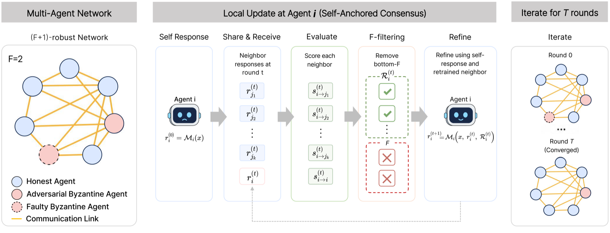

> 图源：该论文（来源：2026, arXiv:2605.09076）

**关键结果**：在数学推理和常识推理任务上显著优于现有方法，即便多数节点被攻击仍能维持可靠共识。

**与本章关系**：对应本章多 Agent 系统可靠性与容错设计知识点，是去中心化 Agent 网络面对恶意或故障节点时的安全协调机制，为生产级多 Agent 系统的鲁棒性建设提供了理论与实践基础。

---

### [MetaAgent-X：端到端强化学习突破自动多 Agent 系统的执行天花板（2026）](https://arxiv.org/abs/2605.14212)

> 🧬 **一句话**：端到端 RL 联合训练 Designer（生成 MAS 结构）和 Executor（执行任务），用 GRPO 分别信用分配+阶段式共演化，破"冻结执行者天花板"。

**核心问题**：自动多 Agent 系统旨在无需人工编排即可实例化工作流，但现有方法只部分自适应——要么做无训练的测试时搜索，要么优化元级设计器却冻结下游执行 Agent，造成"冻结执行者天花板"，端到端训练自设计自执行的 agentic 模型未被探索。

**方法介绍**：MetaAgent-X 是端到端 RL 框架，联合优化自动 MAS 设计与执行——支持基于脚本的 MAS 生成、执行 rollout 收集，并对设计与执行两类轨迹分别用 GRPO 分配信用；引入**阶段式共演化**策略确保训练稳定性。端到端 pipeline 见下图：

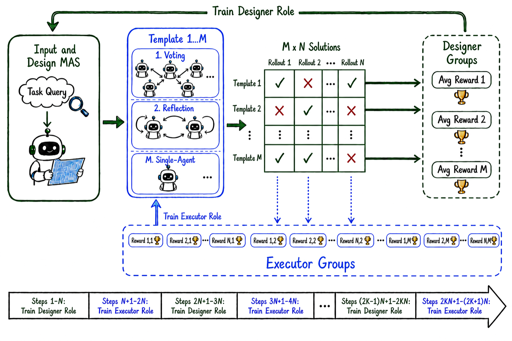

> 图源：MetaAgent-X 论文（来源：2026, arXiv:2605.14212）

**关键结果**：在多个基准上实现最高 **21.7%** 的性能提升。

**与本章关系**：直接对应本章第 16.3 节"多 Agent 系统的优化与学习"，展示了用端到端强化学习联合优化 Agent 架构设计与执行的最新范式。

---

### [DecentMem：去中心化双池记忆驱动的自进化多 Agent 系统（2026）](https://arxiv.org/abs/2605.22721)

> 🧬 **一句话**：每个 Agent 独立维护双池本地记忆（利用池+探索池），分阶段 LLM-as-judge 动态重加权，理论保证全局可达性、遗憾 O(log T)。

**核心问题**：自进化多 Agent 系统以持久记忆为根基，但现有设计几乎清一色采用跨 Agent 共享的集中式记忆库，带来通信与协调开销、隐私风险，并使 Agent 趋同化、丧失多样性。

**方法介绍**：DecentMem 让每个 Agent 维护自己的**双池记忆**——**利用池**（存储固化历史轨迹）与**探索池**（LLM 生成的未见情境候选），两池基于分阶段 LLM-as-judge 反馈在线重加权。理论上证明该设计保证全局可达性且累积遗憾达 O(log T)。集中式 vs 去中心化双池对比见下图：


> 图源：DecentMem 论文（来源：2026, arXiv:2605.22721）

**关键结果**：跨 AutoGen、DyLAN、AgentNet 三大 MAS 框架及 Qwen3/Gemma4 多骨干，准确率最高提升 **23.8%**，token 用量最多降低 **49%**。

**与本章关系**：对应本章"多 Agent 记忆与自我进化"知识点，是去中心化记忆架构替代集中式共享记忆的最新理论与实证方案，为生产级 MAS 的隐私保护与效率提升提供了新思路。

---

### [HyLaT：混合隐-文通信协议——多 Agent 系统通信效率革新（2026）](https://arxiv.org/abs/2605.25421)

> 🧬 **一句话**：隐空间通道传精细认知信号提效，自然语言通道传简明关键信号保可解释，两阶段训练协同，破通信三角困境。

**核心问题**：多 Agent 通信协议设计是核心挑战。单通道方法面临**通信三角困境**：文本法可解释但冗长，隐空间法高效但不透明且仅支持单向工作流。

**方法介绍**：HyLaT 受多信道通信理论启发，提出混合隐-文协议——通过**隐空间信道**传输精细认知信号（高效），用**自然语言**表达简明关键信号（保可解释与精度）。配套两阶段训练：单 Agent 混合生成学习 + 多 Agent 交互协同训练。与现有协议对比如下图：


> 图源：HyLaT 论文（来源：2026, arXiv:2605.25421）

**关键结果**：显著降低通信开销的同时保持任务性能，在多样化设置下展现强泛化能力。

**与本章关系**：对应本章多 Agent 通信机制设计，是"语言通信 vs 隐空间通信"这一核心矛盾的最新融合方案，填补了现有双通道通信理论在 LLM 多 Agent 系统中的空白。

---

### [统一时间与结构信用分配——LLM 多 Agent 提示优化新范式（2026）](https://arxiv.org/abs/2605.30227)

> 🧬 **一句话**：沿时间轴(轮级信用)+结构轴(角色级信用)双轴分解多 Agent 轨迹归因，用"语言化块坐标下降"交替优化角色提示与聚合协议。

**核心问题**：LLM 多 Agent 系统可结合多角色视角解复杂推理，但难调试难优化——不同轮次与角色贡献不均，少数弱组件会主导整体失败。

**方法介绍**：本文对完成的多 Agent 轨迹做归因：**时间上**分配轮级信用识别决策关键阶段与性能瓶颈；**结构上**分配角色级信用量化哪些 Agent 提供决定性信息、哪些冗余或误导。基于这些信用信号，引入信用引导的提示优化流程，选择性精炼弱环节。流程概览见下图：

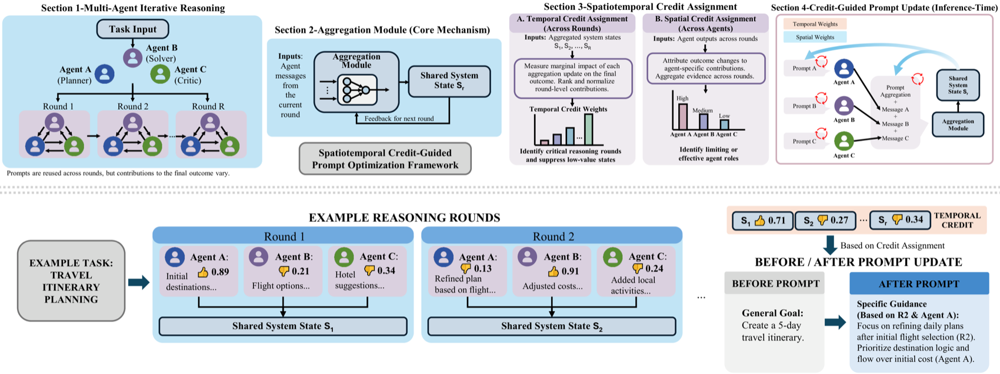

> 图源：该论文（来源：2026, arXiv:2605.30227）

**关键结果**：在多个推理基准上显著降低查询复杂度的同时提升整体性能。

**与本章关系**：直接对应本章多 Agent 系统优化与协作设计知识点，是首个将时间信用+结构信用双轴分解引入 LLM-MAS 提示优化的工作，为自改进多 Agent 系统提供了原则性、可解释的优化路径。

---

### [MOC：基于大语言模型的多 Agent 系统多阶通信机制（2026）](https://arxiv.org/abs/2606.02359)

> 🧬 **一句话**：把 Agent 间通信从"一阶邻居直接拼接"重构为捕获多跳依赖的结构化多阶证据流，配语义-拓扑合并算法控 token。

**核心问题**：MAS 研究多聚焦拓扑优化，对"消息如何在 Agent 间有效传输"研究不足。现有方案直接拼接一阶邻居响应，导致证据接收域受限、多跳路径上的关键洞察被稀释。

**方法介绍**：MOC（Multi-Order Communication）重构 Agent 间通信以捕获多跳依赖，并引入结构化消息合并策略保效率——形式化通信为多阶证据流，用**语义-拓扑合并算法**（Semantic-Topological Merging）在 token 约束下优化语义保真度。多阶通信概览见下图：

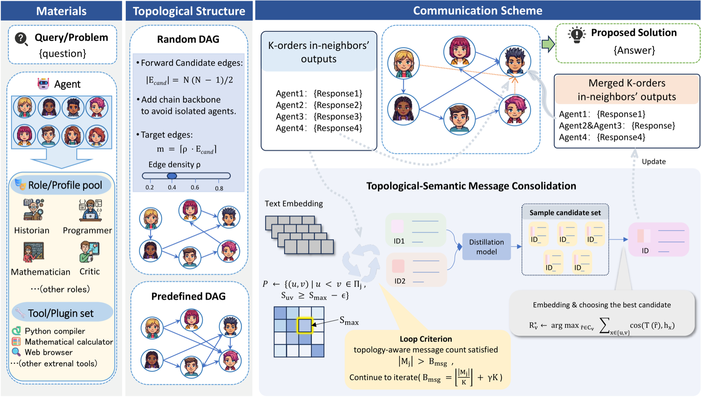

> 图源：MOC 论文（来源：2026, arXiv:2606.02359）

**关键结果**：在六个数据集、多种规模 LLM 骨干上持续提升任务性能并降低通信成本。

**与本章关系**：对应本章「多 Agent 通信与信息传递」知识点，是对"信息在 Agent 图中如何跨多跳有效传播"这一核心挑战的最新实证突破，直接揭示了拓扑设计之外通信协议设计的重要性。

---

### [CCKS：基于共识的多 Agent 通信与知识共享框架（2026）](https://arxiv.org/abs/2606.12281)

> 🧬 **一句话**：用对比学习从局部观测构建共识模型，让 Agent 评估教师建议的适用性而非无条件接受，即插即用集成 DTDE。

**核心问题**：去中心化训练-去中心化执行（DTDE）的协作 MARL 中，基于行动建议的知识共享能促进可解释的可扩展合作，但现有方法过度遵循教师指导而不评估师生兼容性，导致过度建议、稳定性次优、性能退化。

**方法介绍**：CCKS（Consensus-based Communication and Knowledge Sharing）引入共识约束——Agent 基于共识衍生约束采纳建议，更智能地遵循教师指令：通过对比学习从局部观测构建共识模型，据此评估建议适用性而非无条件接受，在保留探索能力的同时吸收有益经验。设计为即插即用模块，可无缝集成任意 DTDE 算法。

**关键结果**：在 Google Research Football 和 StarCraft II 多 Agent 挑战（SMAC）中显著提升协作效率与学习速度。

**与本章关系**：对应本章「多 Agent 协作机制」与「知识共享」知识点，是对教师-学生型知识传递中"共识筛选"这一关键设计问题的最新系统性解答，为去中心化多 Agent 系统的自主协作提供了可扩展基础。

---

### [DeLM：去中心化语言模型——共享上下文的无中心化 Multi-Agent 框架（2026）](https://arxiv.org/abs/2606.10662)

> 🧬 **一句话**：并行 Agent 异步领取任务队列、共享已验证上下文作通信基底、紧凑验证更新写回，三要素去中心化，砍 50% 成本。

**核心问题**：MAS 可在测试时通过把复杂问题分解为并行子任务扩展 LLM 推理，但多数依赖中心化编排——主控 Agent 分配、收集、合并，随子任务增长成为通信与集成瓶颈。

**方法介绍**：DeLM（斯坦福，Azalia Mirhoseini 团队）通过三要素去中心化：**并行 Agent** 异步领取任务队列中的子任务；**共享已验证上下文**（Shared Verified Context）作为通信基底；Agent 完成本地推理后把**紧凑验证更新**写回共享上下文，无需经中心控制器。共享上下文充当公共通信基底。框架概览见下图：


> 图源：DeLM 论文（来源：2026, arXiv:2606.10662，斯坦福）

**关键结果**：在 SWE-bench Verified 上取得最优 Pass@1/Pass@2/Pass@4，成本节省约 **50%**；在 LongBench-v2 多文档问答上超越最强基线高达 **5.7 个百分点**。

**与本章关系**：对应本章「多 Agent 编排模式」与「去中心化协作」知识点，是将"黑板架构"思想引入 LLM 多 Agent 系统的最新实证成果，直接挑战了以中心控制器为核心的主流编排范式。

---

### [Skill-MAS：进化式元技能驱动的自动多 Agent 系统（2026）](https://arxiv.org/abs/2606.18837)

> 🧬 **一句话**：第三条路——把高层编排能力概念化为可进化"元技能"，解耦经验留存与参数更新，让 MAS 不改 LLM 权重也能持续自改进。

**核心问题**：自动 MAS 生成面临"能力-经验"两难：推理时 MAS 充分利用冻结前沿 LLM，但重复相同搜索不学习；训练时 MAS 通过梯度更新内化经验，却受小模型能力天花板限制且难扩展到大模型。

**方法介绍**：Skill-MAS 提出第三条路径——把高层编排能力概念化为可进化的**元技能（Meta-Skill）**，解耦经验留存与参数更新。闭合优化循环：①多轨迹 rollout 为每任务采样行为分布；②选择性反思自适应选取优先任务，做层次对比分析，把系统性经验蒸馏为可泛化的策略级原则。MAS 范式对比如下图：

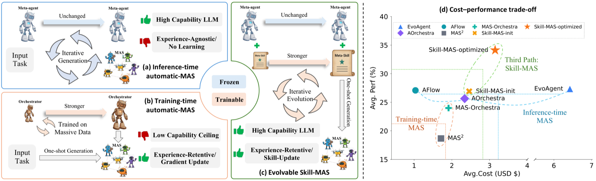

> 图源：Skill-MAS 论文（来源：2026, arXiv:2606.18837）

**关键结果**：在四个复杂基准和四个 LLM 上实现显著性能增益，演化后的元技能在未见任务和不同 LLM 间均表现强迁移性。

**与本章关系**：对应本章「多 Agent 学习与自我优化」知识点，是将 Skill Learning 与 MAS 编排结合的最新成果——元技能使 MAS 能够在不修改 LLM 参数的前提下实现持续自我改进，与 DeLM（去中心化通信）、CCKS（知识共享）一起构成当前多 Agent 协作演进方向的完整图谱。

---

### [WebSwarm：面向深度-广度网络搜索的递归多 Agent 编排框架（2026）](https://arxiv.org/abs/2607.08662)

**发表**：2026 年 7 月 9 日 | [arXiv:2607.08662](https://arxiv.org/abs/2607.08662)

**核心贡献**：单个 ReAct 式搜索 Agent 受限于单一长轨迹和有限上下文，难以同时处理搜索深度和覆盖广度。WebSwarm 提出**渐进递归委派框架**：在推理时联合构建任务分解、递归扩展和 Agent 协作。每个搜索节点将局部目标与搜索模式耦合，可自行解决目标或进一步委派子节点；解决后向上返回证据和结果，使父节点能进一步扩展、修订或聚合。WebSwarm 首先探测任务相关信息在网上的组织方式以引导后续节点扩展，并在同质兄弟节点间复用过程级经验。在 BrowseComp-Plus、WideSearch、DeepWideSearch 和 GISA 四个基准上一致超越单 Agent 和多 Agent 基线。

**与本章关系**：对应本章「多 Agent 协作架构」与「任务分解与委派」知识点，WebSwarm 的递归委派机制将多 Agent 搜索从"并行执行 + 聚合"升级为"递归深度扩展 + 证据驱动协作"，是 ReAct 单 Agent 向递归多 Agent 搜索系统演进的最新框架。

---

## 📝 本章练习

读完本章，先合上书用自己的话回答下面的问题，再展开参考答案对照。

**练习 1（概念）**：本章开篇指出单 Agent 有三大核心局限，因此需要引入多 Agent；但本章又强调"多 Agent 不是银弹"。请说出单 Agent 的三大局限分别是什么，并解释多 Agent 架构相应付出了哪些代价。最后给出一个判断："什么情况下你会坚持用单 Agent，而不是上多 Agent？"

<details>
<summary>参考答案</summary>

**单 Agent 的三大核心局限：**
1. **上下文窗口限制**：单 Agent 的 Context Window 有限（即使 128K Token，在分析 5 万行代码这类任务里也会耗尽），无法在一次调用里装下所有信息，分批处理又难以保持连贯性。
2. **专业知识边界**：一个 Agent 很难同时是多个领域的专家。做全栈项目要同时懂前端、后端、数据库、DevOps、安全——单 Agent 在每个领域都只有"平均水平"。
3. **并行能力缺失**：单 Agent 本质是串行的。5 个子任务串行做要 46 秒，5 个 Agent 并行只要 12 秒（取决于最慢的那个）。

**多 Agent 付出的代价：**
- **通信开销**：Agent 之间来回传消息要消耗大量 Token，直接推高成本和延迟。
- **协调复杂性**：要处理意见冲突、保证一致性，还可能死锁。
- **调试困难**：变成分布式问题，要追踪多个 Agent 的交互才能定位错误。
- **信息丢失**：Agent 间传递上下文时可能被截断或误解，错误会层层累积。

**什么时候坚持单 Agent？**
当任务**简单（< 3 步）、只涉及单一领域、上下文够用、对准确性没有"多重验证"的强需求**时，应坚持单 Agent。本章给的决策标准是"满足 2 个以上多 Agent 条件（可并行/多领域/高复杂度/时间敏感/需互相验证）才考虑多 Agent"。如果只满足 0–1 个，多 Agent 带来的通信、协调、调试成本会超过收益——这时多 Agent 反而是负担。一句话：**多 Agent 的复杂度每升一级大约翻 2-3 倍，没必要就不要上。**

</details>

**练习 2（辨析）**：MetaGPT 论文有一个反直觉的发现——它在 SoftwareDev 基准上代码执行成功率达 87%，而 ChatDev 只有 44%。本章把这归因于"结构化通信"。有同学说："Agent 之间用自然语言自由聊天最灵活，信息也最全，应该效果最好才对。" 请用 MetaGPT 的洞察反驳这个说法，并解释"结构化工件传递"为什么更可靠。

<details>
<summary>参考答案</summary>

**这个说法恰好搞反了——"自由聊天最灵活"在多 Agent 协作里往往是灾难的根源。**

MetaGPT 论文的核心洞察是：**当多个 Agent 自由地用自然语言交流时，会出现三类问题**：
1. **信息丢失**：A 把需求告诉 B，B 再转述给 C 时，细节一层层漏掉。
2. **理解偏差**：同一句自然语言，每个 Agent 的理解可能不同。
3. **效率低下**：大量"闲聊"不产生有效信息，还污染上下文。

自然语言看似"信息最全"，实际上它**模糊、有歧义、不可校验**。比如产品经理说"做个天气查询，界面好看点，加个图表"——"好看""图表"到底指什么？下游工程师只能猜，猜错就返工。

**为什么"结构化工件传递"更可靠？**
MetaGPT 让 Agent 之间不传松散的聊天消息，而是传**结构化工件（Artifact）**：产品经理产出标准 PRD 文档（JSON：功能列表、优先级、技术要求、API 接口），架构师产出系统设计文档和接口定义，工程师产出代码文件……每个角色的输出有**固定 schema**，下游 Agent 拿到的是确定的、可校验的字段，而不是需要"理解"的一段话。这样：
- 信息不会在转述中丢失（字段是结构化的，不靠转述）；
- 没有歧义（优先级是 "P0" 就是 P0，不是"挺重要的"）；
- 可校验（缺字段一眼能看出来）。

这就是为什么 87% vs 44% 的巨大差距主要来自"结构化通信减少了信息丢失"。本章 16.2 节的设计启发也呼应这点：**让 Agent 之间传递结构化中间产物（JSON、代码、文档）比传递自然语言消息更可靠。** 灵活性要让位于可靠性。

</details>

**练习 3（动手）**：请用 LangGraph 的"共享状态"通信模式，设计一个三 Agent 协作流水线：研究员（researcher）→ 写作员（writer）→ 编辑（editor），各 Agent 通过修改共享 State 来传递信息。请写出 State 定义和图（graph）的搭建代码，并解释：(1) 为什么 `research_notes` / `drafts` 这些字段要用 `Annotated[list, operator.add]`？(2) 相比"消息队列"和"直接调用"，共享状态模式在生产环境最大的优势是什么？

<details>
<summary>参考答案</summary>

核心：用一个 `TypedDict` 当"团队共享文档"，每个节点读它、改它，再用有向边把三个节点串成流水线。

```python
from typing import TypedDict, Annotated, Optional
from langgraph.graph import StateGraph, START, END
import operator

# ── 共享状态定义 ───────────────────────────────────────
class TeamState(TypedDict):
    task: str
    research_notes: Annotated[list, operator.add]  # 可追加
    drafts: Annotated[list, operator.add]          # 可追加
    final_output: Optional[str]

# ── 三个节点：每个都"读 State、改 State" ───────────────
def researcher(state: TeamState) -> dict:
    # 读 task，产出研究笔记
    notes = f"关于「{state['task']}」的 3 个研究要点：..."
    return {"research_notes": [notes]}

def writer(state: TeamState) -> dict:
    # 读研究笔记，产出草稿
    context = "\n".join(state.get("research_notes", []))
    draft = f"基于研究写成的文章：{context[:50]}..."
    return {"drafts": [draft]}

def editor(state: TeamState) -> dict:
    # 读最新草稿，产出终稿
    latest = state.get("drafts", [""])[-1]
    return {"final_output": f"【已审核】{latest}"}

# ── 搭建流水线图 ───────────────────────────────────────
g = StateGraph(TeamState)
g.add_node("researcher", researcher)
g.add_node("writer", writer)
g.add_node("editor", editor)
g.add_edge(START, "researcher")
g.add_edge("researcher", "writer")
g.add_edge("writer", "editor")
g.add_edge("editor", END)

app = g.compile()

result = app.invoke({
    "task": "Python 装饰器的应用",
    "research_notes": [],
    "drafts": [],
    "final_output": None,
})
print(result["final_output"])
```

**(1) 为什么用 `Annotated[list, operator.add]`？**
这是 LangGraph 的 **reducer（归并函数）** 机制。普通字段在节点返回时是"覆盖"——后写的把先前的冲掉。但 `research_notes`、`drafts` 这类字段我们希望是"**追加**"而不是"覆盖"：多个节点（甚至同一节点多次运行）产出的内容应该累积保留，而不是互相覆盖丢失。`Annotated[list, operator.add]` 告诉 LangGraph：当有新值写入这个字段时，用 `operator.add`（列表拼接）把新值**加到**老值后面，而不是替换。这样研究笔记、草稿会被完整地累积下来，后续节点能看到全部历史。

**(2) 共享状态模式在生产环境最大的优势？**
**状态透明、易于调试（可观测性强）。** 三种模式对比：
- **直接调用**：同步阻塞、耦合度高，调用链一长就难维护。
- **消息队列**：松耦合、能真异步，但消息散落在各频道里，状态追踪困难、调试痛苦。
- **共享状态（LangGraph）**：所有 Agent 的中间产物都集中在一个透明的 State 里，**任何时刻都能检查"现在进展到哪了、每个节点产出了什么"**。出问题时可以直接 dump State 定位，就像团队在一份共享文档里协作、改动全程可见。

这正是本章的结论：生产环境中，共享状态模式因其透明性和可调试性成为最受欢迎的选择。代价是它比较"紧耦合"——需要预先定义好完整的 State 结构。

</details>

---
