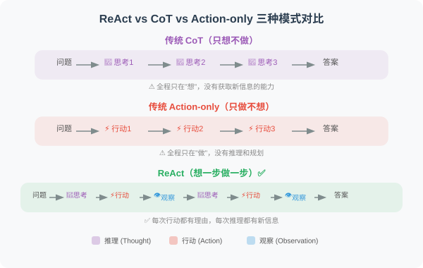
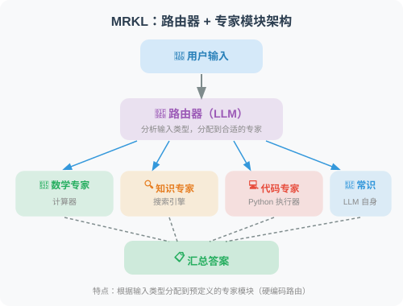
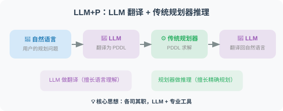
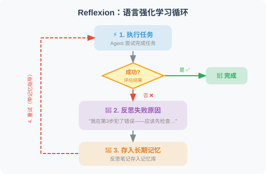
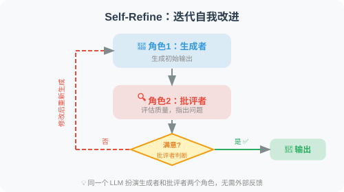
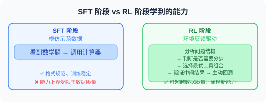
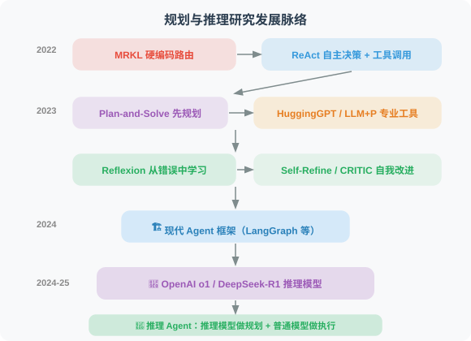
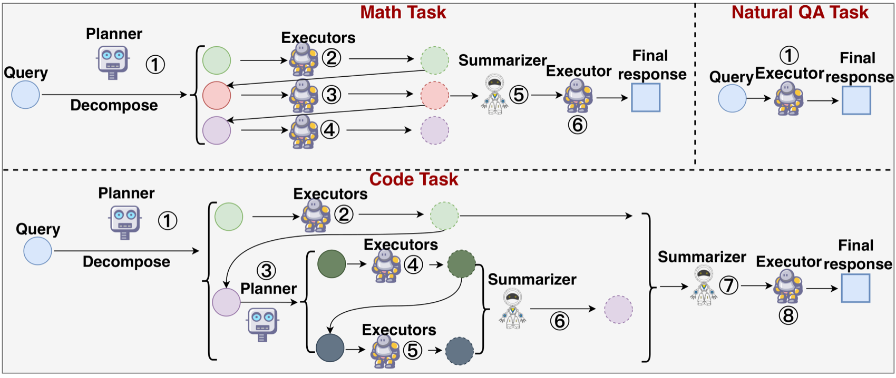
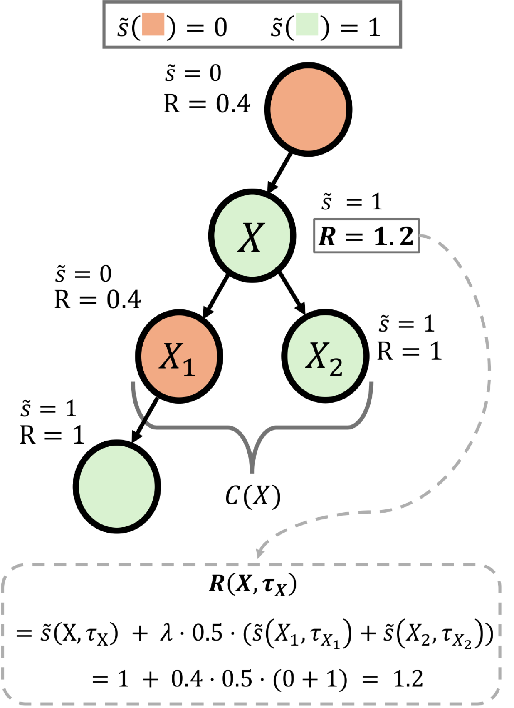
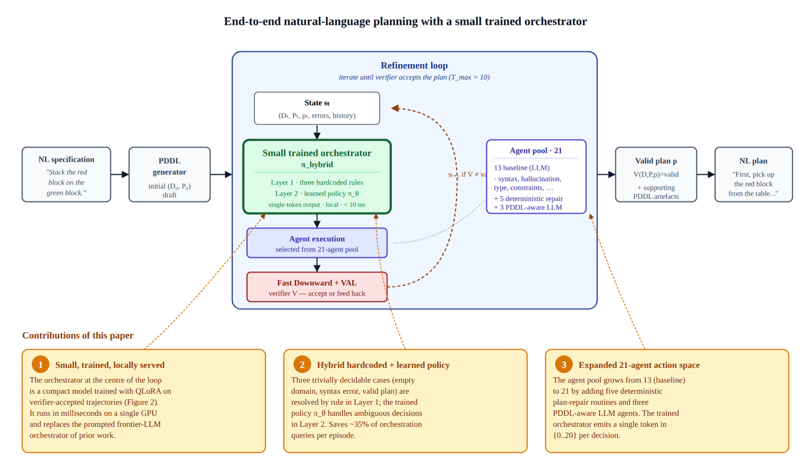

# 5.7 论文解读：规划与推理前沿研究

> 📖 *"Agent 的推理能力决定了它的上限，而规划能力决定了它能处理的任务复杂度。"*  
> *本节深入解读规划与推理领域的核心论文。*

---

## ReAct：推理与行动的融合

**论文**：*ReAct: Synergizing Reasoning and Acting in Language Models*  
**作者**：Yao et al., Princeton University & Google Brain  
**发表**：2022 | [arXiv:2210.03629](https://arxiv.org/abs/2210.03629)

### 核心问题

在 ReAct 之前，LLM 的推理（Chain-of-Thought）和行动（工具调用）是两个独立的研究方向：
- **CoT 让模型"会想"但"不会做"**——推理时无法获取外部信息
- **工具调用让模型"会做"但"不会想"**——盲目执行而不解释理由

### 核心思想

ReAct 的核心洞察：**推理为行动提供方向，行动为推理提供依据，两者交替进行才能解决复杂问题。**



### 实验结果

| 任务 | CoT | Act-only | ReAct | 提升 |
|------|-----|----------|-------|------|
| HotpotQA（多跳问答） | 29.4% | 25.7% | 35.1% | +6pp vs CoT |
| ALFWorld（交互式游戏） | — | 45% | 79% | +34pp vs Act |
| WebShop（在线购物） | — | 30.1% | 40.0% | +10pp vs Act |

### 对 Agent 开发的启示

ReAct 直接奠定了现代 Agent 的基本架构。今天几乎所有主流框架（LangChain、LlamaIndex、AutoGen）的默认 Agent 模式都基于 ReAct。5.2 节的代码实现就是 ReAct 论文的工程化实践。

---

## MRKL Systems：模块化的专家路由

**论文**：*MRKL Systems: A modular, neuro-symbolic architecture that combines large language models, external knowledge sources and discrete reasoning*  
**作者**：Karpas et al., AI21 Labs  
**发表**：2022

### 核心思想

MRKL（Modular Reasoning, Knowledge and Language）提出了一种"路由器 + 专家模块"的架构：



### 与 ReAct 的关系

MRKL 是 ReAct 的前身之一，但有一个关键区别：
- **MRKL 的路由是相对固定的**：根据输入类型分配到预定义的专家
- **ReAct 让模型自主决策**：模型在推理过程中动态决定调用哪个工具

这种从"硬编码路由"到"自主决策"的演进，是 Agent 技术发展的重要一步。

---

## Plan-and-Solve：先规划，再执行

**论文**：*Plan-and-Solve Prompting: Improving Zero-Shot Chain-of-Thought Reasoning by Large Language Models*  
**作者**：Wang et al.  
**发表**：2023 | [arXiv:2305.04091](https://arxiv.org/abs/2305.04091)

### 核心问题

Zero-shot CoT（"Let's think step by step"）虽然简单有效，但在复杂问题上容易犯三类错误：
1. **计算错误**：在多步计算中某一步算错
2. **缺步错误**：遗漏关键的中间步骤
3. **语义理解错误**：误解题目中的关键信息

### 方法原理

Plan-and-Solve 的核心改进非常优雅——将一句提示词替换：

```
Zero-shot CoT：
"Let's think step by step."

Plan-and-Solve (PS)：
"Let's first understand the problem and devise a plan to solve it.
 Then, let's carry out the plan and solve the problem step by step."

Plan-and-Solve+ (PS+)：
"Let's first understand the problem, extract relevant variables and their 
 corresponding numerals, and make a plan. Then, let's carry out the plan, 
 calculate intermediate results (pay attention to correct numerical 
 calculation and target commonsense reasoning), and solve the problem 
 step by step."
```

### 实验结果

在 GSM8K 数学推理基准上，PS+ 比标准 Zero-shot CoT 提升了 5-6 个百分点。

### 对 Agent 开发的启示

Plan-and-Solve 的思想直接对应了 Agent 中的 **Plan-and-Execute 模式**（5.3 节）：先让 LLM 制定完整的执行计划，再逐步执行每个子任务。这比"走一步看一步"的 ReAct 模式在某些任务上更可靠。

---

## HuggingGPT：跨模态的任务规划

**论文**：*HuggingGPT: Solving AI Tasks with ChatGPT and its Friends in HuggingFace*  
**作者**：Shen et al., Microsoft Research  
**发表**：2023

### 核心思想

用 ChatGPT 作为"大脑"来分解复杂任务，然后调度 HuggingFace 上的专业模型来执行子任务：


### 对 Agent 开发的启示

HuggingGPT 展示了"规划 + 工具调用"在多模态任务上的强大能力，其架构思想（大模型规划、小模型执行）在今天的 Agent 系统中广泛应用。

---

## LLM+P：结合传统 AI 规划器

**论文**：*LLM+P: Empowering Large Language Models with Optimal Planning Proficiency*  
**作者**：Liu et al.  
**发表**：2023

### 核心问题

LLM 在长程规划中容易犯错——特别是需要满足复杂约束条件的规划问题（如调度、资源分配）。传统 AI 规划器（如基于 PDDL 的规划器）在这些问题上更可靠，但无法理解自然语言。

### 方法原理



**核心思想**：LLM 做翻译、规划器做推理——各司其职。

### 对 Agent 开发的启示

这种"LLM + 专业工具"的组合思路在 Agent 开发中非常实用：
- 不要让 LLM 做所有事情，它的规划能力是有限的
- 对于需要精确推理的任务，应该将推理部分交给专业工具

---

## Reflexion：语言强化学习

**论文**：*Reflexion: Language Agents with Verbal Reinforcement Learning*  
**作者**：Shinn et al.  
**发表**：2023 | [arXiv:2303.11366](https://arxiv.org/abs/2303.11366)

### 核心问题

传统的强化学习需要大量的试错和参数更新。对于 LLM Agent，能否用一种更轻量的方式从错误中学习？

### 方法原理

Reflexion 提出了 **"语言强化学习"** ——Agent 在任务失败后不更新模型权重，而是生成自然语言的"反思笔记"并存入长期记忆：



### 实验结果

| 任务 | 无反思 | 有反思（Reflexion） | 提升 |
|------|--------|-------------------|------|
| HumanEval（代码生成） | 80% | 91% | +11pp |
| AlfWorld（决策任务） | 63% | 97% | +34pp |

### 关键发现

1. **反思记忆是关键**：不仅在当前任务中反思，还要跨任务保存和复用反思经验
2. **语言比梯度更灵活**：自然语言描述的"经验教训"比参数更新更容易迁移到新任务
3. **长期记忆的价值**：随着反思笔记的积累，Agent 的表现持续提升

---

## Self-Refine：迭代自我改进

**论文**：*Self-Refine: Iterative Refinement with Self-Feedback*  
**作者**：Madaan et al., CMU  
**发表**：2023 | [arXiv:2303.17651](https://arxiv.org/abs/2303.17651)

### 方法原理

Self-Refine 的方案更简洁——让同一个 LLM 扮演两个角色：



### 实验结果

在代码生成、数学推理、对话摘要等 7 个任务上平均提升了约 20%。

### 与 Reflexion 的区别

- **Self-Refine**：在当前任务内反复改进，不保存长期记忆
- **Reflexion**：跨任务积累反思经验，形成长期记忆

---

## CRITIC：工具辅助的自我纠错

**论文**：*CRITIC: Large Language Models Can Self-Correct with Tool-Interactive Critiquing*  
**作者**：Gou et al.  
**发表**：2023 | [arXiv:2305.11738](https://arxiv.org/abs/2305.11738)

### 核心创新

在自我批评的基础上引入**工具验证**——Agent 的自我评估不再仅依赖 LLM 自身的判断，而是借助外部工具进行客观验证：

> - **代码任务**：Agent 写完代码 → 运行单元测试 → 根据测试结果修改代码
> - **事实任务**：Agent 写完回答 → 用搜索引擎核实关键事实 → 修正错误信息
> - **数学任务**：Agent 给出推理 → 用计算器验证计算结果 → 修正计算错误

### 关键发现：自我纠错的边界

一篇重要的反面论文值得注意——**"Large Language Models Cannot Self-Correct Reasoning Yet"**（Huang et al., 2023）指出：

- **在没有外部反馈的情况下，LLM 的纯自我反思可能反而降低推理准确率**
- 模型容易"自信地犯错"——把正确答案改成错误答案
- **实践启示：反思循环中一定要引入外部验证（如代码执行、搜索核实）**

---

---

## DeepSeek-R1：强化学习激发推理能力

**论文**：*DeepSeek-R1: Incentivizing Reasoning Capability in LLMs via Reinforcement Learning*  
**作者**：DeepSeek-AI  
**发表**：2025 年 1 月 | [arXiv:2501.12948](https://arxiv.org/abs/2501.12948)

### 核心问题

传统的 LLM 推理增强依赖监督微调（SFT）——需要人类标注"正确的推理步骤"。但高质量推理数据的标注成本极高，且人类标注者可能遗漏最优推理路径。**能否让模型通过纯强化学习自主学会推理？**

### 方法原理

DeepSeek-R1 的核心创新是用 **GRPO（Group Relative Policy Optimization）** 算法让模型自主进化出推理能力：



DeepSeek-R1（RL + 蒸馏）在 R1-Zero 的基础上：先用少量高质量 SFT 数据"冷启动"，再用大规模 RL 训练，最后将大模型的推理能力蒸馏到小模型（1.5B ~ 70B 的蒸馏版本也具备强推理能力）。

### 关键发现

1. **推理能力可以通过纯 RL 涌现**：R1-Zero 没有见过任何人类标注的推理过程，但自发学会了反思、验证、多步推理
2. **"Aha moment"**：训练过程中模型突然学会自我反思的转折点，是涌现行为的经典案例
3. **蒸馏效果惊人**：32B 蒸馏模型在数学推理上超过了 OpenAI o1-mini，7B 版本也具备强推理能力
4. **开源生态**：MIT 协议开源，推动了推理模型的民主化

### 实验结果

| 基准 | GPT-4.1 | OpenAI o1 | DeepSeek-R1 |
|------|--------|-----------|-------------|
| AIME 2024（数学竞赛） | 9.3% | 79.2% | 79.8% |
| MATH-500 | 76.6% | 96.4% | 97.3% |
| Codeforces Rating | 759 | 1891 | 2029 |
| GPQA Diamond（科学推理） | 49.9% | 75.7% | 71.5% |

### 对 Agent 开发的启示

1. **推理模型改变了 Agent 的架构设计**：o1/o3/R1 等推理模型在"想清楚再做"方面远超普通模型，适合作为 Agent 的规划和决策核心
2. **"慢思考"vs "快思考"**：可以用推理模型处理复杂的规划和决策，用普通模型处理简单的工具调用和信息检索
3. **小模型也能推理**：蒸馏版 R1 让边缘部署的推理 Agent 成为可能

---

## OpenAI o1：原生推理的里程碑

**论文/技术报告**：*Learning to Reason with LLMs*  
**作者**：OpenAI  
**发表**：2024 年 9 月

### 核心贡献

OpenAI o1 是第一个将 **"链式思考"内化到模型训练过程中** 的商业模型，标志着"推理模型"这一全新品类的诞生：


### 后续发展

| 模型 | 发布时间 | 特点 |
|------|---------|------|
| o1-preview | 2024.09 | 首个推理模型，数学/编程显著提升 |
| o1 | 2024.12 | 正式版，性能全面提升 |
| o3-mini | 2025.01 | 成本优化版，支持 low/medium/high 推理强度 |
| o3 | 2025.04 | 旗舰推理模型 |
| o4-mini | 2025.04 | 工具调用 + 推理的结合 |

### 对 Agent 开发的启示

推理模型的出现让 Agent 开发者面临新的选择：
- **简单任务**用普通模型（gpt-4.1-mini），成本低、速度快
- **复杂规划和决策**用推理模型（o3、DeepSeek-R1），准确率高
- **Plan-and-Execute 模式的回归**：推理模型天然适合"先规划再执行"的 Agent 架构

---

## 论文对比与发展脉络

| 论文 | 年份 | 核心贡献 | 局限性 |
|------|------|---------|--------|
| MRKL | 2022 | 模块化路由架构 | 路由规则硬编码 |
| ReAct | 2022 | 推理+行动交替 | Token 消耗大 |
| Plan-and-Solve | 2023 | 先规划再执行 | 静态计划，不适应变化 |
| HuggingGPT | 2023 | 跨模态任务规划 | 延迟高，依赖外部模型 |
| LLM+P | 2023 | LLM + 传统规划器 | PDDL 翻译可能出错 |
| Reflexion | 2023 | 语言强化学习 | 需要明确的成功/失败信号 |
| Self-Refine | 2023 | 迭代自我改进 | 可能陷入无效循环 |
| CRITIC | 2023 | 工具辅助自我纠错 | 需要合适的验证工具 |
| **OpenAI o1** | **2024** | **原生推理模型** | 成本高、不支持工具调用（早期） |
| **DeepSeek-R1** | **2025** | **纯 RL 涌现推理 + 开源** | 推理过程不可控、可能过度思考 |

**发展脉络**：



> 💡 **前沿趋势（2025-2026）**："推理模型"正在重塑 Agent 的架构设计。OpenAI o3/o4-mini 已支持工具调用 + 推理的结合，DeepSeek-R1 的开源让小模型也能具备强推理能力。Agent 开发中的一个重要新模式是 **"双模型架构"** ——用推理模型（o3/R1）作为规划核心负责复杂决策，用普通模型（gpt-4.1-mini）作为执行层负责工具调用和信息检索，兼顾准确性和成本。同时，研究表明 LLM 在需要 5 步以上规划的任务中成功率急剧下降——推理模型正在缓解但尚未完全解决这一瓶颈。

---

## 📝 本章练习

读完本章，先合上书用自己的话回答下面的问题，再展开参考答案对照。

**练习 1（概念）**：ReAct 把"推理（Reason）"和"行动（Act）"交替进行。本章实验表明，单独的 CoT（只推理）或单独的 Act-only（只行动）在复杂任务上都表现不佳，唯有两者结合才显著提升。请用自己的话解释：为什么"只推理"和"只行动"各自都不行，而交替进行就能产生 1+1>2 的效果？

<details>
<summary>参考答案</summary>

- **只推理（CoT）的问题——"会想但不会做"**：纯思维链在头脑里一步步推导，但它**拿不到外部最新信息**。一旦推理需要事实依据（某个数据、某个网页内容、某段代码的运行结果），模型只能靠预训练记忆"脑补"，很容易产生幻觉，而且错了也无法纠正。
- **只行动（Act-only）的问题——"会做但不会想"**：盲目地调用工具，每一步不解释为什么这么做。缺少推理引导，动作就变得随机、缺乏全局规划，遇到岔路容易乱走。

**为什么交替能 1+1>2：** ReAct 的核心洞察是——**推理为行动提供方向，行动为推理提供依据**。

- 推理（Thought）先想清楚"现在该查什么、为什么查"，让接下来的动作有的放矢；先生成的 Thought token 还会成为后续 Action 的"强制上下文"，降低动作的随机性。
- 行动（Action）拿回真实的 Observation，给下一轮推理提供**事实锚点**，避免凭空捏造，也能在出错时及时修正方向。

两者形成闭环：想 → 做 → 看到结果 → 再想……既有外部事实约束、又有推理统领全局，所以能激发出类似人类的"试错 + 自修正"能力，效果远超单独任何一个。

</details>

**练习 2（辨析）**：Reflexion 和 Self-Refine 都让 Agent "反思并改进自己"，看起来很像。但本章指出它们有一个关键区别。请说出这个区别，并进一步思考：本章还提到一篇"反面论文"指出"LLM 还不能很好地自我纠错"——这给我们设计反思循环带来什么实践启示？

<details>
<summary>参考答案</summary>

**Reflexion 与 Self-Refine 的关键区别在于"反思是否跨任务保存"：**

- **Self-Refine**：在**当前任务内部**反复改进（自己生成反馈 → 自己修改），任务结束后这些反思**不保留**，属于"一次性"的自我打磨。
- **Reflexion**：把失败教训写成自然语言"反思笔记"**存入长期记忆**，**跨任务**复用。随着笔记积累，Agent 在一系列任务上的表现会持续提升——这就是"语言强化学习"：不更新模型权重，靠语言经验进化。

**反面论文（"LLMs Cannot Self-Correct Reasoning Yet"）的启示：**

- 在**没有外部反馈**的情况下，LLM 纯靠"自己反思自己"可能**反而降低**准确率——模型会"自信地犯错"，把本来对的答案改成错的。
- 实践启示非常明确：**反思循环里一定要引入外部验证**，不能让模型自说自话。比如：
  - 代码任务 → 跑单元测试，用测试结果指导修改；
  - 事实任务 → 用搜索引擎核实；
  - 数学任务 → 用计算器验证。
- 这正是 CRITIC 论文的核心思想：自我批评要建立在**工具的客观验证**之上，而不是模型主观判断。所以设计 Agent 时，反思 ≠ 让模型空想，而要给它一面"外部的镜子"。

</details>

**练习 3（动手）**：请基于 CRITIC"工具辅助自我纠错"的思想，为一个**写 Python 代码的 Agent** 设计一个带外部验证的反思循环。用伪代码写出流程，并说明它和"纯自我反思"相比好在哪。

<details>
<summary>参考答案</summary>

```python
def coding_agent_with_critic(task, llm, run_tests, max_rounds=3):
    """带外部验证（运行测试）的代码生成 + 自我纠错循环"""
    code = llm.generate(f"请用 Python 完成以下任务：{task}")

    for round in range(max_rounds):
        # —— 外部验证：真正跑测试，而不是让模型自己判断对错 ——
        passed, failed_cases, error_log = run_tests(code)

        if passed:                       # 测试全过，正常退出
            return code

        # —— 反思：把客观的失败证据喂回模型 ——
        reflection_prompt = f"""
你写的代码没有通过测试。这是客观的运行结果：

失败用例：{failed_cases}
报错信息：{error_log}

请分析失败的根本原因，然后给出修正后的完整代码。
"""
        code = llm.generate(reflection_prompt)

    return f"[经过 {max_rounds} 轮仍未通过测试，最后版本]\n{code}"
```

**比"纯自我反思"好在哪：**

1. **反馈是客观的，不是模型脑补的**：纯自我反思里，模型靠"我觉得这段代码有问题吗"来判断，很可能"自信地"认为没问题（或把对的改错）。这里的 `run_tests` 是真实执行，对错由测试用例的客观结果决定。
2. **错误信息具体可定位**：报错堆栈、失败用例告诉模型"具体哪里、为什么错"，比"再检查一遍"这种空泛提示有用得多，修正更有针对性。
3. **规避了"LLM 还不能可靠自我纠错"的陷阱**：呼应本章的反面论文——把反思建立在外部验证之上，才真正有效。
4. **有限轮数兜底**：超过 `max_rounds` 就停，避免在无效循环里浪费成本（Self-Refine 的已知风险之一就是陷入无效循环）。

这其实就是把 ReAct 的"行动—观察"闭环用在了纠错上：写代码（行动）→ 跑测试（观察客观反馈）→ 反思修正，循环往复。

</details>

---

## 📰 最新论文速递

> 🗓️ 本节由每日自动更新任务维护，最近更新：**2026 年 7 月 14 日**

### [Agentic World Modeling：基础、能力、规律与未来展望（2026）](https://arxiv.org/abs/2604.22748)

> 🧬 **一句话**：用"能力级别 × 规律体系"二维分类法统一 Agent 世界建模——L1 预测器/L2 模拟器/L3 演化器，横跨物理/数字/社会/科学四类规律。

**核心问题**：Agent 从生成文本走向"通过持续交互达成目标"，环境动力学建模成为核心瓶颈——但"世界模型"在不同社区含义迥异，缺乏统一路线图。

**方法介绍**：本文提出"levels & laws"二维分类法。第一维定义三个能力级：**L1 预测器**（学单步局部转移算子）、**L2 模拟器**（组合成尊重领域定律的多步动作条件 rollout）、**L3 演化器**（预测失败时自主修正自身模型）。第二维识别四类规律体系（物理、数字、社会、科学），决定世界模型须满足哪些约束、最可能在哪失效。代表性系统时间线见下图：


> 图源：该论文（来源：2026, arXiv:2604.22748）

**关键结果**：系统综述 400+ 篇文献与 100+ 代表性系统，覆盖基于模型的 RL、视频生成、Web/GUI Agent、多 Agent 社会仿真与 AI 驱动科学发现，并提出以决策为中心的评估原则与可复现评估包。

**与本章关系**：与本章「ReAct 框架」和「任务分解」知识点直接关联——世界建模能力是实现准确任务规划和长视野推理的基础，L2/L3 级世界模型代表了 Agent 规划能力的天花板。

---

### [GraphPlanner：图记忆增强的多 Agent 路由与协作规划（2026）](https://arxiv.org/abs/2604.23626)

> 🧬 **一句话**：把多 Agent 路由建模为 MDP，每步同时选 LLM 主干和角色（规划/执行/总结），用异构图记忆捕捉交互历史。

**核心问题**：LLM 路由已能整合多模型优势平衡效率与性能，但要支撑更真实复杂的应用，路由必须延伸到 Agentic 场景——任务规划、异构 Agent 多轮协作、记忆利用都不可或缺，而现有路由器不具备这些能力。

**方法介绍**：GraphPlanner 是异构图记忆增强的 Agentic 路由器，为每个查询生成路由工作流，支持归纳与直推推理。它把工作流生成形式化为 **MDP**——每步同时选择 LLM 主干和 Agent 角色（Planner/Executor/Summarizer）；并用异构图 **GARNet** 捕捉查询、Agent、响应间的交互记忆，把历史记忆与工作流记忆整合进决策。工作流示例见下图：



> 图源：GraphPlanner 论文（来源：2026, arXiv:2604.23626）

**关键结果**：相比强基线路由器精度提升最多 **9.3%**，GPU 显存从 186 GiB 降至 **1.04 GiB**，并具备对未见任务的零样本泛化能力。

**与本章关系**：与本章「任务分解」与「Plan-and-Execute 框架」直接呼应——GraphPlanner 的 MDP 建模将规划决策显式化，图记忆机制解决了多 Agent 长程规划中经验无法复用的痛点。

---

### [OLIVIA：推理时动作自适应——LLM ReAct Agent 在线决策新范式（2026）](https://arxiv.org/abs/2605.11169)

> 🧬 **一句话**：把 ReAct Agent 的动作选择层建模为上下文线性赌博机，用冻结隐藏状态做决策上下文，实现推理时轻量在线学习。

**核心问题**：部署中 Agent 反复处理相关多步任务时，小的动作选择错误会累积成浪费的工具调用、延迟和可靠性下降。但现有推理时适配方法主要靠提示或检索，通过上下文操纵间接影响行为——对 ReAct Agent 不暴露能评分候选动作、表示不确定性、可在线更新的显式决策层。

**方法介绍**：OLIVIA 是推理时动作适配框架，把 LLM ReAct Agent 的动作选择建模为**上下文线性赌博机**，用冻结的隐藏状态作为决策上下文，实现轻量级在线学习。它直接在动作选择接口自适应行为，保留完整推理过程，同时提供显式不确定性估计与低开销在线策略更新。框架概览见下图：


> 图源：OLIVIA 论文（来源：2026, arXiv:2605.11169）

**关键结果**：在四个 Agent 决策基准上验证了一致性性能提升，支持可跟踪、细粒度、不确定性感知的部署时适配。

**与本章关系**：直接对应本章 ReAct 框架与推理时决策知识点，是将在线学习引入 ReAct 循环的最新进展，为"Agent 如何在执行中持续改进动作策略"提供了可落地的轻量方案。

---

*返回：[第5章 规划与推理（Planning & Reasoning）](./README.md)*

### [RAO：递归 Agent 优化——用 RL 训练 Agent 学会分治规划（2026）](https://arxiv.org/abs/2605.06639)

> 🧬 **一句话**：用 RL 训练单一策略同时扮演"调度者"和"执行者"，让它学会何时把任务递归分解给自己的子实例，实现推理时分治扩展。

**核心问题**：传统 Agent 规划面临"上下文崩溃"和"泛化天花板"——模型并未被训练去管理自身子进程，在长任务上失败。递归调用（spawn 子 Agent）是天然的 inference-time scaling 途径，但模型不会自主判断何时该委派、如何通信。

**方法介绍**：RAO（Recursive Agent Optimization）用 RL 训练**递归 Agent**——能递归地 spawn 子任务并委派给自身新实例的 Agent。递归本身就是一种推理时扩展算法，让 Agent 自然支持更长上下文、通过分治泛化到更难问题。RAO 训练模型学会**委派与通信**两个核心能力。框架见下图：



> 图源：RAO 论文（来源：2026, arXiv:2605.06639）

**关键结果**：递归 Agent 训练效率更好，能扩展到超出模型上下文窗口的任务，泛化到比训练时难得多的任务，且墙钟时间优于单 Agent 系统。

**与本章关系**：对应本章 5.5 节"Plan-and-Execute"框架，提供了一种全新的、可学习的 inference-time scaling 规划范式，是任务分解（Task Decomposition）方向的前沿进展。

---

### [Self-Harness：Agent 自主改进自身运行框架的新范式（2026）](https://arxiv.org/abs/2606.09498)

> 🧬 **一句话**：让固定模型用结构化轨迹+验证器结果，迭代地对自己 harness 做最小化机制编辑，实现"模型改进包围自己的框架"。

**核心问题**：Agent 的运行框架（harness——提示词、工具调用逻辑、指令模板）历来由人类手工设计，随 LLM 快速迭代难以规模化维护。人工 harness 工程靠手动诊断和临时修订，外部优化器用独立流程搜索修订——都没有让"模型自己改进自己的 harness"。

**方法介绍**：Self-Harness 研究一个新设定：**固定语言模型只用结构化轨迹和稳定评估器产生的验证器结果，改进围绕自身的 harness**。每轮迭代：当前 harness 在训练任务上跑收集证据→同一模型以 proposer 角色生成窄的、机制特定的编辑→编辑后的 harness 再评估，仅接受通过回归测试的修改。单次优化循环见下图：


> 图源：Self-Harness 论文（来源：2026, arXiv:2606.09498）

**关键结果**：在 Terminal-Bench-2.0 上，三个不同系列模型的 held-out 通过率分别从 40.5%→61.9%、23.8%→38.1%、42.9%→57.1%，定性分析确认改进来自模型特有弱点的精准修复而非泛化指令。

**与本章关系**：对应本章「Agent 自主改进」与「元规划」知识点，是规划能力从"执行外部策略"向"自主优化执行框架"升级的最新实证，展示了 Agent 如何通过结构化反思真正参与自身运行逻辑的演化。

---

### [企业级多 Agent 编排规模化研究：DAG 规划与 ReAct 的全景比较（2026）](https://arxiv.org/abs/2606.20058)

> 🧬 **一句话**：在 208 个企业场景、最高 200 Agent 规模上实证对比 DAG Plan&Execute 与 ReAct，发现"规模而非复杂度"主导退化。

**核心问题**：企业 AI 走向持续事件监测-检测-行动，但现有多 Agent 系统大多假设离散请求-响应工作流，在企业规模下几乎未被研究——编排架构在 200 Agent 量级会怎样退化，无人系统测过。

**方法介绍**：本文在 208 个生产衍生企业场景上评估 DAG Plan & Execute 与 ReAct，覆盖 Persona（<10 Agent）、Department（20–80）、Enterprise（200）三规模，并引入 Task Manager 实现持续运营（优先级推断、相关事件合并、抢占）。各编排级别 token 用量见下图：


> 图源：该论文（来源：2026, arXiv:2606.20058）

**关键结果**：核心发现是**规模（而非任务复杂度）主导编排性能退化**——Agent 发现噪声随规模成主要瓶颈，简单任务退化比复杂任务更剧烈；DAG 在小规模下精度与并行化更优但开销随规模恶化，ReAct 靠增量失败处理更鲁棒。Task Manager 把高优先级队列延迟降低 14–75%，企业规模下相关事件准确率提升超 20 个百分点。

**与本章关系**：直接对应本章 5.5 节「Plan-and-Execute」与 5.4 节「ReAct」的架构选型讨论，提供了两种规划范式在真实企业场景中的大规模实证对比，是理解不同规划框架在复杂系统边界条件下行为特性的最新权威参考。

---

### [HALO：训练小型 Orchestrator——用验证轨迹监督替代 GPT-5 API 编排（2026）](https://arxiv.org/abs/2606.21740)

> 🧬 **一句话**：用验证器认证过的"状态→选修复Agent"轨迹训一个 QLoRA 小模型当 Orchestrator，配 3 条硬规则，替代每步调 GPT-5 API。

**核心问题**：把自然语言规划意图转成可验证计划是经典难题——人们用语言表达目标，经典规划器要 PDDL 规范。最近 Agentic 框架靠"池化专用修复 Agent + 验证器检查的精修循环"架桥，但循环中心的 Orchestrator 本身是 prompted 前沿 LLM，每步精修都付一次前沿 LLM API 调用，成本极高。

**方法介绍**：HALO（Hybrid Agent-Learned Orchestrator）用验证器认证为"以合法计划结尾"的精修轨迹来训练 Orchestrator，跨 11 个 PDDL 领域。它用一个 **QLoRA 微调小策略**配三条硬规则处理可直接决策的选择，在扩展的 21-Agent 动作空间上运作——不像那些每步 prompt 前沿 LLM 或从头学 Orchestrator 的做法。端到端框架见下图：



> 图源：HALO 论文（来源：2026, arXiv:2606.21740）

**关键结果**：在 PlanBench、Natural Plan 等基准上匹配或超越 GPT-5-mini 提示基线，成本降低 **45×**（$0.18→$0.004/任务），LLM 调用次数减少 40–50%。

**与本章关系**：对应本章 5.5 节「Plan-and-Execute」与 Orchestrator 设计知识点，HALO 展示了用验证轨迹数据训练小型专用编排策略的可行路线，是从"全程依赖大模型 API 编排"向"轻量本地编排策略"迁移的最新实证，对低成本大规模 Agent 部署具有重要工程价值。

---

### [ATG：面向 Agentic 规划与执行的原子任务图统一框架（2026）](https://arxiv.org/abs/2607.01942)

**发表**：2026 年 7 月 2 日 | [arXiv:2607.01942](https://arxiv.org/abs/2607.01942)

**核心贡献**：现有 LLM Agent 在复杂多步任务上的性能提升往往依赖更大骨干模型或任务特定微调，基于提示的控制虽无需训练但子任务间输入输出依赖关系隐含在文本轨迹中，难以复用验证过的中间结果。ATG（Atomic Task Graph）提出显式有向无环图（DAG）控制框架：规划阶段递归分解高层任务、追踪图演化；执行阶段并行化独立分支；检测到失败时利用图演化历史精准定位错误源头并只修复受影响区域，保留已验证区域不变。在三个交互基准上仅用 7B–8B 骨干模型一致超越强基线。

**与本章关系**：直接对应本章 5.3 节「任务分解」与 5.5 节「Plan-and-Execute」知识点，ATG 以图结构显式化了子任务依赖，是任务分解方向从"线性分解+顺序执行"向"DAG 并行+局部修复"升级的最新实证，兼顾执行效率和错误容忍。

---

### [GATS：基于图增强树搜索与分层世界模型的高效 Agent 规划（2026）](https://arxiv.org/abs/2607.08894)

**发表**：2026 年 7 月 9 日 | [arXiv:2607.08894](https://arxiv.org/abs/2607.08894)

**核心贡献**：现有 LLM Agent 规划方法如 LATS 和 ReAct 在规划阶段严重依赖 LLM 推理，计算成本高且行为不确定。GATS（Graph-Augmented Tree Search）将系统性 UCB1 树搜索与三层世界模型结合，**在推理阶段完全消除 LLM 调用**：L1 层做精确符号动作匹配，L2 层从执行日志学习统计规律，L3 层用 LLM 预测未知动作。在含分支和死胡同的合成规划任务上达到 **100% 成功率**（LATS 92%，ReAct 64%）；在 12 个高难度场景（编码工作流、网页导航、长时程任务）上保持 **100% 成功率**（LATS 88.9%，ReAct 23.9%），且每个任务**零 LLM 调用**（LATS 需 37 次），生成确定性计划、跨运行零方差。

**与本章关系**：对应本章 5.4 节「树搜索规划」与「世界模型」知识点，GATS 证明了"系统性搜索 + 学习世界模型"可大幅超越"LLM 引导探索"，是 LATS 类方法从"依赖 LLM 推理"向"学习环境模型 + 经典搜索"回归的重要实证，对低成本高可靠 Agent 规划具有直接工程价值。

---

---
