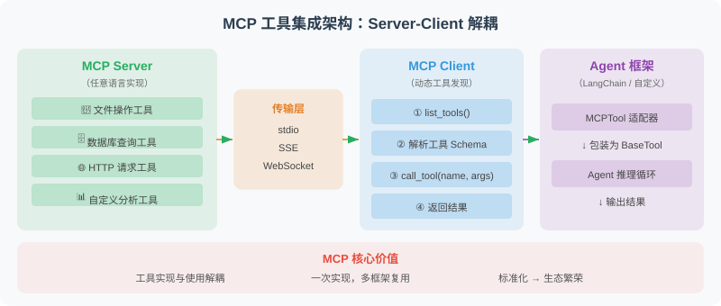

# 17.5 实战：基于 MCP 的工具集成

本节展示如何将自定义工具封装为 MCP 服务器，并在 LangChain Agent 中使用。



MCP 的核心价值在于**标准化和解耦**：工具的实现（MCP Server）和工具的使用（MCP Client / Agent）完全分离。这意味着你可以用任何语言编写工具服务器，任何支持 MCP 协议的 Agent 框架都能直接使用这些工具，不需要为每个框架单独适配。

下面的代码实现了三个关键组件：

1. **MCPTool 适配器**：将 MCP 工具包装为 LangChain 的 `BaseTool`，这是一个"桥梁"模式——让 LangChain Agent 能够无缝使用 MCP 工具，就像使用原生工具一样
2. **动态工具加载**：从 MCP Server 自动发现并加载所有可用的工具，无需手动注册
3. **Agent 集成**：将加载到的 MCP 工具注入到 LangChain Agent 中

### 关于 Session 生命周期

代码中有一个重要的设计考量：MCP 工具持有对 `ClientSession` 的引用，session 关闭后工具就无法使用了。在实际项目中，你需要确保 session 的生命周期覆盖工具的使用期——通常的做法是将 session 管理和 Agent 执行放在同一个 `async with` 上下文中。

```python
# mcp_langchain_integration.py
"""
将 MCP 工具集成到 LangChain Agent 的完整示例
"""

import asyncio
import json
from typing import Any
from langchain_core.tools import BaseTool
from langchain_openai import ChatOpenAI
from langchain.agents import AgentExecutor, create_openai_tools_agent  # legacy，新项目推荐 LangGraph
from langchain_core.prompts import ChatPromptTemplate, MessagesPlaceholder
from mcp import ClientSession, StdioServerParameters
from mcp.client.stdio import stdio_client

# ============================
# 1. MCP Tool 适配器
# ============================

class MCPTool(BaseTool):
    """将 MCP 工具包装为 LangChain Tool"""
    
    name: str
    description: str
    session: Any  # MCP ClientSession
    
    def _run(self, **kwargs) -> str:
        """同步执行（通过 asyncio 桥接）"""
        loop = asyncio.new_event_loop()
        try:
            result = loop.run_until_complete(
                self.session.call_tool(self.name, kwargs)
            )
            if result.content:
                return result.content[0].text
            return "工具无返回内容"
        finally:
            loop.close()
    
    async def _arun(self, **kwargs) -> str:
        """异步执行"""
        result = await self.session.call_tool(self.name, kwargs)
        if result.content:
            return result.content[0].text
        return "工具无返回内容"


# ============================
# 2. 从 MCP Server 动态加载工具
# ============================

async def load_mcp_tools(server_command: str, server_args: list) -> list[MCPTool]:
    """从 MCP Server 加载所有工具
    
    注意：此函数返回的 tools 需要在 MCP session 存活期间使用。
    在实际应用中，应该保持 session 的生命周期覆盖 tools 的使用期。
    下面的 build_mcp_agent() 函数展示了正确的使用方式。
    """
    
    server_params = StdioServerParameters(
        command=server_command,
        args=server_args
    )
    
    tools = []
    
    async with stdio_client(server_params) as (read, write):
        async with ClientSession(read, write) as session:
            await session.initialize()
            
            tools_result = await session.list_tools()
            
            for mcp_tool in tools_result.tools:
                lc_tool = MCPTool(
                    name=mcp_tool.name,
                    description=mcp_tool.description or f"使用 {mcp_tool.name} 工具",
                    session=session
                )
                tools.append(lc_tool)
            
            # ⚠️ 重要：tools 中持有 session 引用，
            # 离开此上下文后 session 会关闭，tools 将无法使用。
            # 生产环境中应该将 session 管理和 agent 执行
            # 放在同一个 async with 上下文中。
            return tools


# ============================
# 3. 构建使用 MCP 工具的 Agent
# ============================

async def build_mcp_agent():
    """构建集成 MCP 工具的 Agent"""
    
    # 加载 MCP 工具
    tools = await load_mcp_tools(
        server_command="python",
        server_args=["production_mcp_server.py"]
    )
    
    print(f"已加载 {len(tools)} 个 MCP 工具：{[t.name for t in tools]}")
    
    # 构建 Agent
    llm = ChatOpenAI(model="gpt-4.1", temperature=0)
    
    prompt = ChatPromptTemplate.from_messages([
        ("system", """你是一个功能强大的 Agent，通过 MCP 协议使用标准化工具。

你有以下工具可用，请合理选择和使用：
- 文件读写操作
- 数据库查询
- HTTP 请求

遇到需要这些能力的任务时，主动使用相应工具。"""),
        MessagesPlaceholder(variable_name="chat_history"),
        ("human", "{input}"),
        MessagesPlaceholder(variable_name="agent_scratchpad"),
    ])
    
    agent = create_openai_tools_agent(llm, tools, prompt)
    executor = AgentExecutor(agent=agent, tools=tools, verbose=True)
    
    return executor


# ============================
# 4. 使用示例
# ============================

async def main():
    agent = await build_mcp_agent()
    
    # 测试文件操作
    result = agent.invoke({
        "input": "读取 README.md 文件，总结其主要内容",
        "chat_history": []
    })
    print(result["output"])
    
    # 测试复合操作
    result = agent.invoke({
        "input": "查询数据库 ./data/sales.db 中的最新10条销售记录",
        "chat_history": []
    })
    print(result["output"])

if __name__ == "__main__":
    asyncio.run(main())
```

## MCP 最佳实践总结

在将 MCP 工具部署到生产环境之前，安全性、错误处理和性能优化是三个必须认真考虑的维度。以下是一些关键的最佳实践：

**安全性**是首要考虑的问题，因为 MCP 工具通常涉及文件系统、数据库等敏感操作，而这些操作的参数是由 LLM 生成的——LLM 可能被 Prompt 注入攻击利用。

**错误处理**要确保任何工具调用失败都不会导致整个 Agent 崩溃，而是返回清晰的错误信息，让 LLM 能够理解并做出应对。

**性能优化**方面，对于只读的数据库查询等操作，使用缓存可以显著减少重复调用的开销。

```python
# 1. 工具安全性
security_checklist = [
    "✅ 文件操作：限制在工作目录内，防止路径遍历",
    "✅ 数据库：只允许 SELECT，不允许 DDL/DML",
    "✅ HTTP：白名单域名，设置超时",
    "✅ 代码执行：使用沙箱（Docker/subprocess）",
    "✅ 敏感数据：不返回完整的 API Key 等信息",
]

# 2. 错误处理
def safe_tool_call(func):
    """工具调用安全装饰器"""
    def wrapper(*args, **kwargs):
        try:
            return func(*args, **kwargs)
        except PermissionError as e:
            return {"error": "权限拒绝", "message": str(e)}
        except FileNotFoundError as e:
            return {"error": "文件不存在", "message": str(e)}
        except Exception as e:
            return {"error": "工具执行失败", "message": str(e)[:200]}
    return wrapper

# 3. 性能优化
# 使用 @lru_cache 缓存不变的查询结果
from functools import lru_cache

@lru_cache(maxsize=100)
def cached_database_query(db_path: str, sql: str) -> str:
    """带缓存的数据库查询（仅缓存只读查询）"""
    import sqlite3
    
    # 安全检查
    sql_upper = sql.strip().upper()
    if not sql_upper.startswith("SELECT"):
        raise PermissionError("只允许 SELECT 查询")
    
    conn = sqlite3.connect(db_path)
    cursor = conn.cursor()
    cursor.execute(sql)
    result = cursor.fetchall()
    conn.close()
    return json.dumps(result)
```

## 小结

本章构建了一个完整的 MCP 工具集成体系：
- ✅ MCP Server：标准化的工具服务器
- ✅ MCP Client：连接和调用工具
- ✅ LangChain 集成：MCPTool 适配器
- ✅ 安全最佳实践：权限控制和错误处理

---

## 📝 本章练习

读完本章，先合上书用自己的话回答下面的问题，再展开参考答案对照。

**练习 1（概念）**：本章把 MCP 比作"AI 世界的 USB-C 接口"。请解释：在 MCP 出现之前，给 Agent 接工具有什么痛点？MCP 的"标准化 + 解耦"具体解决了什么问题？为什么这个设计能让"写一次工具，到处都能用"？

<details>
<summary>参考答案</summary>

**MCP 之前的痛点：工具接口各家不兼容。**
本章开头展示了同一个"search 工具"在不同框架里要写成完全不同的样子——OpenAI Function Calling 用 `{"type":"function", "function":{...}}`，LangChain 用 `@tool` 装饰器，Anthropic 用 `{"name":..., "input_schema":...}`。结果是：你为 OpenAI 写的工具，搬到 LangChain 或 Claude 上就得重写一遍。每接入一个新框架，所有工具都要重新适配，是巨大的重复劳动。

**MCP 解决的核心问题：标准化 + 解耦。**
- **标准化**：MCP 规定了统一的工具描述格式（name / description / inputSchema）和统一的调用协议。任何工具只要按这个标准暴露，就是一个"MCP Server"。
- **解耦**：工具的**实现**（MCP Server）和工具的**使用**（MCP Client / Agent）被彻底分开。Server 只管"我能做什么"，Client 只管"我要调什么"，两边通过标准协议对话，互不关心对方用什么语言、什么框架写的。

**为什么能"写一次，到处用"？**
正因为接口被标准化了：你用 Python 写一个 MCP 天气服务器，Claude Desktop、Cursor、OpenAI Agents SDK、VS Code Copilot——任何支持 MCP 协议的客户端都能直接连上来用，不需要为每个客户端单独适配。这就像 USB-C：不管是手机、笔记本还是耳机，只要都用 USB-C 口，一根线就能互通。这也是 MCP 能成为事实标准、安装量破亿的根本原因。

</details>

**练习 2（辨析）**：MCP、A2A、ANP 是本章的三大协议。有同学说："它们都是 Agent 通信协议，功能重叠，最后肯定只有一个能活下来。" 请反驳这个观点：用一句类比分别概括三者的定位，说明它们为什么是"互补而非竞争"，并描述一个三者协同工作的真实场景。

<details>
<summary>参考答案</summary>

**这个观点是错的——三者解决的是 Agent 世界里不同层次的问题，是互补关系，而非你死我活的竞争。**

本章给出的经典类比：
| 协议 | 一句话类比 | 解决的核心问题 |
|------|-----------|--------------|
| **MCP** | Agent 的"USB 接口" | Agent ↔ **工具/数据源** 怎么连接 |
| **A2A** | Agent 的"微信/即时通讯" | Agent ↔ **Agent** 怎么协作（任务委派、流式） |
| **ANP** | Agent 的"互联网（DNS+HTTPS）" | **大规模 Agent 网络**怎么发现彼此、验证身份、安全通信 |

**为什么互补不竞争？**
它们处在不同的抽象层：MCP 管的是"一个 Agent 怎么用自己的工具"，A2A 管的是"几个 Agent 之间怎么把任务传来传去"，ANP 管的是"成千上万个陌生 Agent 怎么在开放网络里组网、互信"。一个 Agent 系统完全可以同时用上这三者，各司其职。

**三者协同的真实场景（本章给的例子）：**
用户向公司 A 的客服 Agent 咨询退货——
1. **ANP**：客服 Agent 在开放网络中**发现**公司 B 的物流 Agent 和公司 C 的支付 Agent，并通过 DID 密码学验证它们的身份（解决"找到谁、信不信得过"）。
2. **A2A**：客服 Agent 把"查物流状态""处理退款"这些**任务委派**给 B、C 两个 Agent，追踪任务状态直到完成（解决"Agent 之间怎么协作")。
3. **MCP**：物流 Agent 内部调用自己的"物流查询工具"，支付 Agent 调用自己的"退款 API 工具"（解决"每个 Agent 怎么用自己的工具")。

所以正确的理解是本章说的：**ANP 负责发现合适的 Agent，A2A 负责协调任务协作，MCP 负责每个 Agent 调用自己的工具**——三层叠在一起，构成完整的 Agent 生态。

</details>

**练习 3（动手）**：本章的 MCP Server 反复强调"安全性是首要问题，因为工具参数是 LLM 生成的，可能被 Prompt 注入利用"。请你实现一个 MCP 工具 `query_database(db_path, sql)`，要求只允许只读的 `SELECT` 查询，并防住"用分号拼接多条语句""偷偷夹带 DROP/DELETE"等攻击。写出 `call_tool` 中这个工具的核心安全校验逻辑，并解释每一道防线分别挡住了什么攻击。

<details>
<summary>参考答案</summary>

核心思路：**LLM 生成的 SQL 绝不能无条件信任**，要在执行前层层设卡——只放行 SELECT、拦截危险关键词、禁止多语句、限制返回行数。

```python
from mcp.types import TextContent, CallToolResult
import sqlite3
import json

@server.call_tool()
async def call_tool(name: str, arguments: dict) -> CallToolResult:
    if name == "query_database":
        db_path = arguments["db_path"]
        sql = arguments["sql"].strip()
        sql_upper = sql.upper()

        try:
            # ── 防线 1：只允许 SELECT 开头 ──────────────────
            if not sql_upper.startswith("SELECT"):
                raise PermissionError("只允许 SELECT 查询")

            # ── 防线 2：拦截危险关键词 ─────────────────────
            dangerous = ["DROP", "DELETE", "UPDATE", "INSERT",
                         "ALTER", "CREATE", "TRUNCATE", "EXEC"]
            for kw in dangerous:
                if kw in sql_upper:
                    raise PermissionError(f"SQL 含禁止关键词: {kw}")

            # ── 防线 3：禁止多语句（去掉结尾分号后不应再有分号）─
            if ";" in sql.rstrip(";"):
                raise PermissionError("不允许执行多条 SQL 语句")

            # ── 执行 + 防线 4：限制返回行数 ─────────────────
            conn = sqlite3.connect(db_path)
            conn.row_factory = sqlite3.Row
            cur = conn.cursor()
            cur.execute(sql)
            rows = cur.fetchmany(100)   # 最多 100 行，防数据爆量
            conn.close()

            result = [dict(r) for r in rows]
            return CallToolResult(
                content=[TextContent(type="text",
                                     text=json.dumps(result, ensure_ascii=False, indent=2))]
            )
        except Exception as e:
            # 失败不崩溃，返回清晰错误让 LLM 能理解、应对
            return CallToolResult(
                content=[TextContent(type="text", text=f"查询失败：{e}")],
                isError=True,
            )
```

**每道防线挡住什么：**
1. **只允许 SELECT 开头**：从源头排除 `DROP TABLE users`、`DELETE FROM ...` 这类写操作/破坏性操作——它们根本不以 SELECT 开头，直接被拦。
2. **拦截危险关键词**：防住"`SELECT ... ` 后面又夹带 DROP/DELETE/UPDATE"的混合攻击。即使语句以 SELECT 开头，只要正文里出现这些写关键词就拒绝。
3. **禁止多语句**：这是防 SQL 注入的关键一道。攻击者常用分号拼接：`SELECT 1; DROP TABLE users`——第一句无害骗过前两道防线，分号后的第二句才是杀招。`sql.rstrip(";")` 先去掉合法的结尾分号，如果剩下的还含分号，说明是多语句，拒绝。
4. **限制返回行数（fetchmany(100)）**：这不是防注入，而是防"数据爆量"——避免一条 `SELECT * FROM huge_table` 把几百万行全拉出来，撑爆上下文、拖垮服务，也避免敏感数据被一次性大批量导出。

**额外要点**：错误处理用 try/except 包住，任何失败都返回 `isError=True` 的清晰错误信息而不是让 Agent 崩溃——这正好对应本章"错误处理要让 LLM 能理解并应对"的最佳实践。这套校验逻辑本质上就是把"不信任 LLM 输出"的原则落到了代码里。

</details>

---

*下一章：[第18章 Agent 的评估与优化](../chapter_evaluation/README.md)*
