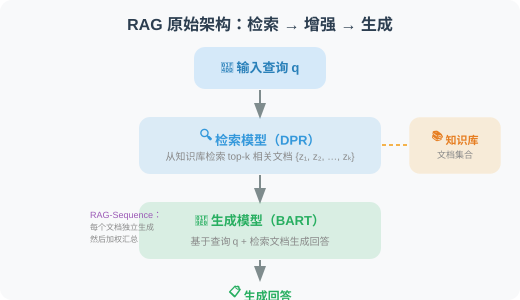
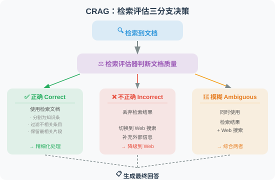
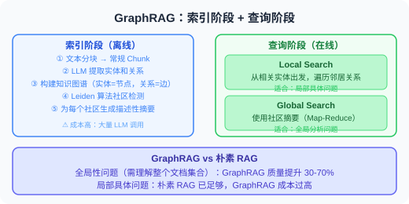
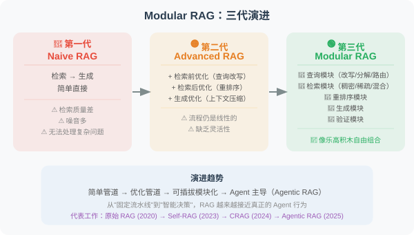
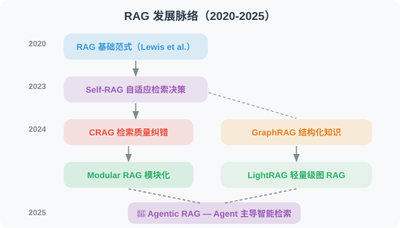
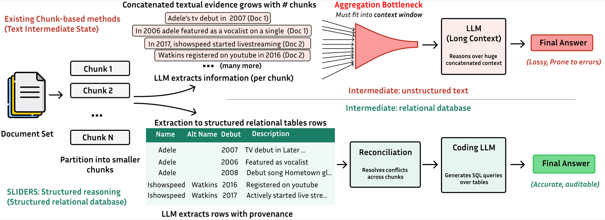
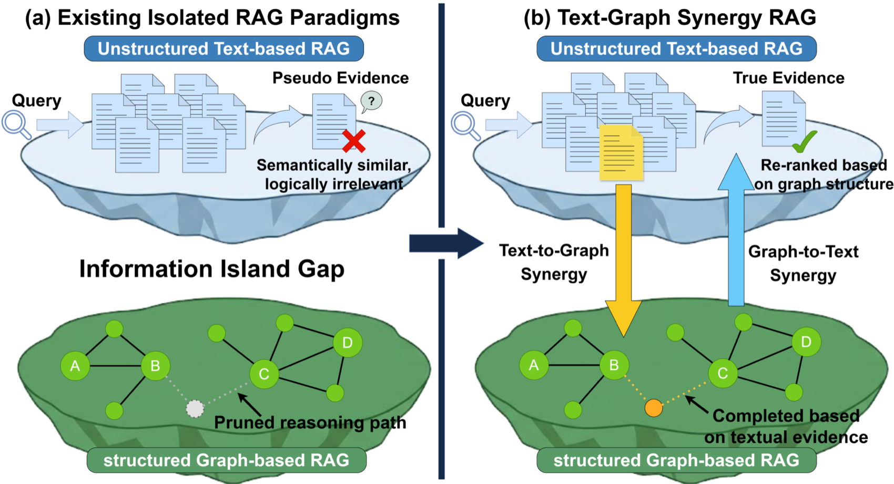
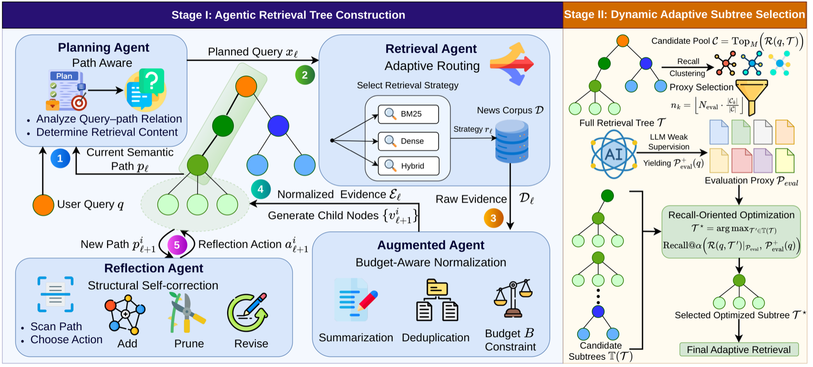

# 6.6 论文解读：RAG 前沿进展

> 📖 *"RAG 是过去两年发展最迅猛的技术方向之一。"*  
> *从朴素 RAG 到 Agentic RAG，本节深入解读推动这一演进的核心论文。*

---

## RAG 原始论文：一切的起点

**论文**：*Retrieval-Augmented Generation for Knowledge-Intensive NLP Tasks*  
**作者**：Lewis et al., Meta AI (Facebook AI Research)  
**发表**：2020 | [arXiv:2005.11401](https://arxiv.org/abs/2005.11401)

### 核心问题

预训练语言模型将知识隐式地编码在参数中，存在三个问题：
1. 无法轻松更新知识（需要重新训练）
2. 对罕见和长尾知识的覆盖不足
3. 无法追溯知识来源

### 方法原理

RAG 的原始方案是**端到端训练**检索模型和生成模型：

论文提出了两种变体：
- **RAG-Sequence**：每个文档独立生成完整回答，然后对所有回答加权
- **RAG-Token**：在生成每个 Token 时，都可以参考不同的文档

### 与今天实践的区别

虽然今天的 RAG 实现方式与原始论文有很大不同（我们通常不做端到端训练，而是将检索和生成解耦），但核心思想完全一致：**让模型在生成回答时能够参考外部知识。**

| 维度 | 原始 RAG (2020) | 现代 RAG (2024-2025) |
|------|-----------------|---------------------|
| 检索模型 | DPR（端到端训练） | 通用嵌入模型（如 OpenAI text-embedding-3） |
| 生成模型 | BART | GPT-4.1 / Claude 等 |
| 训练方式 | 端到端联合训练 | 解耦（检索和生成独立） |
| 向量数据库 | FAISS | ChromaDB / Pinecone / Weaviate |

---

## Self-RAG：自适应检索

**论文**：*Self-RAG: Learning to Retrieve, Generate, and Critique through Self-Reflection*  
**作者**：Asai et al.  
**发表**：2023 | [arXiv:2310.11511](https://arxiv.org/abs/2310.11511)

### 核心问题

传统 RAG 的一个根本缺陷是：**对每个问题都执行检索**。但实际上：
- 有些问题模型本身就能回答，检索反而引入噪音
- 有些问题需要多次检索，一次检索不够
- 检索到的文档质量参差不齐，需要筛选

### 方法原理

Self-RAG 训练模型生成四种**反思标记（Reflection Tokens）**：

> 1. **[Retrieve]**：是否需要检索？→ "Yes" / "No" / "Continue"
> 2. **[IsRel]**：检索到的文档是否相关？→ "Relevant" / "Irrelevant"
> 3. **[IsSup]**：生成的内容是否有文档支持？→ "Fully Supported" / "Partially Supported" / "No Support"
> 4. **[IsUse]**：生成的回答是否有用？→ 1-5 的评分

### 工作流程

### 对 Agent 开发的启示

Self-RAG 的自适应检索思想可以直接应用于 Agent 开发：
- **不是所有请求都需要 RAG**：Agent 应该先判断是否需要检索
- **检索质量验证**：检索到文档后要评估相关性，不盲目使用
- **生成质量自检**：回答生成后要验证是否有文档支持

---

## CRAG：检索结果的纠错机制

**论文**：*Corrective Retrieval Augmented Generation*  
**作者**：Yan et al.  
**发表**：2024 | [arXiv:2401.15884](https://arxiv.org/abs/2401.15884)

### 核心问题

传统 RAG 的另一个痛点是：**检索到低质量文档时怎么办？**
- 向量相似度高不一定意味着真正相关
- 检索到的文档可能过时、片面或有错误
- 一旦注入了低质量上下文，LLM 的回答质量也会下降

### 方法原理

CRAG 引入了一个**轻量级的检索评估器**，根据检索质量采取不同策略：

### 对 Agent 开发的启示

1. **检索不是终点**：检索到文档后还需要质量评估和过滤
2. **降级策略**：当内部知识库不够时，可以降级到 Web 搜索
3. **精细化处理**：大段文档中可能只有几句话是相关的，需要提取关键信息

---

## GraphRAG：知识图谱增强的 RAG

**论文**：*From Local to Global: A Graph RAG Approach to Query-Focused Summarization*  
**作者**：Edge et al., Microsoft Research  
**发表**：2024 | [arXiv:2404.16130](https://arxiv.org/abs/2404.16130)

### 核心问题

传统 RAG 检索的是独立的文本块（Chunk），适合回答**局部问题**（"X 是什么？"），但难以回答**全局问题**（"这个项目中所有团队之间的合作关系是什么？"、"整个文档集合的主要主题有哪些？"）。

### 方法原理

GraphRAG 在传统 RAG 的基础上增加了知识图谱层：

### 实验结果

在全局性问题（需要理解整个文档集合）上，GraphRAG 比朴素 RAG 的回答质量提升了 **30-70%**。

### 对 Agent 开发的启示

1. **结构化知识的价值**：纯文本检索在关系推理方面有天然局限，知识图谱可以弥补
2. **分层检索策略**：局部问题用向量检索，全局问题用图检索
3. **索引成本**：GraphRAG 的索引阶段需要大量 LLM 调用来提取实体和关系，成本较高

---

## Modular RAG：模块化 RAG 架构

**论文**：*Modular RAG: Transforming RAG Systems into LEGO-like Reconfigurable Frameworks*  
**作者**：Gao et al.  
**发表**：2024

### 核心贡献

Modular RAG 不是一个具体的方法，而是一个**系统化的分类框架**，将 RAG 系统的演进分为三个阶段：

### RAG 范式演进总结

| 范式 | 特点 | 代表工作 |
|------|------|---------|
| Naive RAG | 检索 → 生成，简单直接 | 原始 RAG (Lewis et al., 2020) |
| Advanced RAG | 检索前优化 + 检索后优化 | 本书第 6.4 节 |
| Modular RAG | 模块化、可插拔、自适应 | Self-RAG, CRAG |
| Agentic RAG | Agent 主导检索决策，支持多轮检索 | LangGraph + RAG 工作流 |

---

---

## LightRAG：轻量级图增强 RAG

**论文**：*LightRAG: Simple and Fast Retrieval-Augmented Generation*  
**作者**：Guo et al., 香港大学  
**发表**：2024 | [arXiv:2410.05779](https://arxiv.org/abs/2410.05779)

### 核心问题

GraphRAG（微软）虽然通过知识图谱提升了全局问题的回答能力，但存在严重的**成本和效率问题**：
- 索引阶段需要大量 LLM 调用，Token 消耗巨大
- 社区检测和摘要生成耗时长
- 新增文档需要重新构建整个图

### 方法原理

LightRAG 在保持图增强优势的同时大幅降低成本：

> **GraphRAG 的代价**：索引 1000 篇文档 → 可能需要 $50-100 的 LLM 调用费；新增 10 篇文档 → 需要重建整个社区结构
>
> **LightRAG 的改进**：简化实体/关系提取（减少 LLM 调用次数）+ 双层检索（低层精确检索 + 高层抽象检索）+ 增量更新（新文档只需提取新实体并合并）
>
> **成本对比**：GraphRAG $100+ / 1M Token 索引 vs LightRAG $5-10 / 1M Token 索引（降低 10-20 倍）

### 关键发现

1. **图结构 + 双层检索**：在多个数据集上同时优于 GraphRAG 和朴素 RAG
2. **增量更新能力**：可以在不重建图的情况下添加新文档，适合动态知识库
3. **成本大幅降低**：索引和检索成本相比 GraphRAG 降低 10-20 倍

### 对 Agent 开发的启示

对于需要 RAG 能力的 Agent，LightRAG 提供了比 GraphRAG 更实用的选择——在保持图增强优势的同时，大幅降低了部署和运维成本。特别适合知识库频繁更新的场景。

---

## RAG 与推理的融合：Agentic RAG

**综述**：*Agentic RAG: Boosting the Generative AI Capabilities with Autonomous RAG*  
**趋势综述**：多篇论文（2024-2025）

### 核心概念

Agentic RAG 将 RAG 从“被动管道”升级为“Agent 主导的智能检索”：

### 关键技术组件

| 组件 | 学术来源 | 功能 |
|------|---------|------|
| 自适应检索 | Self-RAG (2023) | 判断是否需要检索 |
| 检索纠错 | CRAG (2024) | 评估检索质量并降级 |
| 查询改写 | HyDE, Query Rewriting | 优化检索查询 |
| 多源检索 | Modular RAG (2024) | 动态选择数据源 |
| 迭代检索 | IRCoT (2023) | 多轮检索逐步深入 |
| 推理整合 | LangGraph Workflows | 将检索嵌入推理循环 |

### 对 Agent 开发的启示

Agentic RAG 是 2025 年 Agent 开发中最实用的架构模式之一。LangGraph 是实现 Agentic RAG 的理想框架（详见第 12 章）——可以将检索决策、查询改写、质量评估等步骤编排为状态图中的节点。

---

## 论文对比与发展脉络

| 论文 | 年份 | 解决的核心问题 | 关键创新 |
|------|------|---------------|---------|
| RAG 原始论文 | 2020 | LLM 知识有限 | 检索+生成的融合 |
| Self-RAG | 2023 | 何时需要检索 | 反思标记自适应 |
| CRAG | 2024 | 检索质量不稳定 | 检索评估器 + 降级策略 |
| GraphRAG | 2024 | 全局性问题难以回答 | 知识图谱 + 社区摘要 |
| Modular RAG | 2024 | RAG 系统缺乏灵活性 | 模块化架构框架 |
| **LightRAG** | **2024** | **GraphRAG 成本过高** | **轻量级图索引 + 增量更新** |
| **Agentic RAG** | **2025** | **RAG 流程缺乏智能** | **Agent 主导检索决策** |

**发展脉络**：

> 💡 **前沿趋势（2025-2026）**：RAG 领域的三大趋势：① **Agentic RAG 成为主流**：不再是简单的"检索→生成"管道，而是 Agent 动态决策检索策略、查询改写、多源切换、结果验证的完整推理循环；② **图增强 RAG 走向实用**：LightRAG 等轻量方案解决了 GraphRAG 的成本问题，让图增强 RAG 可以在生产环境大规模部署；③ **RAG + 推理模型**：o3/R1 等推理模型与 RAG 的结合正在被探索——推理模型可以更智能地分解检索需求、评估检索质量。

---

*返回：[第6章 检索增强生成（RAG）](./README.md)*

---

## 📰 最新论文速递

> 🗓️ 本节由每日自动更新任务维护，最近更新：**2026 年 7 月 14 日**

### [MASS-RAG：多智能体合成检索增强生成（2026）](https://arxiv.org/abs/2604.18509)

> 🧬 **一句话**：把噪声上下文下的证据处理拆成多个角色专属 Agent 协同，再用专用合成阶段整合多视角证据。

**核心问题**：当检索回来的上下文噪声大、不完整或异构时，单一生成过程难以有效调和矛盾证据，导致 RAG 在"证据分散于多个检索块"的场景下频繁出错。

**方法介绍**：MASS-RAG 把证据处理流程结构化为多个角色专属 Agent——分别负责**证据摘要**（summarization）、**证据抽取**（extraction）、**推理**（reasoning），再通过一个专用**合成阶段**（synthesis stage）整合这些中间证据视角后生成最终答案。这样设计的关键在于：它暴露出多个中间证据视图，让模型在生成答案前就能比较、整合互补信息，而不是在单次生成里硬扛所有噪声。整体流程见下图：

> 图源：MASS-RAG 论文 Figure 1（来源：2026, arXiv:2604.18509）

**关键结果**：在四个基准上持续优于训练型与无训练基线，准确率提升最高约 3 个点，在"相关证据分散于多个检索上下文"的场景中优势最显著。

**与本章关系**：是本章 6.5 节「Agentic RAG」思想的具体论文实现——将单一 RAG 管道演进为多智能体协作推理系统，解决了传统 RAG 无法有效整合噪声异构上下文的核心痛点。

---

### [HaS：基于同源感知的 RAG 投机检索加速框架（2026）](https://arxiv.org/abs/2604.20452)

> 🧬 **一句话**：借鉴投机执行思想，先在受限范围快速取候选，再用"同源查询再识别"判定是否命中，命中即跳过慢速全库检索。

**核心问题**：RAG 检索延迟随知识库规模增大显著上升。现有加速要么牺牲精度（近似检索），要么只在"完全相同查询"复用时才有边际收益——而真实场景里大量查询是"同源变体"而非字面相同。

**方法介绍**：HaS（Homology-aware Speculative retrieval）的核心是**投机检索 + 同源验证**两段式：先在受限范围内做低延迟投机检索拿到候选文档；再把"候选是否含所需知识"形式化为**同源查询再识别**任务——一旦发现当前查询是某个已观测查询的同源再现，就接受草稿、跳过慢速全库检索。这把传统"严格相同才复用"放宽到"同源即可复用"，大幅提升了缓存命中率。投机检索与验证流程见下图：

> 图源：HaS 论文（来源：2026, arXiv:2604.20452）

**关键结果**：在两个数据集上将检索延迟分别降低 **23.74%** 和 **36.99%**，准确率损失仅 1–2%；作为即插即用方案还能显著加速复杂 Agentic RAG 的多跳查询。

**与本章关系**：对应本章「RAG 的效率优化」方向，与 LightRAG 降低图构建成本的思路互补——HaS 专注检索阶段的延迟加速，是 Agentic RAG 生产化部署的重要工程进展。

---

### [SLIDERS：用 SQL 驱动的关系数据库实现超长文档集合的可扩展问答（2026）](https://arxiv.org/abs/2604.22294)

> 🧬 **一句话**：把文档抽取进关系数据库，用 SQL 做持久化结构化推理，绕开 chunk 聚合瓶颈。

**核心问题**：真实文档集规模会超过任意固定上下文窗口。常见做法是分块（chunk）后拼装答案，但这引入"聚合瓶颈"——chunk 越多，系统仍需合并、推理越来越多抽取证据，最终在长上下文里重新制造了原本想规避的问题。

**方法介绍**：SLIDERS 的思路是**结构化推理替代文本拼接**：把文档中的关键信息抽取进关系数据库，通过 SQL 在持久化结构化状态上做可扩展推理。为让"局部抽取的表示"全局自洽，它引入**数据调和阶段**（data reconciliation），借助来源信息、抽取依据和元数据自动检测并修复重复、不一致、不完整的记录。下图对比了 chunk 拼接如何重新制造长上下文问题，而 SLIDERS 用结构化推理化解它：

> 图源：SLIDERS 论文 Figure 1（来源：2026, arXiv:2604.22294）

**关键结果**：在三个已有长上下文基准上超越所有基线（平均高出 GPT-4.1 约 6.6 分）；在 3.9M 和 36M token 规模的两个新基准上分别领先次优基线约 **19** 和 **32** 分。

**与本章关系**：与本章「Agentic RAG」和「RAG + 结构化检索」方向高度对应，代表了以结构化状态（关系数据库+SQL）替代扁平向量检索的全新思路，是超长上下文 RAG 的重要突破。

---

*返回：[第6章 检索增强生成（RAG）](./README.md)*

### [LatentRAG：隐空间推理与检索协同的高效 Agentic RAG（2026）](https://arxiv.org/abs/2605.06285)

> 🧬 **一句话**：把 Agentic RAG 的推理与子查询从离散语言空间搬到连续隐空间，单次前向即生成，无需逐 token 自回归。

**核心问题**：单步 RAG 应付不了复杂多跳问题；Agentic RAG 引入多步检索，但每一步都要自回归地生成长篇"思路"和"子查询"，累积延迟巨大。

**方法介绍**：LatentRAG 把推理和检索都从离散语言空间迁移到**连续隐空间**——不再逐 token 生成自然语言思路/子查询，而是直接从隐藏状态生成 latent token 表示思路和子查询，单次前向即可完成。它通过对齐训练让 LLM 学会"隐式思考 + 隐式检索"，免去了显式的检索/生成模式切换，实现推理与检索的深度融合。框架见下图：

> 图源：LatentRAG 论文（来源：2026, arXiv:2605.06285）

**关键结果**：在多跳 QA 基准上准确率与标准 Agentic RAG **持平（comparable / on par）**，但思路与子查询生成的延迟降低约 **90%**。

**与本章关系**：直接对应本章 Agentic RAG 多步检索架构，是对"检索-推理交替循环"范式的根本性改进，适合作为第 6.5 节 Agentic RAG 的前沿延伸阅读。

---

### [TGS-RAG：文本-图双向验证与补全的 RAG 框架（2026）](https://arxiv.org/abs/2605.05643)

> 🧬 **一句话**：用 Graph→Text 投票重排文本证据、Text→Graph 桥接恢复被剪枝的推理路径，打破文本与图的"信息孤岛"。

**核心问题**：传统文本 RAG 常检索到"语义相似但逻辑无关"的伪证据；图 RAG 又常因检索时剪枝丢掉潜在有效的推理路径。现有混合方案多停留在简单拼接或单向增强，没解决文本与图之间"不对称推理流"造成的信息孤岛。

**方法介绍**：TGS-RAG 提出双向协同机制——**Graph→Text 通道**用已访问图节点的全局投票（Global Voting）重排并精炼文本证据，过滤语义噪声；**Text→Graph 通道**用记忆基孤立实体桥接算法，把文本信息用来恢复图中被剪枝但可能有效的推理路径。两路互补而非简单拼接。下图对比了孤立检索范式与 TGS-RAG 的双向协同：

> 图源：TGS-RAG 论文 Figure 1（来源：2026, arXiv:2605.05643）

**关键结果**：在多跳推理基准上，检索精度与计算效率均超越现有纯文本、纯图及混合基线。

**与本章关系**：直接扩展了本章 GraphRAG 小节，是文本 RAG + 图 RAG 深度融合的最新实践，有效解决了 GraphRAG 常见的剪枝路径丢失问题。

---

### [Ψ-RAG：层次抽象树索引与多粒度检索 Agent 框架（2026）](https://arxiv.org/abs/2605.00529)

> 🧬 **一句话**：用"合并-折叠"迭代建自适应层次抽象树，配多粒度检索 Agent，专治跨文档多跳推理的树-RAG 三大缺陷。

**核心问题**：现有树状 RAG（如 RAPTOR）面向单文档，扩展到跨文档多跳时有三难：k-means 聚类因刚性分布假设引入噪声（分布适应性差）；树索引缺跨文档显式连接（结构孤立）；抽象过粗掩盖细粒度信息。

**方法介绍**：Ψ-RAG 提出两件核心——①**层次抽象树索引**：通过"合并-折叠"（merging and collapse）迭代过程构建，无先验假设地自适应文档库真实分布；②**多粒度检索 Agent**：智能地与知识库多轮交互（主动追问），配合混合稀疏-密集检索，在多个粒度上定位证据。整体框架见下图：

> 图源：Ψ-RAG 论文（来源：2026, arXiv:2605.00529）

**关键结果**：F1 均值比 RAPTOR 提升 **25.9%**、比 HippoRAG 2 提升 **7.4%**，且建索引速度比图谱方法快数十倍。

**与本章关系**：对应本章 6.4 节"Graph RAG 与层次化检索"，展示了树结构索引与 Agent 化检索的深度融合，代表 Agentic RAG 的最新 ICML 2026 顶会成果。

---

### [EPIC：面向端侧个人 Agent 的偏好对齐记忆构建（2026）](https://arxiv.org/abs/2605.18271)

> 🧬 **一句话**：以用户偏好为紧凑稳定的个人上下文贯穿 RAG 全流程，在严苛内存预算下让检索始终对齐用户。

**核心问题**：端侧个人 Agent 要在隐私、响应速度和存储预算下工作，核心瓶颈不是"存多少"，而是"存什么"才能让检索始终对齐用户——原始数据里大部分与偏好无关，全存会撑爆内存且检索失焦。

**方法介绍**：EPIC（Efficient Preference-aligned Index Construction）把**用户偏好**当作紧凑且稳定的个人上下文表示，贯穿索引与检索流程：先从原始数据中**选择性保留偏好相关信息**，再让检索结果向偏好对齐上下文倾斜。这样索引天然小而准，适合端侧部署。概览见下图：

> 图源：EPIC 论文（来源：2026, arXiv:2605.18271）

**关键结果**：跨对话/辩论/解释/推荐四类基准，索引内存降低 **2,404×**、偏好跟随准确率提升 **18.79 个百分点**、检索成本低 **32.17×**。

**与本章关系**：直接对应本章「个性化 RAG」「记忆型 RAG」与「端侧部署」知识点，说明 RAG 索引不应只追求信息量，而应围绕用户偏好构建可持续的个人上下文层。

---

### [Ex-GraphRAG：基于加法分解 GNN 的可解释图增强 LLM 检索（2026）](https://arxiv.org/abs/2605.21994)

> 🧬 **一句话**：用加法图神经网络替换纠缠式 GNN 编码器，让每个检索实体对答案的贡献可精确分解、可审计。

**核心问题**：GraphRAG 用消息传递 GNN 编码检索子图，但迭代邻域聚合会把各节点贡献纠缠在一起——没有闭式方法确定每个检索实体究竟影响了编码器输出多少，因此无法忠实审计"到底哪些结构证据传到了模型"。

**方法介绍**：Ex-GraphRAG 用 **M-GNAN**（Multivariate Graph Neural Additive Network，多维图神经加法网络）替换传统 GNN 编码器——它是加法图模型在高维嵌入空间的扩展，能对编码器输出按单个节点和特征组做**精确分解**，无需事后近似。用这套可审计编码器，作者进一步发现了"语义-结构错配"：主导编码器输出的节点在子图里反而是结构断裂的，靠低归因的中间节点连起来。

**关键结果**：在 STaRK-Prime 上，这个可审计编码器**匹配黑盒 GNN 性能**；审计还发现移除那些低分节点会导致多跳场景约 **28%** 的性能退化——说明它们虽不重要却是必要的"桥梁"。

**与本章关系**：对应本章「GraphRAG」与「检索可解释性」知识点，揭示了在 Agentic GraphRAG 系统中如何通过架构设计实现内禀可解释性，而非依赖事后归因方法。

---

### [DynaTree：面向时效性新闻检索的动态 Agent 检索树（2026）](https://arxiv.org/abs/2605.31377)

> 🧬 **一句话**：离线用 Agentic RAG 做语义探索建可复用检索树，在线只做轻量子树选择，专治时效性新闻检索。

**核心问题**：Agentic RAG 把语义扩展和检索决策紧耦合在短视野推理循环里，推理成本高；而时效性新闻任务要求高召回、快响应，这种紧耦合范式不适用。

**方法介绍**：DynaTree 是两阶段框架——**离线阶段**用 Agentic RAG 做语义探索，构建可重用的层次检索树（文档聚类组织为多粒度节点）；**在线阶段**完全不做 Agentic 推理，只执行轻量级子树选择和剪枝。这种"稳定树骨骼 + 动态叶节点"设计，让最新内容无需重建整棵树即可被响应。框架见下图：

> 图源：DynaTree 论文（来源：2026, arXiv:2605.31377）

**关键结果**：在新闻检索与 BEIR 基准上，Recall@100 与 NDCG@10 均优于传统 BM25、DPR 及图 RAG 基线，同时在线检索无需 Agentic 推理开销。

**与本章关系**：直接对应本章 Agentic RAG 的动态检索与实时知识更新知识点，是层次树 RAG 方法在时效性场景下的最新延伸，与 RAPTOR 树索引方法形成重要对比——DynaTree 专注于在线增量维护而非批量重建。

---

### [SAG：基于 SQL 超边的查询时动态检索增强生成（2026）](https://arxiv.org/abs/2606.15971)

> 🧬 **一句话**：不预建全局图，把每个文本块转成事件+实体，查询时用 SQL JOIN 动态链接共享实体的事件为本地超边。

**核心问题**：密集相似度检索对结构化约束和多跳推理支持有限；引入知识图谱能缓解，但语义碎片化、维护成本高、增量更新难。

**方法介绍**：SAG（SQL-Retrieval Augmented Generation）不走"预建全局静态图"的老路——它把每个文本块转化为一个语义完整**事件**和一组**索引实体**，写入 SQL、向量、全文三类索引；查询时用 **SQL JOIN** 动态把共享实体的事件链接为**本地超边**（hyperedge），即时构造动态局部索引结构。这避免了全局图重建和持续维护，天然支持增量写入、并发处理与持续扩展。下图对比了 NaiveRAG、GraphRAG 与 SAG 三种范式：

> 图源：SAG 论文 Figure 1（来源：2026, arXiv:2606.15971）

**关键结果**：已在生产环境部署亿级数据，在线检索延迟保持秒级；在 HotpotQA、2WikiMultiHop、MuSiQue 三个多跳基准的 8 项 Recall@K 指标中赢得 8 席。

**与本章关系**：对应本章「多跳检索」和「结构化 RAG 方法」知识点，是将关系型数据库基础设施用于动态图式 RAG 的最新工程化突破，兼具 GraphRAG 的多跳能力与传统数据库的可维护性。

---

### [AgentKGV：面向知识图谱事实验证的 Agentic LLM-RAG 两阶段训练框架（2026）](https://arxiv.org/abs/2607.09092)

**发表**：2026 年 7 月 10 日 | [arXiv:2607.09092](https://arxiv.org/abs/2607.09092)

**核心贡献**：知识图谱（KG）大规模自动构建不可避免地包含事实错误，工业级验证仍是关键挑战。AgentKGV 提出 Agentic LLM-RAG 框架，集成动态路由和迭代查询重写来处理文档级检索中的表面形式不匹配。为提升准确性和成本效率，设计两阶段训练策略：**第一阶段**做轮级蒸馏 SFT，将大教师模型的推理能力迁移到小模型以稳定查询重写和推理；**第二阶段**做轨迹级 GRPO，优化搜索策略以减少不必要的检索。在 T-REx 长尾谓词分割上，相比单轮 RAG 宏 F1 提升 **5.5 个百分点**，两阶段训练再提升 **9.4 个百分点**；GRPO 将平均搜索调用次数从 **3.24 降至 1.63**，且不降低准确率。

**与本章关系**：对应本章「Agentic RAG」与「检索策略优化」知识点，是将 GRPO 强化学习引入 Agentic RAG 检索策略优化的最新成果——不仅改进检索结果质量，还通过 RL 训练让 Agent 学会"何时不需要检索"，是 Agentic RAG 从"多轮检索"向"高效检索"演进的重要工程实证。

---
