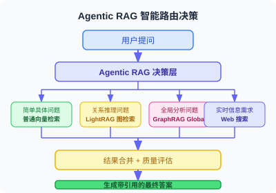

# 6.7 进阶 RAG：GraphRAG 与 Agentic RAG 工程实战

> **本节目标**：超越"检索→生成"的朴素管道，掌握两种 2025 年生产级 RAG 架构——知识图谱增强检索（GraphRAG）和 Agent 主导的智能检索（Agentic RAG）——并能在真实项目中落地。

---

## 为什么需要进阶 RAG？

朴素 RAG（Naive RAG）的核心问题可以用一句话概括：**它把所有问题都当成局部问题来回答**。

> **朴素 RAG 的隐含假设**："用户想知道的一定在某几个相邻的文本块里"
>
> **现实中的反例**：
> - Q1: "这份报告中，所有部门的工作交叉点在哪里？" → 需要全局视野
> - Q2: "A公司和 B公司有什么间接合作关系？" → 需要关系推理
> - Q3: "为什么最终结论是 X？请逐步推导" → 需要多跳检索

两种进阶架构分别针对这两类问题：

| 问题类型 | 适合架构 | 核心思想 |
|---|---|---|
| 全局关系 / 跨文档推理 | **GraphRAG** | 把知识图谱化，检索走图结构 |
| 多跳 / 自适应 / 不确定性问题 | **Agentic RAG** | Agent 动态决策检索策略 |

---

## 第一部分：GraphRAG 工程实战

### 1.1 核心思想：从文本块到知识图谱

GraphRAG 的关键洞察：**文本块（Chunk）保留了知识，但丢失了关系**。

> **传统向量化**："苹果公司收购了 Shazam" → [0.23, -0.11, 0.87, ...]；"Shazam 被谷歌的竞争对手买走了" → [0.21, -0.09, 0.85, ...]（两段向量很近，但你不知道苹果=谷歌的竞争对手这一推断链）
>
> **GraphRAG 的图化**：节点：苹果公司、Shazam、谷歌；边：苹果公司 --[收购]--> Shazam；苹果公司 --[竞争对手]--> 谷歌（关系显式存储，支持图遍历推断）

### 1.2 两种检索模式

GraphRAG 提供 Local 和 Global 两种检索模式：

- **Local Search**：适合具体问题（"张三在项目中负责什么？"）→ 找到"张三"节点 → 遍历邻居关系 → 拼接相关文本
- **Global Search**：适合全局问题（"整个项目中谁是最核心的协作节点？"）→ 对所有社区摘要 Map-Reduce → 综合分析

### 1.3 用 Microsoft GraphRAG 库快速搭建

```bash
# 安装 + 初始化
pip install graphrag
mkdir my_graphrag_project && cd my_graphrag_project
python -m graphrag init --root .
# 把 .txt 文档放到 input/，配置 settings.yaml，然后构建索引
python -m graphrag index --root .   # 10-30 分钟（视文档量）
```

`settings.yaml` 关键配置（精简版）：

```yaml
llm:
  api_key: ${GRAPHRAG_API_KEY}
  model: gpt-4.1-mini         # 索引阶段用 mini 节省成本
embeddings:
  llm:
    api_key: ${GRAPHRAG_API_KEY}
    model: text-embedding-3-small
chunks:
  size: 1200
  overlap: 100
```

```python
# 查询：Local 模式 vs Global 模式
import asyncio
from graphrag.query.cli import run_local_search, run_global_search

async def query_graphrag(question: str, mode: str = "local"):
    if mode == "local":
        return await run_local_search(root_dir=".", query=question)
    return await run_global_search(root_dir=".", query=question)

# 局部问题 → local
asyncio.run(query_graphrag("GPT-4 的 Vision 功能何时发布？", "local"))
# 全局问题 → global
asyncio.run(query_graphrag("这些文档中反复提及的核心主题是什么？", "global"))
```

> 💡 **成本估算**：1000 篇短文档（约 500K tokens），`gpt-4.1-mini` 约 $0.4-1，`text-embedding-3-small` 约 $0.02。

### 1.4 LightRAG：成本更低的替代方案

如果 GraphRAG 的索引成本让你望而却步，LightRAG 是更实用的选择：

```bash
pip install lightrag-hku
```

```python
import asyncio
from lightrag import LightRAG, QueryParam
from lightrag.llm.openai import gpt_4o_mini_complete, openai_embedding

async def build_and_query(documents: list[str], question: str):
    rag = LightRAG(
        working_dir="./lightrag_data",
        llm_model_func=gpt_4o_mini_complete,
        embedding_func=openai_embedding,
    )
    for doc in documents:
        await rag.ainsert(doc)
    # 四种查询模式：naive（对比基线）/ local（实体邻居）/ global（高层概念）/ hybrid（推荐）
    return await rag.aquery(question, param=QueryParam(mode="hybrid"))
```

**LightRAG 的核心优势**：增量更新——新增文档无需重建整个图，`await rag.ainsert(new_doc)` 即可。

### 1.5 GraphRAG vs 传统 RAG：何时选哪个？

```python
def choose_rag_strategy(use_case: dict) -> str:
    """根据使用场景选 RAG 策略。"""
    if not use_case.get("global_questions") and use_case.get("kb_size_docs", 100) < 500:
        return "naive_rag"          # 够用，不要过度工程化
    if use_case.get("global_questions"):
        if use_case.get("budget_sensitive") or use_case.get("frequent_updates"):
            return "lightrag"       # 图增强 + 低成本 + 增量更新
        return "graphrag"           # 微软官方，质量最高
    return "hybrid"
```

| 场景 | 推荐 |
|---|---|
| FAQ 问答（< 200 篇文档） | naive_rag |
| 企业知识库（> 5000 篇，偶有全局问题） | lightrag（成本敏感） |
| 学术论文分析（静态语料，需要关系推理） | graphrag |
| 新闻监控系统（每日更新） | lightrag（增量更新） |

---

## 第二部分：Agentic RAG 工程实战

### 2.1 核心思想：让 Agent 掌控检索决策

朴素 RAG 是一条固定的水管：问题进，答案出。Agentic RAG 是一个会思考的侦探——Agent 决定"要不要检索、用什么查、查到后够不够、不够再换策略"。


### 2.2 四大核心组件

```python
# ── 组件 1：检索决策器 ───────────────────────────────────────────
def should_retrieve(question: str, history: list[dict]) -> bool:
    """判断当前问题是否需要检索。"""
    prompt = f"""判断以下问题是否需要查外部文档。
【不需要】简单计算、通用常识、问题已在对话历史中回答过
【需要】涉及特定领域/公司内部/时效性信息、需要精确数据或引用
对话历史：{json.dumps(history[-3:], ensure_ascii=False)}
问题：{question}
只回复 YES/NO。"""
    resp = client.chat.completions.create(
        model="gpt-4.1-mini",         # 小模型做判断即可
        messages=[{"role": "user", "content": prompt}],
        max_tokens=5, temperature=0
    )
    return resp.choices[0].message.content.strip().upper() == "YES"


# ── 组件 2：查询改写器 ───────────────────────────────────────────
def rewrite_query(question: str, context: str = "") -> list[str]:
    """改写为 2-3 个更利于检索的查询变体。"""
    prompt = f"""将问题改写为 2-3 个检索查询变体。
要求：去掉口语化、覆盖不同侧面、每行一个、无编号。
背景：{context}
问题：{question}"""
    resp = client.chat.completions.create(
        model="gpt-4.1-mini",
        messages=[{"role": "user", "content": prompt}],
        max_tokens=200, temperature=0.3
    )
    return [q.strip() for q in resp.choices[0].message.content.split("\n") if q.strip()]


# ── 组件 3：检索质量评估器 ───────────────────────────────────────
def evaluate_retrieval(question: str, docs: list[str]) -> dict:
    """评估检索结果是否足以回答问题，返回 {relevance, sufficiency, missing}。"""
    prompt = f"""评估检索结果是否足以回答问题。
问题：{question}
文档：{chr(10).join(docs[:5])}
返回 JSON：{{"relevance": 0-10, "sufficiency": bool, "missing": "缺失信息"}}"""
    resp = client.chat.completions.create(
        model="gpt-4.1-mini",
        messages=[{"role": "user", "content": prompt}],
        response_format={"type": "json_object"}, max_tokens=200
    )
    return json.loads(resp.choices[0].message.content)


# ── 组件 4：带引用的答案生成器 ───────────────────────────────────
def generate_with_citation(question: str, docs: list[dict]) -> dict:
    """基于检索文档生成带 [数字] 引用的答案。"""
    docs_text = "\n".join(
        f"[{i}] {d['source']} p.{d.get('page','?')}\n{d['content']}"
        for i, d in enumerate(docs, 1)
    )
    prompt = f"""基于以下参考文档回答问题。
要求：引用时用 [数字] 标注；文档不足时明确说明；不凭空添加信息。
{docs_text}
问题：{question}"""
    resp = client.chat.completions.create(
        model="gpt-4.1", messages=[{"role": "user", "content": prompt}], max_tokens=1000
    )
    return {
        "answer": resp.choices[0].message.content,
        "sources": [f"{d['source']} p.{d.get('page','?')}" for d in docs]
    }
```

> 📦 **完整代码见仓库** `examples/chapter06/agentic_rag.py`，含流式输出、多数据源路由等扩展。

### 2.3 用 LangGraph 编排完整流程

```python
from langgraph.graph import StateGraph, END
from typing import TypedDict, Annotated
import operator

class AgenticRAGState(TypedDict):
    question: str
    chat_history: list[dict]
    needs_retrieval: bool
    rewritten_queries: list[str]
    retrieved_docs: list[dict]
    retrieval_quality: dict
    retry_count: int
    final_answer: str
    sources: list[str]


def build_agentic_rag_graph():
    graph = StateGraph(AgenticRAGState)

    # 6 个节点
    graph.add_node("decide", lambda s: {**s, "needs_retrieval": should_retrieve(s["question"], s.get("chat_history", []))})
    graph.add_node("rewrite", lambda s: {**s, "rewritten_queries": rewrite_query(s["question"])})
    graph.add_node("retrieve", lambda s: {**s, "retrieved_docs": _do_retrieve(s)})  # 检索合并去重
    graph.add_node("assess", lambda s: {**s, "retrieval_quality": evaluate_retrieval(s["question"], [d["content"] for d in s["retrieved_docs"]])})
    graph.add_node("generate", lambda s: {**s, **generate_with_citation(s["question"], s["retrieved_docs"])})
    graph.add_node("direct", lambda s: {**s, "final_answer": _direct_answer(s), "sources": []})

    # 条件路由
    graph.set_entry_point("decide")
    graph.add_conditional_edges("decide",
        lambda s: "rewrite" if s["needs_retrieval"] else "direct",
        {"rewrite": "rewrite", "direct": "direct"})
    graph.add_edge("rewrite", "retrieve")
    graph.add_edge("retrieve", "assess")
    graph.add_conditional_edges("assess",
        # 质量足够或重试≥2 次 → 生成；否则重试
        lambda s: "generate" if s.get("retrieval_quality", {}).get("sufficiency") or s.get("retry_count", 0) >= 2 else "rewrite",
        {"generate": "generate", "rewrite": "rewrite"})
    graph.add_edge("generate", END)
    graph.add_edge("direct", END)
    return graph.compile()
```

**关键设计**：
- **重试上限必须设**：`retry_count >= 2` 防止某些问题触发无限循环
- **质量评估必须严格**：评估 prompt 中明确定义"足够"的标准（必须包含具体数字/日期/专有名词等）
- **条件路由 vs 固定边**：核心决策点（是否检索、是否重试）用条件边，其他用固定边

### 2.4 生产环境的关键配置

| 配置项 | 选择 | 原因 |
|---|---|---|
| 决策/改写/评估 | `gpt-4.1-mini` | 结构化任务不需要最强模型；节省成本 |
| 最终生成 | `gpt-4.1` | 答案质量关键，用大模型 |
| 重试上限 | `2` 次 | 超过 2 次说明问题本身需要人工干预 |
| 查询变体数 | 2-3 个 | 多于 3 个边际收益递减 |
| 检索 top_k | 3-5 | 多于 5 个会引入噪声 |

**多数据源路由**（完整实现见仓库）：

```python
# 思路：根据问题类型路由到不同数据源
class MultiSourceRetriever:
    def route(self, question: str) -> list[str]:
        """用 LLM 判断该用哪些数据源：internal_docs / web_search / graph_rag / sql_database。"""
        ...
    def search(self, question: str, queries: list[str]) -> list[dict]:
        sources = self.route(question)
        # 并行调用各数据源 + 合并去重 + 重排序
        ...
```

---

## 第三部分：两种架构的对比与选型

### 核心差异

| 维度 | GraphRAG / LightRAG | Agentic RAG |
|---|---|---|
| **适合问题类型** | 关系推理、全局归纳 | 多跳问答、不确定性问题 |
| **检索策略** | 图遍历 + 社区摘要 | 动态决策 + 多轮检索 |
| **索引成本** | 高（需预构建知识图谱） | 低（沿用普通向量索引） |
| **延迟** | 中（图遍历） | 高（多轮 LLM 调用） |
| **可解释性** | 强（图结构透明） | 中（决策链可追溯） |
| **推荐场景** | 企业知识库、文档分析 | 客服、研究助手、复杂问答 |

### 组合使用：最强架构

生产环境中，两者往往结合使用：先分类问题类型，再路由到对应检索策略。



```python
class HybridRAGSystem:
    """Agentic RAG + GraphRAG 组合：按问题类型路由。"""
    async def query(self, question: str) -> dict:
        q_type = self._classify(question)   # relational / global / factual
        if q_type == "relational":
            docs = await self.lightrag.aquery(question, QueryParam(mode="hybrid"))
        elif q_type == "global":
            docs = await self.lightrag.aquery(question, QueryParam(mode="global"))
        else:   # factual
            docs = self.vector_store.search(rewrite_query(question))
        return generate_with_citation(question, docs)
```

---

## 常见错误与调试

| 错误 | 症状 | 解决 |
|---|---|---|
| **GraphRAG 索引不查 Token** | 跑一半超 API 额度 | 先用 10-20 篇测试，确认成本 |
| **Agentic RAG 检索无上限** | 某些问题无限重试 | 在 `route_after_assessment` 设 `retry_count >= 2` 截止 |
| **LightRAG 模式选错** | 质量差，换 "hybrid" 后变好 | 默认用 "hybrid"，调试时才用 "naive" |
| **检索评估过松** | 所有检索被判"足够" | 评估 prompt 明确定义"足够"标准 |

---

## 小结

| 技术 | 核心价值 | 生产就绪 |
|---|---|---|
| **GraphRAG** | 处理全局关系问题，准确率最高 | ✅ 微软官方维护 |
| **LightRAG** | GraphRAG 的轻量替代，支持增量更新 | ✅ 低成本生产可用 |
| **Agentic RAG** | 动态检索决策，适应复杂多变问题 | ✅ 需配合 LangGraph |
| **三者组合** | 覆盖所有 RAG 场景 | ⚠️ 复杂度高，按需组合 |

> 💡 **延伸阅读**：关于多模态 RAG 的三种架构（文本优先/多模态 Embedding/原生多模态）和 CLIP 跨模态检索，详见 [23.6 视频理解与多模态 RAG](../chapter_multimodal/06_video_and_multimodal_rag.md)。

## 练习题

1. **实战题**：用 LightRAG 对你的一个本地文档集（至少 20 篇）构建知识图谱，分别用 `local`、`global`、`hybrid` 三种模式查询同一个问题，对比回答质量差异，写一段分析。

2. **设计题**：一家电商公司有三个知识库：产品说明书（500篇）、客服历史对话（10万条）、实时库存数据库。设计一个 Agentic RAG 系统，说明如何路由不同类型的用户问题。

3. **调试题**：以下 Agentic RAG 代码对"公司最新营收是多少？"永远不会触发检索，分析原因并修复：

```python
def should_retrieve(question: str, history: list) -> bool:
    prompt = f"这个问题需要查资料吗？只回复YES/NO：{question}"
    # 提示：问题在提示词的歧义性上
    ...
```

<details>
<summary>参考答案（练习 3）</summary>

提示词过于简短，缺少"什么情况需要/不需要检索"的明确分类标准。模型会倾向于"信息可能在训练数据中" → 回答 NO。应改为：

```python
def should_retrieve(question: str, history: list) -> bool:
    prompt = f"""判断以下问题是否需要查外部文档。
【不需要】简单计算、通用常识、问题已在对话历史中回答过
【需要】涉及特定领域/公司内部/时效性信息、需要精确数据或引用来源

问题：{question}

只回复 YES 或 NO。"""
```

加上"需要"和"不需要"的明确分类后，模型能正确识别"公司最新营收"涉及"公司内部信息"和"时效性数据"，应触发检索。
</details>

4. **进阶题**：GraphRAG 在处理中文文档时常见问题：实体提取质量下降（如把"腾讯公司"和"腾讯"识别为两个不同实体）。设计一个后处理步骤解决实体合并问题。

---

*上一节：[6.6 论文解读：RAG 前沿进展](./06_paper_readings.md)*  
*返回：[第6章 检索增强生成（RAG）](./README.md)*
