# 11.2 Self-Evolution Agent：从会执行到会自我改进

> 🧬 *“真正长期有价值的 Agent，不只是完成当前任务，而是能从每次任务中提取经验，让下一次表现更好。”*

---

## 11.2.1 什么是 Self-Evolution Agent？

**Self-Evolution Agent** 是一种能够基于自身运行经验持续改进的 Agent 系统。它会把每次任务中的成功经验、失败原因、用户反馈和环境变化沉淀为可复用资产，并在后续任务中自动应用。

可以用一句话概括：

> **普通 Agent 解决任务；Self-Evolution Agent 解决任务，并学习如何更好地解决下一类任务。**

| 维度 | 普通 Agent | Self-Evolution Agent |
|------|------------|----------------------|
| **目标** | 完成当前请求 | 完成请求，并提取可复用经验 |
| **反馈使用** | 只在当前对话中修正 | 写入长期记忆、技能库或训练数据 |
| **能力变化** | 会话结束后基本不变 | 随运行次数积累而改进 |
| **改进对象** | Prompt 或单次推理 | 记忆、工具选择、流程、技能、模型策略 |
| **评估方式** | 看最终答案是否正确 | 同时评估过程、成本、稳定性和可迁移性 |

Self-Evolution Agent 的核心不是“让模型自己随意修改自己”，而是建立一个受控闭环：

```text
执行任务 → 记录轨迹 → 评估表现 → 归因失败/成功 → 生成改进 → 验证改进 → 安全部署
```

只有经过评估和验证的改进，才会进入长期系统。

---

## 11.2.2 自我进化的四个层级

Self-Evolution 可以发生在不同层级。越往下，收益越大，但风险和成本也越高。

| 层级 | 进化对象 | 典型方式 | 成本 | 风险 |
|------|----------|----------|------|------|
| **L1 记忆进化** | 长期记忆、偏好、经验教训 | 把成功策略和失败教训写入记忆 | 低 | 记忆污染 |
| **L2 Prompt 进化** | System Prompt、任务模板、工具说明 | 自动生成更好的指令和约束 | 低-中 | 过拟合少数案例 |
| **L3 Skill 进化** | 可复用技能、脚本、工作流 | 把高频任务封装成 Skill | 中 | 技能错误被复用 |
| **L4 Model 进化** | SFT / DPO / RL 训练数据 | 通过数据飞轮更新模型权重 | 高 | 灾难性遗忘、安全回退困难 |

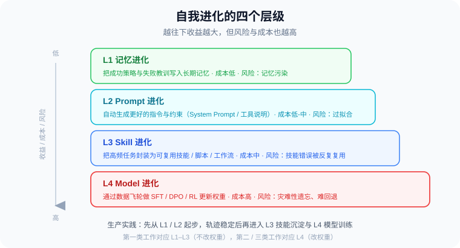

生产系统通常从 L1 和 L2 开始：先让 Agent 学会“记住教训”和“改写流程”，等轨迹数据足够稳定后，再进入 L3 技能沉淀和 L4 模型训练。

> 💡 这四个工程层级和后文的前沿研究坐标系互补：工程层级关心“先改哪里更安全”，研究坐标系关心“论文实际更新了什么对象”。二者不要混用，但可以互相映射。

---

## 11.2.3 代表性前沿工作：Self-Evolution 的论文脉络

Self-Evolution Agent 不是单一论文提出的固定架构，而是由多条研究线汇合而成：**反思学习、输出自修正、工具辅助批评、技能库终身学习、自动设计 Agent 系统、自我修改代码库**。理解这些工作，才能看清“自我进化”到底可以发生在哪一层。

> 📎 **与 11.1 的分工**：本节从"自我进化层级（L1–L4）"的视角串这些工作；其中 Reflexion、Voyager 在 [11.1 节](./01_automatic_prompt_optimization.md) 的"Skill 自动进化"部分已从"Prompt/Skill 优化方法"的视角详细讲过（含图与客服例子）。两节视角互补，这里只做层级定位，不重复展开实现细节。

### Reflexion（NeurIPS 2023）：把奖励信号转化为语言记忆

> 📄 **发表信息**：Shinn et al.（Northeastern、MIT 等），*Reflexion: Language Agents with Verbal Reinforcement Learning*，**NeurIPS 2023**｜arXiv: [2303.11366](https://arxiv.org/abs/2303.11366)
>
> 🧬 **进化层级**：L1 记忆进化　|　**一句话**：不改权重，把失败写成语言反思存进记忆，下次读回避免重犯。

**它要解决的根本矛盾**：标准强化学习（如 PPO）要从稀疏的标量奖励中学习，需要更新海量权重、成百上千次 rollout，对动辄千亿参数、且只能通过 API 访问的大模型既昂贵又往往不可行。Reflexion 的回答是把"奖励"这一信号的**载体从数字换成自然语言**——它把这套机制称为"言语强化学习（Verbal Reinforcement Learning）"。

**三个组件如何协作**（一个闭环 episode）：

- **Actor（执行者）**：基于当前上下文（含历史反思记忆）生成动作或答案，通常用 ReAct 或 CoT 形式。
- **Evaluator（评估者）**：给 Actor 的轨迹打分。分数来源因任务而异——决策任务用环境返回的成败信号、推理任务用启发式匹配、编程任务直接跑单元测试。
- **Self-Reflection（自我反思）**：这是 Reflexion 的灵魂。它读取"轨迹 + 评估分数"，用语言写出一段**诊断性反思**（例如"我没有先检查物品是否在背包里就尝试使用，下次应先 inventory check"），存入一个**滑动窗口式的记忆缓冲区**。

下一次 episode 开始时，最近若干条反思会被拼进 Actor 的上下文，相当于给它一份"上次踩过的坑"清单。注意：**模型权重始终不变，"学习"完全发生在外部记忆里**。

**关键结果与边界**：在决策（ALFWorld）、推理（HotpotQA）、编程（HumanEval，pass@1 达 91%）三类任务上都明显超过不带反思的基线。但它有两个隐含前提——必须有一个**相对可靠的 Evaluator**（否则反思会基于错误信号越走越偏），以及任务允许**多次重试**（反思要在下一次同类任务中才能兑现价值）。这正是它被归为 L1：改的是可检索、可编辑、可遗忘的语言记忆，而非权重。

> 📎 Reflexion 的框架图与客服例子已在 [11.1.14 Skill 自动进化](./01_automatic_prompt_optimization.md) 给出，这里不再重复。

### Self-Refine（NeurIPS 2023）：用自反馈迭代改进单次输出

> 📄 **发表信息**：Madaan et al.（CMU、Allen AI 等），*Self-Refine: Iterative Refinement with Self-Feedback*，**NeurIPS 2023**｜arXiv: [2303.17651](https://arxiv.org/abs/2303.17651)
>
> 🧬 **进化层级**：L2 流程进化　|　**一句话**：同一个模型自己生成、自己批评、自己改写，无需额外训练。

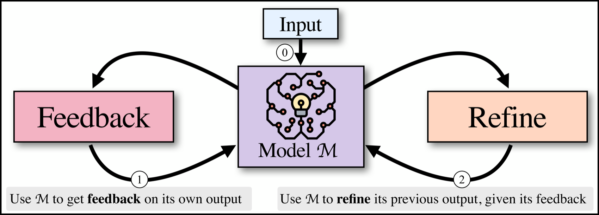

*▲ Self-Refine 原论文 Figure 1（来源：Madaan et al., NeurIPS 2023, arXiv:2303.17651）*

Self-Refine 关注的是另一类自我改进：模型生成初稿后，能否自己提出反馈，再根据反馈改写输出？它的核心主张很反直觉——**同一个冻结模型，既当"作者"又当"审稿人"，仅靠三段不同的 few-shot 提示词就能自我迭代，全程不碰权重、不引入额外模型**。

**三段提示词驱动的循环**（论文的形式化定义）：

1. **初始生成** `y₀ = M(p_gen ‖ x)`：用任务专属的生成提示词产出初稿。
2. **反馈** `fbₜ = M(p_fb ‖ x ‖ yₜ)`：用反馈提示词让模型评点自己的输出。这里有个关键设计——反馈必须**既具体又可执行（actionable & specific）**：不能只说"这段代码效率低"，而要指出"用了暴力 for 循环，应改用求和公式 n(n+1)/2"，既定位到具体片段，又给出明确动作。
3. **精炼** `yₜ₊₁ = M(p_refine ‖ x ‖ y₀ ‖ fb₀ ‖ … ‖ yₜ ‖ fbₜ)`：注意精炼时会把**历史所有轮的输出和反馈都拼进上下文**，让模型"看着自己之前的错误清单"改写，避免反复犯同一个错。

循环在满足停止条件（达到最大轮数，或反馈里出现模型自己生成的"停止指示符"）时结束。

**关键结果与边界**：在 7 类生成任务（对话、代码优化、数学、情感反转等）上，相比直接生成有 **5%–40% 的绝对提升**，代码任务上对 Codex 也有最多 13% 的提升。但它和 Reflexion 的根本差异在于——**Self-Refine 的改进只作用于"当前这一条输出"，循环结束就丢弃，没有跨任务的长期记忆**。所以它属于 L2 流程进化：真正能沉淀下来的不是某次结果，而是"先生成→多维度自评→重写"这套**可复用的工作流模板**。它的软肋也很明确：当模型自身判断力不足以发现错误时（例如它根本不知道答案错在哪），自评会失效——这正是下一篇 CRITIC 要补的洞。

### CRITIC（ICLR 2024）：让外部工具参与批评与修正

> 📄 **发表信息**：Gou et al.（清华、微软等），*CRITIC: Large Language Models Can Self-Correct with Tool-Interactive Critiquing*，**ICLR 2024**｜arXiv: [2305.11738](https://arxiv.org/abs/2305.11738)
>
> 🧬 **进化层级**：L2 / L3 验证进化　|　**一句话**：只靠模型自评会自信地重复错误，必须让外部工具来当裁判。

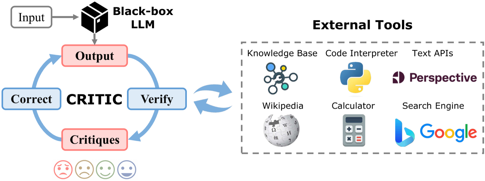

*▲ CRITIC 原论文 Figure 1（来源：Gou et al., ICLR 2024, arXiv:2305.11738）*

CRITIC 的出发点是对 Self-Refine 的一个尖锐质疑：**当模型"自评"时，它用的还是产生错误的那套参数知识——这往往导致它自信地为错误辩护，而不是发现错误**。CRITIC 的解法是把"裁判"这一角色从模型内部搬到外部世界：让模型像人类查资料一样，调用工具来核验自己的每一条声明。

**verify-then-correct 循环的三步**：

1. **生成初答** `ŷ₀`：模型先凭参数知识给出答案。
2. **工具交互式核验** `cᵢ = M(p ‖ x ‖ ŷᵢ, T)`：模型把外部工具 `T` 统一封装成 **text-to-text 接口**——搜索引擎吃一个查询、吐回检索结果；代码解释器吃一段程序、吐回执行结果；计算器、知识库、Perspective API 同理。模型据此生成**带证据的批评（critique）**，例如"我声称 X 在 2019 年成立，但搜索结果显示是 2021 年"。
3. **据批评修正** `ŷᵢ₊₁ = M(p ‖ x ‖ ŷᵢ ‖ cᵢ)`：把批评拼回上下文，重新生成。

循环"核验→修正→再核验"直到批评满意、达到最大轮数或收到环境反馈为止。工具可以按任务预先指定，也可以用 in-context learning 让模型**自动选工具**。

**为什么它对自我进化至关重要**：CRITIC 用实验证明了一条贯穿全章的红线——**没有外部锚点的自我改进，本质是自我强化幻觉**。它在自由式问答、数学、毒性检测等任务上既能纠错、又能做幻觉检测。对应到我们的层级框架，它处在 L2/L3 的"验证"环节：它本身不直接沉淀新 Skill，但它定义了"什么样的改进才配被沉淀"。这也是为什么生产级 Self-Evolution Agent 在写入长期记忆、更新 Prompt 或固化 Skill 前，**都应该先过一道工具验证或测试集验证**——这一点在后文的前沿研究综述中会反复出现（CoEvoSkills 的"考官"、SkillOpt 的"验证门"、Absolute Zero 的"代码执行器裁判"，都是同一思想的不同化身）。

### Voyager（2023）：自动课程 + 技能库 + 环境反馈的终身学习 Agent

> 📄 **发表信息**：Wang et al.（NVIDIA、Caltech 等），*Voyager: An Open-Ended Embodied Agent with Large Language Models*，**TMLR 2024**（2023 年首次公开）｜arXiv: [2305.16291](https://arxiv.org/abs/2305.16291)
>
> 🧬 **进化层级**：L3 技能进化　|　**一句话**：在 Minecraft 中自动出题、把成功代码沉淀成可复用技能库。

Voyager 是 Self-Evolution Agent 走向 L3 Skill 进化的代表工作。前面三篇（Reflexion / Self-Refine / CRITIC）都还在"改一段文本"的层面打转，Voyager 第一次把"经验"升级成了**可执行、可组合、可永久保存的代码技能**，并让整个学习过程脱离人类逐步指令、完全自驱。三个核心组件互相咬合：

1. **自动课程（Automatic Curriculum）**：由 GPT-4 根据 Agent 当前的状态、已掌握技能和探索进度，**动态出一道"难度刚刚好"的新任务**（如"现在你有木镐了，去采集石头"）。这本质是一个内置的"出题者"，让学习沿着能力前沿持续推进，而不是卡在太难或太简单的任务上。
2. **技能库（Skill Library）**：每当 Agent 成功完成一个任务，就把那段经验证的 **JavaScript 代码**连同一段功能描述的 embedding 存进技能库；遇到新任务时按语义检索最相关的几个技能，作为可调用的子程序拼进当前方案。技能之间可以层层组合（"合成石镐"复用"采集木头"），于是能力像滚雪球一样累积。
3. **迭代提示机制（Iterative Prompting）**：写出的代码先在环境里跑，把**执行错误、环境反馈和自我验证**拼回上下文反复修正，直到这段技能稳定可用才入库——这一步正是 CRITIC"外部验证"思想在具身场景的落地。

**为什么是里程碑**：在 Minecraft 中，Voyager 获得的独特物品数、探索里程、科技树解锁速度都远超此前方法，且**技能库可以零样本迁移到新世界**。它对应 L3——把成功轨迹固化为可调用 Skill，也是今天几乎所有"工具化技能库 / Skill 系统"（包括后文那一整条 SkillRL 谱系）的思想原点。它的边界在于强依赖一个**代码可执行、反馈即时**的环境；脱离这种强验证信号，技能质量就难以保证。

> 📎 Voyager 的技能库代码示例已在 [11.1.14 Skill 自动进化](./01_automatic_prompt_optimization.md) 给出，这里不再重复。

### ADAS（ICLR 2025）：自动搜索和设计 Agent 系统本身

> 📄 **发表信息**：Hu et al.（UBC、Vector Institute 等），*Automated Design of Agentic Systems*，**ICLR 2025**｜arXiv: [2408.08435](https://arxiv.org/abs/2408.08435)
>
> 🧬 **进化层级**：系统级进化（L2→L3 之间）　|　**一句话**：让一个"元智能体"自动编写、测试、归档新的 Agent 架构。


*▲ ADAS 原论文 Figure（来源：Hu et al., ICLR 2025, arXiv:2408.08435）*

ADAS 把自我进化推到一个更抽象的层面：前面几篇改的都是"Agent 内部的某个零件"（记忆、提示词、单个技能），ADAS 改的是**整个 Agent 系统的设计图本身**。它提出一个大胆假设——既然 Python 这类语言是图灵完备的，那么把"整个 Agent 系统"（提示词、工具调用、控制流、多 Agent 结构全部）**用代码表示**，理论上一个搜索算法就能发现**任意可能的 Agent 架构**。

它把这件事形式化为 ADAS 问题的三要素：

- **搜索空间**：所有能用代码写出来的 Agent——决定了"哪些系统是可表示的"。用代码作载体，意味着搜索空间几乎无限大。
- **搜索算法（Meta Agent Search）**：一个"元智能体"（用 GPT-4）**像写程序一样迭代地编写新 Agent**：每轮参考一个不断增长的"历史发现存档（archive）"，提出一个有趣的新架构、在任务上测试、把结果连同代码存回存档，再用存档启发下一轮。这套"档案库驱动的开放式探索"借鉴了 FunSearch / 神经架构搜索的思路。
- **评估函数**：用准确率、F1、成本、延迟或安全性来给候选 Agent 打分，作为元智能体优化的目标。

**关键结果**：在 ARC 逻辑谜题上元智能体逐步发现了超越 SOTA 手工 Agent 的设计；在四个常规基准上，发现的 Agent 把 DROP 阅读理解 F1 提升 **13.6/100**、MGSM 数学准确率提升 **14.4%**。最惊人的是**可迁移性**——为数学搜出来的 Agent 直接搬到 GSM8K / GSM-Hard 仍分别提升 **25.9% / 13.2%**，甚至能从数学迁移到阅读理解这种不相似领域。从层级看，ADAS 处在 L2→L3 之间的系统级进化：它升级的不是单条记忆或单个技能，而是 Agent 的整体工作流编排。它与下一篇 SICA 的关键区别在于——**ADAS 的元智能体和目标 Agent 是两个分离的实体，元智能体优化别人、不优化自己**。

### SICA（2025）：能编辑自身代码库的自我改进编码 Agent

> 📄 **发表信息**：Robeyns et al.，*A Self-Improving Coding Agent*，arXiv 预印本 2025｜arXiv: [2504.15228](https://arxiv.org/abs/2504.15228)
>
> 🧬 **进化层级**：代码级进化（最激进）　|　**一句话**：消除元智能体与目标智能体的边界，Agent 直接改写自己的代码。

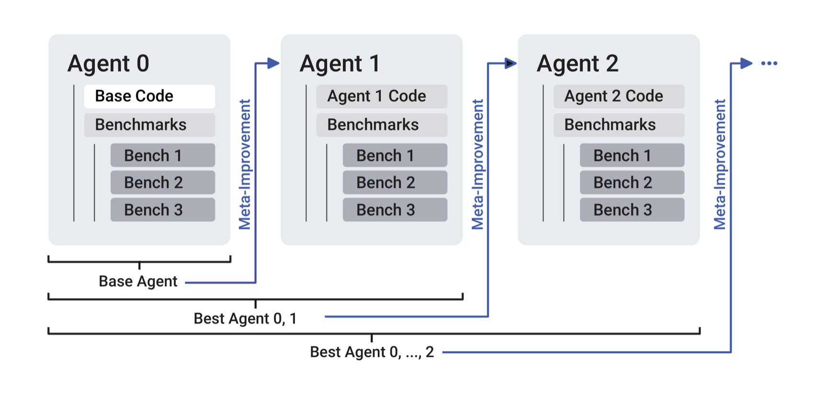

*▲ SICA 原论文 Figure（来源：Robeyns et al., 2025, arXiv:2504.15228）*

SICA 把自我进化推到逻辑终点，触及一个最激进的问题：编码 Agent 能否**直接改写自己的源代码**，让自己在后续任务中更快、更便宜、更强？它对 ADAS 的批评一针见血——ADAS 里元智能体改的是"另一个" Agent，所以严格说**不是自我改进**；SICA 则**消除了元智能体与目标智能体的边界**：同一个 Agent 既是被改的对象，又是动手改的人。

**它的循环（Meta Agent Loop）**：从一份"刚好够支持自我改进"的最小代码（能开关/编辑文件、跑终端命令）出发，进入"基准测试 → 元改进"的循环——Agent 观察自己在基准上的瓶颈（哪里慢、哪里贵、哪里错），提出代码级改动（发明新的提示策略、新工具、新工作流），改写自身实现，再用基准测试验证改动是否真的有效。其动机是一个诱人的"复利"假设：**编码能力的提升，会让下一轮自我改进做得更好，从而越滚越强**。

**关键结果与代价**：在 SWE-Bench Verified 的随机子集上，SICA 把自身性能从 **17% 一路自我改进到 53%**——且这是在施加了安全约束的前提下取得的。但它也最直白地暴露了这条路的危险：一次错误的自改可能破坏安全边界、工具协议或任务稳定性，而且"自己评判自己的改动"天然有 reward hacking 的风险（这正是后文“评判者崩塌”要警惕的）。因此论文也强调，任何"自改代码"系统都必须配齐：

- 沙箱执行环境；
- 回归测试集；
- 版本控制和回滚机制；
- 权限边界；
- 人类审批或灰度发布流程。

### 论文脉络小结

| 代表工作 | 自我进化层级 | 核心问题 | 核心机制 | 工程启发 |
|----------|--------------|----------|----------|----------|
| **Reflexion** | L1 记忆进化 | 不改权重能否从失败中学习 | 反馈 → 语言反思 → 记忆缓冲区 | 把失败归因写成可检索经验 |
| **Self-Refine** | L2 流程进化 | 单次输出能否自我改写变好 | Generate → Feedback → Refine | 把自评改写沉淀为任务模板 |
| **CRITIC** | L2/L3 验证进化 | 自我批评如何避免幻觉 | 工具验证 → 批评 → 修正 | 重要改进必须经过外部验证 |
| **Voyager** | L3 技能进化 | Agent 能否在开放环境中终身学习 | 自动课程 + 可执行技能库 + 环境反馈 | 把成功轨迹沉淀为可调用 Skill |
| **ADAS** | 系统级进化 | 能否自动设计更好的 Agent 架构 | 搜索空间 + 搜索算法 + 评估函数 | 让工作流、模块组合和控制流参与进化 |
| **SICA** | 代码级进化 | Agent 能否修改自身代码库 | 自诊断 + 代码修改 + 基准验证 | 自改系统必须有沙箱、测试和回滚 |

这些论文共同说明：Self-Evolution 不是一句“让 Agent 自我改进”的口号，而是一组逐层增强的机制。从 Reflexion 的语言记忆，到 Voyager 的技能库，再到 ADAS/SICA 的系统级和代码级改进，每一层都需要更严格的评估和安全边界。

---

## 11.2.4 Self-Evolution Agent 的系统架构

一个可控的自我进化系统通常包含六个模块：

1. **执行器（Executor）**：完成用户任务，调用工具、检索资料、生成结果。
2. **轨迹记录器（Trajectory Logger）**：保存输入、计划、工具调用、观察结果、最终输出和成本。
3. **评估器（Evaluator）**：判断任务是否成功、过程是否可靠、是否存在安全问题。
4. **归因器（Critic / Diagnoser）**：分析成功或失败原因，定位可改进点。
5. **进化器（Evolution Engine）**：把改进点转化为记忆、Prompt patch、Skill 或训练样本。
6. **验证器（Validator）**：在回归测试和沙箱中验证改进是否真的有效。

```text
┌──────────────┐
│ 用户任务      │
└──────┬───────┘
       ↓
┌──────────────┐      ┌──────────────┐
│ Executor     │─────→│ Trajectory   │
│ 执行任务      │      │ Logger       │
└──────┬───────┘      └──────┬───────┘
       ↓                     ↓
┌──────────────┐      ┌──────────────┐
│ 用户结果      │      │ Evaluator    │
└──────────────┘      └──────┬───────┘
                              ↓
                       ┌──────────────┐
                       │ Diagnoser    │
                       └──────┬───────┘
                              ↓
                       ┌──────────────┐
                       │ Evolution    │
                       │ Engine       │
                       └──────┬───────┘
                              ↓
                       ┌──────────────┐
                       │ Validator    │
                       └──────┬───────┘
                              ↓
                    记忆 / Prompt / Skill / 训练数据
```

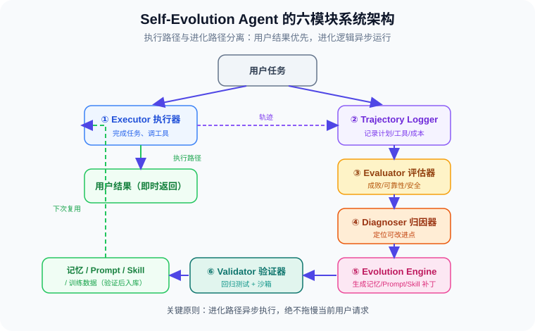

关键原则是：**执行路径和进化路径要分离**。用户请求应该被稳定处理，进化逻辑最好异步运行，避免每次对话都被“自我分析”拖慢。

---

## 11.2.5 自我进化循环：从一次失败中学习

假设一个代码 Agent 在修改项目时犯了错误：没有先读取最新文件内容，就直接基于过期上下文做替换，导致补丁失败。

Self-Evolution Agent 不应该只返回“替换失败”，而应该提取一条可复用经验：

```json
{
  "event": "patch_failed",
  "failure_reason": "used_stale_context_before_search_replace",
  "lesson": "在执行精确替换前，必须先读取目标文件的最新内容，并复制真实上下文作为 old_string。",
  "trigger": "replace_in_file 或 search-and-replace 编辑",
  "future_rule": "如果需要精确替换，先读取文件；不要使用摘要中的旧内容作为替换依据。",
  "confidence": 0.92
}
```

下一次遇到类似任务时，Agent 就可以自动应用这条规则，而不是重复犯错。

这就是自我进化的最小闭环：

1. **检测失败**：工具失败、测试失败、用户纠正、评估低分。
2. **归因失败**：不是简单记录“失败了”，而是找出可操作原因。
3. **抽象经验**：把具体错误转化为未来可复用规则。
4. **验证经验**：确认这条规则不会伤害其他任务。
5. **应用经验**：在相似场景中自动触发。

---

## 11.2.6 实现骨架：一个轻量 Self-Evolution Agent

下面是一个简化版本，展示自我进化系统的关键数据结构和控制流。

```python
from dataclasses import dataclass, field
from datetime import datetime
from typing import Literal
import json


@dataclass
class AgentEvent:
    """一次 Agent 运行事件"""
    task: str
    plan: list[str]
    actions: list[dict]
    final_answer: str
    success: bool
    feedback: str | None = None
    cost_tokens: int = 0
    created_at: str = field(default_factory=lambda: datetime.now().isoformat())


@dataclass
class EvolutionPatch:
    """一次候选进化补丁"""
    patch_type: Literal["memory", "prompt", "skill", "training_sample"]
    content: str
    trigger: str
    expected_benefit: str
    risk: str
    confidence: float


class SelfEvolutionAgent:
    """轻量级自我进化 Agent"""

    def __init__(self, base_agent, evaluator, memory_store):
        self.base_agent = base_agent
        self.evaluator = evaluator
        self.memory_store = memory_store
        self.pending_patches: list[EvolutionPatch] = []

    def run(self, task: str) -> str:
        """执行用户任务，并异步产生进化候选"""
        event = self._execute(task)

        # 用户结果优先返回；进化逻辑可以放到后台队列
        patches = self._reflect_and_propose(event)
        verified = self._validate_patches(patches)
        self._apply_patches(verified)

        return event.final_answer

    def _execute(self, task: str) -> AgentEvent:
        """执行任务并记录轨迹"""
        result = self.base_agent.run(task)
        score = self.evaluator.evaluate(task, result)

        return AgentEvent(
            task=task,
            plan=result.get("plan", []),
            actions=result.get("actions", []),
            final_answer=result.get("answer", ""),
            success=score["success"],
            feedback=score.get("feedback"),
            cost_tokens=result.get("cost_tokens", 0),
        )

    def _reflect_and_propose(self, event: AgentEvent) -> list[EvolutionPatch]:
        """基于成功/失败轨迹生成改进建议"""
        patches = []

        if not event.success:
            patches.append(EvolutionPatch(
                patch_type="memory",
                content=f"任务失败经验：当遇到类似任务 `{event.task}` 时，先检查失败原因：{event.feedback}",
                trigger=self._infer_trigger(event),
                expected_benefit="减少相同错误重复发生",
                risk="可能把一次偶然失败泛化为通用规则",
                confidence=0.75,
            ))

        if event.success and len(event.actions) >= 3:
            patches.append(EvolutionPatch(
                patch_type="skill",
                content=self._summarize_successful_workflow(event),
                trigger=self._infer_trigger(event),
                expected_benefit="把多步成功流程沉淀为可复用技能",
                risk="流程可能只适用于当前环境",
                confidence=0.68,
            ))

        return patches

    def _validate_patches(self, patches: list[EvolutionPatch]) -> list[EvolutionPatch]:
        """验证候选补丁，过滤高风险或低置信度改进"""
        verified = []
        for patch in patches:
            if patch.confidence < 0.7:
                continue
            if "绕过权限" in patch.content or "忽略安全" in patch.content:
                continue
            verified.append(patch)
        return verified

    def _apply_patches(self, patches: list[EvolutionPatch]):
        """应用通过验证的改进"""
        for patch in patches:
            if patch.patch_type == "memory":
                self.memory_store.save({
                    "trigger": patch.trigger,
                    "content": patch.content,
                    "confidence": patch.confidence,
                    "created_at": datetime.now().isoformat(),
                })
            else:
                self.pending_patches.append(patch)

    def _infer_trigger(self, event: AgentEvent) -> str:
        """从任务和动作中推断未来触发条件"""
        if any(action.get("tool") == "search" for action in event.actions):
            return "需要检索或调研资料的任务"
        if any(action.get("tool") == "code_edit" for action in event.actions):
            return "需要修改代码的任务"
        return "相似任务"

    def _summarize_successful_workflow(self, event: AgentEvent) -> str:
        """把成功轨迹总结为技能草案"""
        steps = "\n".join(f"{i + 1}. {step}" for i, step in enumerate(event.plan))
        return f"成功工作流：\n{steps}\n适用任务：{event.task}"
```

这个示例故意保持简单，但已经体现了 Self-Evolution Agent 的核心思想：**不是每次都训练模型，而是先把经验转化为低成本、可验证、可回滚的系统资产**。

---

## 11.2.7 如何判断一次“进化”是否值得保留？

自我进化系统最危险的地方在于：它可能把错误经验固化下来。因此，每个进化补丁都应该经过评估。

| 检查项 | 问题 | 不通过时的处理 |
|--------|------|----------------|
| **可复现性** | 这个问题是否多次出现？ | 只作为临时记忆，不写入长期规则 |
| **泛化性** | 经验是否适用于一类任务，而非单个案例？ | 降低触发范围 |
| **安全性** | 是否鼓励绕过权限、隐藏错误或忽略用户意图？ | 直接拒绝 |
| **收益** | 是否显著提升成功率、速度或质量？ | 不部署，只保留观察 |
| **回归风险** | 是否会让其他任务变差？ | 进入 A/B 测试或人工审核 |
| **可回滚性** | 出问题时能否撤销？ | 不允许自动上线 |

一个实用规则是：

> **记忆可以自动写入，Prompt 和 Skill 要半自动审核，模型权重更新必须离线评估后再部署。**

---

## 11.2.8 Self-Evolution 与 Agentic 数据飞轮的关系

Self-Evolution Agent 和 [第 11.3 节的数据飞轮](./03_data_flywheel.md) 不是两个独立概念，而是同一个闭环在不同层级的表现。

| 视角 | Self-Evolution Agent | Agentic 数据飞轮 |
|------|----------------------|------------------|
| **关注点** | 系统行为如何自我改进 | 模型能力如何通过数据训练增强 |
| **更新对象** | 记忆、Prompt、Skill、流程、评估规则 | 训练数据、奖励模型、策略模型 |
| **迭代速度** | 快，可以按天甚至按任务更新 | 慢，通常按周或月训练发布 |
| **风险控制** | 规则校验、沙箱、回滚 | 离线评估、基准测试、灰度发布 |
| **最佳用途** | 快速吸收经验、修复流程问题 | 提升模型底层能力和泛化能力 |

在成熟团队里，两者通常是串联的：

```text
Self-Evolution Agent
  ↓ 产生高质量经验、失败归因、技能草案
Agentic 数据飞轮
  ↓ 过滤、标注、训练、评估
更强的 Agent 模型
  ↓ 部署回执行系统
产生更高质量轨迹
```


---

## 11.2.9 风险与边界

Self-Evolution Agent 听起来很诱人，但必须避免“失控自改”。生产环境要坚持以下边界：

1. **不能自动放宽安全策略**：任何降低权限、审计、沙箱和隐私保护的改动都必须人工审批。
2. **不能把单次用户偏好当作全局规则**：用户个性化偏好应写入用户级记忆，而不是系统级策略。
3. **不能只学习成功样本**：失败样本同样重要，否则 Agent 会学到脆弱的捷径。
4. **不能没有回归测试**：Prompt、Skill 和模型更新都可能造成隐性退化。
5. **不能让进化逻辑影响当前任务稳定性**：进化应异步执行，用户任务优先。

---

## 11.2.10 实战落地路线

从零构建 Self-Evolution Agent，可以按以下路线推进：

```text
第 1 阶段：记录轨迹
  - 保存任务、计划、工具调用、结果、用户反馈

第 2 阶段：自动评估
  - 建立成功率、成本、工具错误率、用户满意度指标

第 3 阶段：失败归因
  - 把失败分为工具错误、规划错误、信息不足、权限不足、格式错误等类型

第 4 阶段：记忆进化
  - 将高置信度经验写入长期记忆，并按触发条件检索

第 5 阶段：技能进化
  - 将高频成功流程封装成 Skill，并经过回归测试

第 6 阶段：数据飞轮
  - 把高质量轨迹和失败对比样本送入 SFT / DPO / RL 训练
```

---

## 11.2.11 前沿研究全景：技术路线与研究空白

前面几节已经从工程视角回答了“怎样搭一个可控的自我进化系统”。但如果把视角切到 2025—2026 年的研究前沿，还需要回答另一个问题：**这些论文到底在进化什么、谁被训练、谁被冻结、哪些环节仍然缺位？**

为了避免和 11.2.2 中“工程落地层级”的 `L1–L4` 混淆，下面把研究综述里的四层坐标改称为 `R1–R4`：`R1` 表示参数层，`R2` 表示技能层，`R3` 表示记忆层，`R4` 表示系统层。前者关注“工程上先改什么更安全”，后者关注“论文里更新的对象是什么”。

读完这一部分，你将能：

- 用 `R1–R4` 判断一篇自进化工作到底在更新模型权重、Skill、记忆还是工作流；
- 用“出题者 / 解题者 / 总结者”三角色视角，判断训练资源投在了哪个模块上；
- 看清当前最值得关注的研究空白：**总结者本身的训练**，以及“完全自主 + 训总结者”的交叉方向。

### 11.2.11.1 一个研究坐标系：论文里的“进化”到底是什么？

要给十几篇风格迥异的论文建立秩序，最好的办法不是罗列，而是先问一个根本问题：**当我们说一个 Agent "进化"了，到底是它的哪个部分变了？**

把一个 LLM Agent 拆开，它其实只由四样东西组成：

- **策略 π**：做决策的函数，可能藏在模型权重里，也可能只存在于当前上下文里；
- **技能 S**：可复用的过程性知识，通常是一份份 Markdown 文档（"怎么做某类任务"的操作手册）；
- **记忆 K**：关于世界和历史交互的长期状态（事实、偏好、踩过的坑）；
- **环境 E**：可交互的世界（网页、代码、沙箱、操作系统）。

所谓"自进化"，就是定义一个更新算子 T，让它读入环境与交互轨迹，把 (π, S, K) 更新成更强的版本。**按照 T 更新的对象不同**，2024—2026 年的工作大致落在四个层级上——这正是我们贯穿全节的坐标系：

| 层级 | 进化对象 | 更新方式 | 代价 | 典型工作 |
|---|---|---|---|---|
| **R1 参数层** | 策略 π（模型权重） | SFT / RL | 最贵，需 GPU 训练 | EvolveR、SAGE、SkillRL、SKILL0、SkillOS、AgentEvolver、Agent0 |
| **R2 技能层** | 技能 S（Skill 文档） | 提炼 + 验证 + 复用 | 中，靠 LLM 调用 | AutoSkill、EvoSkill、CoEvoSkills、SE-Agent、SkillOpt |
| **R3 记忆层** | 记忆 K（经验条目） | 探索 + 总结 + 打分 | 中低 | MemSkill、MemRL |
| **R4 系统层** | 工作流 / 编排 | 仅推理期，不训练 | 最低 | 生产级 Harness、Skill 运行时 |

> 💡 **一句话直觉**：R1 是"把本事练进本能"，R2/R3 是"长出工具箱和笔记本"，R4 是"优化干活的流程"。2025—2026 年的主流是 R2 + R3，而 R1 往往用"训练—测试解耦"的方式作为它们的底座。本节聚焦讨论最活跃的 R1、R2、R3，R4 已在第 8 章 Harness 工程详述。

#### 为什么这件事现在被点燃？

自进化的诉求，本质是要绕开大模型的四个老大难：**静态知识**（训练完认知就冻结）、**上下文有限**（多轮交互终会"断片"）、**重复犯错**（今天教会明天照犯）、**训练昂贵**（想变强就得重跑 SFT/RL）。核心目标只有一句话：

> **让交互的副产物（轨迹、成败、教训）成为模型能力的延伸或更新通道，而不是每次都靠人工喂数据。**

这个想法在学术上不新（强化学习 + 经验回放就是雏形），但在大模型时代被重新点燃，是因为三个新条件同时成熟：LLM 自己具备了**总结归纳**能力（能给自己写笔记了）、Agent 产品带来了真实的**长程交互**场景、以及高质量人工标注越来越贵倒逼社区探索**"少人工 / 无人工"**路线。

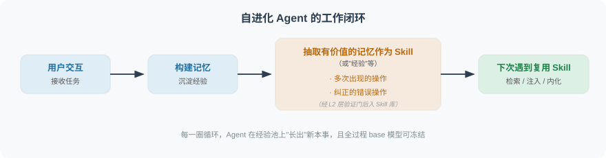

#### 第二把尺子：是否依赖人工数据

R1–R4 回答"进化什么"，还有一把正交的尺子回答"进化的燃料从哪来"——**是否依赖人工标注数据**。绝大多数工作（无论在哪一层）仍然要靠数据集的 Ground Truth 或人工反馈提供训练信号；只有极少数激进工作做到了**零人工数据**，让 Agent 互相出题互相考试。这两把尺子交叉起来，就能给任意一篇论文精确定位。下面我们按 **R2 技能层 → R3 记忆层 → R1 参数层 → 零数据自学**的顺序展开，因为这也大致是"从不改权重到改权重、从依赖数据到摆脱数据"的能力递进线。

---

### 11.2.11.2 R2 技能层：把经验沉淀成可复用的 Skill（不改权重）

> **这一层的共同特征**：base 模型全程冻结，所有"成长"都发生在一份份外部 Skill 文档里。就像给 Agent 配了一个"外挂大脑"——本体不动，本事长在外挂上。

这一层最能体现"自进化"最朴素的直觉：干完活，把有用的套路记成一条 Skill；下次遇到相似任务，翻出来照着做。真正拉开各篇工作差距的，是三个逐渐深入的问题——**Skill 怎么产生？怎么保证质量？怎么持续优化而不越攒越乱？** 我们按这条线索，从最基础的 AutoSkill 一路讲到工程化程度最高的 SkillOpt。

#### AutoSkill：动态增删改查 Skill

> 📄 **原文**：arXiv [2603.01145](https://arxiv.org/abs/2603.01145)　|　🧬 **层级**：R2　|　**一句话**：最基础的双环架构，靠动态增删改查防止 Skill 库无限膨胀。

AutoSkill 回答的是这一层最入门的问题：**Skill 从哪来、怎么用、怎么不越攒越乱？** 它的答案是一个非常经典的**双环结构**——一个环负责"用"，一个环负责"改"。


**左环——在线服务（用 Skill）**，本质是一条带记忆的 RAG 流水线：

- **查询重写**：把用户原始问题改写成更适合检索的形式（口语→检索友好）；
- **混合技能检索**：语义相似度（Embedding）+ 词汇相关性（BM25）双通道召回，兼顾"意思像"和"词面像"；
- **技能注入生成**：把检索到的技能渲染成外部记忆上下文，拼进提示词供模型参考。

**右环——技能进化循环（改 Skill）**，是它区别于普通 RAG 的地方：

- **技能提取**：从交互信号里抽取可复用的技能候选；
- **候选技能管理**：对每个候选判定 **Add（新增）/ Merge（合并到已有）/ Discard（丢弃）**，这一步是控制库规模的闸门；
- **版本化合并**：合并时做"语义并集"更新，保留技能身份、递增版本号，从而可追溯。


**它的软肋，恰好点出全层通病**：评估数据集虽然用了 **WildChat-1M**，但论文只统计了"抽出多少条 Skill"，**没有任何端到端性能指标**。也就是说，它证明了"能自动攒 Skill、库不爆炸"，却没证明"这些 Skill 真的让 Agent 更强了"。**评估缺位**是整个 R2 层最普遍、也最致命的短板——后面 CoEvoSkills、SkillOpt 的贡献，很大程度上正是在补这个洞。

#### EvoSkill：把"失败"变成"新 Skill"

> 📄 **原文**：arXiv [2603.02766](https://arxiv.org/abs/2603.02766)　|　🧬 **层级**：R2　|　**一句话**：三个 Agent 分工把"失败"提炼成新 Skill，再用 Pareto 前沿机制保证库"精而不滥"。

如果说 AutoSkill 解决了"怎么攒、怎么不爆炸"，EvoSkill 更进一步，回答"**失败的经验怎么利用**"。传统 Agent 遇到失败就重试，EvoSkill 把这套笨办法改造成"**失败即学习**"——每一次失败都是一条新 Skill 的原材料。它最大的特点是把 Skill 当作可升级的一等公民，而不是只在 prompt / code 层面做文字修补。

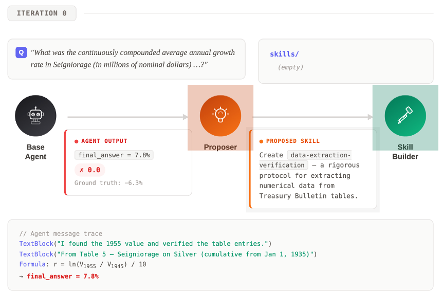

**三 Agent 分工：**

- **Executor Agent（执行者）**：拿当前 Skill 库去跑任务，把失败案例完整记录下来——失败原因、轨迹、最终错误结果一起留档。这是后面所有进化的"原材料"。
- **Proposer Agent（反思者）**：扮演"诊断医生"的角色。读完失败记录后先做根因分析（为什么失败？是缺技能？还是技能用错了？），再基于过往反馈历史决定新建一条 Skill 还是修改已有 Skill——例如在金融文档 QA 任务里它会自动总结出 *data extraction validation*（数据抽取校验）这样的可复用技能。
- **SkillBuilder Agent（落地者）**：把 Proposer 的自然语言提案变成结构化的 Skill 文件夹（含元信息、操作步骤、辅助脚本），并在小样本验证集上跑一轮单元化校验。

**核心机制——Pareto Frontier 精英池**：新生成的 Skill 不是无脑入库，而是要跟已有 Skill 在多维指标上比较，只有在**至少一个维度上严格优于**现有 Skill 的才会进入精英池，否则丢弃或合并。这套机制保证了 Skill 库随着规模增长依然保持"精而不滥"——这也是它跟 AutoSkill 那种"全量保留 + 版本化"做法最大的不同。

**评估亮点：**

- **OfficeQA 主任务**（基于约 89K 页扫描财务文档的复杂数值推理任务）：基线准确率 60.6% → 进化后 **67.9%（+7.3pp）**，主要靠两条自学到的 Skill 撑场：
  - *Data extraction validation*——解决了之前表格解析时常见的"单元格错位"问题；
  - *Quantitative analysis with checkpoints*——在金融数值计算环节强制加入校验点。
- **跨任务迁移**：在 SealQA 上学到的 *search persistence protocol*（搜索坚持协议）直接挪到 BrowseComp 任务上，无需重新训练就带来 **+5.3pp** 的提升——说明只要 Skill 抽象得足够通用，是可以跨任务迁移的，但前提是抽象层级要选对。

> ⚠️ 注意：虽然叫"训练集"，但训练集只用来总结，不更新任何模型。

**点评**：在 R2 技能层里，EvoSkill 是"工程化程度"的中间档——比 AutoSkill 多了精英池筛选机制。它的真正价值在于把"失败"明确写进了进化闭环，这也成了后续很多工作（包括 R1 层 SkillRL 的 failure trajectory distillation）的直接灵感来源。

#### MemSkill：只针对"操作 Memory 的 Skill"做进化

> 📄 **原文**：arXiv [2602.02474](https://arxiv.org/abs/2602.02474)　|　🧬 **层级**：R2/R3 之间　|　**一句话**：前面的工作进化"怎么解题"的 Skill，MemSkill 只进化"怎么管理记忆"的 Skill，且用 RL 训了一个轻量 Controller。

AutoSkill 和 EvoSkill 进化的都是面向用户任务的 Skill，MemSkill 的切口很独特——它只盯着**"操作 Memory 的 Skill"**（何时写入、何时检索、写什么），本质上站在 R2（技能）与 R3（记忆）的交界处。它的另一个看点是把组件拆得极细，并罕见地在这一层引入了一小块 RL 训练。

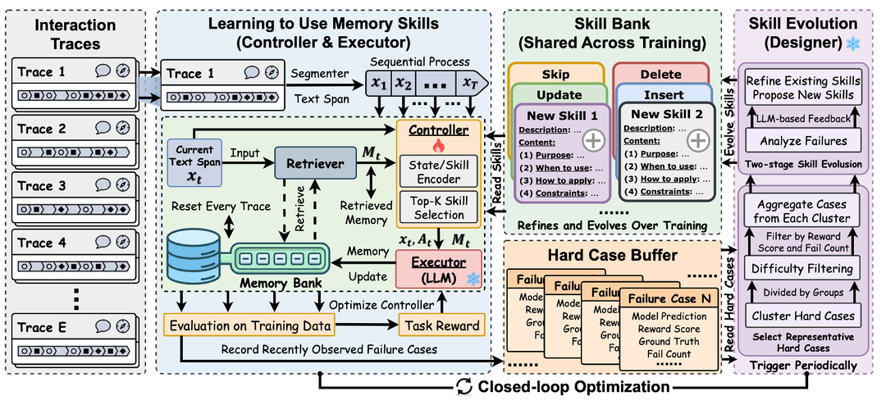

这个工作有意思的地方在于它把组件拆得很细：

- **Retriever**：基于小型 Embedding 模型的相似度计算；
- **Controller**：MLP 结构，**接受 RL 训练**（注意这是这一类里少见的"有训练"环节）；
- **Executor / Designer / Base LLM**：全部冻住。

它有两个并行的更新 Loop：

- **Controller 更新**：Retriever 抽取 Memory + 对话 → Controller 选 Skill → Executor 更新 Memory 库 → 用下游 F1 / Success Rate 作为 reward 训练 Controller；
- **Skill 库更新**：训练中遇到的 Hard Case 交给 Designer 更新 Skill 库。

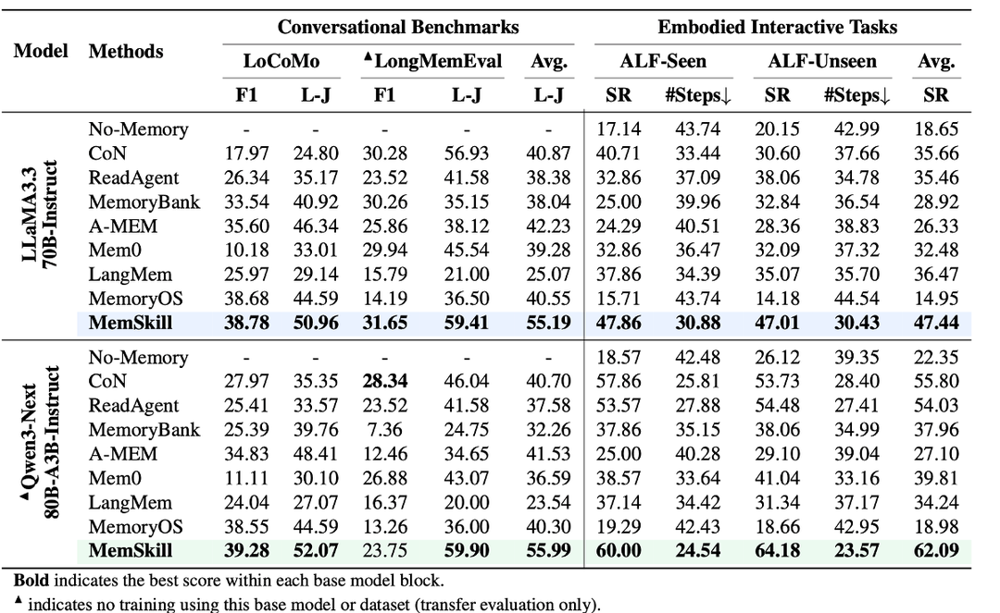

**亮点——Transfer Evaluation：**

- 在 LLaMA 上训练所得的 Controller & Skill 迁移到 Qwen 上仍然有效；
- 在 LoCoMo 上训练所得的 Controller & Skill 迁移到 LongMemEval 上仍然有效。

由于 Base LLM 不动，仍归为"无训练"类。但 MemSkill 给前面两篇工作提供了一条参考思路：**在训练集上构建 Skill，在测试集/其他数据集上评估**。当然，这种做法下"喂给 Agent 的样本顺序"就变得很重要。

#### MemRL：把"检索记忆"本身训成一个 RL 策略

> 📄 **原文**：arXiv [2601.03192](https://arxiv.org/abs/2601.03192)　|　🧬 **层级**：R3（记忆层）　|　**一句话**：不改 LLM 权重，而是把"检索哪条记忆"建模成 MDP，用非参数 RL 让 Agent 在运行时越用越会挑经验。

前面几篇的"进化"都发生在 Skill 文档上，MemRL 则把火力集中到**记忆检索**这一环，并给出了一个很锋利的批评：**传统 RAG 的检索是"被动"的——它只看候选记忆和当前查询"像不像"（语义相似度），却完全不管这条记忆当年"有没有用"（是否带来成功）。**

MemRL 的核心洞见借自人类的"构建性情景模拟"：我们回忆过去不是为了复述，而是为了合成新方案，而且会**记住哪些经验成功、哪些失败**。它把这一点形式化为——**将"检索哪条记忆"建模成一个马尔可夫决策过程（MDP）**：

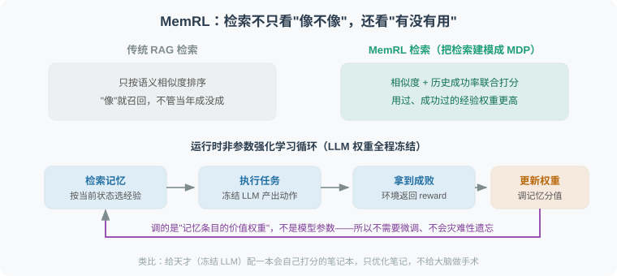

- **能力解耦**：稳定的推理能力交给**冻结的 LLM**（保证核心智商在线），可塑的适应能力交给一个**动态的外部记忆模块**；
- **检索即决策**：给定当前状态，"召回哪几条经验"是一个动作，其收益由下游任务成败提供 reward；
- **非参数 RL 更新**：训练调整的是**记忆条目的价值权重**（哪条经验更该被召回），而不是模型参数——因此天然**免微调、不会灾难性遗忘**。

一句话打比方：**给一个天才（冻结 LLM）配一本会自己打分的笔记本，只优化笔记的权重，不给大脑做手术。** 它和 MemSkill 是 R3 层的一对镜像——MemSkill 训"怎么管理记忆的策略网络"，MemRL 训"怎么给记忆条目排序的检索策略"，两者都验证了同一件事：**即使 base 模型冻结，只在记忆这一层做 RL，Agent 也能在部署后持续变强。**

#### CoEvoSkills：给每条 Skill 配一个"考官"

> 📄 **原文**：arXiv [2604.01687](https://arxiv.org/abs/2604.01687)　|　🧬 **层级**：R2　|　**一句话**：给每条新 Skill 配一个 Verifier"考官"，先过考试才准入库——把软件工程的"单元测试"搬进了 Skill 进化。

CoEvoSkills 直击 AutoSkill / EvoSkill 的共同软肋：**Skill 生成完就直接入库，质量全靠 LLM 自觉。** 它的回答很干脆——不能靠自觉，得有验证闭环。这也正是对 11.2.11.2 开头"评估缺位"通病的第一次正面回应。

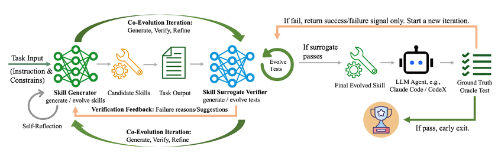

**核心组件——Generator + Verifier 双子星：**

- **Skill Generator**：从执行轨迹里提炼候选 Skill。除了写出 Skill 本身（描述 + 步骤），还要同步生成对应的**单元测试**（输入样例、期望输出、验证逻辑）。
- **Skill Surrogate Verifier**：在一个隔离的 sandbox 环境里跑 Generator 写的 Skill 与单元测试，返回结构化验证反馈（不是简单的 pass/fail，而是带"失败原因"和"建议修改方向"的自然语言反馈）。
- **Co-Evolution Iteration（共进化迭代）**：Skill 与 Test 同时进化——这跟传统软件开发里"先写测试再写代码"的 TDD 有点像。两者互相牵制，逐步收敛到"高质量 Skill + 高严谨度 Test"的稳态。

**两阶段验证：**

- **Surrogate 验证（廉价）**：内置的 Verifier 直接给反馈，跑得快、能快速迭代；
- **Oracle 验证（昂贵但权威）**：通过 Surrogate 的 Skill 还要在真实 LLM Agent 上跑端到端任务，只有真的解决了任务才算"进化成功"。

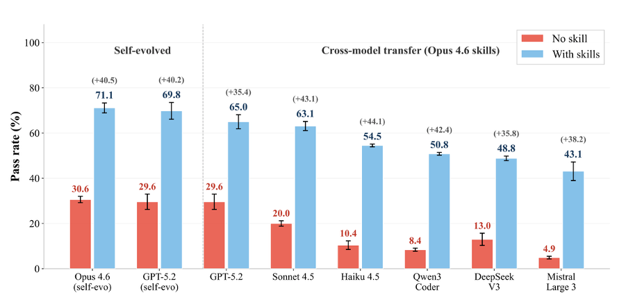

**亮点结论——Self-evo 优于 Cross-model Transfer：**

论文做了一组很有意思的对照实验，把强模型 self-evo 出来的 Skill 直接 transfer 到弱模型上，跟让弱模型自己 self-evo 比较，结果是：

- **self-evo**（强模型自己用自己的 Skill）：强模型从约 30% 提升到约 70%（+40 量级）；
- **cross-model transfer**（把强模型的 Skill 给到弱模型）：也有提升，但绝对值明显低于让模型自己 self-evo。

这个观察的含义是：**Skill 跟模型本身的"风格"是耦合的**——强模型生成的 Skill 在强模型自己上效果最好；强迁到弱模型上，弱模型未必能完整地"读懂并执行"那些精巧的步骤。一个非常实用的工程结论是：**与其花大钱让闭源强模型给你的产品蒸馏 Skill，不如让产品自己用的小模型来 self-evo**——前者贵且效果未必更好。

> ⚠️ 注意：虽然有"信号"，但实际上不涉及训练，仅仅是驳回 Generator 创建的 Skill。

**点评**：CoEvoSkills 的"测试驱动 Skill 进化"思路在 R2 层独树一帜，本质上是把 Verifier 当成"便宜的 reward model"用——这跟 R1 层训练 Curator 的逻辑已经很接近了，只差最后一步：把 Verifier 也训起来。

#### SE-Agent：从"单线程深度修补"到"多线程横向融合"

> 📄 **原文**：arXiv [2508.02085](https://arxiv.org/abs/2508.02085)（NeurIPS 2025）　|　🧬 **层级**：R2（但无长期 Skill 库）　|　**一句话**：与其在一条轨迹上反复自我反思，不如一次跑多条轨迹让它们互相借鉴融合。

SE-Agent 瞄准的是前面所有 self-refine / ReAct 类工作的共同短板——**单轨迹反思的视野太窄**：一条路走死了，再怎么反思也跳不出这条路的思维定式。它的破局点是把自进化从"纵向深挖一条轨迹"切换到"横向融合多条轨迹"。

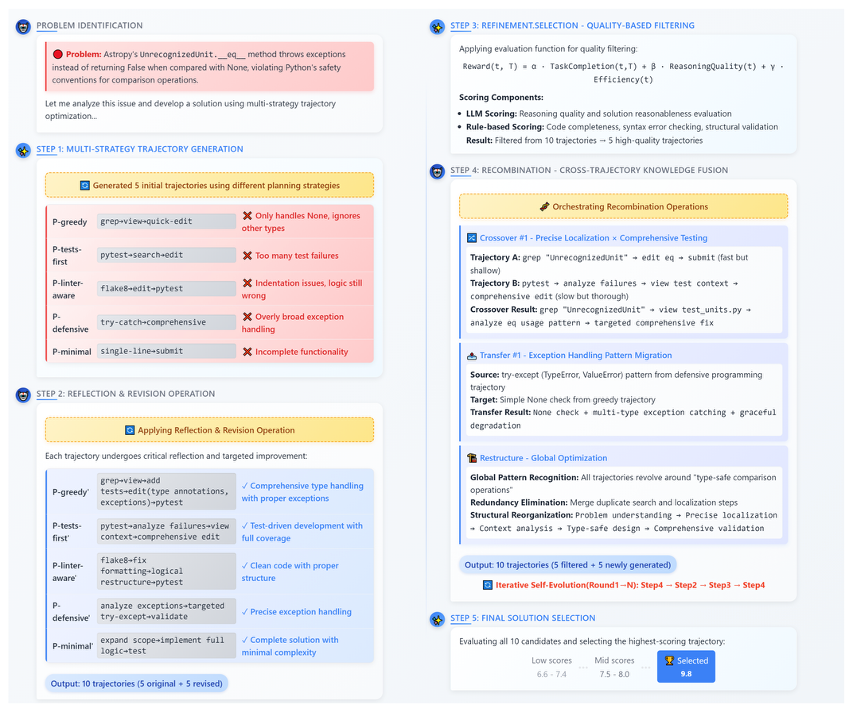

**完整五阶段流程：**

1. **多策略轨迹生成（Multi-Strategy Generation）**：用不同的"性格"采样 N 条轨迹。论文里给了 5 种典型策略——P-greedy（贪心快出）、P-tests-first（先写测试）、P-linter-aware（关注代码风格）、P-defensive（防御式编程）、P-minimal（最小可行）。
2. **反思修订（Revision）**：对每条轨迹独立做一遍传统 self-refine——这一步是"纵向"的（深耕单条轨迹）。
3. **质量过滤（Quality-based Filtering）**：用综合评分函数 `Reward(t,T) = α·TaskCompletion(t) + β·ReasoningQuality(t) + γ·Efficiency(t)` 给每条轨迹打分，把候选数从 10 条砍到 5 条。
4. **跨轨迹重组（Recombination）⭐ 核心创新**：对剩下的 5 条高分轨迹做三类操作：
   - **Crossover（交叉）**：把"轨迹 A 在步骤 5 的精确定位"嫁接到"轨迹 B 的全面测试覆盖"上；
   - **Transfer（迁移）**：把"防御式策略里学到的 try-except 异常处理"迁移到"贪心策略里缺失异常处理"的位置；
   - **Restructure（重构）**：识别多条轨迹共有的全局模式，统一抽象后做一次系统级重写。
5. **最终方案选取（Final Solution Selection）**：从 10 个候选（5 原始 + 5 重组）中选最高分的输出。整个流程可迭代多轮（论文里 N=4 时已收敛）。

**关键观察——横向 vs 纵向：**

- **修订（纵向）**：找出错误步骤并纠正——这是传统 self-refine 在做的事；
- **重组（横向）**：跨轨迹借用成功的子片段——这是 SE-Agent 的真正创新；
- **精炼（横纵融合）**：在重组后的轨迹上再做一轮纵向打磨。

> 💡 这个"横向 vs 纵向"的概念会贯穿本节——它是后面讨论"研究空白"时的一个重要锚点。

**评估：**

- 主战场是 **SWE-Bench Verified**（GitHub 真实代码修复任务）。SE-Agent 让多个底层 LLM 都拿到了显著提升，最高一档实现了 **+55% 相对改善**。
- 跟工业级 Coding Agent 也做了对比，验证了"轨迹级进化"是一个与底层模型选择正交的优化维度。

**点评**：SE-Agent 是 R2 层里思路最"野"的——它没有 Skill 库这种长期记忆机制，但用"一次性多采样 + 跨轨迹融合"的办法做到了类似效果。某种意义上它跟 R1 层的 SAGE（Sequential Rollout）是镜像关系：SE-Agent 是横向采，SAGE 是横向用。

#### SkillOpt：把 Skill 当成"可训练的外部状态"来优化

**TLDR**（arXiv: [2605.23904](https://arxiv.org/abs/2605.23904)，Microsoft）：前面几篇工作要么"一次性生成 Skill"，要么"松散地自我修订"，都不像一个真正的优化器。SkillOpt 的主张是——**把 Skill 文档当成冻结 Agent 的"外部状态"，用深度学习优化器那一套纪律（有界学习率、验证门、负反馈记忆）去训练它**。它自称是第一个"系统化、可控的文本空间 Skill 优化器"。

这篇工作可以看作 CoEvoSkills"验证闭环"思想的极致工程化版本：CoEvoSkills 给 Skill 配了"考官"，SkillOpt 则把整个 Skill 编辑过程改造成了一个**严格对齐深度学习训练循环**的流程。


*▲ SkillOpt 原论文 Figure 1（来源：Yang et al., Microsoft, arXiv:2605.23904）。左侧把"调 Skill"画成在 Skill 空间里沿损失地形下降：无约束的 ad hoc 更新会大幅跳变、不稳定；而有界编辑 + 留出验证门让优化稳定可控。*

**核心类比——把"调 Skill"对齐"调权重"：**

| 深度学习训练 | SkillOpt 对应物 |
|---|---|
| 模型权重 | 单个 Skill 文档（自然语言） |
| 优化器（如 Adam） | 一个独立的前沿模型（只在离线训练时调用，部署时完全不参与） |
| 前向传播 | 冻结目标模型用当前 Skill 在训练集上跑一批 rollout |
| 反向传播 | 优化器读取打分轨迹，分离成功/失败，提出结构化的 **add/delete/replace** 编辑 |
| 学习率 | **文本学习率预算**：每步最多接受的编辑条数（默认 4，配 cosine 衰减） |
| 动量项 | **epoch 级 slow/meta update**：跨轮总结稳定的编辑方向，写入受保护字段 |

**三个关键机制：**

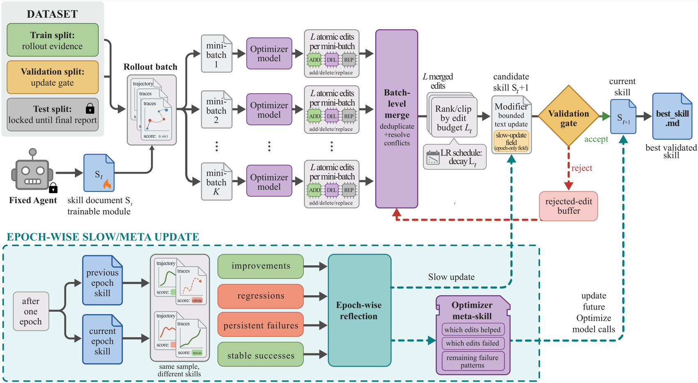

*▲ SkillOpt 原论文 Figure 2（流程图，来源同上）：可对照下面三个机制逐步理解。*

- **验证门（Validation Gate）**：候选 Skill 必须在留出选择集上**严格优于**当前版本才被接受（平局也拒绝），优于历史最佳才更新 `best_skill.md`。这是它跟 Trace2Skill、EvoSkill 等"生成完直接入库"工作最本质的区别。
- **拒绝编辑缓冲（Rejected-Edit Buffer）**：被验证门拒绝的编辑及其导致的分数下降会被记录下来，喂给后续反思调用，避免重复犯同样的错——相当于训练时的负反馈，且**不增加任何推理成本**。
- **文本学习率预算 + slow/meta update**：前者控制每步"步长"避免无界重写抹掉有用规则；后者承载跨 epoch 的稳定方向（消融实验里同时移除两者，SpreadsheetBench 从 77.5 暴跌到 55.0，是最大退化）。

**评估亮点（规模相当大）：**

- 横跨 **6 个 benchmark**（SearchQA、SpreadsheetBench、OfficeQA、DocVQA、LiveMathematicianBench、ALFWorld）、**7 个目标模型**（GPT-5.5/5.4/5.4-mini/5.4-nano/5.2、Qwen3.5-4B、Qwen3.6-35B-A3B）、**3 种执行 harness**（直接对话、Codex、Claude Code）——在全部 **52 个 (模型, benchmark, harness) 单元格上均为最佳或并列最佳**，逐项击败 human、one-shot LLM、Trace2Skill、TextGrad、GEPA、EvoSkill。
- 在 GPT-5.5 上，相比无 Skill 基线：直接对话 **+23.5 分**、Codex agentic loop **+24.8 分**、Claude Code **+19.1 分**。
- **极度紧凑**：学到的 Skill 通常 < 2,000 tokens，仅需 1–4 个被接受的编辑（如 LiveMath 的 +29.3 分仅来自**单个**编辑）。
- **可迁移**：优化好的 Skill 跨模型规模、跨 Codex↔Claude Code 执行环境、迁移到邻近数学 benchmark 都仍然有效，无需重新优化。

> ⚠️ 注意：虽然全程"训练"术语很重，但**目标模型始终冻结**，更新的只是外部 Skill 文档，优化器也不训练（仅推理）。因此仍归为 R2 技能层。

**点评**：SkillOpt 是 R2 技能层里**工程化程度最高**的一篇，它几乎把"Prompt/Skill 空间优化"做到了和权重训练同构的程度——验证门、学习率、负反馈缓冲、动量一应俱全。它和 11.1 节的 TextGrad/GEPA 是近亲（都是文本空间优化），区别在于：TextGrad/GEPA 优化的是 **prompt**，而 SkillOpt 优化的是**可持久化、可导出、可复用的 Skill 文档**，并且引入了 prompt 优化方法普遍缺失的"留出验证门"。

#### R2 技能层小结：看似不训练，其实仍靠数据

- **核心点 1：看似不训练，其实仍要训练数据**。无论靠人为交互反馈还是训练集反馈，本质都是训练数据，没有真正做到"零数据"。
- **核心点 2：灵魂是"把经验存成可复用资产"**。这一层的价值全在于把交互副产物沉淀成可检索的 Skill 文档。
- **核心点 3：总结这一步被严重低估**。几乎所有工作都默契地把"Skill 总结"交给冻结的 base 或独立大模型——这本该是全链路最关键的环节，却几乎没人针对它做优化（这个伏笔会在 11.2.11.5 引爆）。
- **核心点 4：横向 vs 纵向总结**：绝大多数工作是**纵向**（基于单条历史轨迹总结），只有 SE-Agent 是**横向**（基于多次采样的多条轨迹总结）。这个区分是后面讨论研究空白的重要锚点。

---

### 11.2.11.3 R1 参数层：把经验训进权重（重点）

> **这一层的共同特征**：通过 RL/SFT 直接更新模型权重，让模型从根本上"长本事"，而不只是查外挂笔记。这是当前学术界与工业界的主流方向。

R2/R3 的经验存在模型之外，用的时候要检索、要占上下文；R1 则更彻底——把经验通过训练**内化进权重**，让能力成为模型的"本能"。这一层的看点，是各篇工作在"**谁被训练、谁被冻结**"上的不同选择，我们会用后面 11.2.11.5 的"三角色"视角反复回看。

#### EvolveR：离线蒸馏原则 + 在线检索行动

> 📄 **原文**：arXiv [2510.16079](https://arxiv.org/abs/2510.16079)　|　🧬 **层级**：R1（在线阶段更新权重）　|　**一句话**：这一层的基础型，离线把轨迹蒸馏成"策略原则"，在线检索原则指导行动并反哺训练。

EvolveR 是 R1 层最好的入门样例，因为它清晰地把"存经验"和"练权重"两件事拆成两个阶段交替进行：


- **离线阶段（参数冻结）**：Agent 跑完一批任务后，对所有轨迹做提炼，把具体的交互步骤抽象成更通用的"策略原则"，存入原则库（策略原则可以视作一种 Skill）。
- **在线阶段（参数更新）**：Agent 在新任务里实时检索这些原则，指导自己的行动，同时又产生新轨迹反哺下一轮蒸馏训练。

**Reward 设计**：最终结果 reward + 格式 reward。
**评估**：Natural Questions、HotpotQA、TriviaQA、PopQA。

> ⚠️ 注意：看起来很像"RL by talking"，但仍然要靠标注数据集的 Ground Truth 去训练。talking 产生的数据只用来蒸馏经验/skill，不用来当训练标签。

#### SAGE：Sequential Rollout

> 📄 **原文**：arXiv [2512.17102](https://arxiv.org/abs/2512.17102)　|　🧬 **层级**：R1（含 Skill 奖励）　|　**一句话**：RL rollout 时串行跑一串相似任务，让后序任务能直接复用前序刚生成的 Skill。

SAGE 的巧思在于重新设计了 RL 的 rollout 方式：

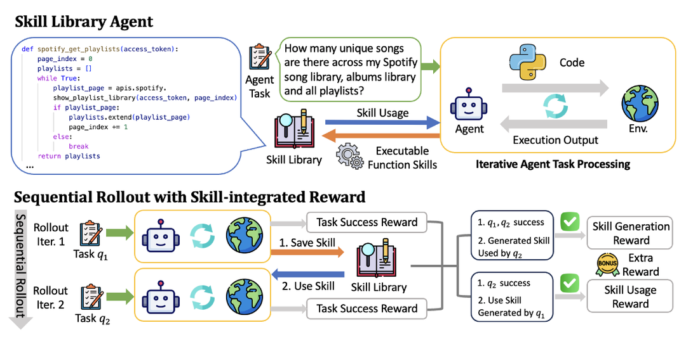

这个思路很巧妙：每次 rollout 不是跑一个任务，而是让 Agent 依次跑一串相似的任务。跑早期任务时积累下来的技能，在同一个 rollout 里的后续任务里就能直接用。这意味着在训练过程中，模型就被迫学会"生成技能"和"复用技能"，不只是会完成任务。

除了任务完成的结果奖励，SAGE 还设计了 **Skill-integrated Reward**——额外的信号专门激励技能的生成和调用。评估数据集是 **AppWorld**（APP 交互数据集）。

#### SkillRL ⭐：强模型蒸馏 Skill，弱模型 RL 学会用

> 📄 **原文**：arXiv [2602.08234](https://arxiv.org/abs/2602.08234)　|　🧬 **层级**：R1　|　⭐ 本节重点关注的四篇工作之一。

**核心主张**：用强模型（如 o3 级别）蒸馏 Skill，再通过 RL 训练弱模型学会使用，并递归进化技能库。

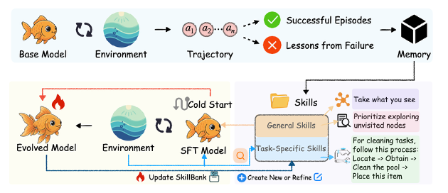

**统一三角色梳理：**

| 角色 | 配置 |
|---|---|
| 训练题目来源 | 官方数据集训练集：ALFWorld（约 7,500 条 SFT）、WebShop（约 2,400 条 SFT）、若干搜索 QA 数据集 |
| 出题者 | 无独立出题者，直接使用数据集 |
| 解题者 | Qwen2.5-7B-Instruct ✅ 训练（Cold-start SFT → GRPO RL） |
| Skill 总结者 | 强模型（o3 级别）❌ 不训练 |

**Skill 总结机制：**

- 成功轨迹 → 提取关键决策点与可迁移模式；
- 失败轨迹 → 合成失败教训（失败点 + 错误推理 + 应对策略）；
- 压缩比：10–20×。

**总体流程**：解题者交互 → 轨迹交给总结者总结 skill → 下一轮训练时使用。

**主要实验结果：**

| 基准 | SkillRL | GRPO 基线 | 提升 |
|---|---|---|---|
| ALFWorld | 89.9% | 77.6% | +12.3% |
| WebShop SR | 72.7% | 66.1% | +6.6% |
| Search-QA avg | 47.1% | ~38.5% | +8.6% |

Skill 库增长：55 → 100 条（通用 12→20，任务专属 43→80）。

**核心设计哲学**：强模型提炼知识，弱模型通过 RL 学会使用知识。

> 💬 **点评**：我们倾向于把这种范式归类于蒸馏，而非真正的进化。

#### SKILL0 ⭐：把 Skill 从上下文内化进权重

> 📄 **原文**：arXiv [2604.02268](https://arxiv.org/abs/2604.02268)　|　🧬 **层级**：R1　|　⭐ 重点四篇之二。

**核心主张**：将 Skill 从推理时的"外挂上下文"内化到模型参数，实现零样本执行（每步 < 0.5K tokens）。


| 角色 | 配置 |
|---|---|
| 训练题目来源 | 直接继承 SkillRL 的 SkillBank（ALFWorld / WebShop / Search-QA 官方训练集） |
| 出题者 | 无 |
| 解题者 | Qwen2.5-VL-3B/7B-Instruct ✅ 训练（三阶段渐进课程） |
| Skill 总结者 | 继承 SkillRL 的强模型，❌ 不训练 |

**三阶段渐进课程：**

| 阶段 | Skill 数量 | 目标 |
|---|---|---|
| Stage 1 | 6 条 | 学会调用 |
| Stage 2 | 3 条 | 减少依赖 |
| Stage 3 | 0 条 | 完全内化 |

**核心设计哲学**：从"使用技能"到"内化技能"的范式转变——消除推理时的检索成本、Token 开销和噪声，把知识真正固化进模型权重。

> SKILL0 不关心 Skill 从哪里来，只关心如何内化。它本质上是 SkillRL 的"下游消费者"。

#### SkillOS ⭐⭐：训练一个专门的 Curator

> 📄 **原文**：arXiv [2605.06614](https://arxiv.org/abs/2605.06614)　|　🧬 **层级**：R1（只训 Curator）　|　⭐⭐ 四篇里我们认为**最有启发性**的一篇。

**核心主张**：训练一个专门的 **Curator**，通过 RL 学会如何增/改/删 SkillRepo，而不是直接学如何使用 Skill。

| 角色 | 配置 |
|---|---|
| 训练题目来源 | Agentic（ALFWorld、WebShop 官方训练集）+ 推理（DeepMath-103k 随机采样约 33,000 条）；两步预处理：强模型标注属性标签 → 按相似度分组（group_size=8） |
| 出题者 | 强模型 ❌ 不训练，仅离线标注每个任务的技能相关属性 |
| 解题者 | Executor ❌ 冻结，不训练；训练时用 Qwen3-8B；测试时换用多种规模模型；ReAct（Agentic 任务）+ CoT（推理任务） |
| Skill 总结者 | Qwen3-8B Curator ✅ GRPO RL 训练 |

**核心设计哲学**："学会如何管理技能，而不是学会如何使用技能"——Executor 冻结，只训练 Curator，通过长周期间接奖励信号学习 Skill 的增删改策略。


这篇工作给出了两个对后续研究极其重要的结论：

- **结论 1：训练过的小模型总结者 > 冻结的大模型总结者**。RL 训练过的 Qwen3-8B 作为 Curator，效果超过直接用冻结的大模型作为 Curator。说明"如何管理 skill"本身是一项可被训练的能力，而且小模型经过专门训练后能压过大模型直接使用。
- **结论 2：不动解题者，性能也能涨**。在 ALFWorld 上，仅训练 Curator、解题者完全冻结的情况下，整体性能仍能取得长足进步。"换 Curator"是一条比"换 Executor"更轻量的优化路径。

#### AgentEvolver ⭐：完全自主的三环自演化

> 📄 **原文**：arXiv [2511.10395](https://arxiv.org/abs/2511.10395)　|　🧬 **层级**：R1（自出题，零人工数据）　|　⭐ 重点四篇之四。

**核心主张**：完全自主的**三环自演化框架**——自出题、自解题、自总结经验，全链路无需人工标注。

| 角色 | 配置 |
|---|---|
| 训练题目来源 | 环境探索生成（Self-Questioning），全自动 |
| 出题者 | LLM 自身（与解题者同一模型）✅ |
| 解题者 | Qwen2.5-7B/14B-Instruct ✅ 训练 |
| Experience 总结者 | Experience Manager ❌ 不训练（本质是一套记忆管理机制） |

**Self-Questioning 四步流程：**

1. **探索**：高温 LLM 广度优先（N_b 步）+ 深度优先探索环境；
2. **合成**：从探索轨迹蒸馏 + 用户偏好约束 → 生成任务 g 与参考解；
3. **筛选**：词法去重 + 语义相似度 + 可行性验证；
4. **混合（可选）**：`p_hybrid = (1−λ)·p_target + λ·p_task`。

**特点**：出题与解题使用同一个 Qwen2.5-7B/14B，RL 训练后形成出题质量与解题能力的双重提升。

#### R1 参数层小结

- **核心点 1**：除 AgentEvolver 外，仍然依赖训练集反馈提供 reward；
- **核心点 2**：进化的抓手是"RL rollout 时继承/更新之前的 Skill"，让"生成技能"和"复用技能"都变成被训练的能力；
- **核心点 3**：这里的"talking"不是严格意义的"RL by talking"——反馈仍来自任务结果或人工标签，而非交互对话本身。

---

### 11.2.11.4 零数据自学：连数据集都不要

> **这一层的共同特征**：完全不用人工标注数据，靠 Agent 之间互相出题、互相解题的闭环自我驱动。它在 R1（更新权重）的基础上，进一步摆脱了"是否依赖人工数据"这把尺子的约束。

前面所有工作（除 AgentEvolver）都还要靠数据集喂题喂答案，这一类的精神更激进：**连题库都自己造**——一个 Agent 出题，一个 Agent 解题，谁也不靠人类。它的成败，几乎全系于两个要害：**答案怎么判对错（验证信号从哪来）**，以及**题目难度怎么控制**。

#### Agent0：一个出题、一个解题

> 📄 **原文**：arXiv [2511.16043](https://arxiv.org/abs/2511.16043)　|　🧬 **零数据自学**　|　**一句话**：学习工具使用，一个 Agent 出题、一个 Agent 解题，交替 RL。

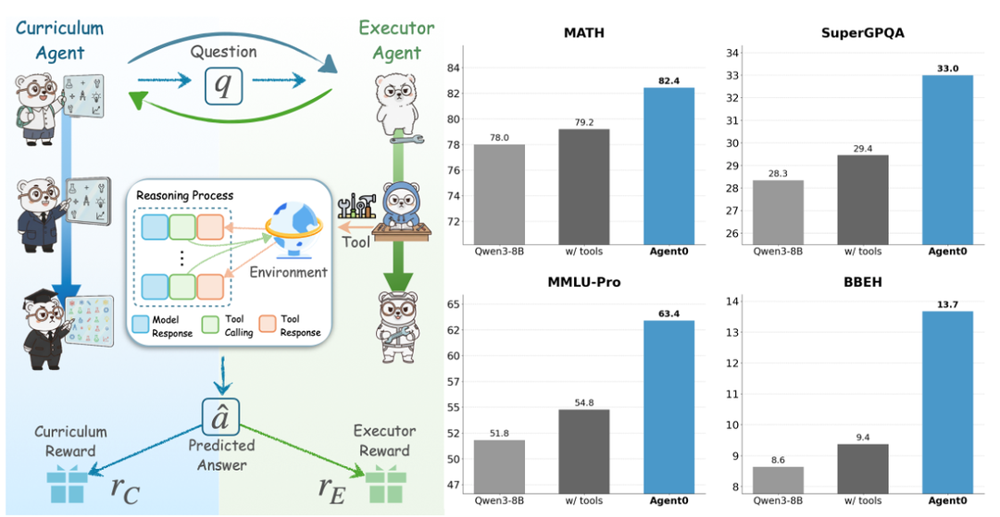

**组件：**

- **Curriculum Agent (RL)**：负责出题；reward = 答题 Agent 的不确定性 + 工具使用频率；
- **Executor Agent (RL)**：负责解题；reward = 解题成功率。

**流程：**

1. 出题 Agent 先 RL 训练（答题 Agent 冻住作为 reward model）；
2. 出题 Agent 冻住，给答题 Agent 出题做 RL 训练。

> ⚠️ 隐患：解题成功率 reward 上有一个比较大的问题——题目的答案是 Curriculum Agent 自己多采样投票选出来的 **silver answer**（伪标签），其可靠性需要打问号。

评估集：数学类为主（GSM8K、AIME 等）。

#### Tool-R0：把 Agent0 思路搬到 general tool

> 📄 **原文**：arXiv [2602.21320](https://arxiv.org/abs/2602.21320)　|　🧬 **零数据自学**　|　**一句话**：把 Agent0 的思路从纯数学搬到通用工具调用。


**Reward 设计：**

- **Generator Agent**：格式 reward + 合法性 reward（不能有幻觉 tool）+ 难度 reward（不能太难太简单）；
- **Solver Agent**：格式 reward + 准确性 reward。

> ⚠️ 同样的隐患：答案仍然是 Generator Agent 自己生成的 silver answer。

评估集：ToolAlpaca、SealTool、NexusRaven。

#### Absolute Zero：用代码执行器作唯一裁判

> 📄 **原文**：arXiv [2505.03335](https://arxiv.org/abs/2505.03335)　|　🧬 **零数据自学**　|　**一句话**：单个模型自出自解，用代码执行器当唯一裁判，彻底不碰外部数据。

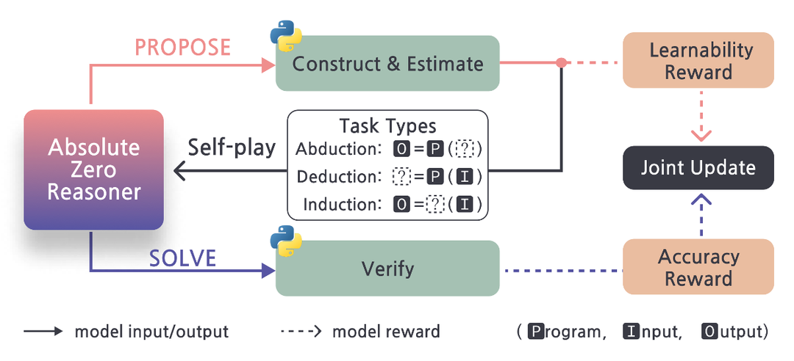

**组件：**

- **出题 Agent**：reward = 1 − 答题 Agent 成功率；但成功率为 0 时 reward 也为 0（避免出太难的题）；
- **答题 Agent**：reward = 解题成功率。

**出题流程**：题目为 `[输入, 代码, 输出]` 三元组，随机删除一个让答题 Agent 猜测，**以代码执行器为最终判断标准**。这是一个非常聪明的设计——它把"判分"这件事完全外包给了一个绝对客观的执行环境，从根本上回避了 silver answer 的可靠性问题。

评估集：

- 代码：HumanEval、MBPP、LCB；
- 数学：AIME24、AIME25、AMC、MATH-500、Minerva、Olympiad。

#### 零数据自学小结：自由的代价是可靠性

通用流程：`出题 Agent 训练 → 出题构造数据集 → 解题 Agent 训练 → 出题 Agent 训练 …`

- **核心点 1**：题目全靠出题 Agent 自己生成，摆脱了对人工数据集的依赖；
- **核心点 2**：最大隐患是 **silver answer**——准确率判断大多对照出题 Agent 自己给的答案，其可靠性存疑；
- **核心点 3**：破解隐患的关键是**引入客观外部裁判**，Absolute Zero 用代码执行器就是范例；
- **核心点 4**：**出题难度的 reward shaping 是核心难点**——太难学不会、太简单学不到，必须精细调；
- **核心点 5**：评估很混乱——除数学类 benchmark 勉强多次出现外，其余几乎没有重叠，横向可比性差。

---

### 11.2.11.5 横向对比：四篇代表工作的“三角色”视角

R1 参数层里的 **SkillRL → SKILL0 → SkillOS → AgentEvolver** 这四篇值得专门拎出来横向对比，因为它们最能反映长程 Agent 自进化的范式演进。这里引入本节第二个核心工具——**"三角色"视角**：任意一套自进化系统，无论落在哪一层，本质都可拆成 **出题者 / 解题者 / 总结者** 三个角色，区别只在于"谁被训练、谁被冻结"。这把尺子比 R1–R4 更细，专门用来看"训练资源投在了哪个角色身上"。

#### 核心对比表

| 论文 | 训练题目来源 | 出题者 | 解题者（训练？） | Skill/Experience 总结者（训练？） |
|---|---|---|---|---|
| SkillRL | 官方数据集训练集 | — | Qwen2.5-7B ✅ 训练 | 强模型 ❌ |
| SKILL0 | 官方数据集训练集 | — | Qwen2.5-VL-3B/7B ✅ 训练 | 强模型（继承）❌ |
| SkillOS | 官方数据集训练集 | 强模型（仅离线分组 ❌） | Executor 冻结 ❌ | Qwen3-8B Curator ✅ |
| AgentEvolver | 完全自动生成 | LLM 自身（与解题者同模型）✅ | Qwen2.5-7B/14B ✅ | Experience Manager ❌ |

#### 一行式速记

- **SkillRL**：[训练集 ✅依赖] [解题者 ✅训] [总结者 ❌]
- **SKILL0**：[训练集 ✅依赖] [解题者 ✅训] [总结者 ❌]
- **SkillOS**：[训练集 ✅依赖] [解题者 ❌] [总结者 ✅训] ← **唯一训练总结者的工作**
- **AgentEvolver**：[出题者 ✅训] [解题者 ✅训] [总结者 ❌]

#### 强模型依赖程度

| 方法 | 依赖的强模型 | 用途 |
|---|---|---|
| SkillRL | o3 级别 | Skill 总结（核心） |
| SKILL0 | o3 级别（继承） | Skill 总结（核心） |
| SkillOS | 强模型（辅助）+ Judge 模型 | 标注分组 + 质量评估 |
| AgentEvolver | 大模型 API | Experience 提取 + 总结 |

> 可以看到：**总结这一步，几乎所有人都默契地外包给了大模型 / 闭源 API**，这跟前面在 R2 技能层小结里观察到的现象高度吻合。

#### 范式演进脉络

```text
SkillRL
  强模型提炼知识 → 弱模型 RL 学会使用 → 递归演化技能库
    ↓
SKILL0
  同样的技能库 → 渐进撤回 → 内化进参数 → 零样本执行（无检索开销）
    ↓
SkillOS
  冻结执行者 → 训练 Curator → 学会如何管理技能（增/改/删）
    ↓
AgentEvolver
  全链路自主 → 自出题 + 自解题 + 自总结 → 步骤级信用分配
```

---

### 11.2.11.6 关键洞察：被忽视的“总结者”

#### 总结者，是被严重低估的关键模块

把 R2 + R3 + R1 各篇的"是否训练总结者"列在一起：

| 工作 | 层级 | Skill 总结者是否训练 |
|---|---|---|
| AutoSkill | R2 | ❌ |
| EvoSkill | R2 | ❌ |
| MemSkill | R2/R3 | ❌（Base 冻结，仅训 Controller） |
| MemRL | R3 | ❌（训检索策略，不训总结） |
| CoEvoSkills | R2 | ❌ |
| SE-Agent | R2 | ❌ |
| SkillOpt | R2 | ❌（优化器为冻结前沿模型，仅推理） |
| EvolveR | R1 | ❌ |
| SAGE | R1 | ✅（序列 rollout 中带 reward 总结） |
| SkillRL | R1 | ❌（强模型 o3） |
| SKILL0 | R1 | ❌（继承） |
| SkillOS | R1 | ✅（唯一专门训练） |
| AgentEvolver | R1 | ❌（大模型 API） |

可以看到，**针对总结者本身做训练的工作屈指可数**——SAGE 算半个（在 RL 过程中有 skill reward），SkillOS 才是真正完整地把 Curator 当成主训练对象。而 SkillOS 给出的实验结论——**训练后的 8B Curator 优于冻结的大模型 Curator**——恰好印证了这件事的价值。

#### "评判者"其实有三层身份，别混为一谈

很多人会问：现在自进化研究似乎都在卷"执行者"的各种 Skill，为什么没人通过"优化评判者"来提升整体水平？这个直觉部分正确，但要先把"评判者"拆成三层，否则容易得出错误结论。


- **3a. 训练期 Reward Model / Verifier**（RLHF、过程奖励 PRM、RLVR、Generative Verifier）：这是整个 o1 / DeepSeek-R1 路线的核心，**研究极其充分**。在这一层，"优化评判者来提升整体"不仅有人做，而且是主战场——所以"没人研究评判者"的说法在这里**不成立**。
- **3b. 推理 / 评估期 LLM-as-Judge**（打分裁判、自我批评、CRITIC 工具验证）：有专门的评估研究线，但绝大多数工作是**直接拿冻结的大模型当裁判，很少去"训练"这个裁判本身**——这一层**半成立**。
- **3c. 自进化里的"总结者 / Curator"**：也就是本节反复强调的角色。它**几乎是空白**——11 篇代表工作里专门训练它的只有 SkillOS 一篇。"通过提升它来提升整体"这个观点，在这一层**完全成立**。

所以更精确的说法是：**"优化执行者 Skill"是显学；"训练评判 / 总结这一环"才是真正被冷落的角落，尤其是 3c。**

#### 一个必须配套的反向风险：评判者崩塌

但这条路有个致命前提：**评判者必须比执行者更可靠**。一旦评判者本身有偏差，你越在自进化的闭环里反复"优化"它，就越会把偏差固化、放大——这就是 **reward hacking / 评估者崩塌**。在没有外部锚点（代码执行器、单元测试、人工标注、可验证答案）的纯自循环里，"训练评判者"很容易退化成"训练一个越来越自信的错误裁判"。这也正是 Absolute Zero 坚持用代码执行器当唯一裁判、而非 silver answer 的原因（见 11.2.11.4）。

因此，本节的核心命题应当被精确表述为：

> **在有可信外部验证信号的前提下，把"评判 / 总结这一环"也变成可训练对象，是当前被严重低估的方向。**

#### 自主性 × 总结质量的二维空间

把四篇代表性工作放到两个维度上看：

```text
总结者训练
   ▲
   │  SkillOS
   │
   │
───┼──────────────► 题目自动生成
   │
SkillRL/      AgentEvolver
SKILL0
```

**右上方那个空白象限——既自动生成题目、又训练总结者——目前没有一篇工作覆盖。这是当前最显眼的研究空白。**

#### 横向 vs 纵向总结的融合空间

R2 技能层里的 SE-Agent 是**横向**（多次采样多条轨迹）总结，其余绝大多数工作都是**纵向**（单条历史轨迹）总结。这两者在 R1 参数层的工作里基本没有融合——SkillRL/SKILL0/SkillOS 仍以纵向为主。横向 + 纵向的融合会不会带来更稳健的 Skill 库？这是又一个开放问题。

---

### 11.2.11.7 写在最后

这一年多自进化 Agent 的研究节奏其实非常快，从"存技能"到"训技能"、从"依赖人工数据"到"零数据自训"，几乎每个月都能看到新工作冒出来。但仔细啃完之后会发现，还有大片研究空白没人去碰——尤其是"**总结者本身的训练**"和"**完全自主 + 训总结者**"这条交叉路径。

回过头看，这条赛道的本质问题其实只有一个：

> **如何让 Agent 在没有人工干预的情况下，把交互的副产物转化为下一次更强的能力？**

无论是把经验存进文件（R2/R3）、训进权重（R1），还是让 Agent 之间互相出题（零数据自学），所有路径都在回答这一个问题的不同侧面。而对工程实践者来说，最值得记住的三条结论是：

1. **总结者值得被专门训练**——SkillOS 证明了一个 8B 的专训 Curator 能压过冻结的大模型，这意味着"如何管理经验"本身是一项可学习、可优化的能力；
2. **Skill 与模型风格强耦合**——CoEvoSkills 提示我们，与其花大价钱让闭源强模型蒸馏 Skill，不如让线上自用的小模型 self-evo，既省钱效果又可能更好；
3. **"调 Skill"可以像"调权重"一样讲纪律**——SkillOpt 证明了，只要给文本空间优化引入验证门、有界学习率和负反馈记忆，不动任何权重也能稳定、可复现地把 Skill 训得越来越强，且部署时零额外开销；
4. **不改权重也能持续进化**——MemRL/MemSkill 证明了，哪怕 base 模型完全冻结，只在记忆这一层做 RL，Agent 部署后依然能越用越会挑经验——这是成本最低的一条自进化路径。

---

### 附录：评估数据集索引

| 数据集 | 使用工作 | 类型 |
|---|---|---|
| WildChat-1M | AutoSkill | 用户对话 |
| OfficeQA | EvoSkill | 办公图表 |
| LoCoMo / LongMemEval | MemSkill / MemRL | 长程对话记忆 |
| SkillBench | CoEvoSkills | 技能 |
| SWE-Bench Verified | SE-Agent | 代码修复 |
| SearchQA / SpreadsheetBench / OfficeQA / DocVQA / LiveMathematicianBench / ALFWorld | SkillOpt | 多领域（QA/表格/文档/数学/具身） |
| ALFWorld | SkillRL / SKILL0 / SkillOS | 具身/Agentic |
| WebShop | SkillRL / SKILL0 / SkillOS | 网页购物 |
| Search-QA | SkillRL / SKILL0 | 检索问答 |
| AppWorld | SAGE | APP 交互 |
| NQ / HotpotQA / TriviaQA / PopQA | EvolveR | 检索问答 |
| DeepMath-103k | SkillOS | 数学推理 |
| GSM8K / AIME | Agent0 | 数学 |
| ToolAlpaca / SealTool / NexusRaven | Tool-R0 | 工具使用 |
| HumanEval / MBPP / LCB | Absolute Zero | 代码 |

---

*下一章：[第12章 LangChain 深入实战](../chapter_langchain/README.md)*


## 参考文献

1. Shinn et al. [**Reflexion: Language Agents with Verbal Reinforcement Learning**](https://arxiv.org/abs/2303.11366). NeurIPS 2023.
2. Madaan et al. [**Self-Refine: Iterative Refinement with Self-Feedback**](https://arxiv.org/abs/2303.17651). NeurIPS 2023.
3. Gou et al. [**CRITIC: Large Language Models Can Self-Correct with Tool-Interactive Critiquing**](https://arxiv.org/abs/2305.11738). ICLR 2024.
4. Wang et al. [**Voyager: An Open-Ended Embodied Agent with Large Language Models**](https://arxiv.org/abs/2305.16291). TMLR 2024.
5. Hu et al. [**Automated Design of Agentic Systems**](https://arxiv.org/abs/2408.08435). ICLR 2025.
6. Robeyns et al. [**A Self-Improving Coding Agent**](https://arxiv.org/abs/2504.15228). 2025.
7. AutoSkill. arXiv:2603.01145.
8. EvoSkill. arXiv:2603.02766.
9. MemSkill. arXiv:2602.02474.
10. MemRL. arXiv:2601.03192.
11. CoEvoSkills. arXiv:2604.01687.
12. SE-Agent. arXiv:2508.02085.
13. SkillOpt. arXiv:2605.23904.
14. EvolveR. arXiv:2510.16079.
15. SAGE. arXiv:2512.17102.
16. SkillRL. arXiv:2602.08234.
17. SKILL0. arXiv:2604.02268.
18. SkillOS. arXiv:2605.06614.
19. AgentEvolver. arXiv:2511.10395.
20. Agent0. arXiv:2511.16043.
21. Tool-R0. arXiv:2602.21320.
22. Absolute Zero. arXiv:2505.03335.

## 小结

Self-Evolution Agent 的本质是：**让 Agent 从自身运行轨迹中提取经验，并把经验转化为可复用、可验证、可回滚的能力资产**。

关键要点：

- **自我进化不等于自动改模型权重**：记忆、Prompt、Skill 和流程优化往往更低成本、更安全。
- **进化必须闭环**：执行、记录、评估、归因、改进、验证缺一不可。
- **失败样本非常重要**：它们能暴露边界、触发规则修正，并生成偏好学习数据。
- **风险控制优先**：任何自我修改都要有权限边界、回归测试和回滚机制。
- **与数据飞轮互补**：Self-Evolution 负责快速系统级改进，数据飞轮负责长期模型级增强。

当 Agent 能够稳定完成任务、记住教训、沉淀技能，并把轨迹反哺训练系统时，它就不再只是一个“会调用工具的聊天机器人”，而开始具备持续成长的能力。

---

*下一节：[11.3 Agentic 数据飞轮：让 Agent 自我进化](./03_data_flywheel.md)*
