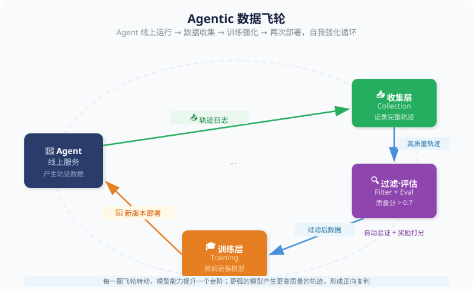
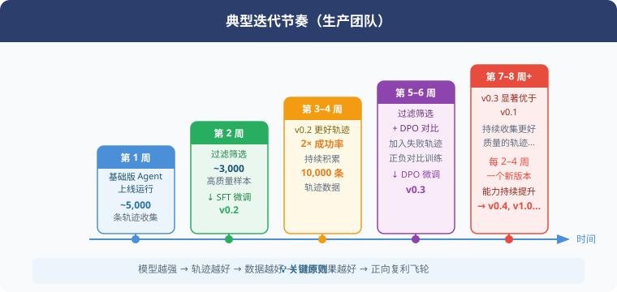
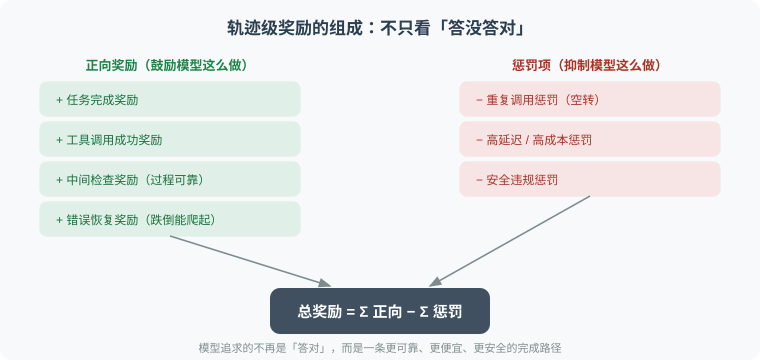

# 11.3 Agentic 数据飞轮：让 Agent 自我进化

> 🔄 *"最好的训练数据不是人工标注的，而是 Agent 在真实环境中成功、失败、修正和完成任务时留下的轨迹。"*

[第 10.8 节](../chapter_agentic_rl/08_agent_finetuning.md) 解决了“如何构建第一批 Agent 训练数据”。但这只是起点。

真正强大的 Agent 系统遵循一个循环：**Agent 运行 → 产生轨迹 → 评估结果与过程 → 提取成功和失败信号 → 训练更强模型 → 更强模型产生更好轨迹 → ...**

这个闭环就是 **Agentic 数据飞轮（Agentic Data Flywheel）**——也是 DeepSeek、OpenAI、Anthropic 等顶尖团队能持续迭代的核心秘密之一。

从训练范式上看，数据飞轮是 Agentic-RL 的工程化形态：SFT 提供第一版可用策略，线上环境提供真实反馈，奖励与过滤系统把反馈变成训练信号，下一轮模型再进入环境继续试错。

---

## 为什么数据飞轮是 Agentic-RL 的关键？

如果只做一次 SFT，模型能力会停留在训练集覆盖范围内；如果有数据飞轮，模型会不断遇到新任务、新工具、新错误和新边界，并把这些经验转化为下一轮能力。

| 问题 | 一次性 SFT 的做法 | 数据飞轮的做法 |
|------|------------------|---------------|
| **普通 SFT 不足以训练 Agent** | 只学习已有专家轨迹 | 持续收集真实轨迹，补齐未覆盖场景 |
| **工具调用需要环境反馈** | 离线判断工具调用是否“看起来正确” | 记录工具是否真的执行成功、返回是否可用 |
| **多步任务需要轨迹级奖励** | 逐条学习 assistant 输出 | 按整条轨迹评估任务完成率、恢复率和成本 |
| **结果正确不等于过程可靠** | 只保留最终答对的样本 | 同时检查中间步骤、异常处理和重复调用 |
| **失败轨迹也有训练价值** | 失败样本通常被丢弃 | 失败被分类、修正、转化为偏好对和专项数据 |
| **Agent 越用越强** | 训练完成后能力冻结 | 使用越多，轨迹越多，薄弱点越清晰，迭代越快 |

这就是 Agentic-RL 与数据飞轮的关系：**RL 提供“如何从反馈中学习”的算法，飞轮提供“持续产生反馈”的系统**。

---

## 飞轮的整体架构



每一圈飞轮转动，模型能力提升一个台阶；台阶越高，产生的轨迹质量越好，下一圈的原材料更优质。

---

## 第一层：轨迹收集

飞轮的原材料是 Agent 运行时产生的**完整交互记录**（Trajectory）。收集时的核心原则是：**记录的不只是"问了什么、答了什么"，还要记录"过程好不好"所需的一切信号**。

一条轨迹至少要包含四类信息：

| 类别 | 关键字段 | 用途 |
|------|---------|------|
| 交互记录 | `messages`（完整 system/user/assistant/tool 序列）、`tool_definitions` | 训练时复现上下文 |
| 结果信息 | `task_completed`、`final_response` | 结果维度打分 |
| 成本信息 | `total_tool_calls`、`tool_call_failures`、`latency_ms`、`total_tokens` | 过程维度打分、效率惩罚 |
| 用户反馈 | `user_rating`（显式）、`user_followup`（隐式满意信号） | 免费的高质量标签 |

工程上有两个容易忽略但很关键的点——**采样**（高流量时不必每条都存）和**脱敏**（训练数据必须先去除 PII），而且整个收集过程要**异步**、不阻塞线上主流程：

```python
async def record(self, traj: AgentTrajectory):
    if random.random() > self.sampling_rate:   # 1. 采样
        return
    traj = self._anonymize(traj)                # 2. 脱敏（正则替换手机号/邮箱等 PII）
    await self.storage.save(traj)               # 3. 异步落库，不阻塞线上
    asyncio.create_task(self._score(traj))      # 4. 触发异步质量评分
```

---

## 第二层：质量过滤与标注

原始轨迹质量参差不齐，必须经过严格筛选才能进入训练集。

### 双维度过滤：结果 × 过程

单看"任务有没有完成"是不够的——一条**结果侥幸正确、但过程混乱**的轨迹（比如反复试错、乱调工具最后蒙对了）会污染训练集。所以质量分要从两个维度加权：

- **结果维度**（约占一半）：显式满意度（用户评分）、隐式满意度（用户是否继续追问）、任务是否实质完成。
- **过程维度**（约占一半）：工具调用成功率、效率（步数惩罚，避免空转）、格式合规性（工具调用是否都是合法 JSON），以及可选的奖励模型打分。

实现上就是把这些子分数按权重加权平均，再用一个阈值（经验值 `0.7`）卡住入选线：

```python
def compute_quality_score(self, traj) -> float:
    scores = {
        # 结果维度
        "satisfaction":   traj.user_rating / 5.0 if traj.user_rating else 0.5,
        "task_completion": 1.0 if traj.task_completed else 0.2,
        # 过程维度
        "tool_success":   1 - traj.tool_call_failures / max(traj.total_tool_calls, 1),
        "efficiency":     1.0 if traj.total_tool_calls <= 5 else 0.5,  # 步数惩罚
        "format":         self._check_format_compliance(traj.messages),
    }
    # 各维度按权重加权平均，得到 0-1 的综合分
    return sum(scores[k] * self.weights[k] for k in scores) / sum(self.weights.values())

# 批量过滤：只保留 score >= 0.7 的高质量轨迹
```

> 💡 **权重不是玄学**：结果维度决定"该不该学这条轨迹"，过程维度决定"这条轨迹会不会教坏模型"。业务不同权重可调——例如客服场景把"满意度"调高，代码 Agent 把"格式合规"和"工具成功率"调高。

### 负样本的价值：失败的轨迹也有用

在 Agent 系统里，失败不是噪声，而是最密集的学习信号。成功轨迹告诉模型“这条路走通了”，失败轨迹则告诉模型“哪些动作看起来合理但实际上会导致任务失败”。

失败轨迹至少有三种用法：

1. **做偏好学习**：同一个任务下，成功轨迹作为 `chosen`，失败轨迹作为 `rejected`，用于 DPO/IPO 等偏好优化。
2. **做错误恢复 SFT**：截取到失败点之前的上下文，让强模型或人工专家补写正确的下一步。
3. **做 RL 奖励修正**：把高频失败类型转化为惩罚项，例如非法工具、重复调用、未检查结果、绕过审批。

| 失败类型 | 离线日志里的表现 | 训练价值 |
|---------|----------------|----------|
| 工具幻觉 | 调用了不存在的 API | 强化工具 schema 约束 |
| 参数错误 | 字段缺失、类型错误、单位错误 | 学习参数校验与自我修正 |
| 环境异常 | API 超时、网页元素变化、权限不足 | 学习重试、降级和求助策略 |
| 长程断链 | 忘记前面结果，重复执行同一步 | 学习状态跟踪和轨迹级规划 |
| 结果偶然正确 | 最终答对但步骤混乱、成本极高 | 学习过程奖励和成本控制 |

这也是为什么数据飞轮不能只收集“用户点赞”的样本。真正有价值的系统会同时收集高质量成功轨迹和可诊断失败轨迹，前者用于增强能力，后者用于修补边界。

落地时，"提取负样本"主要做两件事：一是把**同一任务下的成功轨迹（chosen）与失败轨迹（rejected）配成偏好对**，直接喂给 DPO；二是**定位轨迹里第一个出错的位置**，截取之前的上下文让强模型补写正确续写，形成"错误恢复"样本。核心片段如下：

```python
# 用法一：配成 DPO 偏好对
pair = {
    "prompt":   good_traj.messages[1]["content"],  # 同一个用户问题
    "chosen":   to_text(good_traj),                # 成功轨迹
    "rejected": to_text(bad_traj),                 # 失败轨迹
}

# 用法二：按错误类型分类，便于统计模型的高频短板
def classify_error(msg, available_tools) -> str:
    for call in msg.get("tool_calls", []):
        if call["name"] not in available_tools:
            return "hallucinated_tool"      # 工具幻觉：调用不存在的 API
        if not isinstance(call["arguments"], dict):
            return "invalid_format"         # 参数格式错误
    return "reasoning_error"                # 其余归为推理错误
```

---

## 第三层：自动标注与奖励模型

大部分线上轨迹是没有用户评分的，必须自动判断质量。这里有一条重要的分流原则：**能验证的直接验证，不能验证的才用模型打分**。

**① 可验证任务用规则奖励（RLVR 思路）。** 数学、代码、SQL 这类任务有客观答案，直接验证结果即可——这是最精准、零成本的奖励信号，也是 DeepSeek-R1 的核心做法。例如数学题就是提取答案数字做比对、代码题就是跑一遍看输出是否匹配：

```python
def verify_math(response: str, ground_truth: float) -> float:
    pred = extract_last_number(response)          # 提取回复里的最终数字
    if abs(pred - ground_truth) < 1e-6: return 1.0
    return 0.5 if relative_error(pred, ground_truth) < 0.05 else 0.0  # 近似正确给半分
```

**② 不可验证任务用 LLM-as-Judge。** 对话质量、文案好坏没有标准答案，只能让一个强模型当裁判，从推理质量、工具使用、错误处理等维度打分并输出结构化 JSON。关键的**成本技巧**是：不要对每条都调裁判，**只对质量分处在边界（如 0.5–0.7）的模糊样本**调用，明显好/坏的用规则分就够了，能省下大部分裁判开销。

> ⚠️ **别让裁判自己当裁判**：用来打分的模型应当比被评估的 Agent 更强或至少同级，否则会出现"弱模型给弱轨迹打高分"的系统性偏差。

---

## 第四层：训练与迭代

### 飞轮的迭代节奏



### 从 SFT 飞轮到 RL 飞轮

数据飞轮通常不是一开始就做完整 RL，而是分阶段演进：

| 阶段 | 主要训练方式 | 适合时机 | 核心收益 |
|------|--------------|---------|---------|
| **冷启动** | 人工/合成轨迹 SFT | 没有线上数据时 | 让模型学会基本工具格式 |
| **成功轨迹飞轮** | 高质量轨迹继续 SFT | 有少量真实用户时 | 提升常见任务稳定性 |
| **偏好飞轮** | DPO/IPO/奖励模型 | 有成功与失败对比时 | 让模型区分好过程和坏过程 |
| **Agentic-RL 飞轮** | GRPO/PPO/环境 rollout | 有可执行环境和奖励时 | 优化长期任务完成率与成本 |

关键判断标准是：当系统已经能稳定生成合法动作，但仍然在长任务、异常恢复和成本控制上不稳定时，就应该从“继续模仿成功样本”转向“在环境中优化轨迹收益”。

Agentic-RL 飞轮关注的不只是“这次是否完成”，而是一个更完整的收益函数——把正向奖励和惩罚项加在一起：



这样，模型不会只追求最终答案，而会学习一条更可靠、更便宜、更安全的完成路径。

### 混合训练：新数据 + 旧数据防止灾难性遗忘

飞轮迭代有个隐蔽的坑：如果每轮只用**当轮新收集**的数据微调，模型会逐渐忘掉早期学会的能力（**灾难性遗忘**）。解法是每轮训练时**掺入一部分历史高质量数据**——经验配比约"新 70% + 旧 30%"，且旧数据按质量分**加权采样**（越好的越可能被复用）：

```python
def prepare_training_data(self, new_data, memory_ratio=0.3):
    keep_old = int(len(new_data) / (1 - memory_ratio) * memory_ratio)
    old_data = weighted_sample(self.history, n=keep_old, key="quality_score")
    return shuffle(new_data + old_data)   # 新数据 + 加权抽样的旧数据
```

一轮完整迭代则把前面几层串起来：**过滤高质量样本 → 提取失败偏好对 → 混合新旧数据做 SFT →（偏好对够多时）再做 DPO → 在基准上评估新版本**。这条流水线就是飞轮"转一圈"的全部动作，其中 SFT 打底、DPO 精修的顺序对应上一段的分阶段演进表。

---

## 飞轮的三个关键加速因素

飞轮能转不代表转得快。以下三个因素决定了每一圈的"含金量"，也正是 2025–2026 前沿工作（见下文论文解读）重点强化的方向。

**1. 任务难度课程（Curriculum）。** 一上来就喂高难度长任务，模型只会全盘失败、产不出可用样本。正确做法是**由易到难分级**：从单工具调用起步，随迭代逐步放开步数上限（如"每 3 轮升一级"），让飞轮先在简单任务上转顺再爬坡。

**2. 探索性采样（增加多样性）。** 生产环境默认用低 temperature 保稳定，但这样轨迹会高度同质、覆盖不到"冷门路径"。技巧是**留出约 10% 的流量用高 temperature 运行**，专门去发现不常走的路径，为训练集注入多样性：

```python
# 90% 请求走稳定配置，10% 走探索配置
config = {"temperature": 0.8} if random.random() < 0.1 else {"temperature": 0.2}
```

**3. 合成数据扩充（覆盖盲区）。** 通过评估找出模型的**薄弱技能维度**（如"工具失败后的恢复"准确率只有 40%），再针对性地合成一批该场景的轨迹补进训练集——用"哪里弱补哪里"取代盲目扩量。

---

## 飞轮的效果：现实案例参考

| 团队 | 方法 | 迭代次数 | 效果 |
|------|------|---------|------|
| **DeepSeek** | GRPO + 自生成数学轨迹 | ~10 轮 | 数学推理从 GPT-4 级别追上 o1 |
| **Reflection-70B** | Self-reflection 自我批评 | ~5 轮 | Llama 70B 超越 GPT-4 (有争议) |
| **STaR / V-STaR** | 用正确推理链自举 | 5 轮 | 数学准确率 +40% |
| **AgentTuning** | 多任务 Agent 轨迹微调 | 1 轮 | 通用 Agent 能力 +30% |

> 📌 核心规律：**数据飞轮前 3 轮改善最快**（模型从"不会用工具"到"会用工具"的跨越），后续每轮收益递减，需要更精细的数据工程。

---

## 论文解读：飞轮思想的三篇奠基之作

上表里的方法不是凭空出现的。数据飞轮"用模型自己的产出训练更强的模型"这一核心思想，在 2022–2024 年被三篇论文逐步夯实。按时间顺序读它们，恰好能看清飞轮是怎样从"只捡成功样本"进化到"连失败也物尽其用"的。

### STaR（NeurIPS 2022）：飞轮的第一版——自举正确推理链

> 📄 **发表信息**：Zelikman et al.（Stanford），*STaR: Bootstrapping Reasoning With Reasoning*，**NeurIPS 2022**｜arXiv: [2203.14465](https://arxiv.org/abs/2203.14465)
>
> 🧬 **对应飞轮层**：第一层轨迹收集 + 结果维度过滤　|　**一句话**：让模型自己写推理过程，只留下能推出正确答案的，再拿去训练自己。

STaR 回答了一个当时很棘手的问题：想让模型学会"带推理链（rationale）地解题"，但**几乎没有人工标注的推理过程数据**——让人给几万道题逐一写解题步骤成本太高。STaR 的办法是让模型**自己造数据**：

1. **生成**：用少量 few-shot 示例，让模型对一大批题目生成"推理链 + 答案"。
2. **过滤**：只保留那些**最终答案正确**的推理链（这正是本节"结果维度过滤"的最早雏形——用可验证的答案当免费的质量信号）。
3. **微调 + 迭代**：拿这批筛出来的推理链微调模型，得到更强的模型，再回到第 1 步。

但纯靠这个循环有个死结：**难题模型一开始全做错，就永远产生不出正确样本**，飞轮在难题上转不动。STaR 的巧解是 **"合理化"（rationalization）**——对做错的题，把**正确答案作为提示**塞回给模型，让它"倒着"补写一个能圆上这个答案的推理链。这样难题也能贡献训练样本，飞轮就转起来了。这已经隐约触及"失败样本也能利用"的思想，但方式还很粗糙（本质是给答案抄）。

### ReST^EM（2024）：把飞轮形式化为"生成—改进"两阶段

> 📄 **发表信息**：Singh et al.（Google DeepMind），*Beyond Human Data: Scaling Self-Training for Problem-Solving with Language Models*，**2024**｜arXiv: [2312.06585](https://arxiv.org/abs/2312.06585)

如果说 STaR 给出了飞轮的直觉，ReST^EM 则把它**形式化成一个清晰的两阶段循环**，并证明它能规模化：

- **Generate（生成 / E-step）**：当前模型对每道题采样多个解答，用一个**可验证的奖励**（数学答案对错、代码能否通过测试）过滤出正确的，攒成一个新数据集。
- **Improve（改进 / M-step）**：只在这个筛过的数据集上做微调，得到下一版模型；然后回到 Generate。

它最重要的经验结论有两条，直接对应本节的工程判断：其一，**在可验证任务上，模型自己生成的数据能超过人工标注数据**的效果——这是"数据飞轮"作为独立范式成立的底气；其二，**收益随迭代递减**，几轮之后继续纯 SFT 自举就会饱和甚至过拟合。这正是本节强调"前 3 轮改善最快、之后要转向更精细数据工程（偏好学习、RL）"的实证来源。

### V-STaR（COLM 2024）：让失败轨迹终于派上用场

> 📄 **发表信息**：Hosseini et al.（Mila、Microsoft Research 等），*V-STaR: Training Verifiers for Self-Taught Reasoners*，**COLM 2024**｜arXiv: [2402.06457](https://arxiv.org/abs/2402.06457)
>
> 🧬 **对应飞轮层**：负样本的价值 + 偏好飞轮　|　**一句话**：STaR 把做错的解答全扔了，V-STaR 说——那些失败恰恰是训练"裁判"的最好养料。

V-STaR 一针见血地指出前两者的浪费：STaR/ReST 只用**正确**解答训练生成器，**海量的错误解答被直接丢弃**。可是"错误解答"里藏着极有价值的信号——它告诉我们"什么样的推理看起来对、其实错"。V-STaR 的做法是**双轨利用**：

- **正确解答** → 照旧用来 SFT 训练**生成器（generator）**，让它更会解题；
- **正确 + 错误解答配对** → 用 DPO 训练一个独立的**验证器（verifier）**，专门学习判断一个解答靠不靠谱。

推理时，生成器采样出多个候选解答，再由验证器打分选出最优的（best-of-n）。结果是：在同样的自生成数据下，V-STaR 相比只训生成器的 STaR，在数学和代码任务上有显著提升。

这篇论文对本节的意义最直接：它用实验证明了 **8.2 节"负样本的价值"绝非纸上谈兵**——失败轨迹经过恰当组织（配成偏好对训验证器），能带来单靠成功样本拿不到的增益。本节代码里 `NegativeSampleExtractor.extract_contrastive_pairs` 把成功轨迹当 `chosen`、失败轨迹当 `rejected` 的做法，正是 V-STaR 思路在 Agent 轨迹上的落地。

> 🧭 **三篇连起来看**：STaR 证明了"自举成功样本"可行（飞轮能启动）→ ReST^EM 把它形式化并揭示"收益递减"（飞轮怎么转、何时该换挡）→ V-STaR 补上"失败样本变裁判"（飞轮的另一半燃料）。从 STaR 到 Agent 数据飞轮，变的只是"轨迹"取代了"推理链"、"环境反馈"取代了"答案对错"，内核完全一致。

### 2025–2026 前沿：从"回放经验"到"主动进化轨迹"

上面三篇奠定了地基，但它们本质上仍是**被动**的——先攒一批轨迹，再筛、再训。2025 年之后，这个方向明显转向**闭环、自主、主动进化**：飞轮不再只是回放已有经验，而是主动去"造出"更难、更有信息量的新轨迹。以下三项工作代表了这一转向的三条路径。

**① BPO（arXiv:2508.03018, 2025）：为稀疏奖励长程规划设计的三段式飞轮。** 长程 Agent 任务有两个老大难——**信用分配**（任务几十步才有一次成败信号，RL 不知道该奖励哪一步）和**推理啰嗦**（逐步 CoT 历史太长、算力吃不消）。BPO 用 bootstrapping → extrapolation → refinement 三阶段应对：先用"长短 CoT 融合"引导出高效推理，再用**复杂度分层课程**外推到分布外任务，最后靠**奖励门控的拒绝采样**只在筛选过的经验上迭代自我精炼。它在 ALFWorld、ScienceWorld、WebShop 上以显著更低的 token 成本达到 SOTA——把本节"效率惩罚"和"课程"两个工程点做成了一套完整方法。

**② CoEvolve（2025）：Agent 与数据互相进化的无监督闭环。** 此前多数轨迹合成是**开环**的——先离线造一批任务，和 Agent 不断变化的失败模式"松散耦合"。CoEvolve 的主张是**闭环**：从 rollout 轨迹里提取"弱点信号"，用它提示 LLM **重新探索、发现新的可执行任务与状态**，再把这些新交互抽象、验证成可执行任务并入训练。于是训练分布随 Agent 能力**持续自适应漂移**，而非在固定题库里打转，且全程无需人类监督。这正是本节"合成数据扩充盲区"思想的自主化升级版。

**③ AutoMATES / STRIVE（2026）：把策略优化重构成"轨迹进化"。** 这项工作直接把飞轮和**进化算法**结合：通过多路径对抗生成、可学习的 critic 选择、领域感知的**轨迹变异**，主动 bootstrap 出高质量训练数据，而不是被动经验回放。消融实验显示"进化"这一步最关键——在 ALFWorld 上把一个 1.5B 小模型的成功率从 72.8% 拉到 97.2%，还能迁移到视觉语言任务（Sokoban 89.4%）。它印证了本节的判断：**当纯 SFT 自举饱和后，主动增加轨迹多样性（对抗生成 + 变异）是突破瓶颈的关键。**

> 📌 **趋势总结**：2022–2024 的飞轮解决"能不能转"，2025–2026 的飞轮解决"如何转得更久、更自主"。三个关键词——**闭环**（用失败信号反哺任务生成）、**课程**（由易到难分层外推）、**进化**（主动造出多样轨迹而非回放）。它们和本节代码里的 `CurriculumManager`、`BlindSpotFixer`、`ExploratoryAgentRunner` 一一对应，只是把这些"加速因素"从旁路技巧提升为训练范式的核心。

---

## 实战检查清单

开始构建你的 Agentic 数据飞轮之前，确认以下条件：

```
基础条件：
□ Agent 线上系统已稳定运行（每天 > 100 次调用）
□ 轨迹记录系统已部署（收集 system/user/tool/assistant 完整上下文）
□ 用户反馈渠道已接入（点赞/踩、满意度评分）

数据管道：
□ 脱敏流水线已就绪（GDPR/PIPL 合规）
□ 质量评分函数已实现并在 100 条样本上验证
□ 存储系统能支撑每天增量（建议用对象存储 + Parquet 格式）

训练条件：
□ 有 GPU 资源（至少 A100/H100 × 1，建议 × 4）
□ 训练代码已验证（本地小规模跑通）
□ 评估基准已定义（工具准确率、任务完成率等）

节奏规划：
□ 明确迭代周期（建议 2-4 周一次）
□ 有版本对比的 A/B 测试方案
□ 明确何时"停止迭代"的条件（边际收益低于阈值）
```

---

## 小结

Agentic 数据飞轮的本质是：**用 Agent 自身的运行数据来训练更强的 Agent，形成自我强化循环**。

更准确地说，它把三种信号合在一起：

- **成功信号**：哪些轨迹真的完成了任务
- **失败信号**：哪些动作导致了错误、卡住或高成本
- **过程信号**：哪些中间步骤让结果更可靠、更可复现

> 📋 **每一环的关键**
>
> - **收集**：记录完整轨迹，不只是输入输出，还要有工具调用细节
> - **过滤**：双维度（结果 × 过程），质量分 > 0.7 才入训练集
> - **标注**：可验证任务用规则奖励；不可验证用 LLM-as-Judge
> - **训练**：先 SFT，再偏好学习，最后在可执行环境中做 Agentic-RL
> - **部署**：保留 10% 探索流量（发现新场景）

飞轮启动需要初始模型和初始数据，但一旦转起来，**数据质量和模型能力会互相拉动提升**。这也是为什么“先发优势”在 Agent 领域如此重要——早一步启动飞轮，就早一步积累别人赶不上的环境反馈、失败案例和任务轨迹。

## 📝 本章练习

读完本章，先合上书用自己的话回答下面的问题，再展开参考答案对照。

**练习 1（概念）**：为什么说「一次性 SFT」会让模型能力停留在训练集范围内，而数据飞轮能持续突破？请用「原材料—产物」的关系解释飞轮的自我强化。

<details>
<summary>参考答案</summary>

一次性 SFT 的能力上界由训练集决定：模型只见过专家轨迹里出现过的任务、工具和错误类型，没见过的场景只能靠泛化去“猜”，遇到训练分布外的情况就容易崩。训练一结束，能力就冻结了。

数据飞轮的关键在于**产物会变成下一轮的原材料**：

- 更强的模型 → 在真实环境里跑出**更高质量的轨迹**（原材料变好）；
- 更好的轨迹 + 暴露出来的失败 → 训练出**更强的模型**（产物变好）；
- 如此循环，每转一圈能力上一个台阶。

换句话说，一次性 SFT 是「一锤子买卖」，飞轮是「利滚利」。模型用得越多，遇到的新任务、新工具、新错误越多，薄弱点越清晰，下一轮的针对性训练就越有效。这也是「先发优势」在 Agent 领域格外重要的原因——早启动飞轮，就早积累别人拿不到的环境反馈和失败案例。

</details>

**练习 2（辨析）**：有人说「数据飞轮只要收集用户点赞的成功轨迹就够了，失败轨迹是噪声应该丢掉」。这个说法对吗？失败轨迹到底有什么用？

<details>
<summary>参考答案</summary>

**不对**，而且恰恰相反——失败轨迹往往是**信息密度最高**的学习信号。成功轨迹只告诉模型「这条路走通了」，而失败轨迹告诉模型「哪些动作看起来合理、实际上会导致任务失败」，后者正是模型最需要补的短板。

失败轨迹至少有三种用法：

1. **偏好学习**：同一任务下，成功轨迹作 `chosen`、失败轨迹作 `rejected`，喂给 DPO/IPO。
2. **错误恢复 SFT**：截取到失败点之前的上下文，让强模型或人工补写正确的下一步。
3. **RL 奖励修正**：把高频失败类型（非法工具、重复调用、绕过审批等）转成惩罚项。

此外，只收集「点赞」样本还会带来**幸存者偏差**：训练集里全是顺利完成的情况，模型永远学不会处理异常、超时、权限不足这些真实世界里最常见的麻烦。所以成熟系统会同时收集高质量成功轨迹（增强能力）和可诊断失败轨迹（修补边界）。

</details>

**练习 3（动手）**：本章的 `TrajectoryFilter` 用「结果 × 过程」双维度打分。现在产品同学提出一个新需求：**如果一条轨迹触发了安全违规（如调用了未授权的工具），无论其他维度多高，都必须直接判为不合格**。请修改 `compute_quality_score`，加入这个「一票否决」逻辑。

<details>
<summary>参考答案</summary>

「一票否决」不能用加权平均实现（因为高分维度会把它平均回来），必须在计算加权分**之前**做硬性拦截（hard gate）。一种干净的写法是：

```python
def compute_quality_score(self, traj: AgentTrajectory) -> float:
    """综合质量分（0-1）。安全违规直接一票否决。"""

    # ── 硬性拦截：安全违规直接判 0，不再看其他维度 ──
    if self._has_safety_violation(traj):
        return 0.0

    scores = {}
    # ...（原有的结果维度 + 过程维度打分逻辑不变）...

    total_weight = sum(weights[k] for k in scores)
    return sum(scores[k] * weights[k] for k in scores) / total_weight

def _has_safety_violation(self, traj: AgentTrajectory) -> bool:
    """检查是否调用了未授权工具等安全违规行为"""
    for msg in traj.messages:
        if msg.get("role") != "assistant":
            continue
        for call in msg.get("tool_calls", []):
            if call.get("name") not in self.allowed_tools:
                return True
    return False
```

要点：

- **硬约束 vs 软约束要分开**。质量分是软约束（可以互相补偿），安全是硬约束（不可补偿），二者不能混进同一个加权公式。
- 把拦截放在函数最前面「早返回」，既省算力，也让「安全优先」的意图在代码里一目了然。
- 实际系统里 `allowed_tools` 应作为构造参数传入（参考本章 `NegativeSampleExtractor` 的改法），而不是硬编码。

</details>

---

## 参考文献

1. Zelikman et al. "STaR: Bootstrapping Reasoning With Reasoning." NeurIPS 2022. arXiv:2203.14465.
2. Singh et al. "Beyond Human Data: Scaling Self-Training for Problem-Solving with Language Models (ReST^EM)." 2024. arXiv:2312.06585.
3. Hosseini et al. "V-STaR: Training Verifiers for Self-Taught Reasoners." COLM 2024. arXiv:2402.06457.
4. Zeng et al. "AgentTuning: Enabling Generalized Agent Abilities for LLMs." 2023.
5. Chen et al. "Self-play Fine-tuning Converts Weak Language Models to Strong Language Models (SPIN)." ICML 2024.
6. Guo et al. "DeepSeek-R1: Incentivizing Reasoning Capability in LLMs via Reinforcement Learning." DeepSeek 2025.
7. Mitra et al. "AgentInstruct: Toward Generative Teaching with Agentic Flows." Microsoft Research 2024.
8. Wang, Ji et al. "Beyond Policy Optimization: A Data Curation Flywheel for Sparse-Reward Long-Horizon Planning (BPO)." 2025. arXiv:2508.03018.
9. "CoEvolve: Training LLM Agents via Agent-Data Co-Evolution." 2025.
10. Zhu et al. "STRIVE / AutoMATES: Self-Improving Agent Training via Evolutionary Trajectory Flywheel." 2026.

---

*下一章：[第12章 LangChain 深入实战](../chapter_langchain/README.md)*
