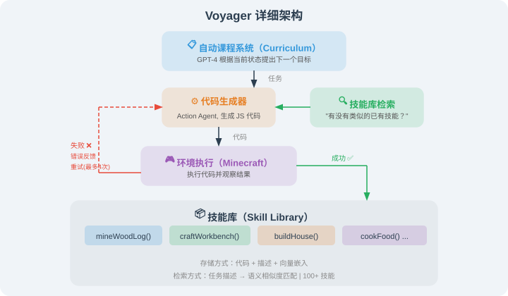
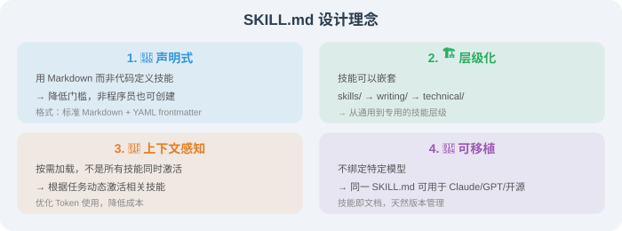
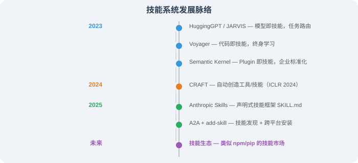
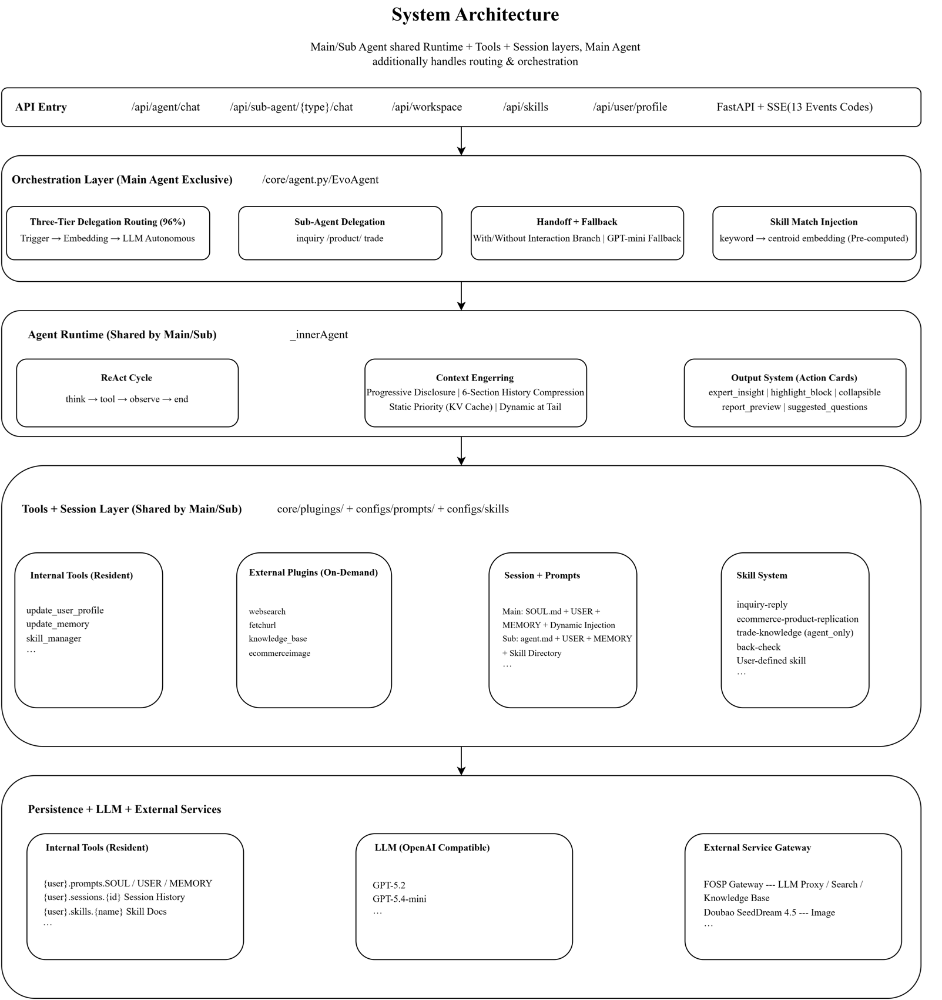
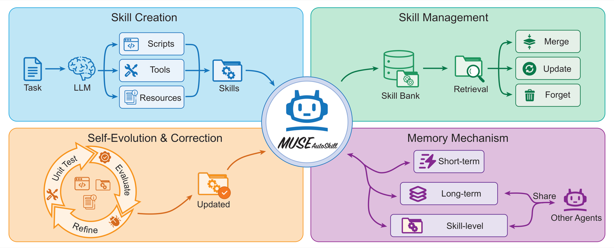

# 9.6 论文解读：技能系统前沿研究

本节解读与 Agent 技能系统相关的核心论文，涵盖技能学习、工具创造和技能生态三个方向。

---

## Voyager：LLM 驱动的终身学习 Agent

**论文**：*Voyager: An Open-Ended Embodied Agent with Large Language Models*  
**作者**：Wang et al., NVIDIA & Caltech  
**发表**：2023 | [arXiv:2305.16291](https://arxiv.org/abs/2305.16291)

### 核心问题

在开放世界环境中，Agent 能否像人类一样**持续探索、不断学习新技能**，而不是只能完成预定义的任务？

### 方法原理

Voyager 在 Minecraft 游戏中构建了 Agent 技能学习的完整闭环：



### 关键发现

1. **技能库是终身学习的关键**：没有技能库的 Agent 在 50 次迭代后就停滞不前，有技能库的 Voyager 能持续进步
2. **技能的时间可扩展性**：早期学到的简单技能可以被后期的复杂任务复用，形成正向循环
3. **自动课程 > 固定课程**：GPT-4 生成的自适应课程比人类设计的固定课程效率高 4.2 倍
4. **代码作为技能表示**：用可执行代码表示技能，比自然语言描述更精确、更可靠

### 实验对比

| 指标 | Voyager | ReAct | Reflexion | AutoGPT |
|------|---------|-------|-----------|---------|
| 独特物品获取数 | **63** | 41 | 43 | 22 |
| 技术树覆盖率 | **15.3/36** | 8.5/36 | 9.2/36 | 5.4/36 |
| 距离探索（方块数） | **2,252** | 1,086 | 1,225 | 892 |

### 对 Agent 开发的启示

Voyager 证明了一个关键架构模式——**技能库 + 自动课程 + 迭代改进**可以让 Agent 实现终身学习。这个模式可以推广到任何 Agent 应用中：
- 客服 Agent 可以从每次成功的对话中提取"对话技能"
- 编程 Agent 可以从每次成功的代码修改中提取"编程技能"
- 研究 Agent 可以从每次成功的调研中提取"研究技能"

---

## CRAFT：创建和检索专用工具集

**论文**：*CRAFT: Customizing LLMs by Creating and Retrieving from Specialized Toolsets*  
**作者**：Yuan et al., 北京大学  
**发表**：2024 | ICLR 2024 | [arXiv:2309.17428](https://arxiv.org/abs/2309.17428)

### 核心问题

传统的 Agent 只能使用**预定义的工具**来解决问题。但如果遇到新类型的问题，没有现成工具怎么办？CRAFT 提出：**让 LLM 自己创造工具**。

### 方法原理

> **传统方法（直接解决）**：问题 → LLM 直接生成代码解决 → 可能出错
>
> **CRAFT 方法（先造工具再解决）**：
> - 阶段1（创造工具）：LLM 分析问题模式 → 抽象出可复用的工具函数 → 用测试用例验证工具
> - 阶段2（使用工具）：从工具库检索合适的工具 → 组合工具解决具体问题
>
> **关键洞察**："抽象化"让 LLM 更少犯错——创造一个"求和"工具 + 调用它，比直接写一大段求和代码更可靠

### CRAFT vs 直接代码生成

```python
# 直接代码生成（容易出错）
def solve_directly(problem):
    """
    问题：计算以下矩阵的行列式
    [[1, 2, 3], [4, 5, 6], [7, 8, 9]]
    """
    # LLM 直接写完整的行列式计算代码
    # 代码长，容易有 bug
    matrix = [[1, 2, 3], [4, 5, 6], [7, 8, 9]]
    det = (matrix[0][0] * (matrix[1][1] * matrix[2][2] - ...)
           - matrix[0][1] * (...))  # 容易写错！
    return det

# CRAFT 方法（先造工具再调用）
def craft_approach():
    # 阶段1：创造通用的行列式计算工具
    def determinant(matrix):
        """计算任意 n×n 矩阵的行列式"""
        n = len(matrix)
        if n == 1: return matrix[0][0]
        if n == 2: return matrix[0][0]*matrix[1][1] - matrix[0][1]*matrix[1][0]
        det = 0
        for j in range(n):
            minor = [row[:j] + row[j+1:] for row in matrix[1:]]
            det += ((-1)**j) * matrix[0][j] * determinant(minor)
        return det
    # 验证：determinant([[2,1],[1,2]]) == 3  ✅
    
    # 阶段2：调用工具解决具体问题
    result = determinant([[1, 2, 3], [4, 5, 6], [7, 8, 9]])
    return result  # 更可靠
```

### 关键发现

1. **"先抽象后使用"优于"直接解决"**：CRAFT 在数学推理和视觉问答任务上显著优于直接代码生成
2. **工具复用率高**：约 60% 的新问题可以直接使用已创建的工具
3. **工具组合能力**：多个简单工具组合可以解决复杂问题
4. **质量验证是关键**：没有测试用例验证的工具，错误率高 3 倍

### 对 Agent 开发的启示

CRAFT 提供了一个重要的设计理念——Agent 不应该局限于使用预定义的工具，而应该能够**按需创造新工具**。在实际项目中：
- 当 Agent 反复遇到类似的数据处理需求时，可以自动创建一个专用工具
- 创建的工具经过验证后保存到工具库，下次直接复用
- 这与 Voyager 的技能库思想异曲同工，只是应用场景不同

---

## Anthropic Skills 生态

**项目**：*Anthropic Agent Skills*  
**作者**：Anthropic  
**发布**：2025 | [github.com/anthropics/skills](https://github.com/anthropics/skills)

### 核心贡献

Anthropic 开源了一套完整的**声明式技能框架**，用 `SKILL.md` 文件定义 Agent 技能。这是工业界首次系统化地定义 Agent 技能的标准。

### 框架设计



### 16 个示范技能覆盖的领域

| 类别 | 示范技能 | 用途 |
|------|---------|------|
| 文档处理 | 文档分析、内容生成 | 处理各种格式的文档 |
| 创意设计 | 主题工厂、画布设计 | 生成品牌素材和设计方案 |
| 开发技术 | 代码审查、架构设计 | 辅助软件开发流程 |
| 企业应用 | 商务沟通、数据分析 | 日常办公自动化 |

### 对 Agent 开发的启示

Anthropic Skills 的最大贡献是**降低了技能创建的门槛**——你不需要写代码，只需要写一份结构化的 Markdown 文档，就能为 Agent 添加新技能。社区项目 [add-skill](https://add-skill.org/) 进一步提供了跨平台的技能安装工具，支持 Claude Code、Cursor、OpenCode 等主流 AI 编程工具。

---

## 论文对比与发展脉络

| 论文/项目 | 年份 | 技能类型 | 核心创新 | 适用场景 |
|----------|------|---------|---------|---------|
| HuggingGPT/JARVIS | 2023 | 模型路由 | 跨模型任务分发 | 多模态任务 |
| **Voyager** | **2023** | **代码技能** | **技能库 + 终身学习** | 具身智能/探索 |
| Semantic Kernel | 2023 | Plugin | 企业级技能封装 | 企业应用 |
| **CRAFT** | **2024** | **工具创造** | **创建 + 检索 + 验证** | 问题求解 |
| **Anthropic Skills** | **2025** | **声明式技能** | **SKILL.md 标准化** | 通用 Agent |
| A2A Agent Card | 2025 | 技能声明 | 多 Agent 技能发现 | 多 Agent 协作 |

**发展脉络**：



> 💡 **前沿趋势（2025-2026）**：Agent 技能系统正在经历从"手工定义"到"生态化"的转变。三大趋势：① **技能标准化**：Anthropic 的 SKILL.md 和 Google 的 A2A Agent Card 正在成为技能描述的行业标准；② **技能市场化**：add-skill CLI 等社区工具让技能可以像 npm 包一样安装和共享；③ **技能自进化**：Voyager 和 CRAFT 展示了 Agent 自主学习和创造技能的可能性——未来的 Agent 将能够在工作中不断积累新技能，技能库持续增长。

---

*返回：[第9章 Skill System](./README.md)*

*下一章：[第10章 Agentic-RL：智能体强化学习训练](../chapter_agentic_rl/README.md)*

---

## 📰 最新论文速递

> 🗓️ 本节由每日自动更新任务维护，最近更新：**2026 年 7 月 14 日**

### [MAGEO：从经验到技能——多 Agent 可复用策略学习框架（2026）](https://arxiv.org/abs/2604.19516)

> 🧬 **一句话**：把生成引擎优化重述为多 Agent 策略学习，把验证过的编辑模式逐步蒸馏成引擎特定的可复用技能。

**核心问题**：生成引擎（GE）正用"带引用的答案"取代"排名链接"重塑信息获取，但现有生成引擎优化（GEO）方法孤立优化每个实例，无法跨任务、跨引擎积累和迁移有效策略。

**方法介绍**：MAGEO 把 GEO 重构为**策略学习问题**——协调的规划、编辑、保真感知评估作为执行层，验证过的编辑模式被逐步蒸馏为可复用的、引擎特定的优化技能。为支持可控评估，它引入**双分支评估协议**（Twin Branch）做内容编辑的因果归因，以及统一语义可见度与归因准确度的 **DSV-CF** 双轴指标，并发布多场景多引擎基准 MSME-GEO-Bench。Twin-Branch 协议下的 MAGEO 概览见下图：


> 图源：MAGEO 论文（来源：2026, arXiv:2604.19516，ACL 2026 Findings）

**关键结果**：在多场景多引擎基准上验证了技能可迁移性，证明跨引擎策略积累可行。

**与本章关系**：直接体现本章「Agent 技能的自动创造与积累」主题，与 Voyager 的代码即技能思路互补——MAGEO 通过多 Agent 验证将策略经验自动转化为结构化技能，是技能自进化方向的最新实践。

---

### [EvoAgent：可演化的技能学习与多 Agent 委托框架（2026）](https://arxiv.org/abs/2604.20133)

> 🧬 **一句话**：把技能建模为带触发机制和演化元数据的多文件结构化能力单元，配三层记忆+三阶段匹配，靠用户反馈闭环持续进化。

**核心问题**：现有 Agent 技能多为静态、单一文件，缺乏触发机制、演化元数据与层次化记忆，难以支撑复杂任务的动态分解和长期能力积累。

**方法介绍**：EvoAgent 把技能建模为**多文件结构化能力单元**，配备触发机制与演化元数据，通过用户反馈驱动的闭环流程实现技能持续生成与优化。它集成**三阶段技能匹配策略**与**三层记忆架构**，支持复杂任务动态分解和长期能力积累。系统架构见下图：



> 图源：EvoAgent 论文（来源：2026, arXiv:2604.20133）

**关键结果**：在真实外贸场景中，接入 EvoAgent 后 GPT-5.2 的专业性、准确性、实用性综合评分提升约 **28%**（LLM-as-Judge 五维评估）；迁移实验表明 Agent 性能不仅取决于底层模型能力，还取决于模型与架构的协同度。

**与本章关系**：是本章「技能生命周期管理」的最新实践——EvoAgent 的触发机制对应技能发现、闭环反馈对应技能优化、三层记忆对应技能持久化，完整覆盖了从技能创建到演化的全生命周期。

---

### [Skill1：强化学习驱动的技能增强 Agent 统一演化框架（2026）](https://arxiv.org/abs/2605.06130)

> 🧬 **一句话**：用单一策略和单一任务结果信号，协同进化技能选择、利用、蒸馏三能力，靠奖励信号的高低频分量分工。

**核心问题**：维护技能库需要三种耦合能力——选相关技能、利用它执行、从经验蒸馏新技能。现有方法孤立优化这些能力或用分离奖励源，导致部分、冲突的演化。

**方法介绍**：Skill1 训练**单一策略**朝共同任务结果目标协同进化技能选择、利用与蒸馏。策略生成查询搜索技能库、重排候选选一个、条件化该技能解题、再从轨迹蒸馏新技能。关键巧思：所有学习都来自单一任务结果信号——其**低频趋势**归功于选择、**高频变化**归功于蒸馏。框架概览见下图：


> 图源：Skill1 论文（来源：2026, arXiv:2605.06130）

**关键结果**：在 ALFWorld 和 WebShop 等基准上验证了统一演化策略的优越性，避免了多组件目标冲突。

**与本章关系**：直接对应本章「技能库的动态更新与强化学习」主题，Skill1 将 RL 信号精细拆分以同时驱动技能选择和蒸馏，是 Voyager「代码即技能」思路在 RL 时代的最新延伸。

---

### [从历史到状态：LLM Agent 的常数上下文技能学习（2026）](https://arxiv.org/abs/2605.05413)

> 🧬 **一句话**：把可复用工作流"固化"进轻量任务模块，推理只看当前观察+紧凑状态块，用 context-to-weights 兼顾隐私与能力。

**核心问题**：个人 Agent 面临"隐私-成本-能力"张力——云端模型多步工作流强但暴露敏感中间上下文给外部 API，本地模型保隐私但不够可靠；两种设定还要反复为长 skill prompt 和增长的历史付费。

**方法介绍**：提出**常数上下文技能学习**（constant-context skill learning），一个 context-to-weights 框架：可复用流程学进轻量任务族模块，推理只条件化于当前观察和紧凑状态块。确定性 tracker 从任务进度渲染状态块并提供对齐子目标奖励，使每个模块可用步级 SFT 训练、再用 RL 精炼。技能学习 pipeline 见下图：


> 图源：该论文（来源：2026, arXiv:2605.05413）

**关键结果**：在 ALFWorld、WebShop、SciWorld 等基准上，Qwen3-8B 达到 **89.6%/76.8%/66.4%** 的未见任务成功率，相比传统方法减少 2~7 倍提示 token 消耗。

**与本章关系**：与本章「技能的持久化存储与上下文压缩」主题高度相关，将技能学习与上下文工程结合，在本地模型上实现了接近云端大模型的技能复用能力。

---

### [HASP：可执行技能程序——让 Agent 技能从被动建议升级为主动干预（2026）](https://arxiv.org/abs/2605.17734)

> 🧬 **一句话**：把技能从"自然语言建议"升级为可执行的程序函数（PF），在高故障风险状态自动激活并修正下一步动作。

**核心问题**：现有技能系统把经验编码成自然语言建议，缺乏明确触发条件和干预机制——技能"被动建议"但不会"主动介入"，遇到高风险状态无法及时纠偏。

**方法介绍**：HASP（Harnessing LLM Agents with Skill Programs）把技能升级为可执行的**程序函数（PF）**，在 Agent 遇到高故障风险状态时自动激活并修正下一步动作。它支持三种使用方式：推理时即插即用干预、训练后监督微调、以及通过验证-教师循环的自我演化，把技能从"记忆"推进到"行动"。

**关键结果**：在网页搜索推理任务中，推理时 PF 相比 ReAct Agent 提升 **25%**，结合训练和演化可超过 Search-R1 达 **30.4%**。

**与本章关系**：对应本章「技能的动态触发与执行」知识点，将 Voyager 式文本技能进化为结构化、可验证的程序技能，是 Agent 技能系统从"记忆"到"行动"的重要范式升级。

---

### [将 Agentic 工作流编译入 LLM 权重：接近前沿质量而成本降低两个数量级（2026）](https://arxiv.org/abs/2605.22502)

> 🧬 **一句话**：把 Agent 工作流步骤直接蒸馏进小模型权重，造"地下 Agent"——无需外部编排器即可独立跑完复杂流程，护隐私又省钱。

**核心问题**：主流 Agent 框架（LangGraph、CrewAI 等合计超 29 万 GitHub Star）都用"LLM 之上的外部编排器"模式，每轮注入指令和路由。最近工作表明：对程序性任务，直接把流程写进前沿模型的 system prompt 就能压制这套编排器——但代价是消耗上下文窗口、每次对话都要前沿模型、还把专有流程暴露给第三方。把流程蒸馏进小模型权重（"地下 Agent"）理应解决所有这些问题。

**方法介绍**：本文把 Agent 过程步骤直接蒸馏进**小型微调模型权重**，使其无需外部编排器即可独立完成复杂工作流（如旅行预订 14 节点、保险理赔 55 节点的流程）。以一个生产级客服流程为例，流程图见下图：


> 图源：该论文（来源：2026, arXiv:2605.22502）

**关键结果**：在三个生产级流程上，编译后小模型能以**百分之一**的成本达到接近前沿模型的质量，同时保护专有流程隐私。

**与本章关系**：对应本章「技能内化与模型微调」知识点，揭示了将 Agent 技能从运行时技巧转为模型内生能力的可行路径，为轻量化技能部署提供了新方向。

---

### [MUSE-Autoskill：技能创建、记忆、管理与评估驱动的 Agent 自进化框架（2026）](https://arxiv.org/abs/2605.27366)

> 🧬 **一句话**：给技能配统一五阶段生命周期（创建→记忆→管理→评估→精炼），每个技能带 SKILL.md+脚本+单测+.memory.md，沙箱验证才入库。

**核心问题**：现有技能创建方法把技能视为孤立静态制品——既无记忆机制、又无自动测试与迭代，技能"用完即弃"，可复用性、可靠性、长期改进都受限。

**方法介绍**：字节跳动 ByteBrain 团队提出 MUSE-Autoskill（Memory-Utilizing Skill Evolution），定义统一五阶段技能生命周期（创建、记忆、管理、评估、精炼）：每个技能配结构化 **SKILL.md** 接口、可执行脚本与单元测试，沙箱验证后才注册入库；每个技能还维护 `.memory.md` 记录跨任务经验；上下文管理用 DAG 节点图和两级压缩防 token 溢出。Agent 架构见下图：



> 图源：MUSE-Autoskill 论文（来源：2026, arXiv:2605.27366，字节跳动 ByteBrain）

**关键结果**：在 SkillsBench（51 个真实任务）上，自生成技能在 35 个任务上达 **87.94%** 准确率，超过人类专家编写技能的 68.40%；把 MUSE 技能迁移给 Hermes 后准确率提升 **10.51 个百分点**。

**与本章关系**：是本章「技能的自动创造、积累与进化」方向的最新旗帜性工作，与 Voyager 的代码即技能思路一脉相承，同时引入了技能生命周期管理与跨 Agent 技能迁移两大新维度，直接体现了书中技能系统走向「技能生态」的前沿趋势。

---

### [COLLEAGUE.SKILL：通过专家知识蒸馏实现自动化 AI 技能生成（2026）](https://arxiv.org/abs/2605.31264)

> 🧬 **一句话**：把专家的数字痕迹（消息/文档/截图）全自动蒸馏成"工作技能层+人格层"双轨技能包，遵循 AgentSkills 标准、可版本管理。

**核心问题**：LLM Agent 越来越需要承载人的专业知识和交互风格，但这些可操作知识通常埋在异构痕迹里，而非写成干净指令。现有记忆/人格系统只捕获碎片，技能框架只提供打包格式——缺一个把痕迹端到端蒸馏成可检视、可纠正、Agent 可用技能的工作流。

**方法介绍**：上海人工智能实验室提出 COLLEAGUE.SKILL，一个**自动痕迹→技能蒸馏系统**，生成人格化 AI 技能。给定目标人/角色的材料，产出版本化技能包，含两条协同轨道：**能力轨**（capability）承载技术规范、决策框架等显性知识；**人格轨**（persona）承载语言风格、决策优先级等隐性模式。技能包分层预设见下图：


> 图源：COLLEAGUE.SKILL 论文（来源：2026, arXiv:2605.31264，上海 AI Lab）

**关键结果**：实现从数字痕迹到可移交专家技能的全自动管道，技能包遵循 AgentSkills 开放标准、支持持续进化与版本管理（回滚）；GitHub 两周获 13000+ Stars。

**与本章关系**：对应本章「技能的自动生成与标准化」知识点，COLLEAGUE.SKILL 将技能创建从手工编写推进到从真实工作数据中全自动提炼，是 AgentSkills 标准下专家知识可迁移性的最新实践，也是技能系统从编程环境向真实组织知识管理扩展的重要信号。

---

### [MMG2Skill：Agent 能将野生指南蒸馏为自进化技能吗？（2026）](https://arxiv.org/abs/2606.01993)

> 🧬 **一句话**：把"野生多模态指南"编译成可编辑结构化技能，用轨迹级根因反馈修订技能（无需基准分数），让固定 VLM Agent 越用越强。

**核心问题**：网上有大量程序性知识，但多模态、异构、有噪声，且隐含人类执行假设，难以直接当作 Agent 所需技能。

**方法介绍**：本文把问题形式化为**"指南到技能学习"（Guide-to-Skill Learning）**：把指南编译成可编辑的结构化技能，执行时用该技能条件化固定的 VLM Agent，再从**轨迹级根因反馈**中修订技能（无需基准分数）。配套发布首个专用基准 MMG2Skill-Bench。框架见下图：


> 图源：MMG2Skill 论文（来源：2026, arXiv:2606.01993）

**关键结果**：在 GUI 控制、开放游戏和策略卡牌三类任务下，六个 VLM 骨干均获 **+12.8 至 +25.3 个百分点**的宏观平均提升；消融表明：直接输入原始指南反而降低性能，结构化编译与轨迹反馈缺一不可。

**与本章关系**：对应本章「技能的自动生成与持续改进」知识点，是将真实世界异构文档（而非代码执行）作为技能知识来源的最新探索，丰富了技能系统从人类知识中自动蒸馏的路径。

---

### [SGDR：状态感知动态检索——面向网页 Agent 的在线技能学习（2026）](https://arxiv.org/abs/2606.04391)

> 🧬 **一句话**：技能检索从"任务级一次性"升级为"步骤级动态匹配"——每步同时匹配任务目标和当前网页状态。

**核心问题**：现有技能学习方法在"任务级"静态复用——根据初始任务指令检索一次技能集，执行全程固定。但网页执行中合适的下一步动作不仅取决于任务目标，还取决于不断变化的当前网页状态，初始技能集往往覆盖不到中段状态。

**方法介绍**：SGDR（State-Grounded Dynamic Retrieval）提出三组件：**滑动窗口轨迹提取**把已完成轨迹切成可在中间状态调用的子过程；**双重文本-代码表示**连接语义检索与可执行动作；**状态感知动态检索**在每步同时匹配任务目标和当前网页状态。方法概览见下图：


> 图源：SGDR 论文（来源：2026, arXiv:2606.04391）

**关键结果**：在 WebArena 五个域的实验中，SGDR 以 GPT-4.1 达到 **37.5%** 平均成功率，相比最强基线提升约 **10.6%**。

**与本章关系**：直接对应本章「技能的检索与复用」知识点，将技能检索从"任务级一次性"升级为"步骤级动态匹配"，是 Skill Learning 与 Agentic RAG 理念深度融合的最新成果，补充了 Voyager 等框架中技能检索粒度过粗的不足。

---

### [组合技能路由：基于 MCP 技能的分解-检索-组合框架（2026）](https://arxiv.org/abs/2606.18051)

> 🧬 **一句话**：把复杂请求分解成原子子任务，逐个检索 MCP 技能，再用依赖感知 DAG 规划器组合成可执行计划。

**核心问题**：LLM Agent 越来越依赖外部技能（可复用工具规范），但真实任务常需多个技能而非只选一个。现有工作把技能检索当成"整体任务匹配单个技能"，难以处理需要多技能协同的复杂请求。

**方法介绍**：本文把问题形式化为**组合技能路由**：给定复杂查询和大技能库，把查询分解为原子子任务，为每个子任务检索合适技能，再组合成可执行计划。提出 **Decompose-Retrieve-Compose 框架**——LLM 任务分解器 + 带 FAISS 索引的双编码技能检索器 + 依赖感知 DAG 规划器。为支持评估，发布 **300 条组合查询、覆盖 2209 个真实 MCP 服务器技能、24 个功能类别**的基准。实验揭示标准 LLM 分解在步骤级类别召回仅 34.2%，故提出检索增强分解（SAD）改进。

**关键结果**：组合路由方案在多技能协同任务上显著优于单次整体匹配，同时降低每步工具调用的冗余；SAD 检索增强分解有效提升分解质量。

**与本章关系**：对应本章「技能的检索与复用」与「技能编排」知识点，是将技能系统从"单技能调用"升级为"多技能组合"的最新框架，直接面向 MCP 生态下的真实技能市场场景，补充了 Voyager/SGDR 等工作在技能组合维度的不足。

---


### [技能不是孤岛：Agent 技能供应链中的依赖与风险度量（2026）](https://arxiv.org/abs/2607.01136)

**发表**：2026 年 7 月 1 日 | [arXiv:2607.01136](https://arxiv.org/abs/2607.01136)

**核心贡献**：本文提出 Agent 技能供应链（ASSC）框架，借鉴软件 SBOM（软件物料清单）思路，设计 SkillDepAnalyzer 自动提取技能的自然语言依赖证据并建模为依赖图。对 143 万个技能的大规模分析揭示四种结构模式：技能元数据"激活就绪但治理匮乏"、依赖图跨技能-包-服务三层且呈集中复用、递归复用扩展出隐性包清单、技能依赖簇围绕工作流聚集。研究还发现，单独审查一个技能会遗漏隐藏在其依赖链中的安全信号，并成功识别出多个被现有扫描工具（SkillSpector、Cisco Skill Scanner）漏检的在野恶意技能。

**与本章关系**：对应本章「技能系统的安全与治理」知识点，是首个从供应链视角系统分析 Agent 技能生态安全风险的工作，与本章已收录的 Detect Malicious Agent Skills（Locate-and-Judge）形成互补——后者在运行时检测恶意技能，本文在依赖链层面量化系统性风险。

---

### [MetaSkill-Evolve：双时间尺度元技能递归自改进框架（2026）](https://arxiv.org/abs/2607.05297)

**发表**：2026 年 7 月 6 日 | [arXiv:2607.05297](https://arxiv.org/abs/2607.05297)

**核心贡献**：现有自进化 Agent 只改进任务技能（做什么），而改进流程本身（怎么改进）是一次性编写且固定不变的。MetaSkill-Evolve 提出双时间尺度框架使技能改进**递归化**：每个分支同时携带任务技能 s 和分支局部元技能 m=(ψ,σ,α,π,ε)，后者的五个组件分别参数化分析器、检索器、分配器、提议器和进化器。任务技能在快循环上进化，元技能在慢循环上对自身应用同一管线进化，无需额外模型或目标。在 OfficeQA、SealQA、ALFWorld 三个 Agent 基准上，相比原始骨干模型分别提升 **+23.54、+16.09、+1.92** 个百分点。

**与本章关系**：对应本章「技能的自进化与递归改进」知识点，MetaSkill-Evolve 首次将技能改进过程本身视为可进化对象，实现了"学会如何学习"的递归自改进，是继 Skill1（RL 驱动技能演化）之后技能系统从单层进化向元技能递归升级的重要突破。

---
