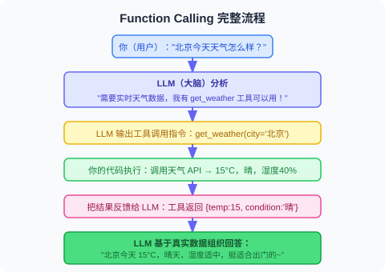
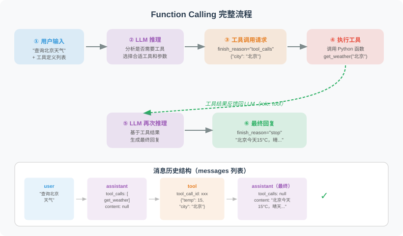

# 3.2 Function Calling 机制

> 🎯 **本节目标**：理解 Function Calling 的完整流程，能写出最小可运行的示例。

---

## 先看懂"发生了什么"

在深入代码之前，让我们用一个日常对话来模拟整个过程：



**注意这个循环中的角色分工**：

| 角色 | 做什么 | 不做什么 |
|------|--------|---------|
| **LLM** | 决定是否需要工具、选择哪个工具、生成参数 | 不实际调用任何 API |
| **你的代码** | 执行真正的函数/API 调用 | 不做决策 |
| **工具定义（JSON Schema）** | 告诉 LLM 有哪些工具可用、每个工具怎么用 | 不包含实现逻辑 |

## 完整流程：5 步



> 🎬 **交互式动画**：观看用户、LLM 和工具引擎之间的消息传递全过程——包含多轮工具调用的完整通信协议。
>
> <a href="../animations/function_calling.html" target="_blank" style="display:inline-block;padding:8px 16px;background:#9C27B0;color:white;border-radius:6px;text-decoration:none;font-weight:bold;">▶ 打开 Function Calling 交互动画</a>


这个流程可能会循环多次。比如用户说"如果下雨就发邮件提醒"——先查天气，再决定是否发邮件。

---

## 机制优先：先理解，不急着写完整代码

Function Calling 的核心不是某段 Python，而是一次**由模型发起、由程序执行、再把结果交还给模型**的消息往返。初学者可以先把它理解为下面这个分工流程：

| 步骤 | 谁负责 | 发生了什么 | 读者需要抓住的重点 |
|---|---|---|---|
| 1. 定义工具 | 开发者 | 告诉模型有哪些工具、每个工具需要什么参数 | 工具定义是"说明书"，不是函数实现 |
| 2. 用户提问 | 用户 | 提出一个可能需要外部能力的问题 | 模型先判断是否需要工具 |
| 3. 生成调用意图 | LLM | 输出"我要调用哪个工具，以及参数是什么" | 模型只生成指令，不亲自执行 |
| 4. 执行工具 | 你的程序 | 调用真实函数、API 或数据库 | 这里才发生真实世界的动作 |
| 5. 返回结果 | 你的程序 → LLM | 把工具结果放回对话历史 | 模型基于结果组织最终回答 |

以"北京和上海天气怎么样？"为例，模型不会自己查天气。它会先生成两个查询意图：一个查北京，一个查上海；程序执行查询后，把两个城市的结果交回模型；模型再用自然语言总结给用户。

### 三个关键对象

| 对象 | 可以用一句话理解为 | 常见内容 |
|---|---|---|
| 工具函数 | 真正干活的"手" | 查天气、搜网页、读数据库、发邮件 |
| 工具 Schema | 写给模型看的"说明书" | 工具名、用途、参数、必填字段 |
| Agent 循环 | 让模型和工具反复协作的"调度器" | 判断是否继续调用工具，或是否结束回答 |

### 一次调用的消息形态

不必急着看完整 SDK 代码，先看消息在系统里的形态：

| 阶段 | 消息含义 | 示例 |
|---|---|---|
| 用户输入 | 用户提出目标 | "北京和上海的天气怎么样？" |
| 模型输出 | 模型请求工具 | 调用 `get_weather`，参数分别是 `北京`、`上海` |
| 工具结果 | 程序返回观察结果 | 北京晴，上海多云 |
| 最终回答 | 模型整合结果 | "北京今天晴，上海多云……" |

### 伪流程

1. 收到用户问题。
2. 把用户问题和工具说明一起发给模型。
3. 如果模型选择直接回答，就结束。
4. 如果模型请求工具调用，程序解析工具名和参数。
5. 程序执行真实工具，并把结果写回对话历史。
6. 再次请求模型，让它基于工具结果继续回答或继续调用工具。

> 💡 **为什么是循环？** 因为一次工具调用可能不够。"查天气然后发邮件"这样的任务就需要两轮：第一轮查天气，第二轮根据天气结果决定是否发邮件。

完整的 SDK 代码将在第 3.5 节实战中统一展开。本节先把机制讲清楚：**LLM 决策，代码执行，结果再反馈给 LLM。**

---

## 关键设计决策

### tool_choice：控制模型的工具使用策略

`tool_choice` 决定模型是否可以使用工具，以及是否必须使用工具。常见策略如下：

| 设置 | 含义 | 适合场景 |
|---|---|---|
| `auto` | 让模型自己判断是否用工具 | 通用对话型 Agent，最常用 |
| `none` | 禁止工具调用，只输出文本 | 纯聊天、角色扮演、无需外部数据的任务 |
| `required` | 强制至少调用一个工具 | 明确需要实时数据或外部动作的任务 |
| 指定工具名 | 强制调用某个特定工具 | 测试工具、构建固定流程 |

| 场景 | 推荐设置 |
|------|---------|
| 通用对话型 Agent | `auto` |
| 纯聊天 / 角色扮演 | `none` |
| 明确知道需要数据的场景 | `required` |
| 测试某个特定工具 | 指定工具名 |

### strict 模式：生产环境必开

OpenAI 在 2024 年推出了 Structured Outputs 功能。可以把 `strict` 理解为"参数格式强校验"：开启后，模型输出的参数必须符合你声明的 JSON Schema。

开启严格模式时要注意三点：

- **声明 `strict: true`**：告诉模型必须严格遵守 Schema。
- **禁止额外字段**：通常需要设置 `additionalProperties: false`，避免模型凭空加参数。
- **完整声明参数类型**：每个字段都要有明确的类型、含义和必填规则。

**生产环境强烈建议开启**，它可以显著减少因参数格式错误导致的运行时崩溃。

### 并行工具调用：独立任务同时做

当多个工具之间没有依赖关系时，可以让模型一次返回多个调用指令：

> 用户："同时查一下北京、上海、广州的天气" → 模型一次性返回 3 个 tool_calls → 你的代码并行执行 3 个查询（用 ThreadPoolExecutor 或 asyncio）→ 总等待时间 ≈ 最慢的那一个（而不是三个相加）

适用条件：**工具之间互相独立**。如果有依赖（先查天气→再决定是否发邮件），应设 `parallel_tool_calls=False`。

---

## 错误处理：让 LLM 自己解决问题

这是初学者最容易忽略的设计要点：**工具不要让异常直接炸掉整个 Agent，而要把可理解的错误返回给模型。**

| 错误做法 | 更好的做法 |
|---|---|
| 网络超时后直接抛异常，整个 Agent 中断 | 返回"搜索超时，请换更短的关键词或稍后重试" |
| 参数非法时只说 `Invalid input` | 返回哪个字段错了、期望格式是什么、收到的值是什么 |
| 权限不足时隐藏细节 | 告诉模型需要用户授权或更换工具 |

**为什么这样设计？** 因为错误信息会出现在 LLM 的上下文中。一个聪明的 LLM 看到"搜索超时"后，可能会尝试缩短关键词重试；看到"API Key 无效"后会告知用户检查配置。这比直接抛异常优雅得多。

---

## Function Calling 与 MCP 的关系

学完基础机制后，你会听到 **MCP（Model Context Protocol）** 这个概念——Anthropic 于 2024 年底推出的工具调用标准协议。

| 对比项 | Function Calling | MCP |
|-------|-----------------|-----|
| 本质 | 单平台的 API 能力 | 跨平台的标准协议 |
| 工具绑定 | 写死在代码里 | 以独立服务运行，任何客户端可用 |
| 适合场景 | 快速原型、单模型项目 | 多模型共享、团队协作、生态复用 |

可以把它们理解为：**Function Calling 是"自己做饭"，MCP 是"点外卖"**。前者灵活自由，后者标准化可复用。掌握了 Function Calling 后，理解 MCP 会非常自然——本质上就是把工具的定义和执行从代码中抽离出来变成独立服务。

详细内容见 [第17章 Agent 通信协议](../chapter_protocol/README.md)。

---

## 📝 动手练习

在继续阅读之前，试着回答以下问题（不要急着写代码，先用自然语言思考）：

**练习 1**：如果要给 Agent 添加一个"当前时间"工具，它的 Schema 应该包含哪些信息？description 中应该说明什么？

<details>
<summary>参考答案</summary>

一个好的"当前时间"工具定义需要包含：

- **工具名**：例如 `get_current_time`，让模型一眼知道它是获取当前时间。
- **使用时机**：当用户问"现在几点""今天几号""当前日期"等问题时调用。
- **参数设计**：如果只返回本地当前时间，可以无参数；如果支持时区，则需要 `timezone` 参数。
- **返回格式**：例如返回日期、时间、时区和星期，方便模型组织回答。

关键点：即使工具没有参数，也要明确告诉模型"这个工具不需要用户提供额外信息"。

</details>

**练习 2**：下面的工具描述有什么问题？LLM 可能犯什么错？

```json
{"description": "处理邮件相关的事情"}
```

<details>
<summary>参考答案</summary>

问题太多了：
- 太模糊 —— "处理邮件"可能指发送、读取、删除、归档……LLM 不知道具体做什么
- 没有说明何时使用 vs 何时不使用
- 没有参数描述

更好的版本可以这样写：向指定邮箱发送邮件；仅在用户明确要求发送时调用；不适用于查询邮件或管理邮箱。

</details>

---

## 小结

| 要点 | 一句话记住 |
|------|-----------|
| 核心思想 | LLM 当大脑做决策，代码当手脚去执行 |
| 5 步流程 | 定义 → 发送 → 决策 → 执行 → 回答 |
| 最重要的事 | **工具的 description 写得好不好，决定了 Agent 的智商** |
| 安全兜底 | 错误信息返回给 LLM 而非抛异常 |
| 生产必开 | `strict: true` + `additionalProperties: false` |
| 进阶方向 | MCP 协议实现跨平台工具复用 |

---

*下一节：[3.3 自定义工具的设计与实现](./03_custom_tools.md)*