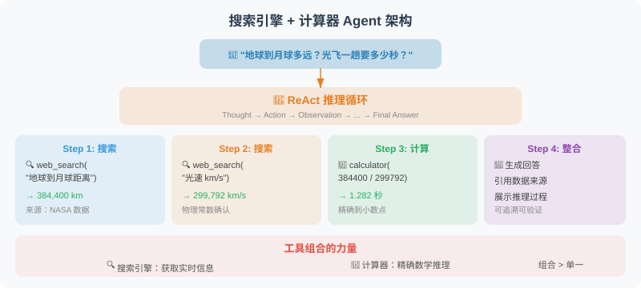

# 3.5 实战：搜索引擎 + 计算器 Agent

本节构建一个实用的搜索与计算 Agent，能够回答需要实时信息和数学推理的复杂问题。



## 项目目标

构建一个 Agent，能够：
- 🔍 搜索互联网获取实时信息
- 🧮 精确执行数学计算
- 🔗 组合多个工具完成复杂任务
- 📝 给出有来源依据的回答

## 设计思路

很多现实问题不是单一工具能解决的。例如"地球到月球多远？光飞一趟要多少秒？"——需要先搜索距离数据，再用计算器做除法。这种**多步工具组合**才是 Agent 真正发挥作用的地方。

我们设计三个互补的工具：

| 工具 | 职责 | 何时调用 | 何时不调用 |
|---|---|---|---|
| `search_web` | 搜索互联网获取实时信息 | 实时数据、新闻、人物背景 | 数学计算、单位换算 |
| `calculate` | 精确计算数学表达式 | 大数运算、科学计算 | 直接查得到的事实 |
| `unit_converter` | 常见单位换算 | km/mile、°C/°F、kg/pound | 货币、汇率 |

设计上有三个关键决策贯穿整个 Agent：

1. **工具边界互斥**：每个工具有"适用 / 不适用"两个描述，避免模型在多个工具间随机选择
2. **错误信息返回字符串而非抛异常**：模型收到错误后能自我修正（如换关键词、换格式）
3. **Agent 循环设置硬上限**：`MAX_STEPS = 8`，防止模型陷入无限循环把 Token 烧光

下面分三段展开核心实现：工具层、Schema 层、Agent 循环。

---

## 第一段：三个工具的实现

每个工具都遵循"输入 → 处理 → 返回字符串"的模式。这一段展示工具的核心逻辑，省略了边界处理细节。

```python
# ── 工具1：搜索（基于 DuckDuckGo 免费 API，无需 API Key）────────
import requests

def search_web(query: str, num_results: int = 5) -> str:
    """调用 DuckDuckGo Instant Answer API，返回文本摘要。"""
    try:
        url = "https://api.duckduckgo.com/"
        params = {"q": query, "format": "json", "no_html": 1}
        data = requests.get(url, params=params, timeout=10).json()
        
        results = []
        if data.get("AbstractText"):
            results.append(f"即时答案：{data['AbstractText']}")
        for topic in data.get("RelatedTopics", [])[:num_results]:
            if isinstance(topic, dict) and topic.get("Text"):
                results.append(f"• {topic['Text'][:200]}")
        
        return "\n".join(results) if results \
            else f"未找到结果，建议换更具体的关键词。"
    except Exception as e:
        return f"搜索失败：{e}。请检查网络连接。"


# ── 工具2：精确计算（用受限 eval 兼顾安全与功能）─────────────
import math

def calculate(expression: str) -> str:
    """用受限的 eval 环境执行数学表达式，避免任意代码执行。"""
    safe_dict = {
        "__builtins__": {},           # 关键：禁用所有内置函数
        "sqrt": math.sqrt, "log": math.log, "sin": math.sin, "cos": math.cos,
        "pi": math.pi, "e": math.e, "abs": abs, "round": round,
        # ... 其他数学函数按需添加
    }
    try:
        result = eval(expression, safe_dict)
        return f"{expression} = {result}"
    except ZeroDivisionError:
        return "计算错误：除以零"
    except Exception as e:
        return f"计算错误：{e}。请确认表达式格式正确。"


# ── 工具3：单位换算 ──────────────────────────────────────────
def unit_converter(value: float, from_unit: str, to_unit: str) -> str:
    """支持长度/重量/温度/面积四类单位的双向换算。"""
    conversions = {
        "m": 1.0, "km": 1000.0, "mile": 1609.344,        # 长度
        "kg": 1.0, "pound": 0.453592,                    # 重量
        # ... 完整映射在代码仓库
    }
    if from_unit in ["celsius", "fahrenheit", "kelvin"]:
        # 温度需要特殊处理（非线性换算）
        return _convert_temperature(value, from_unit, to_unit)
    if from_unit not in conversions or to_unit not in conversions:
        return f"不支持的单位：{from_unit} 或 {to_unit}"
    return f"{value} {from_unit} = {value * conversions[from_unit] / conversions[to_unit]:.6g} {to_unit}"
```

### 为什么这么写工具层？

| 设计选择 | 原因 | 替代方案及取舍 |
|---|---|---|
| **DuckDuckGo 而非 Google Search** | 免费、无需 API Key，适合学习和原型 | Google/Bing 搜索质量更高但要付费，**生产环境建议切到 Tavily 或 SerpAPI** |
| **`eval` + 受限 `safe_dict`** | 兼顾灵活性（支持 Python 表达式）和安全性（禁用 `__builtins__`） | 完全禁止 `eval` 只能解析简单算式，复杂数学函数就废了；**永远不要把 `safe_dict` 留空** |
| **温度用特殊分支** | 温度换算是非线性（带偏移），不能用通用乘法 | 在 `conversions` 字典里加 `offset` 字段统一处理也行，但会牺牲可读性 |
| **错误返回字符串** | 模型看到错误信息能自我修正（换关键词、换格式） | 直接抛异常 → Agent 中断 → 用户看到冷冰冰的 `Exception: ...` |

> 💡 **完整代码见附录仓库** `examples/chapter03/search_calc_agent.py`，包含完整的单位换算表、错误重试、缓存逻辑等工程化细节。

---

## 第二段：工具 Schema —— Agent 的"说明书"

工具描述是影响 Agent 表现的关键。3.4 节学过的"六要素检查清单"在这里直接落地：每个工具都写明**适用、不适用、参数、返回、风险**。

```python
TOOLS = [
    {
        "type": "function",
        "function": {
            "name": "search_web",
            "description": """在互联网上搜索实时信息。

适合用于：
- 查询最新新闻、事件、价格等实时数据
- 获取人物、地点、事件的背景信息
- 查找技术文档和教程

不适合用于：
- 数学计算（使用 calculate 工具）
- 单位换算（使用 unit_converter 工具）
- 你已经知道答案的问题""",
            "parameters": {
                "type": "object",
                "properties": {
                    "query": {
                        "type": "string",
                        "description": "搜索关键词，建议简洁精准。"
                    },
                    "num_results": {
                        "type": "integer",
                        "description": "返回结果数量，默认5，最大10",
                        "default": 5
                    }
                },
                "required": ["query"],
                "additionalProperties": False   # 关键：禁止额外字段
            }
        }
    },
    {
        "type": "function",
        "function": {
            "name": "calculate",
            "description": """精确计算数学表达式。

支持：基本运算（+,-,*,/,**）、数学函数（sqrt/sin/cos/log等）、常量（pi/e）

不适合：
- 需要查询的事实（如"光速是多少"）→ 用 search_web
- 单位换算 → 用 unit_converter
- 大段文本处理""",
            "parameters": {
                "type": "object",
                "properties": {
                    "expression": {
                        "type": "string",
                        "description": "数学表达式，使用 Python 语法。乘方用 **，不用 ^"
                    }
                },
                "required": ["expression"],
                "additionalProperties": False
            }
        }
    },
    {
        "type": "function",
        "function": {
            "name": "unit_converter",
            "description": """单位换算，支持长度、重量、温度、面积等常见单位转换。

适合：m/km/mile、kg/pound、°C/°F 等
不适合：货币汇率、时区转换""",
            "parameters": {
                "type": "object",
                "properties": {
                    "value":    {"type": "number", "description": "要换算的数值"},
                    "from_unit": {"type": "string", "description": "原始单位，如 m, km, celsius"},
                    "to_unit":   {"type": "string", "description": "目标单位，如 mile, pound, fahrenheit"}
                },
                "required": ["value", "from_unit", "to_unit"],
                "additionalProperties": False
            }
        }
    }
]
```

### 三个 Schema 设计的精妙之处

1. **每个 description 都包含"不适合"段**：这是 3.4 节强调的"反例边界"。当模型同时看到 `calculate` 和 `unit_converter` 时，"不适合"段会让它选择正确的那个。

2. **`additionalProperties: False` 全部开启**：禁止模型"创造性"地传入未定义的字段。否则模型可能发散传 `unit_type: "length"`、`precision: 5` 之类，让工具层崩溃。

3. **参数的 `description` 包含示例**：`"如：'Python 3.12 新特性' 而非 '我想知道Python最新版本有什么新功能'"` —— 这一句就让工具调用准确率显著提升。

---

## 第三段：Agent 循环——决策与执行的调度器

```python
from openai import OpenAI
client = OpenAI()

class SearchCalcAgent:
    """搜索 + 计算 Agent"""

    SYSTEM_PROMPT = """你是一个能够搜索和计算的智能助手。
你有三个工具：search_web（搜索）、calculate（计算）、unit_converter（换算）。

使用策略：
- 需要实时数据 → 先 search_web
- 需要精确计算 → 用 calculate，不要手动算
- 复杂问题可组合多个工具
- 给出答案时说明信息来源
- 简洁准确，重点突出"""

    def __init__(self):
        self.messages = [{"role": "system", "content": self.SYSTEM_PROMPT}]

    def chat(self, user_message: str) -> str:
        self.messages.append({"role": "user", "content": user_message})
        MAX_STEPS = 8   # 安全护栏：防无限循环

        for step in range(MAX_STEPS):
            response = client.chat.completions.create(
                model="gpt-4.1",
                messages=self.messages,
                tools=TOOLS,
                tool_choice="auto",
                parallel_tool_calls=True
            )
            message = response.choices[0].message
            self.messages.append(message)

            # 模型直接给出最终答案 → 结束
            if response.choices[0].finish_reason == "stop":
                return message.content

            # 模型请求工具调用 → 执行并把结果回传
            if response.choices[0].finish_reason == "tool_calls":
                for tool_call in message.tool_calls:
                    func_name = tool_call.function.name
                    func_args = json.loads(tool_call.function.arguments)
                    result = TOOL_FUNCTIONS[func_name](**func_args)

                    self.messages.append({
                        "role": "tool",
                        "tool_call_id": tool_call.id,
                        "content": str(result)
                    })

        return "已达到最大步骤数限制，请简化问题重试。"
```

### Agent 循环的关键设计

| 环节 | 在做什么 | 为什么这样 |
|---|---|---|
| **`MAX_STEPS = 8`** | 硬上限防止无限循环 | 复杂任务通常 3-6 步完成，8 步足够；超限说明任务本身有问题 |
| **`parallel_tool_calls=True`** | 允许模型同时返回多个工具调用 | "查北京和上海天气"这种独立任务并行执行，总等待时间 ≈ 最慢的一个 |
| **结果写回 `messages`** | 工具结果作为 `role: tool` 消息加入历史 | 模型下一轮能看到自己上轮的调用结果，形成完整推理链 |
| **`finish_reason` 分支** | `stop` 是直接回答，`tool_calls` 是请求工具 | OpenAI API 协议用这个字段告诉调用方下一步该做什么 |

---

## 运行测试

```bash
# 安装依赖
pip install openai python-dotenv requests rich

# 交互模式
python search_calc_agent.py

# 演示模式
python search_calc_agent.py --demo
```

## 示例对话

下面是 Agent 回答"地球到月球多远？光速飞过去要几秒？"的完整轨迹：

| 步骤 | 角色 | 工具 | 内容 |
|---|---|---|---|
| 1 | 用户 | — | 问距离 + 飞行时间 |
| 2 | Agent | `search_web` | 查询"地球到月球距离公里" → 得到 384,400 km |
| 3 | Agent | `calculate` | 计算 `384400 * 1000 / 299792458` → 1.28 秒 |
| 4 | Agent | — | 综合回答：约 384,400 km，光速约需 1.28 秒 |

注意第 2、3 步是**并行调用**的（`parallel_tool_calls=True`）——模型可以一次性请求"先搜索再计算"。如果用 `parallel_tool_calls=False`（如"查天气→决定是否发邮件"这种有依赖的任务），模型会等第一个结果回来再决策下一步。

---

## 小结

本章实战完成了一个功能完整的搜索+计算 Agent。核心要点：

- ✅ **三个职责清晰、边界互斥的工具**：搜索、计算、换算各管一摊
- ✅ **Schema 中的"适用/不适用"双面描述**：显著降低误调用
- ✅ **`additionalProperties: False` 强制参数格式**：减少运行时崩溃
- ✅ **错误信息返回字符串**：让模型能自我修正
- ✅ **Agent 循环设置 `MAX_STEPS` 硬上限**：防止 Token 被烧光
- ✅ **并行工具调用**：独立任务同时做，节省总等待时间

这个 Agent 可以作为你后续开发的基础框架——通过添加更多工具（数据库、邮件、Slack），就能扩展成生产可用的个人助理。

> 📦 **完整代码**：仓库 `examples/chapter03/search_calc_agent.py` 包含 `rich` 美化日志、`reset` 重置对话、演示模式等完整工程实现。

---

*下一节：[3.6 论文解读：工具学习前沿进展](./06_paper_readings.md)*
