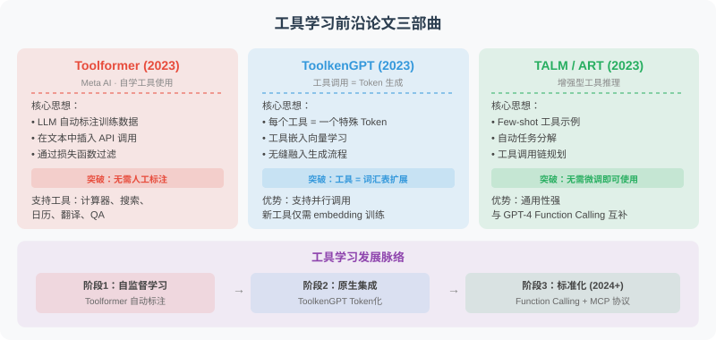
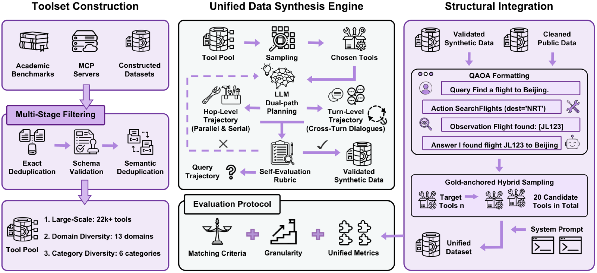
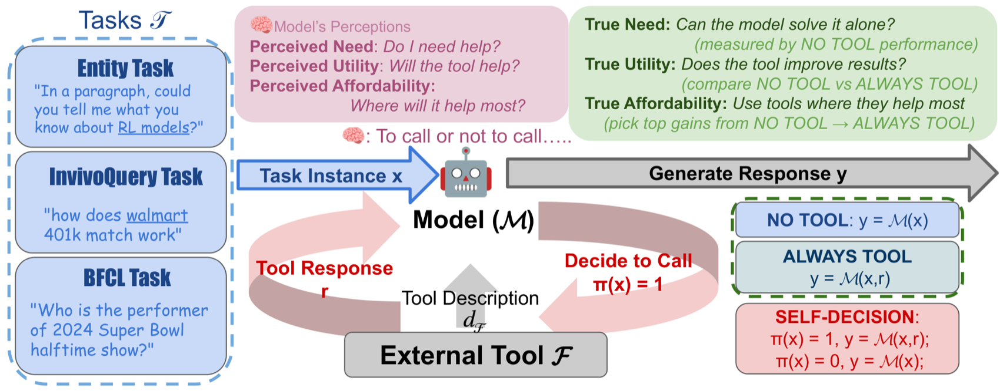

# 3.6 论文解读：工具学习前沿进展

> 🎯 **本节学习目标**：深入理解自监督学习如何解决“AI 什么时候该用工具”这一难题，掌握 Function Calling 的自训练思路。

> 📖 *"The best way to predict the future is to invent it."*  
> *"让 LLM 使用工具"是 Agent 研究中最活跃的方向之一。本节深入解读三篇奠基性论文。*



---

## Toolformer：让模型自学工具使用

**论文**：*Toolformer: Language Models Can Teach Themselves to Use Tools*  
**发表**：2023 | [arXiv:2302.04761](https://arxiv.org/abs/2302.04761)

### 思考：为什么不能让人类标注每一条调用？
如果你要训练一个能够使用计算器、搜索引擎的 Agent，最直观的想法是标注海量数据：`User: 1+1? -> Assistant: [Call Calculator(1+1)]`。但问题是：你永远标注不完人类在何时需要工具。

### 设计原则：让模型通过“预测未来”来学习
Toolformer 提出了一个非常反直觉但巧妙的思路：**如果调用工具能帮我预测下一个单词，那这个工具就是有用的。**

#### 💡 Toolformer 训练回路
我们通过以下流程自动筛选高质量的训练数据：

{visualizer_call: toolformer_training_loop}

### 实践练习：如何构建一个 Toolformer 简化版？
请思考：如果引入工具调用后，模型预测后续文本的概率提升了，我们应该如何判断这次工具调用是否值得保留？

下面是一个简化版实现。真实训练中会基于 token 级别的 log-probability 计算损失差异，这里用序列平均 log-probability 来表达核心思想：

```python
def calculate_utility(response_with_tool, response_without_tool, threshold=0.05):
    """
    计算一次工具调用带来的效用。

    Args:
        response_with_tool: 使用工具后的模型评估结果，例如 {"avg_logprob": -0.8}
        response_without_tool: 不使用工具时的模型评估结果，例如 {"avg_logprob": -1.1}
        threshold: 最小收益阈值，避免把微弱波动误判为有效工具调用

    Returns:
        dict: 包含效用分数和是否保留该工具调用的判断。
    """
    utility_score = (
        response_with_tool["avg_logprob"]
        - response_without_tool["avg_logprob"]
    )

    return {
        "utility_score": utility_score,
        "keep_tool_call": utility_score > threshold,
    }

# 示例：使用工具后平均 log-probability 从 -1.10 提升到 -0.82
result = calculate_utility(
    response_with_tool={"avg_logprob": -0.82},
    response_without_tool={"avg_logprob": -1.10},
)
print(result)  # {"utility_score": 0.28, "keep_tool_call": True}
```

这个例子说明：Toolformer 的关键并不是让人类告诉模型“什么时候该调用工具”，而是让模型自己通过概率改进发现有价值的工具调用样本。**当工具调用能显著提高后续文本预测质量时，就把这段调用轨迹加入训练数据；否则丢弃。**

---

## Gorilla：大规模 API 调用的精准性

**论文**：*Gorilla: Large Language Model Connected with Massive APIs*  
**发表**：2023 | [arXiv:2305.15334](https://arxiv.org/abs/2305.15334)

Toolformer 关注“什么时候调用工具”，Gorilla 更关注另一个工程问题：**当工具数量非常多时，模型能不能准确选择 API，并生成正确的参数？**

### 核心问题：API 幻觉

在真实业务中，Agent 面对的不是一两个工具，而可能是几十、几百甚至上千个 API。此时模型容易出现三类错误：

- **调用不存在的 API**：把训练语料中见过的函数名和当前系统的工具混淆。
- **参数结构错误**：字段名、类型、必填项不符合真实 schema。
- **版本不匹配**：API 已更新，但模型仍按旧文档调用。

Gorilla 的价值在于，它把 API 文档、检索和模型生成结合起来，让模型在调用前先找到最相关的 API 文档，再基于文档生成调用代码或参数。

### 对 Agent 开发的启示

- **工具文档就是上下文的一部分**：不要只给工具名，要给清晰的参数说明、边界条件和示例。
- **工具多时必须检索**：当工具数量超过模型上下文预算时，应先检索相关工具，再把少量候选工具注入上下文。
- **调用结果需要验证**：生产系统不能只相信模型生成的参数，应通过 schema 校验、单元测试或 dry-run 机制拦截错误调用。

可以把 Gorilla 理解为后来“工具检索 + Function Calling + MCP 懒加载”工程模式的早期代表。

---

## 📰 最新论文速递

> 🗓️ 本节由每日自动更新任务维护，最近更新：**2026 年 7 月 14 日**

### [OpenTools：社区驱动的可靠工具使用 Agent 框架（2026）](https://arxiv.org/abs/2604.00137)

> 🧬 **一句话**：工具调用不可靠，不只怪 Agent 不会用，工具本身也可能是错的——OpenTools 第一次把"工具本身的质量"当成一等公民来治理。

**核心问题**：工具集成 LLM 的失败有两个来源，但既往研究几乎只盯着前者——**工具调用准确性**（Agent 是否选对工具、传对参数）和**工具本身准确性**（工具实现是否正确、是否可用、是否回归）。一个实现有 bug 的工具，再聪明的 Agent 也救不回来。

**方法介绍**：OpenTools 设计了上下两条互补的工作流（见下图）。**上层（维护流）**：社区模块持续收集新工具、测试用例和反馈，由 verifier（工具创建者/维护者）审核接纳，更新规范化的工具箱与评测套件；工具评测模块再跑标准化检查，刷新每个工具的"内在可靠性信号"（准确率、可用性、回归）。**下层（执行流）**：用户输入查询并从 OpenTools-Box 选工具，Agent 模块决策并发起调用，执行模块运行工具返回观测，最终带着结构化的工具/推理日志产出答案。这套设计把"工具质量"做成了可被社区持续演进的闭环。


*▲ OpenTools 原论文 Figure（来源：Dang et al., 2026, arXiv:2604.00137）*

**关键结果**：在 Prompting / ReAct / OctoTools / MultiAgent 四种框架上，把工具箱从 OctoTools-T 换成更高内在质量的 OpenTools-T，整体平均分一致提升——证明**"提高工具本身质量"能直接转化为端到端可靠性的提升**，而非只优化 Agent 推理。

**与本章关系**：直接呼应本章「工具接入与封装」知识点，首次将工具质量管理上升为与 Agent 推理能力同等重要的系统性问题，是构建生产级工具生态的重要参考框架。

---

### [工具注意力机制：动态工具门控与懒加载消除 MCP 上下文开销（2026）](https://arxiv.org/abs/2604.21816)

> 🧬 **一句话**：把"Attention is All You Need"从 token 层搬到工具层——只让相关工具的 Schema 进入上下文，砍掉 MCP 的"工具税"。

**核心问题**：MCP 协议靠"无状态 + 急切式 Schema 注入"连接 Agent 与工具，每轮都把所有工具 Schema 塞进上下文，造成 **10k–60k token/轮**的隐性开销（论文称之为 *MCP Tax / Tools Tax*）。这不仅膨胀 KV Cache，还会在上下文利用率逼近约 70% 的"断裂点"时拖垮推理质量。

**方法介绍**：提出 **Tool Attention** 中间件层，把自注意力的思想推广为"对工具的门控注意力"，三个组件协同：(i) **意图-Schema 重叠分（ISO Score）**——用句向量算用户意图与各工具 Schema 的相似度；(ii) **状态感知门控函数**——根据对话状态决定哪些工具该"激活"；(iii) **两阶段懒加载 Schema 池**——只在真正需要时，才把相关工具的完整 Schema 从池中提升到上下文。

**关键结果**：在 6 台 MCP 服务器 / 120 个工具的模拟基准（500 任务，3 seeds）上，每轮工具 token 从 **47.3k 降至 2.4k（约 −95%）**，有效上下文利用率从 24% 提升到 91%。（注：论文明确标注部分 LLM 质量指标为基于 token 计数与公开遥测的*投影估算*，非真实 LLM 跑测。）

**与本章关系**：直接对应本章「MCP 工具协议」与「上下文效率优化」知识点，为大规模 Agentic 工作流中工具注册与动态调度提供了可落地的工程方案。

---

### [AgenticQwen：双飞轮数据驱动的小型工业级工具调用模型训练（2026）](https://arxiv.org/abs/2604.21590)

> 🧬 **一句话**：用"两个互相喂数据的飞轮"自动造出越来越难的训练任务，把小模型练成能扛工业级多步工具调用的 Agent。

**核心问题**：工业应用越来越需要会多步推理、会用工具的 Agent，但又受成本和延迟约束，因此**小型 Agentic 模型**极具价值。难点在于：高质量的多步工具调用训练数据稀缺且难以人工标注。

**方法介绍**：AgenticQwen 用多轮 RL 在合成数据 + 少量开源数据上训练，核心是**双飞轮（dual data flywheels）**（见下图）：**推理飞轮**通过"从错误中学习"不断提升任务难度——把模型做错的题加难再喂回去；**Agentic 飞轮**把线性工作流扩展成**多分支行为树**，让训练任务反映真实世界的决策复杂度（分支、回退、条件）。两个飞轮持续自动生成越来越有挑战性的任务，驱动小模型逼近大模型的工具调用能力。


*▲ AgenticQwen 原论文 Figure（来源：Alibaba, 2026, arXiv:2604.21590）*

**关键结果**：所得小型 Agentic 模型在搜索与数据分析任务上接近大型模型表现，模型权重与合成数据已开源至 HuggingFace。

**与本章关系**：对应本章「Function Calling 与工具调用」核心知识点，展示了如何通过 RL + 合成数据训练专门的工具调用能力，是第 10.8 节"专为 Agent 的微调"与 [11.3 节"数据飞轮"](../chapter_self_evolving/03_data_flywheel.md) 的典型工业实践。

---

### [UniToolCall：统一工具调用表示、数据与评测的 LLM Agent 框架（2026）](https://arxiv.org/abs/2604.11557)

> 🧬 **一句话**：工具学习领域"各说各话"——表示不统一、数据不规范、基准不兼容，UniToolCall 把从工具集构建到评测的全链路一次性标准化。

**核心问题**：现有工具调用研究存在三大顽疾——交互表示不一致、忽视工具调用轨迹的结构分布、评测基准互不兼容，导致结果难以横向比较。

**方法介绍**：UniToolCall 是一个全链路标准化框架（见下图四模块）：(1) **工具集构建**——汇集 22k+ 工具；(2) **统一数据合成引擎**——融合 10 个标准化公开数据集与"结构可控"的合成轨迹，构建 390k+ 训练实例，显式建模单跳/多跳、单轮/多轮、串行/并行等交互模式，并用 **Anchor Linkage** 机制强制跨轮依赖（让后一轮真正依赖前一轮结果，而非孤立调用）；(3) **结构化整合**；(4) **评测协议**——把 7 个公开基准统一成 QAOA（Query-Action-Observation-Answer）格式，在函数调用、轮次、对话三个粒度做细粒度评测。



*▲ UniToolCall 原论文 Figure（来源：2026, arXiv:2604.11557）*

**关键结果**：在工具干扰最强的 Hybrid-20 设置下，微调后的 **Qwen3-8B 达到 93.0% 单轮严格精度**，超越 GPT、Gemini、Claude 等商业模型。

**与本章关系**：直接对应本章工具调用的数据与评测痛点，为本章 6.3 节的 Benchmark 比较提供了最新统一评测基准。

---

### [Reinforced Agent：推理时工具调用反馈的主动纠错机制（2026）](https://arxiv.org/abs/2604.27233)

> 🧬 **一句话**：评估不该只在事后"验尸"——派一个 Reviewer Agent 在工具真正执行前先审一遍，把"事后恢复"变成"事前预防"。

**核心问题**：工具调用的评估（工具选择、参数准确性、范围识别）历来是**事后（post-hoc）**的——它脱离了正在运行的执行循环，发现的错误通常只能靠 prompt 调优或重训来修，**无法在当下实时纠偏**。

**方法介绍**：把评估搬进推理时执行循环——一个专门的 **Reviewer Agent 在临时工具调用真正执行之前**对其审查，建立"执行 Agent / 审查 Agent"的清晰分工。论文评估了三种协作机制（不同反馈轮数 r、不同反馈模型），并用 **GEPA**（见 11.1 节自动提示优化）自动优化 Reviewer 的提示词，省去人工撰写审查 prompt 的高成本。

**关键结果**：在 BFCL 单轮场景提升 **+5.5%**、Tau²-Bench 多轮有状态场景提升 **+7.1%**，叠加 GEPA 自动提示优化再获 **+1.5~2.8%**。

**与本章关系**：对应本章工具调用可靠性与错误恢复的知识点，是对现有 ReAct 式工具调用流程的在线增强方案，与第 11.1 节 GEPA、11.3 节"评判者"主题直接呼应。

---

### [调还是不调：评估与优化 LLM 工具调用决策的统一框架（2026）](https://arxiv.org/abs/2605.00737)

> 🧬 **一句话**：工具不是调得越多越好——本文用决策论拆出"该不该调"的三个判据，并发现模型"自以为需要"和"实际有用"之间存在系统性错位。

**核心问题**：Agentic 架构给 LLM 加了工具就更强，但**工具调用并非总是有益**——冗余甚至有害的调用会拖累性能。尤其对网页搜索这类工具，外部信息是否有用，取决于模型内部知识够不够、以及它能否整合可能含噪的工具返回。

**方法介绍**：本文借鉴决策论提出三维评估框架（见下图）——**必要性（necessity）**：是否真的需要外部信息；**效用（utility）**：工具是否真带来价值；**可负担性（affordability）**：调用成本是否划算。分析结合两个视角：一个从"最优决策"反推真实的 need/utility 的规范性视角，一个考察模型自身认知的视角。基于此训练一个**基于隐藏状态的轻量估计器**来纠正决策偏差。



*▲ 该论文原论文 Figure（来源：2026, arXiv:2605.00737）*

**关键结果**：揭示了模型对工具调用的"主观认知"与"客观效果"之间存在系统性错位；所提估计器在 3 个任务、6 个模型上均优于原有自感知设置。

**与本章关系**：直接对应本章"何时调用工具"这一核心决策问题，为工具调用框架设计提供了量化评估视角，是对现有工具调用范式的重要反思。

---

### [工具调用持续学习的轨迹监督策略（2026）](https://arxiv.org/abs/2605.09734)

> 🧬 **一句话**：训练数据通常只给"最终答案"，不给"解题过程"——本文证明在工具学习里，保留完整调用轨迹能显著提分并缓解遗忘。

**核心问题**：多数训练数据只呈现最终产物，而非产生它的过程。在工具使用这一可量化的场景里追问：当模型持续学习一连串新 API 领域时，**保留中间 API 调用轨迹**到底有没有用？

**方法介绍**：用 QLoRA 微调 Llama 3.1 8B Instruct，在 API-Bank 的四个顺序领域块上做对照实验。**条件 A**：剥掉历史 API 请求/响应行，只训练模型预测下一个 API 调用；**条件 B**：保留完整轨迹上下文。两者在相同的持续学习设置下对比最终准确率与遗忘程度。

**关键结果**：单 seed 试点中，**条件 B（保留轨迹）达到 56.9% 最终完整调用准确率，条件 A 仅 39.2%**（高 17.7 个百分点），API-name 准确率也高 7.7 点，并有效缓解旧领域遗忘；代价是多用 25.1% 训练 token。

**与本章关系**：对应本章「工具调用与微调」知识点，是持续学习场景下工具调用能力保持的最新实证研究，为需要持续扩展工具库的生产 Agent 训练策略提供了实践参考。

---

### [通过 QLoRA 微调让小模型内化工具知识（2026）](https://arxiv.org/abs/2605.17774)

> 🧬 **一句话**：当工具集是固定的，何必每次都把整本工具说明书塞进 prompt？不如把它"背"进模型权重里。

**核心问题**：工具调用 Agent 习惯在每次 prompt 里塞入完整工具 Schema，即便可用工具在大量查询间是固定不变的。这种重复的 Schema 上下文拉长输入，还会让小模型变成不可靠的规划者。

**方法介绍**：研究"小模型能否通过参数高效微调，把固定工具目录内化进权重，从而在推理时无需显式工具描述就能做结构化规划"。其核心对比是两种规划范式：**标准提示**在每次调用时都提供用户查询 + 序列化的完整工具目录 `d(𝒯)`；而 **QLoRA 方案**把固定工具目录的知识内化进适配器权重，使模型仅凭 query 就能完成 MCP 工具规划。在工业资产运维基准 **AssetOpsBench**（MCP 风格工具）上，用 **8-bit QLoRA** 在约 1,700 条工具使用样本上微调 Gemma 4 E4B 与 Qwen3-4B。

**关键结果**：在描述无关推理下，微调后的小模型在 AT-F1、服务器路由、工具选择上**超过携带完整工具目录的基线**，同时把 prompt 长度减少约 **94.7%**；Qwen3-4B 还实现约 62% 内存节省与 2.5 倍推理加速。

**与本章关系**：直接对应本章「工具 Schema 注入」「工具调用微调」与「上下文开销优化」知识点，展示了除检索/懒加载之外，用参数高效微调降低工具税的另一条路线。

---

### [SING：大规模工具生态中意图感知的主动工具发现（2026）](https://arxiv.org/abs/2606.16591)

> 🧬 **一句话**：当 MCP 工具生态膨胀到数千个，纯语义检索会漏掉"多步任务所需的工具协作链"——SING 用"意图图"把任务意图、工具、协作关系连起来检索。

**核心问题**：MCP 生态快速膨胀，可扩展的工具发现越来越难。现有方法要么暴露所有工具 Schema（上下文代价巨大），要么用语义检索——但语义检索**忽视了多步执行所需的工具间功能依赖**（比如"查会议"之后往往要"按日期过滤"）。

**方法介绍**：SING（Synthetic Intention Graph）分**离线建图 + 在线检索**两阶段（见下图）。**离线**：先用 Schema 为每个工具生成候选查询、去重选择后抽象成"意图节点"，再通过协作判断在工具间建立"协作边"，形成连接「意图—工具—服务器」的合成意图图。**在线**：用户查询先经 LLM 分解为子任务，走两条并行管线——管线 1（Intention PPR）对每个子任务在意图图上做个性化 PageRank 检索，管线 2（语义匹配）算查询与服务器摘要的最大余弦相似度——最后分数融合，输出 Top-K 工具/服务器供执行。


*▲ SING 原论文 Figure（来源：2026, arXiv:2606.16591）*

**关键结果**：在 7,471 个工具的统一语料上，Global Recall@5 提升达 **59.8%**，下游成功率最高提升 **28.9%**，同时减少完整工具 Schema 曝露达 **99.8%**。

**与本章关系**：直接对应本章「工具的检索与选择」和「大规模工具生态管理」知识点，是 RAG 式工具检索在长视野 Agentic 任务中的最新突破，从"静态工具库"走向"动态工具发现"。

---

### [LedgerAgent：结构化状态跟踪与策略合规工具调用 Agent（2026）](https://arxiv.org/abs/2606.20529)

> 🧬 **一句话**：客服 Agent 把状态和策略全混在 prompt 里、每次临时重建——难免"查对了事实却用错"或"调用合法却违规"，LedgerAgent 给它配了一本独立的"账本"。

**核心问题**：客服域的策略合规型工具调用 Agent，必须跨轮跟踪任务状态、调用工具、并遵守领域策略。但现有 Agent 不单独表示状态——观测、工具返回、策略指令统统混进 transcript，每次决策时临时重建，导致两类典型失败：**(1) 检索到了正确记录，却基于过期/缺失的事实做决策；(2) 语法合法的工具调用违反了策略**。

**方法介绍**：LedgerAgent 在推理时引入一本独立的**账本（Ledger）**（见下图），显式维护已观测到的任务状态（事实、标识符、条件）；并在执行"会改变环境"的工具调用之前，用账本去**验证与状态相关的策略约束**，主动拦截违规调用。这相当于把"隐式藏在 prompt 里的状态"提取为一个可被显式读写和校验的结构。


*▲ LedgerAgent 原论文 Figure（来源：2026, arXiv:2606.20529）*

**关键结果**：在四个客服域、多个开放/封闭权重模型上，LedgerAgent 在多轮一致性的严格指标（repeated-run reliability）下取得最大提升。

**与本章关系**：对应本章「工具调用可靠性」与「工具调用中的策略合规」知识点，是将显式状态管理引入工具调用循环的最新工程化探索——与 11.3 节 SkillOpt 的"外部状态"、Self-Evolution 的"显式状态分离"思想一脉相承，直接解决了多轮工具执行中"上下文漂移"与"隐式状态错乱"的核心问题。

---

### [OpenAgent：揭示静态训练在工具使用泛化中的脆弱性（ICML 2026）](https://arxiv.org/abs/2607.01084)

**发表**：2026 年 7 月 1 日 | [arXiv:2607.01084](https://arxiv.org/abs/2607.01084)

**核心贡献**：本文形式化了"开放世界工具使用 Agent"（OpenAgent）问题，刻画了查询、动作、观测、领域四维度的分布偏移。通过构建受控沙箱环境，在感知-交互-推理-内化四级层次上系统诊断各类环境偏移的影响，发现无论 SFT 还是 RL 训练的 Agent 都面临不同程度的性能退化。在此基础上，提出扰动增强微调（Perturbation-Augmented Fine-Tuning）策略，为提升真实环境下的 Agent 鲁棒性奠定基础。

**与本章关系**：对应本章「工具调用的鲁棒性」与「静态工具训练的局限性」知识点，是 ICML 2026 录用工作，首次系统量化了静态训练 Agent 在开放世界工具调用中的泛化缺口，对构建可靠的工具调用系统具有重要的工程预警价值。

---

### [低延迟系统中的工具制造与自进化 LLM Agent（2026）](https://arxiv.org/abs/2607.08010)

**发表**：2026 年 7 月 9 日 | [arXiv:2607.08010](https://arxiv.org/abs/2607.08010)

**核心贡献**：本文将生产环境中 Agent 反复为相同步骤生成代码的延迟浪费，替换为**工具制造管线**——在部署前将重复性 SOP 步骤编译为经验证、版本化的可复用工具。工具制造器在真实环境中收集执行轨迹、观察后端 schema 和值、生成候选工具并针对标注用例修复。运行时 Agent 直接调用这些工具，仅在需要时回退到代码生成。在亚马逊物流中心告警分诊系统中部署后，工具调用使 p50 延迟降低 **42%**，端到端错误率最高降低 **53%**；版本化工具还提升了可审计性并暴露规范缺口和数据漂移。

**与本章关系**：对应本章「工具调用可靠性」与「工具生命周期管理」知识点，是将代码生成 Agent 转型为工具制造-调用混合架构的最新生产级实证，揭示了"将重复推理编译为工具"在延迟、可靠性和可运维性三个维度上的工程价值。

---
